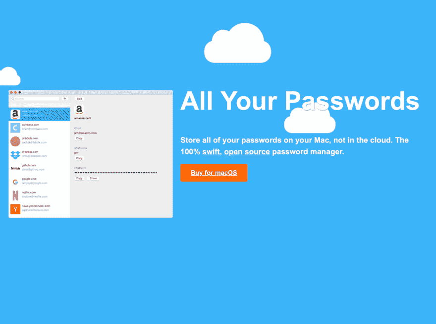

# 第 27 天:Swift macOS 密码管理器，适用于讨厌云的人

> 原文：<https://dev.to/swlkr/day-27-swift-macos-password-manager-for-people-who-hate-the-cloud-h9d>

[<——第 26 天去这里](https://dev.to/swlkr/day-26-swift-macos-password-manager-for-people-who-hate-the-cloud-468e)

📅2019 年 1 月 27 日
🚀[离](https://www.producthunt.com/upcoming/all-your-passwords)发射还有 3 天
🔥26 日连胜
💰4.99 美元的价格(又涨了)
🤑0 美元收入
📈0 顾客
⌚️花了 39.5 小时
😭1 重写
💻113 个文件被更改，249828 个插入(+)，561 个删除(-)
🏁今天的目标:**尝试建立一个登陆页面，修复视图控制器内存问题，这不是电子版的原因**

上午 10:48
从我所知道的最时髦的咖啡店买了超级奇特的咖啡豆。试着用我的酷泼设备。咖啡豆磨得不够细，所以出来的咖啡更像脏水而不是咖啡。🤦‍♂️

**上午 10 点 54 分**
登陆页面时间。走过去 [cruip](https://cruip.com) 看到了切换模板，觉得很酷。已下载。太过分了。我之前谈到过黑暗模式，但我觉得现在黑暗模式已经内置到操作系统中，它不再是新的了，不用担心在登录页面上展示它可能就好了。

上午 11:04
我刚刚有了一个关于登陆页面的惊人想法。所以这是一个 twizzy 的混音，但不是专注于亮/暗的切换，云会出现(可能是最大数量)，你可以点击吹走它们，每吹走 100 朵云，你会得到一个折扣，最多 500 朵云打五折，这使价格降至非常合理的 2.50 美元。这可能是我做过的最酷的登陆页面。我希望我能在合理的时间内让它看起来很体面。

**12 点 44 分**
经典。被应用程序的性能改进分散了注意力。几乎没有在着陆器上工作过，这是我目前在着陆器上看到的

下午 2:04
修复了一大堆与图标相关的奇怪 bug，还有更多，但现在已经足够了。着陆器也取得了一些进展

**下午 2 点 24 分**
打算暂时下线，吃点东西。想想我为什么决定把这个着陆器做得这么难为自己。