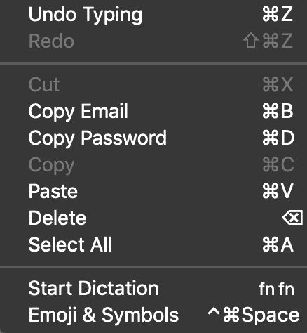
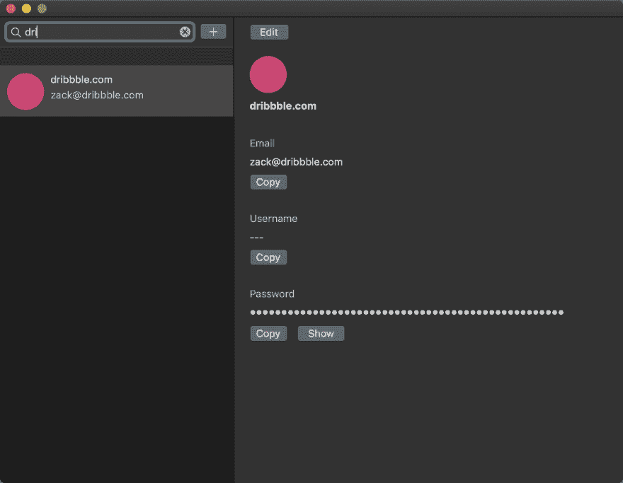
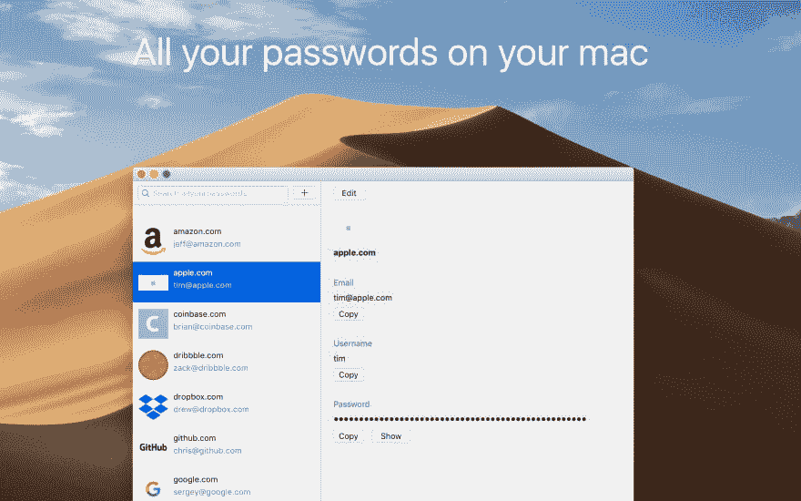
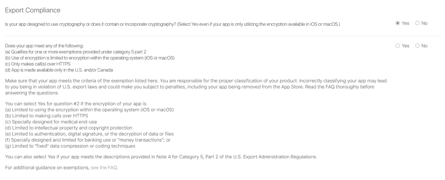
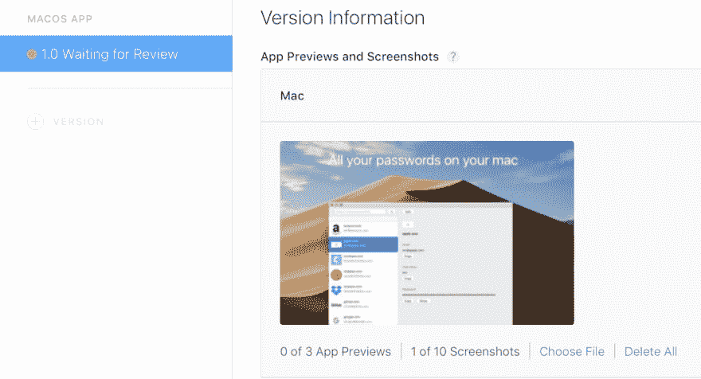

# 第 28 天:Swift macOS 密码管理器，适用于讨厌云的人

> 原文：<https://dev.to/swlkr/day-28-swift-macos-password-manager-for-people-who-hate-the-cloud-1894>

[<——第 27 天去这里](https://dev.to/swlkr/day-27-swift-macos-password-manager-for-people-who-hate-the-cloud-h9d)

📅2019 年 1 月 28 日
🚀[离](https://www.producthunt.com/upcoming/all-your-passwords)发射还有 2 天
🔥27 日连胜
💰4.99 美元的价格
🤑0 美元收入
📈0 顾客
⌚️花了 44 小时
😭1 重写
💻113 个文件被更改，249813 个插入(+)，561 个删除(-)
🏁今天的目标:**完成登陆页面的设置。尝试在 2 天内在 mac app store 中获得应用程序😬**

上午 11:46
我只是想强调一下我认为这整件事情中最好的部分。我实际上可以比使用旧的密码管理器移动得更快，因为我这样做了:

复制电子邮件实际上是“复制电子邮件或用户名”,它会尝试复制电子邮件，或者如果是空白/无，它会按顺序复制用户名。因此，当需要登录网站或其他网站时，我搜索 dribbble 的部分名称“dri ”,它在 tableview 中高亮显示并被选中，然后我只需点击 CMD+D，或者如果我真的点击了该行，则点击 CMD+C，将密码复制到我的剪贴板。没有更多的鼠标周围试图找到隐藏的复制按钮，超级兴奋。哦，对于电子邮件/用户名，我点击 CMD+B。这是惊人的。比浏览器扩展更好、更安全。

整个过程太快了，我甚至不用碰触控板。CMD+B 表示电子邮件/用户名，CMD+D 表示输入服务名称后的密码。谁知道没有浏览器扩展，事情会变得如此方便？！

**上午 11:51**
我调查了在应用商店里没有这个应用需要什么，我确实找到了 [devmate](https://devmate.com) ，但它似乎包括所有这些监视设备，哦，我的意思是…“分析”。所以我不确定我想要那样。我可能会更好地服务于 stripe，电子邮件中的 uuid 生成的许可证密钥和我自己的自动更新功能😬两天的工作量很大。我想要事故报告。肯定有一个 v2 在工作中。

就是 Mac App Store！

**晚上 8 点 20 分**
生活。我今天设法完成了一个截图，所以这很了不起

**晚上 8:35**
在还剩两天的时候，向 app store 提交应用程序有太多的问题，我很难保持头脑清醒。

**晚上 8 点 36 分**

提交审查，它真的到了最后期限😅

