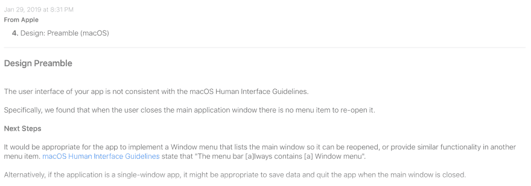

# 第 30 天:为讨厌云的人提供 Swift macOS 密码管理器

> 原文：<https://dev.to/swlkr/day-30-swift-macos-password-manager-for-people-who-hate-the-cloud-56ab>

[<——第 29 天去这里](https://dev.to/swlkr/day-29-swift-macos-password-manager-for-people-who-hate-the-cloud-4ph4)

📅2019 年 1 月 29 日
🚀离发射还有 13 个小时🤞T3】🔥29 日连胜
💰5.00 美元的价格
🤑0 美元收入
📈0 顾客
⌚️花了 52 小时
😭1 用[源](https://github.com/swlkr/allyourpasswords-lander)源
重写
🛬 [1 着陆器](https://allyourpasswords.com)💻114 个文件被更改，250127 个插入(+)，559 个删除(-)
🏁今天的目标:**第三次提交到 app store。完成着陆器。提交至产品搜寻**

**上午 11:52**
再次被苹果商店拒绝，原因如下

毫无疑问，这是我的第一个 mac 应用。还有其他一些事情，比如不能在文本字段中跳转，我认为这很有趣。

提交到应用商店可能不会在明天发生。所以我报名参加了 [devmate](https://devmate.com) 虽然这不是我真正想做的事情，但如果我想在太平洋标准时间明天上午 12 点有机会发布，我将不得不采取一些激烈的措施。让我们看看我能以多快的速度集成他们的 SDK 并设置支付😬下班后。

下午 5 点 55 分
我开始着手处理二进制文件的公证版本。当艾丽夏下载并安装它的时候，它真的工作了。我真不敢相信。经过一个月一周的工作，我实际上有了一个不错的密码管理器，这是我从 Xcode >新项目中编写的。

感觉不可思议。老实说，我不在乎发射。在我设定的时间框架内，终于完成了一个非常小的版本，并让它正常工作，这真是太好了。💪

如果给我足够的时间，我也许可以制作任何软件……如果给我足够的时间，我也许可以做任何事情。等等。

我不想操之过急。

我仍然需要在凌晨 1 点之前为产品搜索制作一堆宣传材料，我还需要把着陆器整理好，但除此之外，allyourpasswords 的第一个版本已经完成了。我想添加这么多功能，更不用说一个 iOS 配套应用程序，这样我就可以真正摆脱当前的密码管理器。

原来我没有完成着陆器，但它足够好，可以发射了！