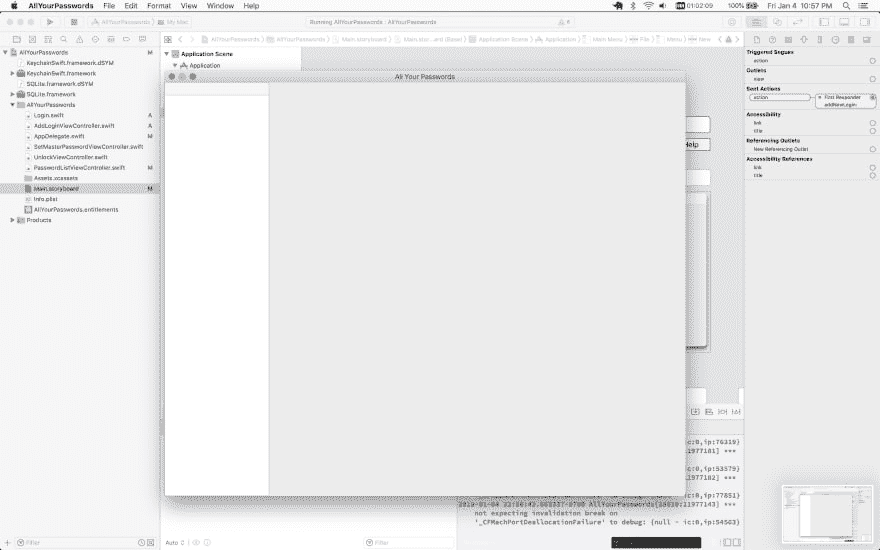
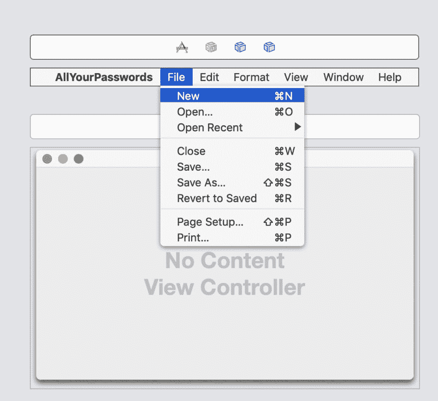
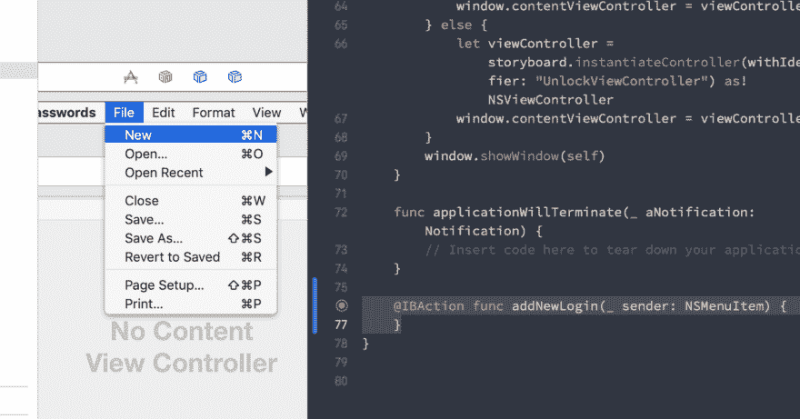

# 第四天:为讨厌云的人制作一个 swift macOS 密码管理器

> 原文：<https://dev.to/swlkr/day-4-making-a-swift-macos-password-manager-for-people-who-hate-the-cloud-43a1>

[< -第三天请点击此处](https://dev.to/swlkr/day-3-making-a-swift-macos-password-manager-for-people-who-hate-the-cloud-5dii)

我今天超级分心，离午夜还有一个小时，但我决心保持连胜！这就是我今天所做的，我移动了桌面视图，并决定用它奇怪的 ios/macos 混合应用程序完全破解密码。这是表格视图的样子，只有一列，正如已故的伟大的史蒂夫·乔布斯告诉我们的，这是制作表格视图的唯一方法

[](https://res.cloudinary.com/practicaldev/image/fetch/s--wtAC8OyK--/c_limit%2Cf_auto%2Cfl_progressive%2Cq_auto%2Cw_880/https://thepracticaldev.s3.amazonaws.com/i/0ikerm81e0uyyfqybnvk.png)

所以这看起来真的很好，只需要在故事板上做一些限制就可以了。我实际上开始喜欢 macos 开发了，我开始看到 CSS 有多落后了。总之。与几天前相比，我现在是一个球迷，或者这只是斯德哥尔摩综合症在起作用，这是瑞典的魔力？无论如何，这看起来不错，不幸的是，仍然没有密码在那里，所以这里是我想做的 Cmd+N 或文件->新的，使一个新的密码，一个新的观点对它的权利。伙计，我不知道我在干什么。我开始点击我的故事板，瞧

 [](https://res.cloudinary.com/practicaldev/image/fetch/s--Z7-H-Kud--/c_limit%2Cf_auto%2Cfl_progressive%2Cq_auto%2Cw_880/https://thepracticaldev.s3.amazonaws.com/i/zvxkh39reij8m4h24uuo.png)

你可以选择这个假的小菜单，你可以选择 File->New，所以我的下一个想法是让我把它拖到视图控制器上，但是不行。我又开始羡慕 web 开发人员了，当然，我会立即搜索解决方案。你必须控制并拖动你的鼠标🐁两次。首先从 New 到 AppDelegate.swift 文件，如下所示

 [](https://res.cloudinary.com/practicaldev/image/fetch/s--GxwhTgxc--/c_limit%2Cf_auto%2Cfl_progressive%2Cq_66%2Cw_880/https://thepracticaldev.s3.amazonaws.com/i/i7pm95jlgpn90sft8gmh.gif)

在这个 gif 中，我已经完成了它，并将其连接到 addNewLogin，但它就在那里，你创建了一个 func，你就快到家了。然后从那里你控制并拖动 New 到两个蓝色框旁边的橙色小框中，并选择你刚刚创建的函数的名称。现在第三步也是最后一步是...而我💩您不需要将函数定义从 AppDelegate.swift 复制并粘贴到您选择的视图控制器点 swift 文件中。

在这一点上，我有这么多的 wtf 深度和这么紧迫的时间，我只是很高兴的事情是发射。但是我还有一个小时，而且我的两个日常目标都要实现了(每日博客和每日对这个密码管理器的进展)，所以我继续努力。我已经展示了“添加密码”视图控制器，就这样，时间到了。这是我最后得到的代码:

```
 @IBAction func addNewLogin(_ sender: NSMenuItem) {

        let storyboard = NSStoryboard(name: NSStoryboard.Name("Main"), bundle: Bundle.main)
        let viewController = storyboard.instantiateController(withIdentifier: "AddLoginViewController") as! NSViewController

        for sView in self.containerView.subviews {
            sView.removeFromSuperview()
        }

        viewController.view.frame = containerView.bounds
        containerView.addSubview(viewController.view)
    } 
```

哦！真性感...真性感。今天几乎没有任何代码！

[](https://res.cloudinary.com/practicaldev/image/fetch/s--f-qLH5L---/c_limit%2Cf_auto%2Cfl_progressive%2Cq_66%2Cw_880/https://thepracticaldev.s3.amazonaws.com/i/mj4ivz2qf951vx0ovd03.gif)

孩子们，不要喝酒和编程。第五天即将到来(明天)