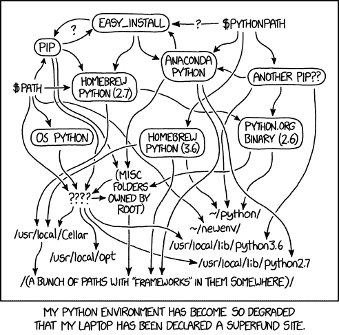

# 死简单 Python:虚拟环境和 pip

> 原文：<https://dev.to/codemouse92/dead-simple-python-virtual-environments-and-pip-5b56>

喜欢那些文章吗？买这本书！ [***死简单蟒*** 作者杰森·c·麦克唐纳可从无淀粉出版社购得。](https://nostarch.com/dead-simple-python)

* * *

虚拟环境。如果你曾经在 Python 中做过任何有意义的工作，你几乎肯定听说过这些。很有可能，你甚至被告知它们是不可协商的。问题是，你不知道它们是什么，更不知道如何制作它们。

在我最初几十次尝试使用虚拟环境时，我设法犯了一些可怕的错误。他们从未工作过。我不想承认，但我已经不知道自己做了什么了！自从我知道了虚拟环境是如何工作的，我就没有遇到过一个问题。

# 我为什么要在乎？

虚拟环境是一个沙箱，在这里你可以只安装你需要的 Python 包。

“是啊，包裹是什么？”

嗯，Python 以“包含电池”而闻名大多数事情只需一个简单的`import`语句就能“工作”...

[](https://res.cloudinary.com/practicaldev/image/fetch/s--Xao-jPPB--/c_limit%2Cf_auto%2Cfl_progressive%2Cq_auto%2Cw_880/https://imgs.xkcd.com/comics/python.png)

但是如果您想要的不仅仅是内置的软件包呢？例如，您可能想要创建一个时髦的用户界面，并且您决定使用 [PySide2](https://wiki.qt.io/Qt_for_Python) 。PySide2 像成千上万的其他第三方库一样，还没有内置到 Python 中——您必须安装它们。

谢天谢地，安装大多数第三方库很容易！库的作者已经将整个库打包成一个**包**，可以使用一个方便的叫做`pip`的小 Python 工具来安装。(我们稍后会谈到这一点。)

但是这就是棘手的地方。有些软件包需要先安装其他软件包。某些包不喜欢某些其他包。同时，你实际上可以安装一个包的特定*版本*，这取决于你到底需要什么。

我提到过您系统上的一些应用程序和操作系统组件依赖于那些 Python 包吗？

如果你不小心的话，你会落得如此狼狈的下场...

[](https://res.cloudinary.com/practicaldev/image/fetch/s--Xcb2Ca7X--/c_limit%2Cf_auto%2Cfl_progressive%2Cq_auto%2Cw_880/https://imgs.xkcd.com/comics/python_environment.png)

这就是我们拥有虚拟环境的原因！我们可以为每个项目创建一个不同的小沙箱，只在里面安装我们想要的包，并保持一切整洁有序。额外的是，我们实际上从不改变在我们的*系统*上安装了什么 Python 包，所以我们避免破坏与我们的项目无关的重要东西。

# 获取工具

让我们安装`pip`和(如果您的系统需要，`venv`)。仅仅为了举例，我们还将安装 Python 3。如果你已经有了，重装不疼；否则，你可以跳过这部分。

## Linux

在 Linux 上，您的发行版的包存储库中几乎肯定有您需要的东西。

*   Debian/Ubuntu: `sudo apt install python3-venv python3-pip`
*   Fedora: `sudo dnf python3-pip`

## Mac

在 Mac 上，您可以使用 Macports 或 Homebrew 来安装。

这里是 Macports，针对 Python 3.7。如果你想要 3.6，把下面的`37`的所有实例都改成`36`...

```
sudo port install python37 py37-pip
sudo port select --set python python37
sudo port select --set pip py37-pip 
```

Enter fullscreen mode Exit fullscreen mode

这是自制的...

```
brew install python 
```

Enter fullscreen mode Exit fullscreen mode

## 窗口

在 Windows 上，你只需要[下载并安装](https://www.python.org/downloads/windows/) Python。这应该也会自动安装`pip`和`venv`。

然而，如果你试图在命令行中运行`pip`，你应该下载 [get-pip.py](https://bootstrap.pypa.io/get-pip.py) 到你的桌面上，在命令行中导航到那个目录，并通过`python get-pip.py`运行它。

咻！说完这些，让我们开始有趣的部分...创建虚拟环境！

# 创建虚拟环境

同样，虚拟环境就像一个沙箱，只包含您选择的包，而忽略(默认情况下)安装在系统其他地方的所有 Python 包。每个虚拟环境都位于一个专用目录中。按照惯例，我们将这个文件夹命名为`venv`。

对于每个项目，我通常喜欢在项目文件夹中创建一个专用的虚拟环境。(如果您使用 Git 或另一个 VCS，有一个额外的设置步骤我们稍后会讲到。)

为了创建虚拟环境，我们首先将命令行中的工作目录更改为项目文件夹。(记住，那是`cd`命令。)然后，我们一步创建虚拟环境及其目录。

在 UNIX 上...

```
python3 -m venv venv 
```

Enter fullscreen mode Exit fullscreen mode

该命令的最后一部分`venv`，是您为虚拟环境创建的目录的名称。从技术上来说，你可以随便叫它什么，但就像我之前提到的，`venv`是约定俗成的。

注意，我们在这里明确指定我们想要使用`python3`，尽管我们可以用我们想要使用的特定 Python 可执行文件(比如`python3.6 -m venv venv`)来调用`venv`

如果您查看您的工作目录，您会注意到目录`venv/`已经被创建。

# 激活虚拟环境

太好了，那我们怎么用这个东西？

实际上，这非常简单。

在类 UNIX 系统(Mac、Linux 等)上。)，就跑...

```
source venv/bin/activate 
```

Enter fullscreen mode Exit fullscreen mode

在 Windows 上，运行...

```
venv\Scripts\activate.bat 
```

Enter fullscreen mode Exit fullscreen mode

像魔术一样，你现在正在使用你的虚拟环境！在 UNIX 系统上，您可能会在命令行提示符的开头看到`(venv)`，表示您正在使用名为`venv`的虚拟环境。

当然，如果您将虚拟环境命名为其他名称，比如`bob`，您需要相应地更改激活命令(`source bob/bin/activate`)。

在拥有多个 Python 版本的系统上，虚拟环境的一个奇妙之处在于*您不再需要在命令中指定路径。*当虚拟环境被激活时，`python whatever_your_command_is.py`将使用您在创建`venv`时选择的 Python 版本。每次都是。

# 引入画中画

我们大多数人都对 Python 的包系统抱有很大的期望。(看到我在那里做了什么吗？没有吗？*叹息*。)

`pip`很容易使用，*比过去的日子里容易多了*。事实上，它曾经是如此的笨重，以至于有人觉得他们需要创造一个叫做`easy_install`的东西，但是`pip`现在用起来已经很轻松了。

## 安装软件包

要安装一个包，比如说，`pyside2`，只需运行...

```
pip install PySide2 
```

Enter fullscreen mode Exit fullscreen mode

如果你想安装某个东西的特定版本，那也很容易。

```
pip install PySide2==5.11.1 
```

Enter fullscreen mode Exit fullscreen mode

另外，您甚至可以使用类似于`>=`(“至少是这个版本，或者更高版本”)的操作符，等等。这些被称为**需求说明符**。所以这个...

```
pip install PySide2>=5.11.1 
```

Enter fullscreen mode Exit fullscreen mode

将安装 PySide2 的最新版本，至少是版本 5.11.1 的版本。如果您想确保某人实际上可以访问一个包的最低版本(他们可能没有)，这真的很有帮助。

## 需求. txt

通过为你的项目写一个`requirements.txt`文件，你实际上可以为自己和他人节省更多的时间。在每一行，列出`pip`包的名称，就像您在`install`命令中输入的一样。

例如，如果您有这样一个`requirements.txt`文件...

```
PySide2>=5.11.1
appdirs 
```

Enter fullscreen mode Exit fullscreen mode

...您可以使用以下命令一次性安装所有这些软件包...

```
pip install -r requirements.txt 
```

Enter fullscreen mode Exit fullscreen mode

很简单，对吧？

## 升级软件包

您可以使用`pip install`命令和`--upgrade`标志更新已经安装的软件包。例如，要安装 PySide2 的最新版本，只需运行...

```
pip install --upgrade PySide2 
```

Enter fullscreen mode Exit fullscreen mode

您还可以使用以下命令一次性升级所有必需的软件包...

```
pip install --upgrade -r requirements.txt 
```

Enter fullscreen mode Exit fullscreen mode

## 移除包裹

移除物品也同样简单。

```
pip uninstall PySide2 
```

Enter fullscreen mode Exit fullscreen mode

## 寻找包裹

太好了，这样我们就可以安装、升级和移除东西了。但是我们怎么知道`pip`甚至可以提供什么样的包呢？

有两种方法。第一种是使用`pip`本身来运行搜索。比如你想要一个网页抓取的包。

```
pip search web scraping 
```

Enter fullscreen mode Exit fullscreen mode

这会给你一大堆结果来筛选，但是如果你只是忘记了一个包的名字，这是很有帮助的。

如果你想要一些更具浏览性和信息量的东西，[PyPI.org](https://pypi.org/)是**官方** Python 包索引。

## 最后一个音符

一旦您安装了虚拟环境所需的软件包，就可以开始了！下次您启动虚拟环境时，这些包仍会在那里，就像您离开时一样，等待着您。

## 关于 pip 的一个警告...

不管谁告诉你，永远不要在 UNIX 系统上使用*、*、**、**、`sudo pip`。它会对你的系统安装造成很多不好的影响，以至于你的系统软件包管理器无法纠正，你将会为你的系统终身后悔这个决定。

所有`sudo pip`似乎要解决的问题都可以通过虚拟环境来解决。

**朋友不让朋友`sudo pip`**

# 离开虚拟环境

太好了，那么你如何走出虚拟环境，回到现实中来呢...呃，*咳咳*，系统。

UNIX 用户们，你们准备好了吗？

```
deactivate 
```

Enter fullscreen mode Exit fullscreen mode

我知道！简单吧？

当然，Windows 上的事情稍微复杂一些...

```
venv\Scripts\deactivate.bat 
```

Enter fullscreen mode Exit fullscreen mode

呃，还是很无痛的。(请记住，与激活一样，如果您将虚拟环境命名为其他名称，您必须相应地更改该行。)

# 整 She-Bang

最后一个小细节。您可能已经注意到，大多数 Python 文件都是以类似...

```
#!/usr/bin/python 
```

Enter fullscreen mode Exit fullscreen mode

首先，这被称为“she-BANG”(haSH-BANG，或`#!`的缩写)，它允许脚本在不将`python`附加到终端命令开头的情况下运行。

二、上面那行**非常非常错误**。它迫使计算机使用一个特定的系统范围的 Python 副本，这或多或少地把整个虚拟环境的东西扔出了窗外。

相反，你应该**总是**使用下面的 she-bang for Python3 脚本:

```
#!/usr/bin/env python3 
```

Enter fullscreen mode Exit fullscreen mode

如果您碰巧有一个同时在 Python2 和 Python3 上运行的脚本，请使用:

```
#!/usr/bin/env python 
```

Enter fullscreen mode Exit fullscreen mode

(顺便说一下，关于`python`vs .`python2`vs .`python3`的规则正式来自 [PEP 394](https://www.python.org/dev/peps/pep-0394/) 。)

# 虚拟环境和 Git

还记得之前的警告吗，关于`venv`如果你使用像 Git 这样的 VCS？

在一个虚拟环境的目录中是你用`pip`安装的*实际包*。这将使你的存储库中塞满不必要的大文件，而且你不一定要将一个虚拟环境文件夹从一台计算机复制到另一台计算机，并期望它无论如何都能工作*。*

 *因此，我们不想在我们的 VCS 中跟踪这些文件。在 Git 中，在存储库的根目录下有一个名为`.gitignore`的文件。创建或编辑该文件，并在其中的某个位置添加这一行...

```
venv/ 
```

Enter fullscreen mode Exit fullscreen mode

当然，如果您为您的虚拟环境使用不同的名称，您需要更改该行以匹配。

按照惯例，每个克隆您的存储库的开发人员将构建他们自己的虚拟环境，可能使用您创建的那个`requirements.txt`文件。

如果您使用的是不同的 VCS，比如 Subversion 或 Mercurial，请查看文档，了解如何忽略像`venv`这样的目录。

## 但是...

许多 Python 开发人员可能会对您将虚拟环境放入存储库文件夹深表不满。我上面的方法的主要缺点是，如果你把你的虚拟环境命名为*，而不是* `venv`(或者你放在`.gitignore`中的任何东西)，它将被提交，这是不好的。

最好的习惯实际上是让你的虚拟环境完全远离存储库目录。但是，如果我们诚实，我们大多数人实际上并不知道。只是感觉用“错误”的方式做更方便。

这就是为什么我们在`.gitignore`上加上`venv`。您或者其他人可能会将虚拟环境放在您的存储库目录中，因此这有助于防止*一些*意外提交。

# 一些额外的招数

我在 Freenode IRC 上的一些 Python 开发者朋友，以及评论中的人，指出了一些对虚拟环境用户有帮助的额外技巧。

## Python 3.3 之前

只有在使用 Python 3.3 或更高版本时，`venv`命令才有效。在此之前，您需要 pip 提供的一个名为`virtualenv`的包。如果需要使用，请参见 [`virtualenv`文档](https://virtualenv.pypa.io/en/stable/)。

如果你在一个既有 Python 2 又有 Python 3 的系统上，确保你使用了`python3 -m venv`或者任何合适的东西。这一招在 Python 之前的任何版本上都不起作用。

## 使用虚拟环境而不激活

您还可以使用作为虚拟环境一部分的二进制文件，而无需实际激活它。例如，您可以执行`venv/bin/python`来运行 virtualenv 自己的 Python 实例，或者执行`venv/bin/pip`来运行它的`pip`实例。这实际上就像你激活了虚拟环境一样！

例如，我可以这样做(假设我的虚拟环境是`venv`)...

```
venv/bin/pip install pylint
venv/bin/python

>>> import pylint 
```

Enter fullscreen mode Exit fullscreen mode

...而且很管用！然而，`import pylint`仍然不能在全系统的 Python shell 上工作...当然，除非你在系统上安装了它。；)

## 另类

我听到了很多关于使用`pipenv`的建议，包括在评论区。我不会在这篇文章中涉及它，但它有一个整洁的工作流程，和许多声乐爱好者。你可以在这里找到更多信息: [pipenv on PyPI](https://pypi.org/project/pipenv/)

# 包装完毕

我希望这篇指南已经为你完全揭开了虚拟环境和`pip`的神秘面纱。当然，我建议您将文档放在枕头下:

*   [`pip`文档](https://pip.pypa.io/en/stable/)
*   [`venv`文档](https://docs.python.org/3/library/venv.html)

Chris Warrick 也有一篇精彩的文章，涵盖了虚拟环境的其他方面: [Python 虚拟环境五分钟](https://chriswarrick.com/blog/2018/09/04/python-virtual-environments/)

* * *

*漫画礼貌[XKCD](http://xkcd.com/)T3】*

*感谢`grym`、`deniska`和`ChrisWarrick` (Freenode IRC `#python`)提出的修改建议。**