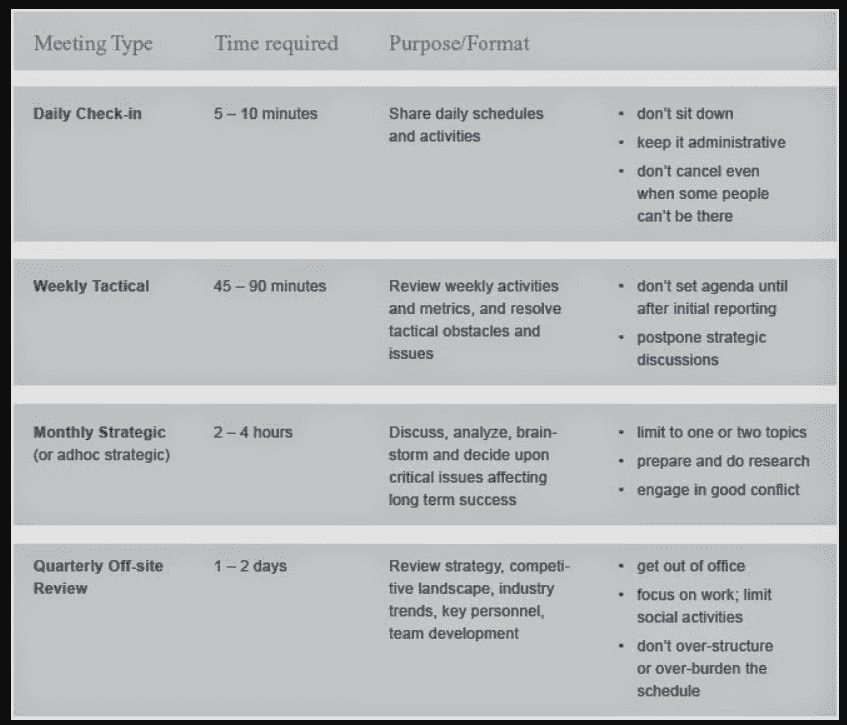
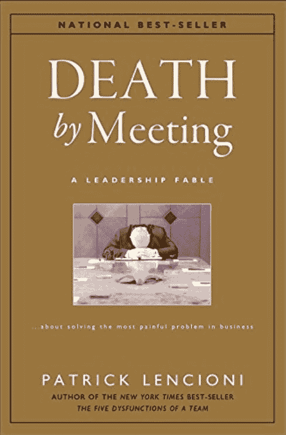

# 相遇而死——一本书的反思

> 原文：<https://dev.to/bhavaniravi/death-by-meeting-a-book-reflection-4lok>

我刚看完这本书，名字叫[会议死亡](https://www.amazon.in/gp/product/8126506768/ref=as_li_tl?ie=UTF8&camp=3638&creative=24630&creativeASIN=8126506768&linkCode=as2&tag=bhavaniravi00-21&linkId=d149da2cb1c4f90d8d29e848ac348a51)。我正式宣布帕特里克·兰西奥尼是我最喜欢的作家。我也读过他的《团队的五大功能障碍[，我很喜欢。](https://www.amazon.in/gp/product/B006960LQW/ref=as_li_tl?ie=UTF8&camp=3638&creative=24630&creativeASIN=B006960LQW&linkCode=as2&tag=bhavaniravi00-21&linkId=1bc9b9c354f6455b5357a445ae48d27d)

### 我喜欢他写作的 3 个理由

1.  通常，我只需要几天就能完成他的书。
2.  不是因为它的大小，而是因为他如何让复杂的主题变得简单易懂。
3.  他是一个惊人的讲故事的人。他围绕故事和伟大的类比虚构这些复杂的话题。

> 通过见面回到死亡…

### 电影 Vs 会议

他把《见面》和电影进行了对比。

> 你想要什么？看电影还是开会？

我们大多数人会说是电影，但为什么呢？因为英雄解决了问题。但是开会也是出于同样的原因。其实开会应该更好，因为你可以和主人公对话，帮他解决问题。从不同的角度带他看一下。

但是，我们都更喜欢电影而不是会议。为什么？这本书用一个词回答了这个问题。如果你的会议缺少这一个词，那么你将会以无聊的电影和抱歉的会议结束。**“冲突”这个词。**

### 会议类型

你们都只看一种类型的电影吗？有时是喜剧，有时是动作，有时是动画。但是还有一件有趣的事情，它并不总是电影。你也看连续剧和情景喜剧，你也听歌让事情变得有趣。

同样，也有不同种类的会议。每种问题一个

1.  每日站立
2.  每周**战术**
3.  月度**战略**
4.  季度异地**审查**

我听到你尖叫着“会议太多了”。我听到了。这本书也给出了答案。

会议可能会很无聊，但这本书教会了我不必如此，以及为什么不应该如此。作为一名团队领导/主管，如果你让你的团队窃窃私语说你的会议是在浪费生产时间，这本书是给你的。如果你是一个渴望管理伟大团队的人(像我一样)，这本书也适合你。点击此处获取您的副本。

你喜欢你刚刚读的书吗？ ***按住*** *的“鼓掌”键，给我一个* ***大声喊*** *上*[* * _ Twitter** *]([【https://twitter.com/@bhavaniravi】](https://twitter.com/@bhavaniravi))*。_

