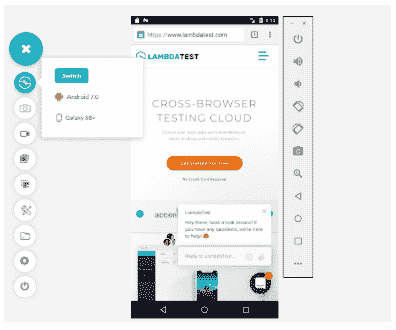
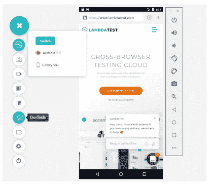
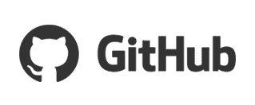

# 使用开发工具在最新的移动设备上进行调试，享受轻松集成的乐趣

> 原文：<https://dev.to/lambdatestteam/debug-on-lambdatest-mobile-devices-with-developer-tools-and-enjoy-easy-integrations-2lci>

当你在真实的移动设备上启动一个网站，遇到一个 bug，就变得无法调试了。因此，为了帮助你，LambdaTest 推出了移动开发工具，让你在移动设备上调试更加容易。

您只需打开想要测试您的网站/ web 应用程序的移动设备，然后使用 LambdaTest 的移动调试工具图标[调试您的网站](https://goo.gl/HKfGFn)。

到目前为止，你可以在支持 chrome 浏览器的 android 模拟器(即 Android 7.0 及以上版本)和所有 iOS 模拟器上找到移动开发工具，但是，很快你就可以在所有剩余的设备上测试了。
[T3】](https://res.cloudinary.com/practicaldev/image/fetch/s--wjcoS21P--/c_limit%2Cf_auto%2Cfl_progressive%2Cq_auto%2Cw_880/https://www.lambdatest.com/blog/wp-content/uploads/2018/08/dev.png)

## 支持开发工具的移动设备:

### 安卓:

*   Galaxy S9 Plus
*   Galaxy Note 9
*   银河标签 S4 10.5
*   银河 S9
*   谷歌 Pixel 3 XL
*   谷歌像素 3
*   谷歌像素 2 XL
*   谷歌像素 2
*   一加 6T
*   索尼 Xperia xz2
*   小米 MI 8
*   银河 S8+
*   银河 S8
*   Galaxy J7 max
*   谷歌像素 XL
*   谷歌像素
*   Nexus 6p
*   Nexus 5x
*   LG V20
*   华为荣耀 6x
*   oppo R9[T1](https://goo.gl/vqTtE8)

### iOS:

所有 iPhones 和 iPads

**步骤 1** :从菜单栏选择实时测试，进入实时控制台。

**第二步**:启动实时后，点击以下图标
 ，切换到移动设备

**第三步**:从上面的列表中选择您想要测试的 android 模拟器或 iOS 模拟器，并在点击启动之前输入 URL。

**步骤 4** :一旦你点击启动，一个移动设备将会打开，显示你所选择的配置。
T3T5】

**步骤 5** :你会在左手边的菜单栏上看到一个开发工具选项，点击它打开开发工具。
T3T5】

第六步:一旦你点击它，开发工具就会打开，然后你就可以开始调试你的网站/网络应用了。

除了开发工具，我们还为您提供了一些全新的惊人的内部集成。现在你可以把你的 bug 从你的 LambdaTest 账户直接转移到 GitHub、Slack 和 JIRA，这也是在 LambdaTest 测试期间。

**[与 GitHub](https://goo.gl/LzCSak)**
 集成

**[融入与懈怠](https://goo.gl/HwA9PB)**

**[与 JIRA](https://goo.gl/UQFsd4)**
 融合

**[与特雷罗](https://goo.gl/xrpAg6)融合**

**[与 Gitlab](https://goo.gl/6Zg2wC) 集成**

**[与 Bitbucket](https://goo.gl/Vd6QfQ) 整合**

**[与 VSTS](https://goo.gl/KE2k6h) 融合**

**[与 Paymo](https://goo.gl/euNXjE) 整合**

**[融入团队](https://goo.gl/fMrxuK)**

**[与牛郎](https://goo.gl/h73r3g)融合**

**[融入会所](https://goo.gl/7dBtYt)**

**[与螳螂](https://goo.gl/zbaxc5)融合**

您需要做的就是安装该集成，授权它，并开始记录错误。如果你使用任何其他的 bug 管理工具，比如 Asana，Trello，GitLab，Bitbucket，那么不要担心，你也可以在 LambdaTest 中使用它们😉！

只需简单的步骤，将你的 LambdaTest 账户与 JIRA、Asana、Slack、Trello、GitHub、GitLab、Bitbucket 整合。如果您使用其他工具，请告诉我们，我们会在我们的平台上为您提供！

希望你喜欢我们的开发工具和新的集成。如果您对我们有任何反馈或意见，请在[support@lambdatest.com](mailto:support@lambdatest.com)给我们留言或与我们聊天。我们会在那里为你服务。

你可以在这里看视频

[https://www.youtube.com/embed/SVpr_V3nwLI](https://www.youtube.com/embed/SVpr_V3nwLI)

原文出处:[lambdatest.com](https://goo.gl/2ugTdZ)

