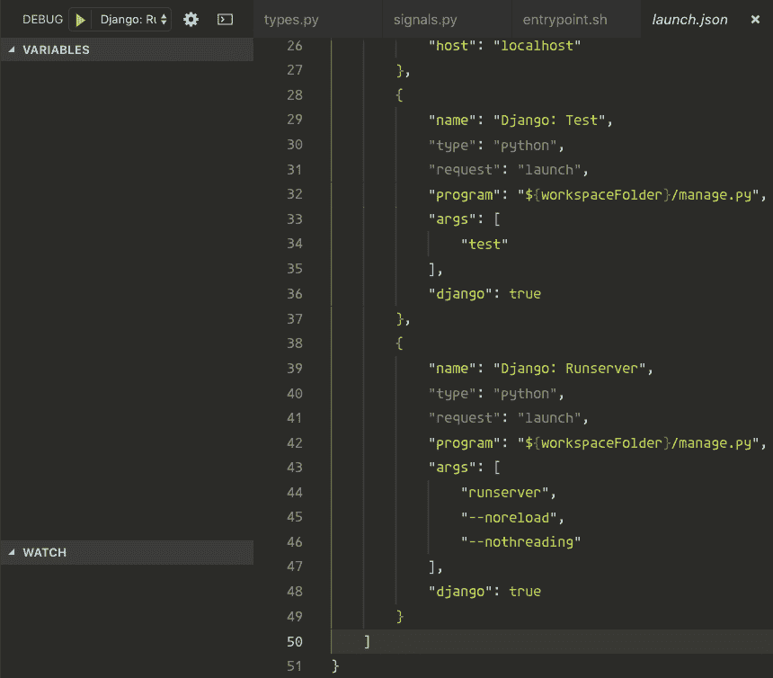

# 从 Visual Studio 代码中轻松调试 Python 和 Django

> 原文：<https://dev.to/wealize/debug-python-and-django-easily-from-visual-studio-code-4dfk>

调试代码，有时痛苦，有时滑稽，但永远是一项令人兴奋的任务。

[](https://i.giphy.com/media/RDuF5FVTSyzy8/giphy.gif)

如果我们没有使用正确的工具，开发人员就会浪费更多的时间。对于开发人员来说，让调试变得容易有时是一个技术问题，但幸运的是，在 Python 中，从一开始就有很好的调试选项。

Visual Studio 代码有一个非常强大且可配置的选项卡，您可以在其中为项目定义所需的配置。你可以拥有所有你想要的配置！(用于测试、调试、运行特定流程……)

## TL；速度三角形定位法(dead reckoning)

从 VS 代码中，我们可以很容易地在本地调试 Python 代码，也可以在 Docker 容器内部使用 ptvsd 运行。我告诉你怎么做。

## 打印

我们都在职业生涯的某个阶段写过代码，但是成为更好的开发人员的道路不止于此，花时间研究直到我们找到更好的工具来完成这项任务是很重要的。

打印从来都不酷，但在学习适当的调试工具之前，它一直是检查变量输出的快速而肮脏的选择。

## PDB

**PDB** 和 **pudb** 都是很棒的工具！当我想调试一些复杂的东西时，我仍然会使用它们，但是为了提高调试速度，我发现使用 VS Code Debug tab 要方便得多，在这里我可以看到特定代码行的所有上下文。

在此之前，我曾经有一个针对`pdb`的代码片段，它将扩展到`import pdb; pdb.set_trace()`，这样我就可以在特定的代码行停止执行。然后用`(n)ext`、`(c)ontinue`、`(q)uit` …我可以一行一行地控制执行和`step into`一个特定的函数或方法(更多关于 [pdb](https://docs.python.org/3/library/pdb.html) 和 [pudb](https://pypi.org/project/pudb/) )。

## VS 代码

使用 VS 代码一段时间后，我开始深入研究 Django 和 Node/React 上不同的用户和工作区配置，这篇文章给出了一个例子，说明如何配置 Django 项目来使用 VS 代码调试选项卡。

在本地安装了 Django 项目后，启动服务很容易，我们可以只使用 runserver。我们单击 Debug 选项卡，在选择器中选择`Add configuration...`，并按照向导选择`Django: runserver`。

[](https://res.cloudinary.com/practicaldev/image/fetch/s--rH60mmAO--/c_limit%2Cf_auto%2Cfl_progressive%2Cq_auto%2Cw_880/http://javaguirre.me/asseimg/django-runserver.png)

配置如下所示:

```
{  "name":  "Django: Runserver",  "type":  "python",  "request":  "launch",  "program":  "${workspaceFolder}/manage.py",  "args":  [  "runserver",  "--noreload",  "--nothreading"  ],  "django":  true  } 
```

Enter fullscreen mode Exit fullscreen mode

如果您使用`pipenv`、`virtualenv`或者在您的工作区配置上选择了`pythonPath`(在 Mac 上选择了`Command-,`，VS 代码知道如何自动运行命令。我们也可以有一个测试命令，用一个`envvar`来选择另一个`DJANGO_SETTINGS_MODULE`。

```
{  "name":  "Django: Test",  "type":  "python",  "request":  "launch",  "program":  "${workspaceFolder}/manage.py",  "env":  {"DJANGO_SETTINGS_MODULE":  "myproject.settings.test"},  "args":  [  "test"  ],  "django":  true  } 
```

Enter fullscreen mode Exit fullscreen mode

我们点击播放，让我们的测试通过。:-)

## VS Docker 中的代码调试

在 Docker 容器中调试有点复杂，我们需要打开一个`socket`来调试 VS 代码，让我们看看如何调试。

如果我们使用`pipenv`，我们的 Django Dockerfile 看起来就像这样。

```
FROM python:3.7

RUN mkdir /code

WORKDIR /code

RUN pip install pipenv
ADD Pipfile /code/
RUN pipenv install --dev

COPY . /code/

EXPOSE 8000 
```

Enter fullscreen mode Exit fullscreen mode

我们可以有一个`docker-compose.yml`文件来更容易地管理依赖关系，比如`postgres`、`redis`，或者只是为主机打开的端口。

```
version: '3.7'

services:
  db:
    ...

  backend:
    build: .
    image: mydjangoproject
    command: pipenv run manage.py runserver 0.0.0.0:8000
    environment:
      DJANGO_DEBUG: 1
      DJANGO_SETTINGS_MODULE: myproject.settings.local
    volumes:
      - .:/code
    ports:
      - 8000:8000 # Serving Django
      - 8888:8888 # debugging service (ptvsd)
    depends_on:
      - db

  frontend:
    ... 
```

Enter fullscreen mode Exit fullscreen mode

在这种情况下，我们为 Django `runserver`和`8888`打开`8000`，这样 VS 代码就可以通过 Debug 选项卡连接到 Django。

为了能够做到这一点，微软创建了一个库，[pt VSD](https://github.com/microsoft/ptvsd)**Visual Studio 调试器的 Python 工具**。这个库在我们的 Python 代码中运行，并打开一个套接字，我们可以连接它来调试应用程序。在 Django 中，我们可以把它放在`wsgi.py`文件中，只有当`settings.DEBUG`是`True`时，它才会运行。

```
import os

from django.core.wsgi import get_wsgi_application

os.environ.setdefault("DJANGO_SETTINGS_MODULE", "myproject.settings")

if os.environ.get('DJANGO_DEBUG', False): # You can use django.conf settings.DEBUG
    import ptvsd
    ptvsd.enable_attach(address=('0.0.0.0', 8888))
    ptvsd.wait_for_attach() # We can remove this line it gives you trouble,
                             # but it's good to know if the debugger started or not
                             # blocking the execution for a while :-) 
application = get_wsgi_application() 
```

Enter fullscreen mode Exit fullscreen mode

我们在端口`8888`中向外部世界`0.0.0.0`打开套接字，这样我们就可以从主机(我们的机器)连接。

我们执行我们的`docker-compose`脚本，在我的例子中是`docker-compose up backend`。

在 VS 代码中，配置非常简单，我们在 ptvsd 打开套接字的地方添加了`port`，我们告诉 VS 代码，我们的`localRoot`是当前项目，`remoteRoot`是我的`/code`路径，在我的`Dockerfile`上为这个项目定义。

```
{  "name":  "Remote Django App",  "type":  "python",  "request":  "attach",  "pathMappings":  [  {  "localRoot":  "${workspaceFolder}",  "remoteRoot":  "/code"  }  ],  "port":  8888,  "host":  "localhost"  } 
```

Enter fullscreen mode Exit fullscreen mode

现在是奇迹发生的时候了！你应该可以做这样的事情。:-)

[https://www.youtube.com/embed/oyKkQzvUVMU](https://www.youtube.com/embed/oyKkQzvUVMU)

你知道更多在 VS 代码上调试的窍门吗？请在评论中告诉我！