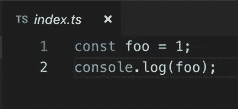
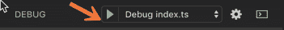
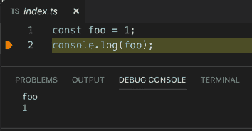
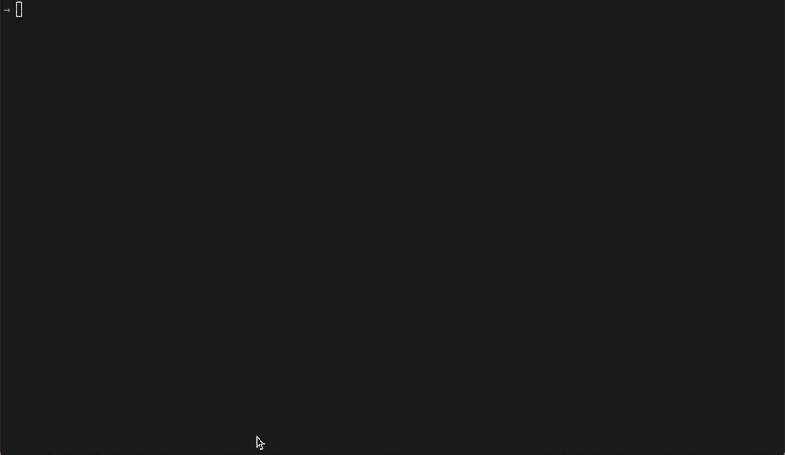

# 在 VSCode 中调试 TypeScript

> 原文：<https://dev.to/bradymholt/debugging-typescript-in-vscode-3fkm>

[](https://res.cloudinary.com/practicaldev/image/fetch/s--1aSqTUWw--/c_limit%2Cf_auto%2Cfl_progressive%2Cq_auto%2Cw_880/https://www.geekytidbits.com/debugging-typescript-in-vscode/vscode-ts-node-debugging.png)

我非常喜欢使用 [ts-node](https://github.com/TypeStrong/ts-node) 来处理 node.js 中的 TypeScript。在开发期间，我用`ts-node src/index.ts`启动我的应用程序，而不是进行中间的`tsc`构建步骤，然后将 Node 指向。js 输出。当然，ts-node 仍然在幕后调用 TypeScript，但它使整个过程变得流畅。

我也喜欢使用 [VSCode](https://code.visualstudio.com/) 调试器来调试我的类型脚本。在`ts-node`的帮助下，这也是一个顺利的过程。这是你怎么做的。

首先，通过运行`npm install ts-node`将`ts-node`依赖项安装到 Node.js 应用程序中。

然后，创建条目类型脚本文件。对于这个例子，我将在项目根中创建`index.ts`,它看起来像这样:

```
const foo = 1;
console.log(foo);
```

现在，添加(或修改)一个`.vscode/launch.json`文件，如下所示:

```
{
  "version": "0.2.0",
  "configurations": [
    {
      "name": "Debug index.ts",
      "type": "node",
      "request": "launch",
      "cwd": "${workspaceRoot}",
      "runtimeArgs": ["-r", "ts-node/register"],
      "args": ["${workspaceRoot}/index.ts"]
    }
  ]
}
```

现在，在 TypeScript 代码中添加一个断点。

[](https://res.cloudinary.com/practicaldev/image/fetch/s---E_WyJ5X--/c_limit%2Cf_auto%2Cfl_progressive%2Cq_66%2Cw_880/https://www.geekytidbits.com/debugging-typescript-in-vscode/vscode-breakpoint.gif)

现在，开始在 VSCode 中调试:

[](https://res.cloudinary.com/practicaldev/image/fetch/s--2Z6HWjhH--/c_limit%2Cf_auto%2Cfl_progressive%2Cq_auto%2Cw_880/https://www.geekytidbits.com/debugging-typescript-in-vscode/vscode-debug.png)

[](https://res.cloudinary.com/practicaldev/image/fetch/s--Mfz49-Op--/c_limit%2Cf_auto%2Cfl_progressive%2Cq_auto%2Cw_880/https://www.geekytidbits.com/debugging-typescript-in-vscode/vscode-debugging.png)

沃丽拉。现在，您可以调试您的 TypeScript，而不必担心中间的 transpile 步骤或 sourcemap 设置。

我已经创建了一个名为 [vscode-debugging-ts-code](https://github.com/bradymholt/vscode-debugging-ts-code) 的 repo，它正确地完成了所有的设置。使用这个项目看起来像这样:

[](https://res.cloudinary.com/practicaldev/image/fetch/s--fML5MEAh--/c_limit%2Cf_auto%2Cfl_progressive%2Cq_66%2Cw_880/https://user-images.githubusercontent.com/759811/54855051-db697a00-4cc2-11e9-94ea-43c56e96e04d.gif)