# 用 chrome devtools 调试 wordpress 主题加载性能

> 原文：<https://dev.to/tahriadel/debugging-wordpress-theme-load-performance-with-chrome-devtool-4960>

### 简介

在这篇小文章中，我将向你展示我是如何解决 WordPress 主题的一个小性能问题
的，我们正在
[PixelDima](https://pixeldima.com/) 工作，向你展示如何使用 Chrome DevTools。

[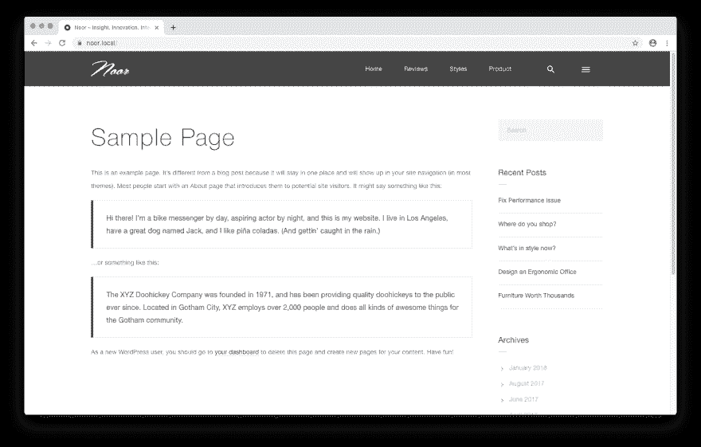](https://res.cloudinary.com/practicaldev/image/fetch/s--wznSPnTz--/c_limit%2Cf_auto%2Cfl_progressive%2Cq_auto%2Cw_880/https://thepracticaldev.s3.amazonaws.com/i/nkahlkptpuaqnne567a6.png)

### 调试

正如我在标题中提到的，我将在 Chrome 浏览器上使用 DevTool，如果你愿意，你可以使用标准的 Chrome 浏览器。

我将在一个本地环境下工作，你可以使用
飞轮的 [Local 来设置你的 WordPress。](https://localbyflywheel.com/)

让我们开始分析并重新加载页面以查看性能:

1-从 Chrome 主菜单打开 DevTools

点击右上角的菜单打开 Chrome DevTools，然后更多
*工具* >* 开发者工具*

[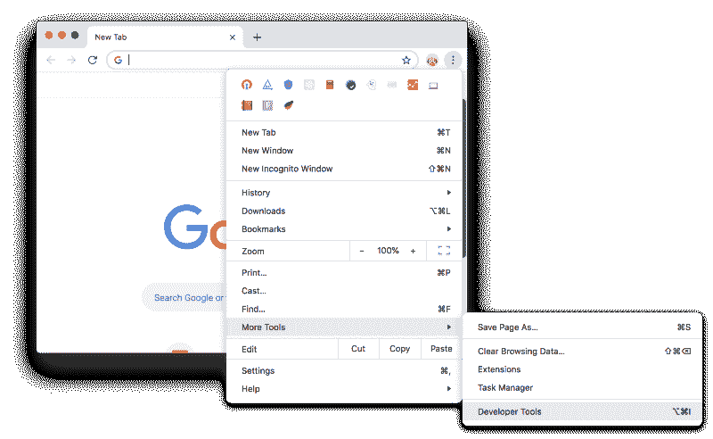](https://res.cloudinary.com/practicaldev/image/fetch/s--CDhQ3PBg--/c_limit%2Cf_auto%2Cfl_progressive%2Cq_auto%2Cw_880/https://thepracticaldev.s3.amazonaws.com/i/1dkfrk8sq5kwnxvw0ewb.png)

2 —转到**性能**选项卡。

3 —点击**重新加载**图标。

[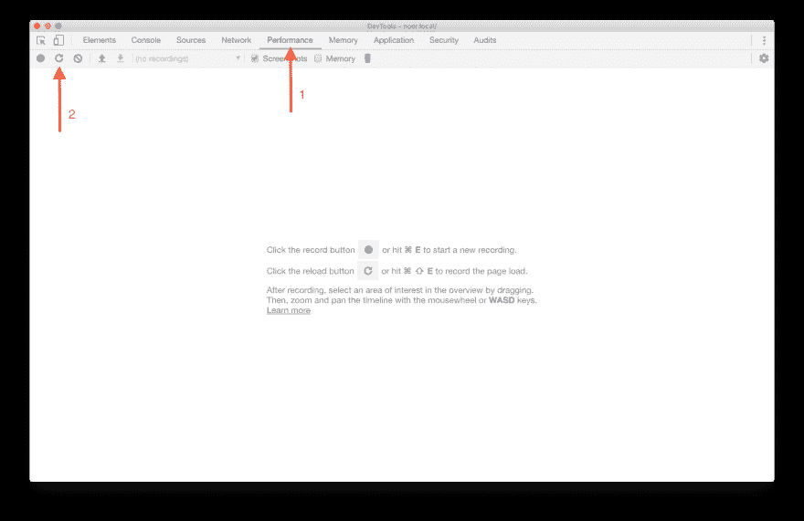](https://res.cloudinary.com/practicaldev/image/fetch/s--aadd55mM--/c_limit%2Cf_auto%2Cfl_progressive%2Cq_auto%2Cw_880/https://thepracticaldev.s3.amazonaws.com/i/5fo3yfq77yeax33dddid.png)

### 查看绩效档案

这是页面加载的性能概要。

[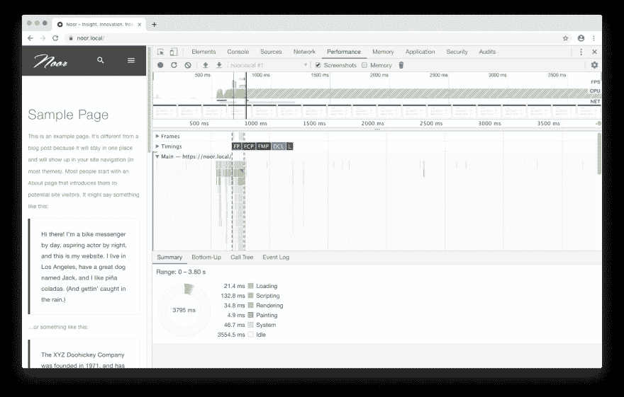](https://res.cloudinary.com/practicaldev/image/fetch/s--1bnmfz83--/c_limit%2Cf_auto%2Cfl_progressive%2Cq_auto%2Cw_880/https://thepracticaldev.s3.amazonaws.com/i/y15fsvtsf8zh040rt5zx.png)

放大红色条，其中大的“**挡住了**

正如您在下面看到的，我们可以确认这段时间很慢，该帧用了
`68.1 ms`来执行，并以`15 FPS`和 CPU 时间`277.66`运行。

[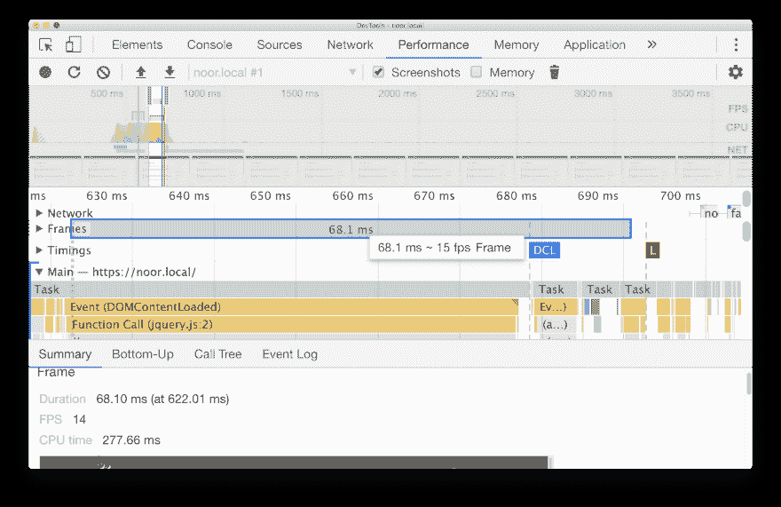](https://res.cloudinary.com/practicaldev/image/fetch/s--de653CF5--/c_limit%2Cf_auto%2Cfl_progressive%2Cq_auto%2Cw_880/https://thepracticaldev.s3.amazonaws.com/i/tyxmo2q1o7u0tq6m3v64.png)

> *FPS 上方的红色条是一个警告，帧速率下降得太低，以至于
> 可能损害了用户的体验。*

要开始调查，请点击 **FPS** 图上方的`Red`条。如果你点击右上角有一个**红色三角**的
，你将在**摘要标签**中获得更多
小曲。

[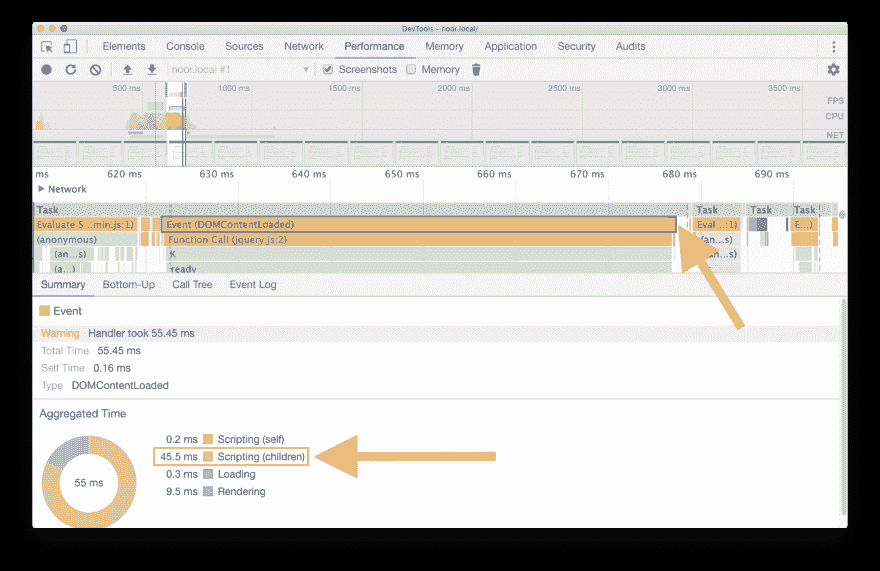](https://res.cloudinary.com/practicaldev/image/fetch/s---j86lIY1--/c_limit%2Cf_auto%2Cfl_progressive%2Cq_auto%2Cw_880/https://thepracticaldev.s3.amazonaws.com/i/dtjdftl25ok0780zajlq.png)

您可以说子脚本正在运行`45.5 ms`，因此我们必须知道
哪些活动直接占用了总计最多的时间。DevTool 能够
显示记录中选定部分的活动。

[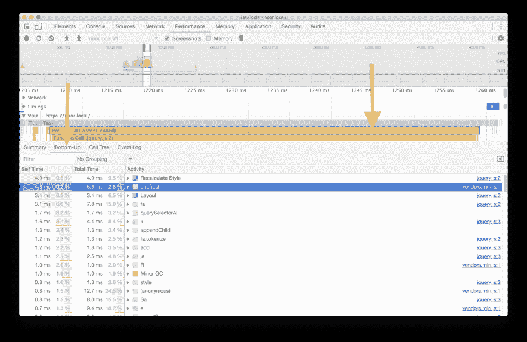](https://res.cloudinary.com/practicaldev/image/fetch/s--PQoKj2Ij--/c_limit%2Cf_auto%2Cfl_progressive%2Cq_auto%2Cw_880/https://thepracticaldev.s3.amazonaws.com/i/2duz4aefx3ivq9omvn5w.png)

上面你可以看到几乎所有的时间都花在了执行
对`vendors.min.js` (JS 文件，包含主题上使用的所有
脚本)和`Recalculate Style`的两个调用`e.refrech`上，点击`e.refrech`，你
会得到:

[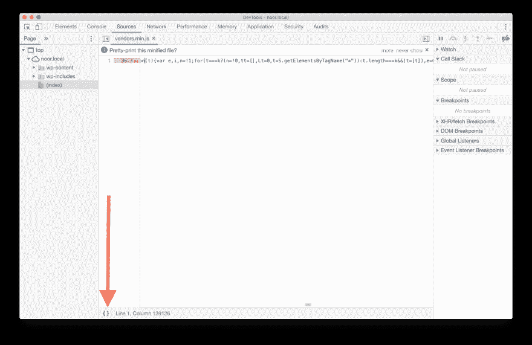](https://res.cloudinary.com/practicaldev/image/fetch/s--OO2im6XS--/c_limit%2Cf_auto%2Cfl_progressive%2Cq_auto%2Cw_880/https://thepracticaldev.s3.amazonaws.com/i/gmqx2yrnlal1xp45xmdg.png)

DevTools 将您带到代码中触发事件的确切位置。由于
代码变小了，你应该把它打印出来。

[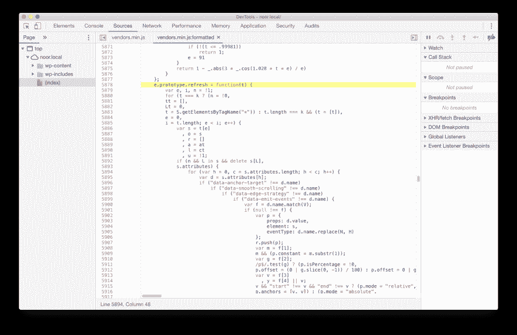](https://res.cloudinary.com/practicaldev/image/fetch/s--9ycRmSsI--/c_limit%2Cf_auto%2Cfl_progressive%2Cq_auto%2Cw_880/https://thepracticaldev.s3.amazonaws.com/i/npqr4jo024hsiwry0lzw.png)

我在主题的所有 JS 文件中搜索了“`data-anchor-target`”，我发现
在 slow 后面的文件是`skrollr.js`我们用它作为视差图像，
但是在这个页面中，我们没有使用任何视差图像。

在一个大型项目中，准确获取慢速帧背后的代码的最好方法是
过滤 JS 文件，并获取我们编写的定制 JS 代码。

所以为了打开树，你可以按住 Option (Mac)或 Control+Alt (Windows，
Linux)然后点击。(感谢@ChromeDevTools)

> Chrome DevTools@ chromedevtools[@ TahriAdel](https://twitter.com/TahriAdel)按住 Option (Mac)或 Control+Alt (Windows、Linux)然后点击19:15PM-08 2017 年 11 月02

[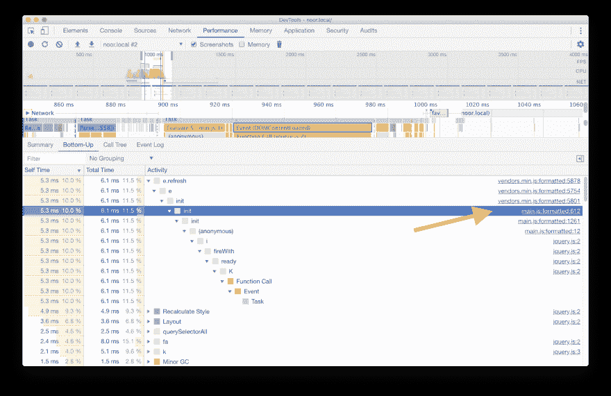](https://res.cloudinary.com/practicaldev/image/fetch/s--QE4VMcYC--/c_limit%2Cf_auto%2Cfl_progressive%2Cq_auto%2Cw_880/https://thepracticaldev.s3.amazonaws.com/i/a5nyxjiboh36qyguak71.png)

现在，在打开树激活之后，我搜索了包含
我们的自定义 JS 的`main.min.js`，我打开了它，正如所料，它直接进入了
运行视差的代码(*，这里我们使用了 Skrollr 函数*)。

[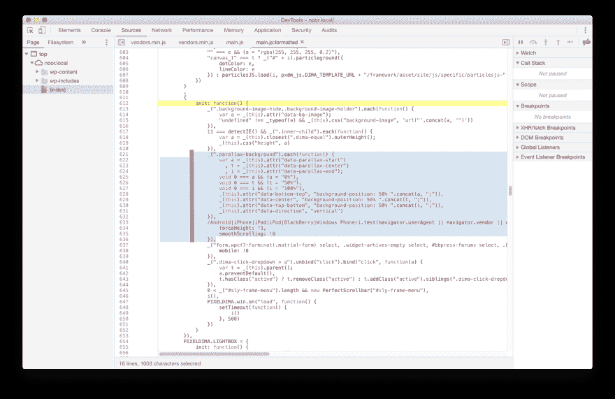](https://res.cloudinary.com/practicaldev/image/fetch/s--Fn0EKhN_--/c_limit%2Cf_auto%2Cfl_progressive%2Cq_auto%2Cw_880/https://thepracticaldev.s3.amazonaws.com/i/5e5895cvrwwvvqcd07j0.png)

在代码中，你可以看到我们在没有任何条件的情况下调用了`Skrollr`
，这意味着即使我们没有使用它，它也在运行。所以为了解决这个问题，我们
必须添加一个条件，在调用 Skrollr 函数之前测试元素`$(".parallax-background")`是否存在
。

### 修复后的结果

[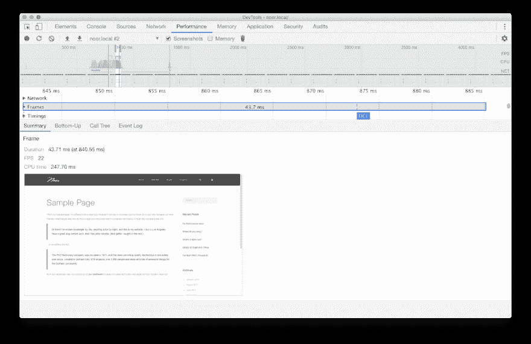](https://res.cloudinary.com/practicaldev/image/fetch/s--2SpQ0htz--/c_limit%2Cf_auto%2Cfl_progressive%2Cq_auto%2Cw_880/https://thepracticaldev.s3.amazonaws.com/i/3dai9ri5xpw43jv5ipnt.png)

通过这个小修复，我们不再有红色条，我们设法保存了`25
ms`(从`68 ms`到`43 ms`，现在运行在`23 FPS`而不是`15 FPS`
，CPU 时间`247.06 ms`。

### 来源:

*   [https://moderndevtools.com/lessons/11](https://moderndevtools.com/lessons/11)
*   [https://developers . Google . com/web/tools/chrome-dev tools/evaluate-performance/reference](https://developers.google.com/web/tools/chrome-devtools/evaluate-performance/reference)