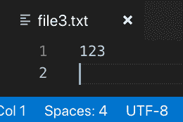
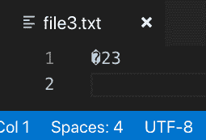
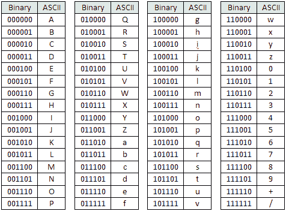

# 解码混乱的编码世界(第 2 部分)

> 原文：<https://dev.to/neumaneuma/decoding-the-confusing-world-of-encodings-part-2-4lo>

# 什么是编码？第二部分

在[第 1 部分](https://dev.to/neumaneuma/decoding-the-confusing-world-of-encodings-part-1-3oke)中，我们揭示了术语“编码”的以下用法:

> 这个文件是十六进制编码的
> 
> 该文件使用 ASCII 编码
> 
> 该字符串是 Unicode 编码的
> 
> 让我们将输出写入 UTF-8 编码的文件

在第 2 部分中，我们将讨论“编码”的其他用法:

> 我们的信息是安全的，因为它是用 Base64 编码的
> 
> Python 使用 Unicode 字符串进行编码

* * *

> ## Our message is safe because it is encoded with Base64

这种说法涉及几个不同的概念。我将从检查编码的类型开始。

据我所知，编码有两种不同的类别:[字符编码](https://en.wikipedia.org/wiki/Character_encoding)和[二进制到文本编码](https://en.wikipedia.org/wiki/Binary-to-text_encoding)。ASCII 和 UTF-8 是字符编码的例子。Base64 是二进制到文本编码的一个例子。

有什么区别？字符编码和二进制到文本编码的共同目标是将位转换成字符。但是，字符编码旨在产生人类可读的输出。二进制到文本的编码被设计成将比特转换成人类可打印的输出。

等等，什么？你说这是一个模糊的区别？好吧，让我试着用不同的方式解释它。像 ASCII 这样的字符编码非常适合数据存储和传输。例如，假设你正在写一篇演讲稿。你想把它保存在你的电脑上，这样你就不用每次都重新输入了。计算机将语音存储为一串`1`和`0`，需要 ASCII 将这些比特翻译回组成语音的单词、字母和标点符号。同理，假设你想把演讲稿上传到云端。在互联网上传输该语音需要完全相同的过程。

Base64 是二进制到文本编码的一个例子。事实上，它几乎是唯一一个正在使用的，就像 UTF-8 是网页上的字符编码。它是 ASCII 的子集，包含 128 个 ASCII 字符中的 64 个:`a-z`、`A-Z`、`0-9`、`+`和`/`。它不包含像`NUL`或`EOF`这样的字符(它们是不可打印字符的例子)。Base64 通常用于将二进制文件转换为文本，甚至将不可打印字符的文本文件转换为仅可打印字符的文本文件。这样做的好处是，您可以输出任何类型文件的内容，不管它包含什么数据。它也不必局限于一个文件；它可以只是一个字符串，如密码。此外，无论底层位是什么，您都可以保证始终有可以显示的字符。这是 UTF 8 号无法做到的。Base64 是怎么做到的？

我在第 1 部分的 UTF-8 章节中描述了一个字节开头的某些位模式是如何指示这个字符有多少字节的。`0`为 1 字节，`110`为 2 字节，`1110`为 3 字节，`11110`为 4 字节。它使用`10`来表示一个字节是一个延续字节。这意味着不遵循这种模式的字节序列是 UTF-8 无法理解的。不以`0`、`10`、`110`、`1110`或`11110`开头的字节不会被 UTF-8 正确渲染。比如 UTF-8 就不懂`11111111`。

让我们在命令行上用一个新文件`file3.txt` :
来展示这个

```
$ cat file3.txt
123 
```

```
$ xxd -b file3.txt
00000000: 00110001 00110010 00110011 00001010                    123. 
```

```
$ printf '\xff' | dd of=file3.txt bs=1 seek=0 count=1 conv=notrunc # overwrite the first byte with 11111111
1+0 records in 1+0 records out
1 byte copied, 0.0009188 s, 1.1 kB/s 
```

```
$ xxd -b file3.txt
00000000: 11111111 00110010 00110011 00001010                    .23. 
```

这是在被`printf '\xff' | dd...`命令覆盖之前，该文件在使用 UTF-8 编码的 VSCode 中的样子:

[](https://res.cloudinary.com/practicaldev/image/fetch/s--sL4i-eLh--/c_limit%2Cf_auto%2Cfl_progressive%2Cq_auto%2Cw_880/https://thepracticaldev.s3.amazonaws.com/i/nbvj2lx056280lx3bbgn.JPG)

这是它之后的样子:

[](https://res.cloudinary.com/practicaldev/image/fetch/s--Xk9hRTJn--/c_limit%2Cf_auto%2Cfl_progressive%2Cq_auto%2Cw_880/https://thepracticaldev.s3.amazonaws.com/i/jdxz1062elkw50tnln0p.JPG)

如前所述，Base64 可以始终显示可打印的字符，即使 UTF-8 不能。让我们看看实际情况:

```
$ base64 file3.txt > file4.txt 
```

现在，该文件具有可打印的字符:

[](https://res.cloudinary.com/practicaldev/image/fetch/s--_hgCuTSd--/c_limit%2Cf_auto%2Cfl_progressive%2Cq_auto%2Cw_880/https://thepracticaldev.s3.amazonaws.com/i/g05dls1z3qzpgydfxnrj.jpg)

好极了。但是我们怎么会有`/zIzCg==`呢？为了避免混淆，我将一步一步来。

Base64 的字母表中有 64 个字符。这意味着它只需要 6 位来表示整个字母表(2 <sup>6</sup> == 64)。UTF-8 使用字节中的前导位作为元数据来确定它是起始字节还是延续字节。这些字节不包含任何关于被存储字符的信息(即实际数据)。相比之下，Base64 使用整个字节作为数据。它没有元数据。然而，正如我提到的，它只使用 6 位。一个字节有 8 位。这种数学如何排列？

让我们从检查 Base64 表开始，它看起来非常类似于 ASCII 表:

[](https://res.cloudinary.com/practicaldev/image/fetch/s--xxRJ814n--/c_limit%2Cf_auto%2Cfl_progressive%2Cq_auto%2Cw_880/https://thepracticaldev.s3.amazonaws.com/i/2bvlrwy8fd325q0zzcc1.png)

`file3.txt`的二进制表示是`11111111 00110010 00110011 00001010`。Base64 的工作方式是以 6 位为一组来解释位。因此，即使一个字节的逻辑分组是 8 位，我们也要将分组修改为 6 位(以反映 Base64 如何看待这一点):`111111 110011 001000 110011 000010 10`。事实上，让我们以表格的形式来看一下，这样会更简单:

| 字节 | Base64 字符 |
| --- | --- |
| `111111` | `/` |
| `110011` | `z` |
| `001000` | `I` |
| `110011` | `z` |
| `000010` | `C` |
| `10` | ？？？ |

前 5 组 6 位完全符合我们 Base64 编码的前 5 个字符`file4.txt`。但是我们最后只剩下 2 位，这不足以构成 Base64 中的有效字符。`file3.txt`有 4 个字节，也就是 32 位。32 不能被 6 整除。

当文件大小不能被 6 位整除时，Base64 采用填充。为了使 32 位文件与 Base64 兼容，我们将把`0000`附加到文件的末尾，这样最终的字符可以被 Base64 正确地呈现。下面是新的位串:`111111 110011 001000 110011 000010 100000`。让我们也以表格形式查看一下:

| 字节 | Base64 字符 |
| --- | --- |
| `111111` | `/` |
| `110011` | `z` |
| `001000` | `I` |
| `110011` | `z` |
| `000010` | `C` |
| `100000` | `g` |

那好多了。现在前 6 个字符匹配。但是结尾的`==`呢？我们没有剩余的比特。事实上，`=`甚至不在 Base64 表中！怎么回事？

Base64 要求输出的字符数能被 4 整除。这意味着那些`=`是填充字符以满足需求。但是为什么会有这样的要求呢？好吧，让我们假设一下。Base64 字符每个使用 6 位。一个字节使用 8 位。字节是文件系统中的基本构造块。我们不以比特来衡量事物，而是以字节来衡量。那么，需要多少 Base64 字符才能使总位数恰好适合一个字节串(即，能被 8 整除)？

它需要 24 位，也就是 3 个字节。在 24 位中有 4 个 Base64 字符(每个 6 位)。我想这就是`=`填充要求背后的基本原理。

下表显示了原始文件大小如何影响 Base64 输出:

| 原始文件大小 | Base64 字符数 | `=`填充 | `0`填充 |
| --- | --- | --- | --- |
| 1 字节 | four | `==` | `0000` |
| 2 字节 | four | `=` | `00` |
| 3 字节 | four |  |  |
| 4 字节 | eight | `==` | `0000` |
| 5 字节 | eight | `=` | `00` |
| 6 字节 | eight |  |  |
| ... | ... | ... | ... |

让我们看一些需要填充和不需要填充的字符串的例子。

* * *

*2 `=`填充:`@` ( `01000000` )*

| 字节 | UTF 8 字符 |
| --- | --- |
| `01000000` | `@` |

| 字节 | 比特位置 | Base64 字符 |
| --- | --- | --- |
| `010000` | **010000** 00 | `Q` |
| `000000` | 010000 **00** | `A` |
| `padding` | `none` | `=` |
| `padding` | `none` | `=` |

请注意，由于末尾只有 2 位可用，`0000`被用作末尾的填充，以使位长(不包括任何`=`填充)能被 6 整除。

* * *

*1 `=`填充:`AB` ( `0100000101000010` )*

| 字节 | UTF 8 字符 |
| --- | --- |
| `01000001` | `A` |
| `01000010` | `B` |

| 字节 | 比特位置 | Base64 字符 |
| --- | --- | --- |
| `010000` | **010000** 0101000010 | `Q` |
| `010100` | 010000 **010100** 0010 | `U` |
| `001000` | 0100000010100**0010** | `I` |
| `padding` | `none` | `=` |

这次`00`被用作字符串末尾的填充。

* * *

*无填充:`v3c` ( `011101100011001101100011` )*

| 字节 | UTF 8 字符 |
| --- | --- |
| `01110110` | `v` |
| `00110011` | `3` |
| `01100011` | `c` |

| 字节 | 比特位置 | Base64 字符 |
| --- | --- | --- |
| `011101` | **011101**100011001101100011 | `d` |
| `100011` | 011101**100011**001101100011 | `j` |
| `001101` | 011101100011**001101**100011 | `N` |
| `100011` | 011101100011001101**100011** | `j` |

由于位数可以被 6 整除，所以这次不需要填充。

* * *

现在我们应该能够理解什么时候需要填充，什么时候不需要。让我们来看看`file4.txt`(Base64 表示`file3.txt`)的完整表格:

*`file3.txt`的原始二进制(共 4 字节):`11111111001100100011001100001010`*

| 字节 | 比特位置 | Base64 字符 |
| --- | --- | --- |
| `111111` | **111111**11001100100011001100001010 | `/` |
| `110011` | 111111**110011**00100011001100001010 | `z` |
| `001000` | 1111111110011**001000**11001100001010 | `I` |
| `110011` | 1111111110011001000**110011**00001010 | `z` |
| `000010` | 111111110011001000110011**000010**10 | `C` |
| `100000` | 111111110011001000110011000010**10** | `g` |
| `padding` | `none` | `=` |
| `padding` | `none` | `=` |

由于`file3.txt`是 4 个字节，它需要`0000`作为最后一个 Base64 字符的填充符，需要`==`作为完整 Base64 输出的填充符。

最后需要注意的是，`file4.txt`(其内容为`/zIzCg==`)将被存储为 UTF-8(在本例中与 ASCII 完全相同，因为 Base64 是 ASCII 字母表的子集)。记住 Base64 不是字符编码！这是一种二进制到文本的编码。字符编码是存储在磁盘上的编码。我在学习这个的时候有一个错误的假设，Base64 文件在磁盘上会有和原始文件完全相同的字节(也就是说，`file4.txt`和`file3.txt`会有相同的字节)。然而事实并非如此！观察:

```
$ xxd -b file4.txt
00000000: 00101111 01111010 01001001 01111010 01000011 01100111  /zIzCg
00000006: 00111101 00111101 00001010                             ==. 
```

因此，Base64 获取了`file3.txt`的底层位，使用其算法将这些位映射到 Base64 字符，然后将这些字符写入 UTF-8 中的`file4.txt`。如果我们创建一个新文件并手动输入`/zIzCg==`，它将会有完全相同的二进制表示。这只是文本的 UTF-8 编码。

* * *

### 什么是 Base64url？

[Base64url](https://en.wikipedia.org/wiki/Base64#URL_applications) 是偶尔会出现的东西。这是 Base64 的一个变体，其中`+`和`/`被替换为`-`和`_`，因此输出将是 [URL 安全的](https://en.wikipedia.org/wiki/Percent-encoding)。`+`和`/`必须编码在一个 URL 中(即`+`变成`%2B`，`/`变成`%2F`)，但是`-`和`_`被认为是安全的。

`=`也不是 URL 安全的，但是没有关于如何处理它的标准化。一些库将对它进行百分比编码(`%3D`)，一些库将它编码为句点(`.`)。

* * *

### 编码与加密

出于某种原因，人们经常混淆这两个术语。我认为原因在于，特别是当它涉及到 Base64 时，是因为 [HTTP `Authorization`请求头](https://developer.mozilla.org/en-US/docs/Web/HTTP/Headers/Authorization#Examples)和[jwt](https://jwt.io/)。这两个概念都是与安全相关的，都涉及 Base64 来将明文转换成看似“混乱”的输出。因此，人们错误地认为 Base64 编码和加密是一回事。

其实不是。

加密是使用一个密钥(基本上只是一个随机数)将明文数学转换成密文(一堆乱码)的过程。根据使用的加密类型，将密文转换回明文的唯一方法是使用相同的密钥(对称加密)或不同但数学上相关的密钥(非对称加密)。在没有密钥的情况下，破解加密的唯一方法是暴力破解，这取决于所使用的加密强度，可能需要 6400 亿年。

从二进制到文本的意义上来说，编码是将比特转换成人类可打印的输出的过程。这应该是一个任何人都可以做的平凡的可逆过程。即使使用了不同于 Base64 的编码，编码的数量也是相当有限的。暴力破解可能需要现代计算机几毫秒才能完成。

这当然意味着 HTTP `Authorization`请求头和 jwt 不提供任何固有的数据机密性。不是说他们没用，只是说加密不是他们的好处之一。任何截获这些数据片段的人都可以轻松地解码 Base64(如果他们在技术上足够精通，能够嗅探网络流量，那么他们很有可能也知道 Base64 是什么)。Base64 旨在确保您不必处理二进制数据(即标准字符编码不知道如何解释的字节)或像`NUL`或`EOF`这样的字符。它经常被用在与安全相关的概念中(比如 [PEM 格式](https://en.wikipedia.org/wiki/Privacy-Enhanced_Mail)，但是它本身并不是一种安全技术！

* * *

> ## Python uses Unicode strings for encoding

在 python 2 中，有一类字符串文字被称为 [unicode 字符串](https://docs.python.org/2/howto/unicode.html#encodings)。它们通过将字符`u`作为字符串文字的前缀来描述(例如，`u'abc'`)。我不喜欢 unicode 字符串这个术语，因为它会导致人们混淆 unicode 是一种编码。那么 python 指的 unicode 字符串到底是什么意思呢？

我们来看看 Python 2.7.12 中的一些例子:

```
>>> a = u'abc'
>>> b = u'abcŔŖ'
>>> a
u'abc'
>>> b
u'abc\u0154\u0156' 
```

所以我们定义了两个字符串，`a`和`b`，它们包含的内容与第一部分中[的`file1.txt`和`file2.txt`相同。`a`可以毫无问题的打印到控制台，但是控制台在`b`结束时无法渲染`ŔŖ`。相反，这些字符被替换为它们的 unicode 码位:`\u0154` ( `U+0154`)和`\u0156` ( `U+0156`)。python 2 解释器似乎只能打印使用 ASCII 的字符串，而不能打印 unicode 兼容的编码。](https://dev.to/neumaneuma/decoding-the-confusing-world-of-encodings-part-1-3oke)

让我们尝试对这些字符串进行显式编码:

```
>>> a.encode('utf-8')
'abc'
>>> a.encode('ascii')
'abc'
>>> b.encode('utf-8')
'abc\xc5\x94\xc5\x96'
>>> b.encode('ascii')
Traceback (most recent call last):
  File "<stdin>", line 1, in <module>
UnicodeEncodeError: 'ascii' codec can't encode characters in position 3-4: ordinal not in range(128) 
```

字符串`a`可以像预期的那样使用 ASCII 和 UTF-8 编码。正如所料，使用 ASCII 编码字符串`b`会导致错误，因为`Ŕ`和`Ŗ`都不是 ASCII 兼容的。使用 UTF-8 对字符串`b`进行编码会呈现一个混合了 ASCII 字符(python 2 可以处理)和 python 2 不能处理的非 ASCII 字符的十六进制表示的字符串。

python 2 中的 unicode 字符串只是 ASCII 兼容字符和非 ASCII 兼容字符的码位(作为字符串)的组合。python 3 怎么样？Python 3 摆脱了常规字符串(如`abc`)和 unicode 字符串(如`u'abc'`)的区分，只有不带任何前缀的常规字符串。这是否意味着 python 3 中没有 unicode 字符串？

让我们使用 Python 3.5.2 来了解一下:

```
>>> a = "abc"
>>> b = 'abcŔŖ'
>>> a
'abc'
>>> b
'abcŔŖ' 
```

Python 3 将每个字符串都视为 unicode 字符串，除此之外，现在还可以将非 ASCII 兼容字符打印到控制台。此外，`encode()`功能仍然工作相同:

```
>>> b.encode('utf-8')
b'abc\xc5\x94\xc5\x96' 
```

剩下的唯一问题是如何打印出代码点？

```
>>> b.encode('unicode_escape')
b'abc\\u0154\\u0156' 
```

* * *

现在读者应该对 Base64 是什么及其工作原理、编码和加密之间的区别以及 python 中 unicode 字符串的含义有了很好的了解。那太难了！但这表明了“编码”是什么的复杂性和过多的术语。