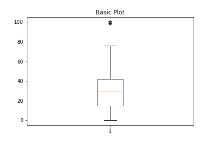
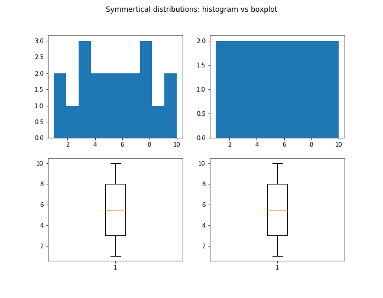
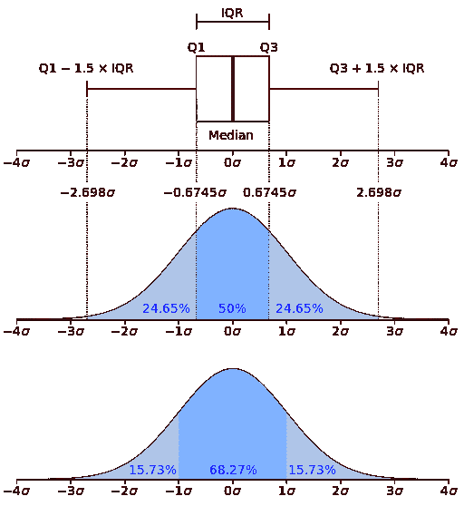
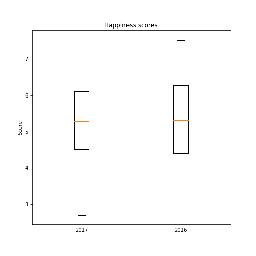
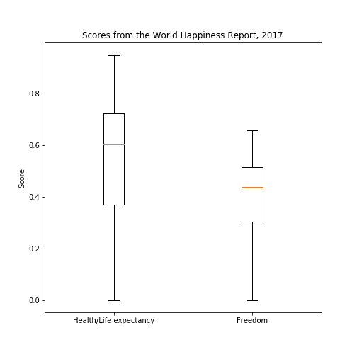

# 解构盒子和胡须情节

> 原文：<https://dev.to/annazubova/deconstructing-the-box-and-whisker-plot-11f3>

当试图理解一组数据看起来像什么时，有大量的选项来可视化它。重要的是，要选择那些服务于我们想问的特定问题的。

当可视化数据和对分布进行初步分析时，直方图通常是首选。然而，盒须图(通常称为盒图)可以单独使用，也可以作为数据分析的附加工具。

箱线图使用分布的 5 个重要描述统计量:**中值**、**下四分位数**、**上四分位数**和**最大值和最小值**。它让我们快速了解数据的样子，并允许在一个简单的图表中比较不同组的数据。

以下是一个基本盒状图的示例:

[](https://res.cloudinary.com/practicaldev/image/fetch/s--81npnXzE--/c_limit%2Cf_auto%2Cfl_progressive%2Cq_auto%2Cw_880/https://github.com/AnnaLara/visualizations_with_boxplot_blogpost/raw/master/basic_boxplot.png)

## 局限性

重要的是要理解，这 5 个统计量不能是用于描述分布的唯一分布度量，不如均值和标准差等指标。然而，在分布高度偏斜或存在异常值的情况下，它可能是检查数据形状、分布和可变性的非常有用的工具。

箱线图在显示数据是否对称方面非常有用，但它们不会显示对称的类型。例如，两组数据看起来可能与箱线图完全相同，但其中一组数据的频率差异很大，而另一组数据是均匀分布的。箱线图不是检查这些特征的合适工具。因此，箱线图最好与其他可视化方法结合使用，例如直方图。

[](https://res.cloudinary.com/practicaldev/image/fetch/s--JEqYDnQN--/c_limit%2Cf_auto%2Cfl_progressive%2Cq_auto%2Cw_880/https://github.com/AnnaLara/visualizations_with_boxplot_blogpost/raw/master/hist_vs_box_1.png)

## 用箱线图可视化离群值

箱线图的主要目的之一是快速可视化异常值，以查看是否有必要将其移除以进行进一步分析。但是为了真正理解什么被认为是异常值，让我们看看下面的正态分布的箱线图和 PDF。

<figure>

[](https://res.cloudinary.com/practicaldev/image/fetch/s--N9HKVynw--/c_limit%2Cf_auto%2Cfl_progressive%2Cq_auto%2Cw_880/https://github.com/AnnaLara/visualizations_with_boxplot_blogpost/raw/master/512px-Boxplot_vs_PDF.svg.png)

<figcaption>Source: https://commons.wikimedia.org/wiki/File:Boxplot_vs_PDF.svg</figcaption>

</figure>

触须实际上代表的是超出该值的数据将被视为异常值。为了确定下限，从第一个四分位数值中减去四分位数间距乘以 1.5。为了确定上限，我们应该将 1.5 倍的四分位间距加到第三个四分位值上。

在正态分布中，带须的箱线图代表所有数据的 99.3%；也就是说，异常值仅占数据的 0.7%。

## 比较数据

箱线图的另一个非常重要的用途是比较不同组的数据。绘制几个彼此相邻的箱形图可以让我们很好地判断各组是否相似。

我们需要寻找的是:

*   如果盒子重叠。
    如果没有重叠的话，很明显各组是不同的。

*   如果中线在盒子的可视范围内。如果不是，很可能是不同的群体。

*   盒子的范围。
    评估方框的比较范围有助于了解数据分布的差异。

*   偏斜度。
    由于从箱形图中很容易观察到偏斜度，因此比较两个图之间的该参数可能是有用的。

这种初步的视觉分析可以帮助理解我们正在观察的两组是否相似，以及我们是否需要应用一些其他技术来进一步测量它们的差异。

让我们来看看来自 [Kaggle](https://www.kaggle.com/unsdsn/world-happiness) 的《世界幸福报告》的数据。首先，我们来看看 2017 年和 2016 年的幸福得分。

[](https://res.cloudinary.com/practicaldev/image/fetch/s--g3m19PQB--/c_limit%2Cf_auto%2Cfl_progressive%2Cq_auto%2Cw_880/https://github.com/AnnaLara/visualizations_with_boxplot_blogpost/raw/master/happiness_2017_2016.png)

这些组显然非常相似，因为中线位于同一水平面。第二幅图的展开比第一幅图略宽。

然而，如果我们比较健康和自由得分，箱线图将显示更多的差异。

[](https://res.cloudinary.com/practicaldev/image/fetch/s--Zg8sUtEZ--/c_limit%2Cf_auto%2Cfl_progressive%2Cq_auto%2Cw_880/https://github.com/AnnaLara/visualizations_with_boxplot_blogpost/raw/master/health_freedom_2017.png)

我们实际上可以提取由箱线图计算的统计值。创建绘图后返回的对象中存储了所有值。要查看它有哪些键，我们可以运行`bp.keys()`。例如，要提取中位数，我们可以使用下面的代码:

```
#get values for the medians
#bp is a box plot object 
medians = []
for i in bp['medians']:
    medians.append(i.get_data()[1][0]) 
```

Enter fullscreen mode Exit fullscreen mode

`medians`现在等于`[0.6060415506362921, 0.43745428323745705]`

为了获得盒子的上层和下层，我们可以实现这个代码，其中我们将访问来自`bp['boxes']`对象的第二个元素，该元素表示线条的 y 轴值。之后，我们将选择第一个和第三个元素，它们是盒子的上下 y 轴值:

```
#get values for boxes' lower and upper values boxes = []
for i in bp['boxes']:
    boxes.append(i.get_data()[1][0])
    boxes.append(i.get_data()[1][3]) 
```

Enter fullscreen mode Exit fullscreen mode

`boxes`现在包含列表`[0.36986629664897896, 0.723007529973984, 0.3036771714687345, 0.5165613889694209]`

因此，第一个框(50%的数据位于此处)的范围介于 0.37 和大约 0.72 之间，中间值为 0.61。第二个箱形图的范围为 0.30 至 0.52，中间值为 0.44。

## 缺口盒图

箱形图的一个有趣特征是经常被忽略的*缺口*参数，它允许比较中值的置信区间。默认情况下，置信度为 95%。该选项在比较相同值的组时特别有用，我们将寻找指示中值相似性/差异的凹口的视觉重叠。

缺口盒图可与 Matplotlib 盒图中的另一个参数 *bootstrap* 一起使用。默认情况下，它被设置为等于无。如果设置为整数，这将指示应该执行多少次引导以确定置信区间。

## 其他有用的选项

使用 Matplotlib 库创建盒状图时，还有其他一些有用的参数。

*sym* :决定飞行积分的外观。将其设置为空字符串会告诉 Matplotlib 我们不想显示异常值。

*胡须*:参数允许改变胡须的范围。默认情况下，该参数等于 1.5。晶须的下限和上限相应地由 Q1 - 1.5*IQR 和 Q3 + 1.5*IQR 决定。如果 *whis* 设置为“范围”字符串，则触须达到最小值和最大值。

*vert* :接受一个布尔值。默认情况下，它设置为 True，但如果设置为 False，则盒状图将水平显示。

*positions* :接受类似数组的参数。默认情况下，它是(1，N+1)，其中 N 是盒状图的数量。如果设置为(1，1)，两个盒状图将重叠。

*宽度*:设置每个方框的宽度。

*标签*:设置每个方框图的标签。

### 参考文献及进一步阅读

*   [箱线图的 Matplotlib 文件](https://matplotlib.org/api/_as_gen/matplotlib.pyplot.boxplot.html?highlight=boxplot#matplotlib.pyplot.boxplot)
*   [构建盒须图](https://www150.statcan.gc.ca/n1/edu/power-pouvoir/ch12/5214889-eng.html)
*   [比较箱线图和直方图——哪种工具更好？](https://www.brighthubpm.com/six-sigma/58254-box-plots-vs-histograms-in-project-management/)
*   [了解箱线图](https://towardsdatascience.com/understanding-boxplots-5e2df7bcbd51)
*   [如何比较箱线图](https://blog.bioturing.com/2018/05/22/how-to-compare-box-plots/)
*   [关于如何比较箱线图的更多信息](https://blog.bioturing.com/2018/05/22/more-on-how-to-compare-box-plots/)

这篇博文的可视化可以在我的 [GitHib 个人资料](https://github.com/AnnaLara/visualizations_with_boxplot_blogpost)中找到。