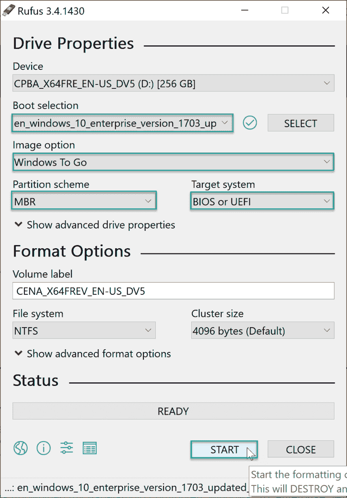
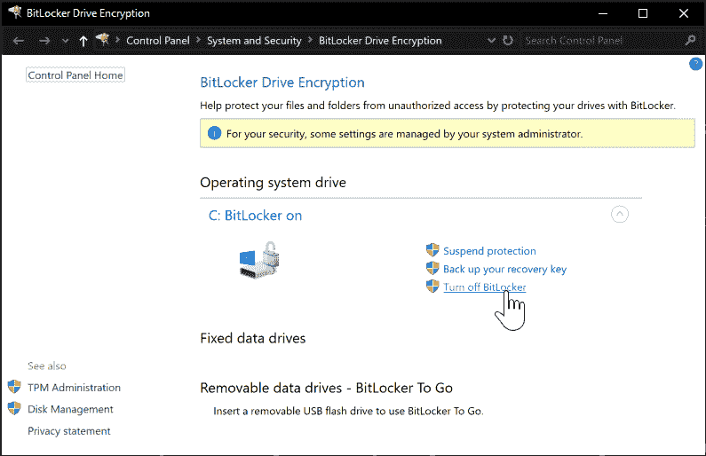
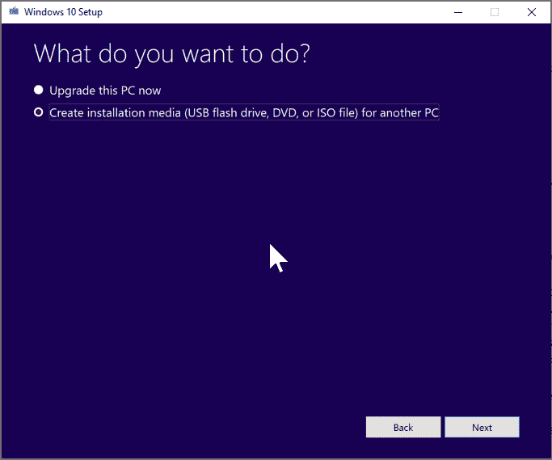
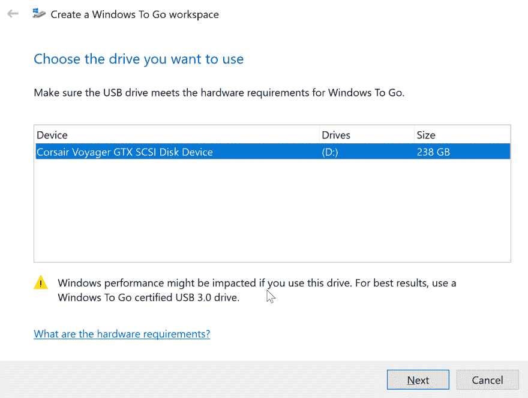

# 解密损坏的 windows 安装的 BitLocker 操作系统驱动器

> 原文：<https://dev.to/xpirit/decrypt-bitlocker-os-drive-of-corrupted-windows-installation-2njp>

长话短说:我在 Windows 中遇到了一个问题，它使我无法从笔记本电脑中的 NVME 固态硬盘启动。为了在不丢失任何存储数据的情况下将 Windows 的新副本安装到该驱动器上，我需要解密该驱动器。原来你不能安装到加密的磁盘上。要解密磁盘，您需要登录...我最终使用 Windows-to-go 来解决我的问题

## 在不同的系统中安装驱动器

解决此问题的最简单方法是，将驱动器添加到另一个已经运行 Windows 的系统中，启动该系统，使用 BitLocker 恢复密钥解锁数据分区，然后从 BitLocker 控制面板解密:

T3】关闭 BitLocker

但是，这需要访问带有备用 NVME 插槽的系统，以便安装驱动器。原来，我们公司的大多数笔记本电脑只有一个已经被主操作系统磁盘占用的插槽。

## 以恢复模式启动 Windows

如果系统上有可用的本地管理员，您可以使用该管理员启动恢复模式并从那里解密 BitLocker。我的系统加入了 Azure Active Directory，并且没有本地管理员。这也排除了这个选择。

## Windows-to-go 救援

在经历了许多不同的选择都没有结果之后，我想起了 Windows-to-go。Windows-to-go 基本上是一种从 u 盘启动 Windows 的方式。我从我的 visual studio 订阅中下载了 [Windows 1703 企业版](https://my.visualstudio.com/Downloads?q=Windows%2010%20Enterprise,%20Version%201703%20(Updated%20July%202017)&pgroup=)([1809 中有一个错误会导致蓝屏](https://www.tenforums.com/general-support/123835-1809-windows-go-still-broken.html))，并使用 [Rufus 创建了一个 Windows-to-go USB key](https://rufus.ie/) 。

 

<figcaption>使用 Rufus 从任何 Windows ISO 文件创建 Windows-to-go 密钥</figcaption>

将 u 盘插入有问题的系统，选择它作为引导设备(可选地关闭安全引导)，让它重新引导几次，直到你看到一个 Windows 桌面。

在 Windows 资源管理器中找到受影响的驱动器(该驱动器上将显示一个锁图标)，并输入 BitLocker 恢复密钥以解锁该驱动器。现在，您可以打开 BitLocker 控制面板来解密驱动器。

T3】关闭 BitLocker

## 使用 Windows 映像下载工具创建安装驱动器

现在使用 Windows Media Creation Tool 建立一个 Windows 10 安装映像，并在损坏的映像上安装一个全新的 Windows 10。在此之后，你必须重新安装所有的应用程序，但正确安装后，你不会丢失任何文档。

 

<figcaption>使用媒体创建工具创建可启动的 windows 安装映像</figcaption>

> 我以前用 Rufus 创建过一个可启动的 windows 映像，但是不知何故，那些不能把 Windows 安装到 GPT 分区的硬盘上，这个工具提供的 USB key 可以。

## 吸取教训

因此，和往常一样，在使用 BitLocker 时:

*   请确保您备份了 BitLocker 恢复密钥。在我的例子中，它被上传到 Azure Active Directory 并存储在 1Password 中。
*   创建一个本地管理员帐户，在紧急情况下使用非常复杂的密码。这样，您可以启动到 Windows 恢复控制台，并获取您的数据。
*   拥有兼容 Windows-to-go 的 USB 闪存盘。

我用了这个:

虽然未经认证，但它非常管用:

## 耶！

*虽然我已经将我的大部分数据同步到云存储帐户，配置了 Azure Backup，我的项目在 Azure DevOps 或 GitHub 中，但将我所有的文件放在“它们应该在的地方”的驱动器上仍然容易得多，我可以以 300 MB/s 的速度访问它们。*

我又站起来了。