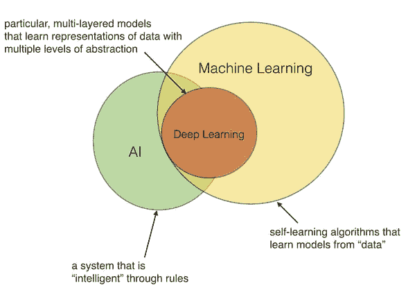

# 深度学习、人工智能和机器学习

> 原文：<https://dev.to/devtox/deep-learning-ai-and-machine-learning-3kfp>

人工智能(AI)是机器可以执行复杂的任务。

2 个最著名的子领域是:**机器学习**和**深度学习**。

**机器学习:**对数据进行分析和学习的算法。他们可以做预测任务，如回归和分类。

**深度学习**是一套机器学习算法，使用能够从经验中学习的复杂神经网络。

机器学习是 AI 的一个品牌，深度学习是机器学习的一个分支。

阅读更多:[差分机器学习，深度学习，AI](https://pythonbasics.org/difference-machine-learning-deep-learning-ai/)