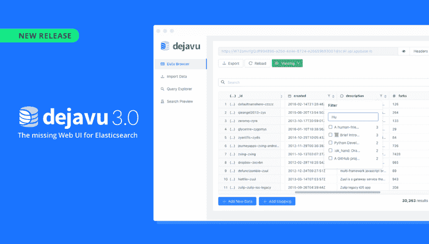

# Dejavu 3.0:弹性搜索缺失的网络用户界面

> 原文：<https://dev.to/appbaseio/dejavu-30-the-missing-web-ui-for-elasticsearch-3h8e>

 
止于[opensource.appbase.io/dejavu](https://opensource.appbase.io/dejavu/)的现场直播。

dejavu 3.0—elastic search 缺失的 web 用户界面在这里🎉 🎉！到目前为止，这是一个令人惊叹的旅程:自从我们在 2015 年首次发布以来，我们已经跨越了一生总计 **475，000**Docker pull，拥有超过 **11K** active Chrome 扩展安装，超过 **5，100+** stars🌟在我们的 Github 仓库里。

在这个主要版本中，我们增加了一个 rad 特性，允许在几分钟内构建和测试搜索 UI。这也是对代码
的完全重写，以将性能提高 2-3 倍，并将 Dejavu 的内存占用减少 50%以上。你可以在这里阅读[的完整更新日志](https://github.com/appbaseio/dejavu/releases/tag/3.0.0)。

**Dejavu 3.0:**用 ElasticSearch 可视化构建分面搜索 UI

在过去 3 年里，我们在构建托管搜索服务 appbase.io 的过程中，不断遇到的用户痛点之一就是如何构建合适的搜索体验。事实证明，理解像 Elasticsearch 这样的搜索引擎是如何工作的有一个陡峭的学习曲线。

简而言之，如今构建搜索体验需要能够轻松导入数据，在测试时调整映射和数据本身，并能够调整与搜索相关的查询。

[Dejavu](https://opensource.appbase.io/dejavu) 是一个开源的麻省理工学院许可的 Web UI，用于 [Elasticsearch](https://www.elastic.co/products/elasticsearch) 。它揭示了构建和测试搜索 UI 的经验。Dejavu 最初是一个用于 Elasticsearch 的富数据浏览器，在 3.0.0 版本中，它允许您为 Elasticsearch 索引构建和测试搜索 UI。

#### 你能用 Dejavu 3.0 做什么？

*   将 JSON 或 CSV 数据导入到您的 Elasticsearch 索引中，
*   获得丰富的数据浏览体验(隐藏/显示数据字段、过滤数据、查询视图和 CRUD 操作)，
*   连接到多个索引并以列的形式浏览嵌套的 JSON 数据，包括对数据应用分面过滤器的能力，
*   在几分钟内构建一个搜索 UI 并测试索引的相关性，
*   用 GUI 编辑器编写搜索查询。

此外，对于 appbase.io 用户，Dejavu 可以做更多的事情:

*   动态编辑映射(例如，将`int`字段更改为`text`字段，然后重新索引您的全部数据)，
*   为测试搜索 UI 视图创建多个配置文件(保存您更新的每个搜索设置，并为多个视图构建搜索或 A/B 测试单个视图)。

* * *

你应该在[opensource.appbase.io/dejavu](https://opensource.appbase.io/dejavu)尝试将 Dejavu 作为一个托管应用，并以 [Docker 图像](https://hub.docker.com/r/appbaseio/dejavu)或 [Chrome 扩展](https://chrome.google.com/webstore/detail/dejavu/jopjeaiilkcibeohjdmejhoifenbnmlh)的形式获得它。