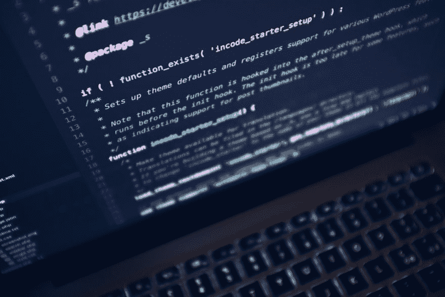

# Swift 中的委托模式示例

> 原文：<https://dev.to/mrcflorian/delegation-pattern-in-swift-by-example-30g3>

在开发几个 [iOS 应用程序模板](https://www.iosapptemplates.com)时，我意识到 Swift 中的授权模式有多广泛。这甚至在苹果的框架中也非常明显。ui table view&ui collection view 可能是 Swift 中最常见的授权示例。在本文中，我们将进一步了解什么是委托模式，以及我们如何在 Swift 中实施委托模式。

[](https://res.cloudinary.com/practicaldev/image/fetch/s--y37wD7fO--/c_limit%2Cf_auto%2Cfl_progressive%2Cq_auto%2Cw_880/https://thepracticaldev.s3.amazonaws.com/i/52dr83gdrj5flfm2du0l.jpeg)

委托模式是 Swift 中的一种报文传送设计模式，用于对象之间的一对一通信。它利用 Swift 协议来避免将组件耦合在一起。

让我们举一个常见的例子，创建一个简单的视图，比如:

```
class BubbleView: UIView {
    override init(frame: CGRect) {
        super.init(frame: frame)
        setup()
    }
    required init?(coder aDecoder: NSCoder) {
        super.init(coder: aDecoder)
        setup()
    }
    private func setup() {
        self.isUserInteractionEnabled = true
        let tapGestureRecognizer = UITapGestureRecognizer(target: self, action: #selector(BubbleView.didTapIntoButton))
        self.addGestureRecognizer(tapGestureRecognizer)
    }

    @objc func didTapIntoButton(_ sender: UITapGestureRecognizer) {
    }
} 
```

我们有一门课叫 BubbleView。让我们定义一个委托，把它写成一个协议:

```
protocol BubbleViewDelegate: class {
    func userDidTap(into bubbleView: BubbleView)
} 
```

观察我们是如何遵守 Apple 关于命名委托方法的指导方针的(我们包括调用者以及“didDo”格式)。

回到我们的视图类，让我们添加一个新的属性:

```
class BubbleView: UIView {
    { ... }
    weak var delegate: BubbleViewDelegate?

    @objc func didTapIntoButton(_ sender: UITapGestureRecognizer) {
        delegate?.userDidTap(into: self)
    }
} 
```

请注意我们是如何对新属性使用“弱”的。这是为了避免潜在的保留周期，这将在下一步中更加明显。

假设我们希望拥有气泡视图的视图控制器处理所有的用户操作，比如点击气泡视图。这是为了通过分离视图层和控制器层来保持一个干净的 MVC 架构。

```
class ContainerViewController: UIViewController {

    lazy var bubbleView: BubbleView = {
        let bubbleView = BubbleView(frame: CGRect(x: 90, y: 10, width: 200, height: 200))
        bubbleView.backgroundColor = .black
        bubbleView.layer.cornerRadius = 100
        bubbleView.delegate = self
        return bubbleView
    }()
    override func loadView() {
        super.loadView()
        view.addSubview(bubbleView)
    }
}
extension ContainerViewController: BubbleViewDelegate {
    func userDidTap(into bubbleView: BubbleView) {
        let currentBounds = view.bounds
        UIView.animate(withDuration: 1.5) {
            var frame = bubbleView.frame
            frame.origin.y = currentBounds.height
            bubbleView.frame = frame
        }
    }
} 
```

就是这样。我们刚刚展示了一个广泛传播的委托示例——通过将重要的逻辑委托给控制器层来处理视图上的用户触摸事件，这样就保留了一个完美的 MVC 设计。React 原生版，请查看 [instamobile.io](https://www.instamobile.io) 。