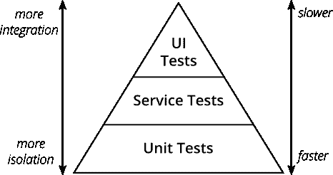
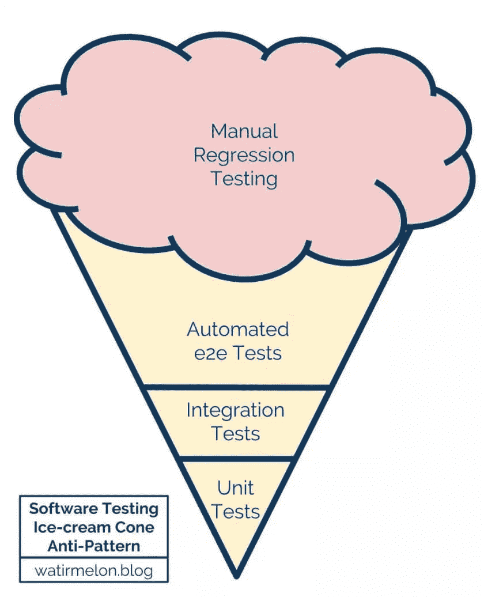
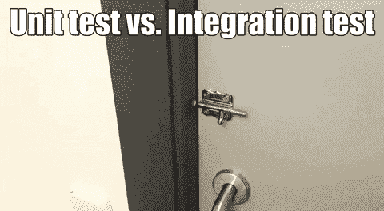

# 安全交付未经测试的代码

> 原文：<https://dev.to/mathmesquita/delivering-untested-code-with-safety-o2o>

# [T1】简介](#intro)

虽然之前我在拉丁美洲最大的电子商务公司 B2W 数字公司的团队决定从我们项目的一个 CI 管道中删除 e2e 测试步骤，但我们在基于 selenium 的架构上运行的测试花费了太多时间来完成，并且损害了我们的开发周期。

这个项目是我们团队中最老的一个，超过 10 个开发人员已经对它的代码库进行了修改，将来会有更多的人帮助。它是整个电子商务流程的核心部分，帮助成千上万的客户完成日常购物。我们在谈论收银台，一个错误会让我们公司赔钱的地方。

我们放弃 e2e 测试的决定是一个冒险的决定，将测试的责任转移给团队中的某个人，通常是我们的项目经理或团队领导，这就产生了一种依赖，即我们可以在多大程度上信任容易出错的人工测试。

毫无疑问，我们[在这场战斗中失败了很多次](https://en.wikipedia.org/wiki/Human_error),但是作为补偿，没有无用的测试，我们有了更大的交付率，减少了我们的压力，让我们能够处理项目的其他技术债务——这是在 SPA 是新的，Angular 1 开始成为一种东西的时候创建的。

回顾我们的决定，出现了一些问题。

1.  e2e 测试有多重要？
2.  我们如何将 e2e 测试添加到我们的工作流程中，而不会成为我们的负担？
3.  我们应该使用哪个工具来保持我们的测试套件与项目框架的分离？

我将围绕这三个问题发表我的看法，希望你喜欢。:)

# e2e 考试有多重要？

## 定义

在我们开始讨论之前，让我们以一种每个人都能用同一种语言阅读的方式给我们的单词设定一些含义。

正如 Simon Stewart 在[这篇博客文章](https://testing.googleblog.com/2010/12/test-sizes.html)中所说的，命名测试类型是一项艰巨的工作，在软件开发社区中还没有达成共识，而且很可能，每个阅读这篇文章的人都听过同一个概念的多个名称。

*   **端到端测试**是验证我们应用程序的所有部分都在一起*工作*，从一边到另一边。在这里，我们测试了应用程序中用户交互的各个方面，例如，在登录页面中，用户单击电子邮件字段，键入他的电子邮件地址，单击密码字段，键入他的密码，单击登录按钮，页面向 API 发送请求，并以 200 状态代码作为响应。
*   **UI 测试**类似于 *e2e(端到端)*测试，但是它们将专门测试我们的界面如何显示从 API 收集的数据以及 UI 中的用户交互。请注意，我们不一定要使用真正的 API 响应，我们可以使用*测试 doubles(存根和间谍)*来获得相同的结果，例如，在登录页面中，当用户单击登录按钮时，我们的间谍会确保请求已发送，并且我们的存根使用 200 状态代码进行响应。

定义卡对我们来说是可见的，让我们来看看关于测试的旧概念。

## 美好古老的测试金字塔

UI 和 E2E 测试通常重叠在测试金字塔的顶部三角形上，这是开始寻找第一个问题答案的好地方*(e2e 测试有多重要？).*尽管它没有显示所有可能的测试类别，但它恢复了现代软件开发中最常见和最常用的类别，这对我们来说就足够了。

如上所述，我们的金字塔创建了一个完美的类比，从底部到顶部，我们应该如何优先化我们的测试周期。我们必须测试系统中最小的部分，单元，它们更孤立，提供快速的反馈，需要更少的迭代，而不是最大的部分，UI 测试，因为用户交互的内在本质是复杂的，所以反馈周期更慢，而且很难制作。

很容易看出，如果我们只关注单元测试，我们的开发周期会变得更快，这在敏捷的世界中通常比质量更受青睐。

最糟糕的情况是，当我们的金字塔遇到更奇怪的东西，颠倒过来。如果这种反模式发生，我们的应用程序就开始与我们作对。E2E 和 UI 测试的执行时间较慢，这使得我们的整个 CI/CD 流程变慢，直接影响了我们团队的生产力。此外，取决于您如何实现您的测试，它们可能被证明是一个假阳性警报的巢穴，消除您的团队在您开始开发时对它的所有信心。

E2E 和 UI 测试并不是一件容易的事情，更不容易的是失去对测试流程的控制，并在最糟糕的地方制造巨大的技术债务，而这个地方本应该为我们的应用程序和测试任务带来安全。

这是我们经历过的场景，直到我们刚刚删除它，因为在当前的项目条件下修复它没有足够的价值。

## 单元测试够了吗？

有了这些不利因素，看起来我们已经得到了测试最高方面的答案，对吗？我们还是算了吧！！！

**问题解决**。

**不！每次你认为单元测试已经足够了，你就让你的应用程序变成了一个不安全的地方。:(**

# 我们如何将 e2e 测试添加到我们的工作流程中，而不成为我们的负担？

让我们从另一个角度来看这个问题。

当开发软件时，我们应该总是以拥有[正交系统](https://en.wikipedia.org/wiki/Orthogonality_(programming))为目标，如果我们保持应用程序的各个部分解耦，这将为我们带来安全性和可预测性。把这种肯定作为一个公理，我们应该重新评估这两种选择，为我们的金字塔的上层。

### 端到端测试

正如在定义中提到的，e2e 对我们的应用程序进行了横向测试，包括 API 的响应和复杂的步骤，以重现一个特定的场景，就像那些真正的枝节情况，用户创建的状态只有在我们的 UI 中进行了大量有意义的不同交互后才有可能。

你觉得有什么奇怪的吗？如果您回答是，那么您是正确的，在前端项目中进行测试以验证真实的 API 响应是将您的断言与 API 是否工作的问题联系在一起，并且在 API 离线的情况下，您的测试工作将会失败，并出现与您当前项目/代码无关的问题的误报。明确地说，在这种情况下，您的 UI 会在生产环境中的本地测试套件中崩溃，问题出在另一个系统，即 API。

前端测试套件不应该依赖于后端环境，尽管它对于生产来说是非常必要的，出于测试目的，我们可以存根响应，并相信负责 API 的团队会将数据正确地交付给我们的前端应用程序，并保证运行状态。

从这个角度来看，E2E 测试看起来不像是现代前端应用程序的好方法，因为我们的视图层实际上与数据层是分离的，有时甚至部署在不同的环境中。

### UI 测试

对于前端应用程序来说，真正重要的是测试组件的行为是否正确，显示的数据是否在正确的位置，以及我们的操作是否是通过用户输入调用的。

UI 测试正好解决了这些问题，不多也不少。通过阻止我们的请求并访问我们的状态，我们可以强制执行一些场景，而这些场景是普通用户会话*(就像我们在 e2e 测试中实现的那样)*需要几秒甚至几分钟才能完成的，因为需要与我们的 API 进行交互。

我们应该测试它们的哪些部分？

## 正确的检测量

很难选择我们必须测试哪些场景，记住 [Pareto 原则](https://betterexplained.com/articles/understanding-the-pareto-principle-the-8020-rule/)中的内容，我们 80%的努力可能会花在编写前 20%的测试上，而花后 20%的努力不足以完成后 80%的测试，因此会适得其反，更不用说增加我们的覆盖面[不会保证更高的质量](https://jasonrudolph.com/blog/2008/06/17/testing-anti-patterns-incidental-coverage/)。

注意，我不是告诉你 20%就足够了，这取决于你的项目，只有你和你的团队才能决定你应该达到的正确覆盖率。请记住，大于 40%的数字很高，也许您应该重新评估您正在测试的内容。

对于选择测试哪些部分的任务，我有一些建议。

### 避免重复

尽管有些应用程序需要大量的交互，我们应该看看这是不是我们测试设计的问题，这很容易发生在测试重复的情况下，例如，你有两个测试在内部页面之前再现登录交互。记住， [DRY](https://en.wikipedia.org/wiki/Don%27t_repeat_yourself) 原则也应该应用到我们的测试中，如果你有一个必须在多个场景中完成的行为，为它创建一个单独的模块，并在必要的地方导入。

此外，当您复制您的测试时，当特定部分的行为发生变化时，您为一些未来的同事甚至是您创建了一个困难的工作，将更正这些测试的努力乘以它在您的测试库中被复制的次数。

### 如果这对你来说很难，很可能对他们来说也很难

没有理由出现只有 1%的用户突破应用程序管道的情况。当然，你想有一个 100%的场景覆盖率，有什么更好的方法来保证安全，然后测试一切？Amiright？没有！你不应该关注它，也不应该在你的项目中有潜在的附带报道。在 [TDD](https://en.wikipedia.org/wiki/Test-driven_development) 周期内，100%的覆盖率应该是从测试你的规范或者开发足够的软件中获益的。

考虑到这一点，我们应该关注产品的核心特性，以一个电子商务应用程序为例，用户必须完成一个订单。

## 新的希望

好吧，在 100%的测试覆盖率之后运行[是一种反模式](https://jasonrudolph.com/blog/2008/06/17/testing-anti-patterns-incidental-coverage/)，但是如果在有人来到我们的办公桌前或者发电子邮件告诉我们在最后一次特性更新之后曾经工作的东西停止工作之前，有东西警告我们我们的错误，这不是很好吗？

当然，这不应该发生在设计良好的软件中，但有时你没有在你现在正在工作的软件的早期阶段工作，你或你的同事做出的错误决定导致了这样一种状态，即一个本应本地化的模块中的一个变化，在应用程序的另一个地方触发了一个意外的行为。

分析这个问题的根本原因，我们将面临技术债务，这种债务[有其“偿还”](https://dev.to/caiorcferreira/using-technical-debt-as-your-next-tool-1bp6)的方式，但正如我对遗留项目的经验告诉我的那样，即使在偿还债务时，我们也经常会看到一些错误的行为，这些行为之前已经确定会回来困扰我们，因为一些变化只是再次触发了它。

这是我们修复中的一个问题吗？或者有人刚刚解开了我们的补丁？

我想这些都不是。当我们寻找要责备的人时，我们将再次寻找错误的地方，寻找罪犯不会使我们的项目变得更好，也不会修复 bug，它只会带来新的问题，并且可能对你的团队成员之间的关系以及你公司的其他团队有害。

## 作为开发周期一部分的 UI 测试

> 亲近你的敌人，但更要亲近你的敌人

我们从之前的主题中了解到，测试应用程序的每一个 UI 方面都是有害的，足以让我们对测试套件产生偏执狂，也可能适得其反，从而损害我们的整个开发过程，减缓我们的交付，使我们的一天失去动力，并停止我们的[工作流](https://en.wikipedia.org/wiki/Flow_(psychology))。然而，仅仅放弃我们的测试将会消除我们的应用程序的任何安全性，使我们交付低质量的产品，并随着我们所做的每个部署中不断出现的错误而降低公司对我们产品的信任。

我在这里建议，你应该保持 100%覆盖你的 UI 测试的目标，把核心和非核心分开。文本分歧不应该停止你的管道，但缺少必要的按钮应该。

在拆分两个测试套件之后，我将在下一篇文章中讨论如何让核心成为 CI 周期的一个强制步骤，而另一个将在代码交付生产后的后期生产步骤中运行。原因很简单，如果我们的非核心场景运行时间超过 30 分钟，例如，在最坏的情况下，我们将在它发布后 30 分钟收到警告，我们将能够在任何人联系我们告诉我们我们使用我们部署的最后一个功能破坏的功能之前回滚到最后一个稳定的部署。

在修复了警告的错误或任何报告的错误后，记得创建一个新的 UI 测试来防止它再次发生。不要停止从你的项目中交付特性来映射场景，如果你遵循[童子军规则](https://medium.com/@biratkirat/step-8-the-boy-scout-rule-robert-c-martin-uncle-bob-9ac839778385)，它应该以一种渐进的方式发生，总是让你发现的代码更好一点，这样做你的同事、客户和利益相关者会感谢你，你将能够交付*“错误代码”*而不会造成大的伤害或减慢你的工作流程。

# 展望未来

在本系列的下一篇文章中，我将讨论我们可以使用哪种工具来保持我们的业务逻辑与我们在项目中用来完成它的工具相分离。此外，请解释如何在 Gitlab CI 中做到这一点，这是一个非常棒的开源工具，我们公司用它来创建 CI/CD 管道。

我希望你喜欢它，这是我很高兴在这么久之后写的，我曾经有一个博客，但当一个骗子综合症袭击了我，让我对我过去写的东西感到沮丧时，我停止了写作。所以，感谢你的时间和耐心阅读这篇文章，如果你有任何问题，批评或只是想打个招呼，我很乐意在评论区谈论它。

如果你想在下一篇文章出现时得到通知，你只需要跟着我，剩下的事情由 [dev.to](http://dev.to/) 来完成。再次感谢您，祝您度过愉快的一周。:)

# 参考文献

[https://en.wikipedia.org/wiki/Human_error](https://en.wikipedia.org/wiki/Human_error)
[https://Martin fowler . com/articles/practical-test-pyramid . html # UiTests](https://martinfowler.com/articles/practical-test-pyramid.html#UiTests)
[https://testing.googleblog.com/2010/12/test-sizes.html](https://testing.googleblog.com/2010/12/test-sizes.html)
[https://dzone . com/articles/should-you-aim-for-100 %- test-coverage](https://dzone.com/articles/should-you-aim-for-100-percent-test-coverage)
[https://better explained . com/articles/understanding-the-Pareto-principle-the-the-8020-rule/](https://betterexplained.com/articles/understanding-the-pareto-principle-the-8020-rule/)