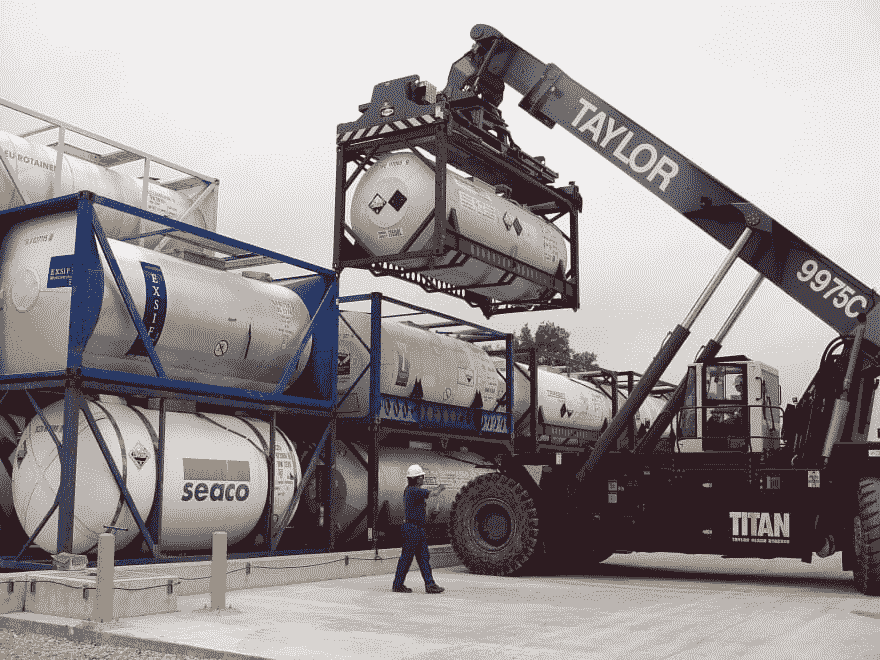

# 揭秘平台即服务(PaaS)

> 原文：<https://dev.to/heroku/demystifying-platform-as-a-service-paas-55nh>

容器已经流行了好几年了，而且某种程度上平台即服务(PaaS)也是相关的，但是你如何开始在你自己的项目中使用 Paas 呢？让我们开始吧。

如果你在过去的一年里花了一些时间看软件开发工作或与技术相关的博客帖子，你可能会注意到“容器”这个术语被频繁地使用。对于一个崭露头角的开发人员来说，容器的概念可能看起来令人困惑，更令人畏惧的是在实践中使用容器。有各种各样复杂的术语围绕着容器的概念，尤其是当你深入研究并开始使用“平台即服务(PaaS)”这样的术语时。幸运的是，一旦您对这些服务的工作方式有所了解，它们可以在减少开发过程的混乱方面发挥重要作用。

# 后退一步:容器到底是什么？

Docker 和 Kubernetes 等技术最近的流行有助于“容器”成为一个流行词，这是有充分理由的。容器[消除了开发过程中的许多令人头疼的问题](https://xkcd.com/1988/),许多开发人员发现它们是节省资源时间的工具，在消除复杂的技术开销方面发挥了巨大作用。

为了更好地理解数字世界中的容器，描绘一个物理容器并思考它的用途会很有帮助。有了实体容器，一个人基本上可以把一堆杂七杂八的东西打包成一个整洁的、单一的物体，轻松地从一个地方移动到另一个地方。

就像海运集装箱一样，船(或“平台”)并不真正需要担心每个集装箱的内容。它可以移动它们，跟踪它们，并把它们分开，就好像每一个都是一样的。

数字容器以类似的方式工作。您可以将代码、依赖项、配置和应用程序的其他方面打包到一个包含的对象中。

至关重要的是，容器不是“持久的”，除了标准化的软件包之外，它们没有任何定制的预装软件。在 Heroku，我们称之为“堆栈”,你有 3 个左右的选择。例如，下面是我们最新堆栈中的[内容。您需要的任何额外代码(参见本文后面的“依赖项”)都需要由您明确列出，并且将在容器与您的应用程序代码一起“旋转”时安装。这种缺乏持久性实际上符合我们的比喻:一旦我们处理完一个集装箱，我们希望它基本上是空的。我们可能会期望出现一些通用的东西，如汽车的栓系和轨道，这些是“标准堆栈”组件。](https://devcenter.heroku.com/articles/stack-packages)

*豪车或金枪鱼罐头，同一个集装箱可以同时装载两者*

但我们不会把我们珍贵的明代花瓶装在集装箱里运输，并期望它是按照我们明代花瓶的外形切割的预填充泡沫。

当您开始考虑基础设施和安全性等问题时，记住这一点会非常有帮助。

# “集装箱”对“动力”

在深入研究与容器相关的术语之前，有必要注意一下“容器”和“动态”之间的区别——没有区别。Dyno 是 Heroku 专用于容器的术语。你可能会看到“dyno”和“container”在 Heroku 中互换使用，但 container 是通用术语。早在术语`container`成为标准之前，Heroku 就创造了术语“dyno”。

还有其他服务甚至自托管工具来运行容器，但是我不使用它们，原因我将在下面的要点中阐述。

# 分解平台即服务

平台即服务或 PaaS 可以简单地定义为允许用户创建、运行和管理应用程序的平台，而不会让用户遇到构建和管理基础架构的难题。简而言之，用户管理应用程序，而 PaaS 管理存储、运行时、网络、安全和服务器等。流行的 PaaS 选项包括 Heroku、AWS Elastic Beanstalk、Google App Engine 和 Microsoft Azure。所有这些都提供了让您创建、控制和删除容器的工具，通常称为“编排”

# 编排

你能自己使用容器并围绕容器运行所有的流程编排，而没有一个平台为你做吗？你绝对可以。像 Kubernetes 这样的工具就是为了这个目的而存在的，但是过去几年揭示了自托管容器的一个丑陋的事实:它们很难维护。

容器的愿景是系统在模块中易于查看。我们想象一个工头说‘在这里多装些集装箱！那边的那些没有被使用，让我们清空它们以释放资源。

Kelsey Hightower 是今年在 KubeCon 做主题演讲的福音传道者。他经常谈论 T1 平台如何比 Kubernetes 更容易使用。

如果你正在读这篇文章，你是一个开发者。我不是说 Kubernetes 对你来说太难用了。我是说，在一个你自己管理的平台上编排你的容器不是你一个周末就能掌握的事情——在你完成学习工作之后，维护 Kubernetes 至少是一份兼职工作。使用像 Heroku 这样的工具，您就可以控制自己的业务需求，而无需运行自己的容器编排工具。

# 兜了一圈:Heroku 作为平台即服务

Heroku 是一个很好的例子，说明了围绕 PaaS 和容器的术语如何使概念看起来比实际复杂得多。许多新开发人员将在 Heroku 上构建他们的第二或第三个 web 应用程序，而没有意识到这给了他们使用 PaaS 和容器技术的机会。

Heroku 被恰当地描述为“基于托管容器系统的平台即服务”。当用户将他们的应用程序推给 it 时，应用程序被容器化，并放置在管理托管、基础架构和安全性等内容的更广泛的平台中。简而言之，用户推动集装箱内的东西，平台完成其余的繁重工作。

# 环境配置

当我运行我自己的服务器时，我觉得我了解我的应用程序的“环境”:我的环境就是除了应用程序代码之外的一切，所有我安装在服务器上的东西，对吗？如果我不单独安装软件，如何在 PaaS 系统上“管理我的环境”?答案是:这个例子中的环境是当我将我的应用程序从开发、测试、试运行到生产时所改变的一切。需要清楚地定义数据库的位置、任何特定的路由设置，以及在生产过程中会发生变化的任何东西。如果你是 [12 因素应用程序设计](https://12factor.net/)的学生，你知道这应该是明确定义和可控的。Heroku 为您的每个 dynos 提供了一个环境工具，让这一切变得简单！

# 依赖关系

我们经常谈论“管理依赖性”，但是当我们在平台即服务上有一个容器化的应用程序时，什么是依赖性呢？依赖性可以广义地定义为应用程序正确运行所依赖的软件片段。

*像‘依赖注入’这样酷的术语实际上只是‘将你从别处复制的一些代码添加到你的程序中’*

根据所使用的编程语言，这些依赖项以不同的方式声明。Bundler 的 Gemfile 处理 Ruby 应用程序的依赖关系，npm 的 package.json 处理 Node.js 应用程序的依赖关系，等等。使用这样的工具意味着您将显式地声明您的依赖关系，而不是仅仅抓取代码块并将其添加到您的应用程序中。这也意味着您可以自动获得更新，并跟踪您的代码来自哪里。

依赖关系是由平台即服务基于源代码和依赖关系文件中的内容构建的。你可以在这里阅读更多关于这个[的内容。](https://devcenter.heroku.com/articles/how-heroku-works#defining-an-application)

# 路由器

如前所述，Heroku 上的应用程序保存在容器中(也称为“dynos”)。路由器处理入站请求并将它们指向这些容器。更具体地说，路由器确保传入的 web 请求被传递到运行 web 应用程序的容器(可能是许多容器中的一个)。路由器还确保流量在容器间均匀分布，以避免一个容器超载而另一个容器空着。这种分布是如何发生的？简单的答案是随机选择算法，这里的会提到[。](https://devcenter.heroku.com/articles/http-routing)

# 缩放

一旦进入大型应用领域，伸缩性是需要考虑的重要因素。术语“扩展”本质上是指配置应用程序的实践，这种配置方式允许应用程序随着范围和用户群的增长而保持稳定和可用。如果没有扩展，大量的流量会使包含的应用程序过载，并导致各种各样的问题。在 Heroku 上，缩放以两种方式之一发生:

*   垂直扩展，使您的 dyno 更大，更有能力快速处理请求
*   水平扩展，增加您的 dynos 的多个副本，以便每个副本只占总请求的一小部分

Heroku 提供了手动和自动应用扩展选项。你可以在这里阅读更多关于这个过程的信息[。](https://devcenter.heroku.com/articles/scaling)

让 Heroku 处理您的路由，以及您的代码运行在所有软件需求都被明确列为依赖项的容器中的巨大优势是，您可以创建更多的容器并无缝地水平扩展*。从一个容器到两个容器到 1000 个容器应该不需要人工注意。成本应该总是最优化的，所以我们也希望自动化规模缩小:在不需要的时候移除活动容器。Heroku 还使垂直扩展比传统虚拟机简单得多。*

 *在过去的日子里，扩展是一个购买更多服务器并将它们连接起来的过程，但即使在该过程的更多部分被虚拟化之后，也没有一个简单的方法来添加第二个服务器，这主要是因为路由、编排和上面提到的依赖关系。但是有了 Heroku containers(dyno ),就有可能保证启动一个新的 dyno 会创建一个与你已经拥有的一模一样的副本。有了 Heroku 来处理请求到两个新 dynos 的路由，缩放就像拖动滑块一样简单。

# 进一步阅读

虽然这篇文章对运行自己的容器堆栈有些不满，但如果你对这个方向感兴趣，我可以推荐两本书，看看科迪·布姆加德纳的 [OpenStack in Action](https://www.manning.com/books/openstack-in-action) 或凯尔西·海塔尔的[Learn Kubernetes the Hard Way](https://github.com/kelseyhightower/kubernetes-the-hard-way)。

如果阅读本指南已经给了你尝试 Heroku 的背景知识，那么试试[入门指南](https://devcenter.heroku.com/start)或者看看 Amy Wibowo 的[字面 Twitter 机器人](https://shop.bubblesort.io/products/literal-twitter-bot-zine-pre-order)，它使用 Heroku 构建了一个很酷的 Twitter 机器人！*