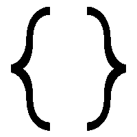

# 理解 JavaScript 中的新 Set 对象

> 原文：<https://dev.to/firebase007/demystifying-the-set-object-3k9p>

[](https://res.cloudinary.com/practicaldev/image/fetch/s--IExDYagE--/c_limit%2Cf_auto%2Cfl_progressive%2Cq_auto%2Cw_880/https://thepracticaldev.s3.amazonaws.com/i/it11xbkj5fnwbqnnbbb4.png)

ES2015 最新浏览器规范中的*新集合*对象有多种使用案例。在本教程中，我们将看一个简单的场景，在这个场景中，我们将探索这个特性派上用场的方式。

注意:在我们继续之前，应该注意到*新 Set* 对象目前具有良好的浏览器支持，因此可以在生产应用程序中使用。如果你想看看浏览器的支持或兼容性，你可以看看它[这里](https://developer.mozilla.org/en-US/docs/Web/JavaScript/Reference/Global_Objects/Set#Browser_compatibility)。

根据 [MDN](https://developer.mozilla.org/en-US/) 文档，Set 对象允许您存储任何类型的唯一值，无论它们是原始数据类型，如字符串、布尔值、符号、null 等，甚至是对象。

下面是新 Set 对象的语法示例，

`new Set([iterable])`

在这个例子中，参数是 iterable——这更像是一个我们可以循环遍历的对象或集合。可迭代的一个简单例子是数组。

**注意:**当值被传递给 Set 对象时，它们总是保持唯一的，并且总是返回一个新的 Set 对象。另一方面，如果没有任何东西传递给 Set 对象，或者如果它的值是一个像 null 这样的原语，那么它的返回值将是空的。

继续，就像每个对象都有一个构造函数，它们通过包含方法和属性来获得自己的特征，Set 对象的所有实例都从 Set 原型继承。因此，*set . prototype . constructor*是创建实例原型时返回的函数。还记得使用“new”关键字来声明某个事物的实例吗？太好了！

现在看看 Set prototype 上可用的一些属性和方法，我们有了 *Set.prototype.size* ，它返回 Set 对象中值的数量。此外，我们还有 *Set.prototype.add()* 方法，顾名思义，该方法将带有给定值的新元素添加到 Set 对象中，并返回新的 Set 对象。

现在让我们看一个简单的例子，

```
var myNewSet = new Set();

myNewSet.add(1) 

// returns Set [1]

myNewSet.add(5); 

// returns Set [ 1, 5 ]

myNewSet.add(5); 

// returns Set [ 1, 5 ] 
```

这里，我们声明了一个变量 *myNewSet* ，它在内存中存储 Set 对象的一个新实例。然后我们使用 *add* 方法来填充变量。我们会注意到最后返回的 Set 对象只有一个值“5 ”,而不是预期的两个值。这正好验证了我们最初的观点，Set 对象中的值只能出现一次，因为它在集合中是唯一的。

注意:前面我们提到过，要检查 Set 对象中值的数量，我们应该使用 *Set.prototype.size* 属性。 *Set.prototype.length* 属性没有像预期的那样检查 Set 对象中的值的数量，而是返回 0，这是本例中 length 属性的值。

应用新 Set 对象的另一个例子是在删除数组副本的情况下。让我们来看一个例子，

```
 const numbers = [2,3,4,4,2,3,3,4,4,5,5,6,6,7,5,32,3,4,5]

 console.log([...new Set(numbers)]) 

// [2, 3, 4, 5, 6, 7, 32] 
```

我们可以看到，重复的元素被清除出数组，返回了一个只包含唯一元素的新数组。在此之前，我们必须循环遍历数组，做大量的工作来删除重复项。使用新的 Set 方法，我们直观地看到了如何用更少的代码行实现我们的目标。

在我们结束之前，现在进入更有趣的部分，我正在浏览 Graphql 的一个简短摘录，在那里我遇到了 Set 对象的另一个非常漂亮和重要的用例。让我们看看例子，因为我相信例子更有助于交流意图，

```
var distances = [
  { from: "Tahoe City", to: "Nevada City", distance: 65 },
  { from: "Nevada City", to: "Redwood Valley", distance: 151 },
  { from: "Redwood Valley", to: "Willits", distance: 16 },
  { from: "Willits", to: "Garberville", distance: 68 },
  { from: "Garberville", to: "Shelter Cove", distance: 24 },
  { from: "Garberville", to: "Mendocino", distance: 76 },
  { from: "Mendocino", to: "Redwood Valley", distance: 51 }
]; 
```

现在，这里的案例研究是让我们寻找一种从对象数组中删除重复城市的方法，因为我们打算查询城市数据，我们不想要重复的城市。

现在实施；

```
 var cities = new Set();

      distances.forEach(d => {
        cities.add(d.from);
        cities.add(d.to);
      });

      return Array.from(cities);

// returns (7) ["Tahoe City", "Nevada City", "Redwood Valley", "Willits", "Garberville", "Shelter Cove", "Mendocino"] 
```

这里，首先，我们声明了 Set 对象的一个新实例，它允许我们从对象的原型继承它的方法和属性。然后，我们遍历存储在距离变量中的对象数组，对于每次迭代，我们将城市附加到 Set 对象，同时在此过程中删除重复的城市。

我们现在可以看到一个简单而非常有用的例子，Set 对象派上了用场。另外，注意 *add* 方法的使用？太好了！现在，还要注意 Array.from()方法？这个方法从一个 iterable 对象创建一个数组，其中的参数必须是 iterable 对象，这样我们就可以把它转换成一个数组。

有关这种方法及其用例的更多信息，您可以查看此处的文档:https://developer . Mozilla . org/en-US/docs/Web/JavaScript/Reference/Global _ Objects/Array/from

最后，关于 Set 对象所有优点的更多信息，以及那些想进一步探索的人，可以查看关于 [MDN](https://developer.mozilla.org/en-US/docs/Web/JavaScript/Reference/Global_Objects/Set#Specifications) 的参考文档。

非常感谢亚历克斯·班克斯和伊芙·波尔切洛以及 MoonHighway 团队的文章，我从其中提取了最后一个例子，以说明和驱动一个非常重要的用例。想了解更多信息，你可以去 https://moonhighway.com/看看。

这里引用的资源来自 Mozilla 开发者网络文档。

感谢您抽出时间阅读本文。我真的很感谢任何问题，评论和一般反馈。继续学习！