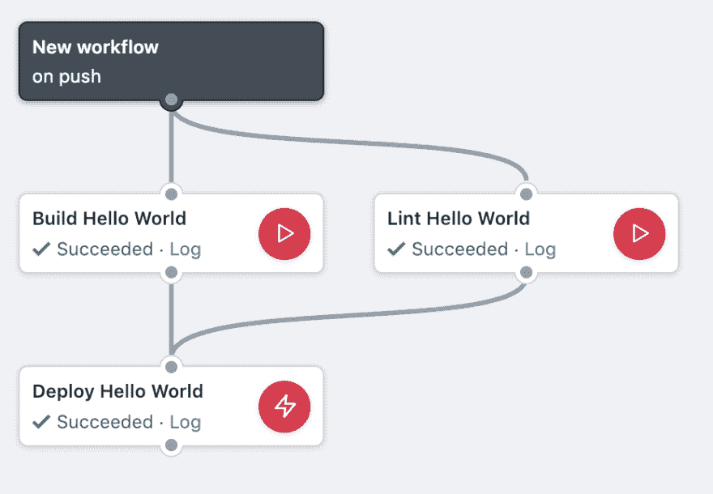
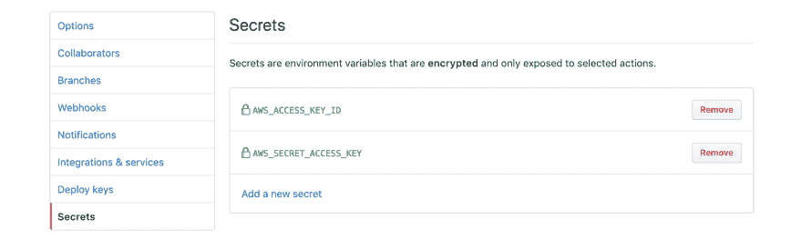

# 使用 GitHub 动作部署无服务器 API

> 原文：<https://dev.to/alexbielen/deploy-a-serverless-api-with-github-actions-3k6o>

***在你继续阅读之前，请注意:**这篇文章已经过时了！GitHub Actions 切换到 YAML 作为其配置语言，并改变了一些语义。如果你对为什么我认为 GitHub actions 是社交编码中的重要一步感兴趣，或者想了解 GitHub Actions 在 beta 版中是如何工作的，请继续阅读。编码快乐！*

你听说过“发布会应该很无聊”这句话吗？这是持续集成和持续部署(CI/CD)的非正式格言。GitHub Actions 在 2018 GitHub Universe 大会上宣布，旨在将无聊的发布带给 GitHub 生态系统中的*所有*用户。今天我们将从为什么 GitHub Actions 是社交编码的一个重要发展开始，然后我们将看看 Actions 用来创建自动化系统的核心概念。最后，我们将使用 AWS、无服务器框架和 GitHub 操作来构建和部署无服务器 API。请注意，完成 API 教程需要以下先决条件:

*   一个 [AWS 自由层](https://aws.amazon.com/free/)账户
*   具有编程访问权限的 AWS IAM 用户(参见[此处](https://github.com/serverless/serverless/issues/1439)了解良好的初级 IAM 策略)。请注意，在设置 IAM 用户时，您应该始终遵循最小特权原则。)
*   上面用户的`AWS_ACCESS_KEY_ID`和`AWS_SECRET_ACCESS_KEY`。
*   在 [GitHub Actions Beta](https://github.com/features/actions) 中注册的 GitHub 帐户
*   回购协议的克隆或分支[https://github.com/twobulls/github_actions](https://github.com/twobulls/github_actions)

## 社会编码

社交编码是一种软件开发实践，其核心理念是社区和协作构建最好的软件。社交编码的例子数不胜数，包括 GitHub、一般的开源软件以及像 npm 这样的包管理器。社交编码允许构建者在软件上共享努力和协作。GitHub Actions 是社会化编码向前迈出的重要一步，因为它引入了一种共享自动化的可行方法。

自动化和 CI/CD 往往是样板文件。这导致重复的代码和时间浪费在实际上不能区分你的应用程序的工作上。Actions 支持简化对自动化工具的访问*和*轻松共享这些工具的能力。Actions 是基于 Docker 的，它提供了可移植性和易于共享性。GitHub 利用了这一点，它允许构建者整合来自任何公共 GitHub 库或 DockerHub 上任何 Docker 映像的操作。当然，如果一个特定的动作不存在，构建者可以创建自定义的动作，并有选择地在公共存储库中共享它们。集成自动化工具和易于共享的结合使得 Actions 成为 GitHub 的一个绝佳的战略机遇，也是 GitHub 生态系统中建设者的福音。

在任何大规模的社交编码平台中，重要的是要意识到由意外或恶意引入的版本变化和漏洞导致的潜在问题。行动也不例外。GitHub 已经解决了一些问题，包括访问控制和版本锁定，但是还有一些问题我们将在后面探讨。接下来，我们将深入 GitHub 动作的核心概念。

## 核心概念

### 可视化编辑器或配置语言

工作流可以在代码中创建，也可以使用可视化编辑器创建。以下示例将使用 Actions 提供的配置语言。
[T3】](https://res.cloudinary.com/practicaldev/image/fetch/s--RV3CXtnH--/c_limit%2Cf_auto%2Cfl_progressive%2Cq_auto%2Cw_880/https://thepracticaldev.s3.amazonaws.com/i/1qby87rzksvlk7gnpcth.png)

### 动作

动作是“在 Docker 容器中运行的代码”。虽然动作与更广泛的服务共享它们的名字，但是它们是要执行的工作的单独单元。每个动作都有一个唯一的名称和一个必需的属性，即`uses`。使用`action`模块:
定义一个动作

```
action "Unique Name" {
  uses = "./actions/helloworld"
} 
```

`uses`属性可以引用同一个 repo 中的一个动作，GitHub 存储库中的一个公共动作，或者托管在 Dockerhub 上的一个公共 Docker 容器。如果不熟悉 Docker 也不用太担心。稍后我们将对所使用的命令做一个简要的概述。该操作引用了以下 Docker 容器:

```
# actions/helloworld/Dockerfile
FROM golang:1.11.4-stretch

LABEL "com.github.actions.name"="Echo Hello World"
LABEL "com.github.actions.description"="Say Hello to the World!"

CMD echo "Hello World!" 
```

您可以根据需要提供其他可选属性。包括`needs`、`secrets`和`args`在内的一些常见属性将在后面讨论。有关属性的完整列表，请参见[官方文档](https://developer.github.com/actions/creating-workflows/workflow-configuration-options/#actions-attributes)。

### 事件

事件是在你的 GitHub 库中“发生”的事情，包括`pull_request_review`、`push`和`issues`。事件触发不同的工作流，并根据事件类型具有不同的环境变量。这很重要，因为操作所针对的提交依赖于触发操作的事件类型。

例如，`release`事件通过触发释放的标签来解析`GITHUB_SHA`(提交散列)。因此，由`release`事件触发的动作使用分支的最新提交 SHA。

但是，`push`事件的`GITHUB_SHA`是“事件特定的，除非删除一个分支(当它是默认分支时)”。这意味着它直接从触发事件中获取提交 SHA。

您可以在[官方文档](https://developer.github.com/actions/creating-workflows/workflow-configuration-options/#events-supported-in-workflow-files)中阅读有关可用事件和 SHA 决议的更多信息。

### 工作流程

工作流由操作组成，并由事件触发。换句话说，工作流结合了事件和动作。使用`workflow`块定义工作流程。每个`workflow`块需要一个唯一的名称，并且有两个必需的属性:`on`和`resolves`。在`on`属性中，您定义了触发工作流的事件类型。在`resolves`属性中，您描述了工作流要“解决”的动作。`workflow`块定义读起来像一个英语句子:“在发布事件上，名为 Deploy Staging 的工作流解决了构建、测试和部署。”

```
workflow "Deploy Staging" {
  on = "release"
  resolves = ["build", "test", "deploy"]
} 
```

属性需要更多的关注，我们将在接下来讨论。

### 依赖关系

动作之间的依赖关系可以用`needs`属性来表达。在下面的示例中，“部署”依赖于“构建”、“测试”和“Lint”的成功完成。您会注意到我们在工作流块
的`resolves`属性中只包含了“部署”动作

```
workflow "Deploy to Staging" {
  on = "release"
  resolves = "Deploy"
}

action "Build" {
  uses = "docker://image1"
}

action "Test" {
  uses = "docker://image2"
}

action "Lint" {
  uses = "docker://image3"
}

action "Deploy" {
  needs = ["Build", "Test", "Lint"]
  uses = "docker://image4"
} 
```

这是因为“部署”动作依赖于“构建”、“测试”和“Lint”动作的完成。我们可以用这种风格表达复杂的依赖关系。

### 排比

我最初的假设是，在上面的工作流中，“构建”、“测试”和“Lint”将并行运行，因为它们是独立的操作。实际上，情况并非如此。我尝试了下面的工作流格式，我也期望它能够并行运行:

```
workflow "Deploy to Staging" {
  on = "release"
  resolves = ["Build", "Test"]
}

action "Build" {
  uses = "docker://image1"
}

action "Test" {
  uses = "docker://image2"
} 
```

同样，情况并非如此，上述情况也不是同时发生的。根据文档“当[在`resolves`属性中]列出多个动作时，这些动作并行执行。”这可能只是公测版的一个限制，我想将来会允许并行操作。

### 工作区

工作区是您的操作将在其中工作的目录。工作区目录包含触发工作流的事件中设置为`GITHUB_SHA`的存储库的副本。一个动作可以修改这个目录、访问内容、创建二进制文件等。我们将使用工作区来存储由我们的操作生成的编译后的 Go 二进制文件。

### 机密管理

动作允许通过`secrets`属性访问秘密。你必须明确列出一个动作可以访问的秘密。在下面的例子中,“部署 Hello World”动作被授予访问`AWS_ACCESS_KEY_ID`和`AWS_SECRET_ACCESS_KEY`的权限。

```
action "Deploy Hello World" {
    needs = ["Build Hello World", "Lint Hello World"]
    uses = "serverless/github-action@master"
    secrets =  ["AWS_ACCESS_KEY_ID", "AWS_SECRET_ACCESS_KEY"]
    args = "deploy"
} 
```

机密通过存储库设置面板添加，并作为环境变量暴露给操作。
[T3】](https://res.cloudinary.com/practicaldev/image/fetch/s--4A3SogzG--/c_limit%2Cf_auto%2Cfl_progressive%2Cq_auto%2Cw_880/https://thepracticaldev.s3.amazonaws.com/i/tlm73n13elr3v0xpdzlu.png)

注意:GitHub Actions 建议在公测期间，此时不要存储任何生产机密。欲了解更多信息，请阅读官方文档。

## 使用 GitHub 动作部署无服务器 API

接下来，我们将构建一个无服务器 API。工作流将在每个`push`上构建、lint 并部署到我们存储库中的主分支。

### 秘密

从您创建的 IAM 用户获取`AWS_ACCESS_KEY_ID`和`AWS_SECRET_ACCESS_KEY`。在存储库中的“设置”页面中，点击“秘密”并添加`AWS_ACCESS_KEY_ID`和`AWS_SECRET_ACCESS_KEY`。注意:在公开测试期间，不要在存储库中存储任何生产机密。

### 无服务器 API 代码

无服务器框架处理无服务器应用程序的基础设施和供应。基础设施是在`serverless.yml`文件中定义的，所以这是我们首先要看的地方。无服务器使用最小配置语言将事件与期望的计算联系起来。这里我们创建了一个 http api `GET /hello`，并用`bin/hello`中的 Go 二进制文件处理 api 事件。

```
# serverless.yml

...

functions:
  hello:
    handler: bin/hello
    events:
      - http:
          path: hello
          method: get 
```

接下来，我们将查看`bin/hello`二进制文件的源代码。这段代码使用了无服务器框架的默认 Go 模板，对`message`主体:
做了一点修改

```
// hello/main.go

...

type Response events.APIGatewayProxyResponse

func Handler(ctx context.Context) (Response, error) {
    var buf bytes.Buffer

    body, err := json.Marshal(map[string]interface{}{
        "message": "Hello From Two Bulls!",
    })
    if err != nil {
        return Response{StatusCode: 404}, err
    }
    json.HTMLEscape(&buf, body)

    resp := Response{
        StatusCode:      200,
        IsBase64Encoded: false,
        Body:            buf.String(),
        Headers: map[string]string{
            "Content-Type": "application/json",
        },
    }

    return resp, nil
}

... 
```

这个函数返回一个定义 http 状态代码、头和响应体的`APIGatewayProxyResponse`。

`Makefile`定义了动作将要运行的构建步骤。有两件事值得注意:这是使用 Go 1.11 模块系统，我们将环境变量`GOOS`设置为`linux`，因为我们将在 AWS Lambda 中运行这个函数。

```
build:
    export GO111MODULE=on
    env GOOS=linux go build -ldflags="-s -w" -o bin/hello hello/main.go 
```

### GitHub 动作代码

接下来我们将看看 GitHub 动作的工作流程和动作定义。这里，我们定义了一个工作流，它在每个`push`事件上触发，并解析“部署 Hello World”动作。“部署 Hello World”动作`uses`是一个外部动作，由无服务器 GitHub 组织维护。为了引用这个外部操作，我们使用组织名、repo 名和我们希望将版本固定到的 commit-ish。此外，我们明确地授予这个动作对我们之前创建的`AWS_ACCESS_KEY_ID`和`AWS_SECRET_ACCESS_KEY`秘密的访问权。`args`属性是我们传递给动作的参数——因为这个动作包装了无服务器框架，所以我们要传递`deploy`参数，但是任何无服务器命令都可以在这里运行。“部署 Hello World”动作`needs`“构建 Hello World”和“Lint Hello World”动作，但是这些是在我们的存储库中定义的，因此可以使用相对路径语法来引用。这些将在“部署 Hello World 行动”的之前完成*。* 

```
workflow "New workflow" {
    on = "push"
    resolves = "Deploy Hello World"
}

action "Build Hello World" {
    uses = "./actions/build"
}

action "Lint Hello World" {
    uses = "./actions/lint"
}

action "Deploy Hello World" {
    needs = ["Build Hello World", "Lint Hello World"]
    uses = "serverless/github-action@master"
    secrets =  ["AWS_ACCESS_KEY_ID", "AWS_SECRET_ACCESS_KEY"]
    args = "deploy"
} 
```

### 码头工人

我们的存储库引用 Docker 文件中定义的操作。我们将快速概述一下这里使用的 Docker 语法及其含义。

定义我们将用于容器的基本图像。我们使用的是`golang:1.11.4-stretch`,它带有构建 Go 所必需的依赖项。此外，它还安装了`go`工具。

`LABEL`提供关于我们容器的元数据。我们可以包含名称、描述和其他元数据，包括该操作在可视化编辑器中应该如何显示。

`CMD`是 Docker 容器启动时我们想要运行的命令。这是我们将花费大部分时间编写希望容器执行的命令的地方。

有了这个快速介绍，我们就可以查看我们存储库中的`Dockerfile`。“构建 Hello World”容器运行`make`。Make 运行上面讨论的`Makefile`中的步骤。“Lint Hello World”容器针对我们存储库中的 Go 源代码运行`go vet`。

```
# actions/build/Dockerfile

FROM golang:1.11.4-stretch

LABEL "com.github.actions.name"="Build Hello World"
LABEL "com.github.actions.description"="Run make to build the Golang binary."

CMD make 
```

```
# action/lint/Dockerfile

FROM golang:1.11.4-stretch

LABEL "com.github.actions.name"="Lint Hello World"
LABEL "com.github.actions.description"="Lint the hello world application using go vet."

CMD cd hello && go vet 
```

### 部署！

一切就绪后，我们就可以部署 API 了。您可以对`README.md`进行更改、提交和推送。打开存储库中的操作面板，您可以看到操作排队并开始工作。您还可以打开日志并观察日志输出。当一个操作成功完成时，您会在每个操作上看到一个绿色勾号。

[](https://res.cloudinary.com/practicaldev/image/fetch/s--RV3CXtnH--/c_limit%2Cf_auto%2Cfl_progressive%2Cq_auto%2Cw_880/https://thepracticaldev.s3.amazonaws.com/i/1qby87rzksvlk7gnpcth.png)

接下来，查看“部署 Hello World”操作的日志。

```
Serverless: Stack update finished...
Service Information
service: go-github-actions
stage: dev
region: us-east-1
stack: go-github-actions-dev
api keys:
  None
endpoints:
  GET - https://xxrefpqkp2.execute-api.us-east-1.amazonaws.com/dev/hello
functions:
  hello: go-github-actions-dev-hello
layers:
  None
Serverless: Removing old service artifacts from S3...

### SUCCEEDED Deploy Hello World 23:54:39Z (1m23.488s) 
```

API 的 URL 在端点中列出。打开网址，你会看到以下内容:

```
{"message":"Hello From Two Bulls!"} 
```

瞧啊。GitHub Actions 部署的无服务器 API。

## 局限性

使用 GitHub 操作时，需要注意一些限制。首先，它仍然处于有限的公开测试阶段，因此对 API、特性和限制的更改是可以预期的。

### 工作流限制

此外，并发性、计算和总时间都有限制。在决定使用 GitHub 动作之前，确保这些限制符合您当前用例。

*   运行 58 分钟(排队和执行时间)
*   每个工作流最多可以运行 100 个操作
*   每个存储库同时有两个工作流

你可以在[官方文档中阅读完整列表。](https://developer.github.com/actions/creating-workflows/workflow-configuration-options/#workflow-limitations)

### 安全限制

正如前面所暗示的，动作通过允许版本锁定和对秘密的显式访问控制，减轻了一些潜在的安全问题。当使用外部动作时，你需要信任作者。整合外部行动时，您应该问几个问题:

*   从安全的角度来看，有没有办法知道某个操作被破坏了？
*   外部操作需要多大的访问权限？
*   如果你允许访问，外部行为会对你的秘密做什么？

这些问题不一定是 GitHub Actions 独有的，而是社交编码时代更广泛的问题。针对此问题的一些潜在缓解措施是关于受损外部操作的警报以及冻结使用受损操作的工作流。但是在实现这些特性之前，请确保信任您正在使用的操作。

## 下一步

今天，您学习了 GitHub 操作，并部署了一个无服务器 API。GitHub Actions 非常灵活，这只是触及了可能的表面。由于可用事件的多样性，Actions 可以与 GitHub 问题以及 Slack 等外部通信工具集成。您可以为许多常见任务构建自动化。但最重要的是，你可以分享这种自动化，并使用其他人已经建立的自动化。