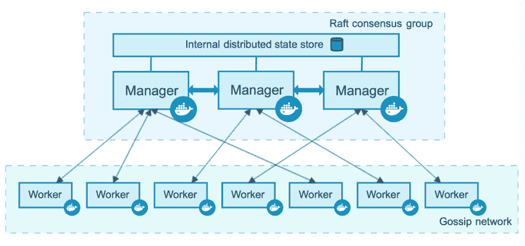
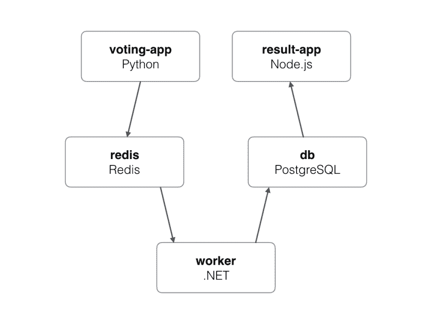

# 在 Docker Swarm 中部署简单的应用程序

> 原文：<https://dev.to/dhanushkadev/deploy-a-simple-application-in-docker-swarm-37kd>

在这篇文章中，我们将讨论 Docker Swarm 的基本概念，并获得一些在 Docker Swarm 上部署应用程序的实践经验。你需要有关于容器的基本知识来跟随这篇文章。[这里的](https://architecture-database.blogspot.com/2019/03/docker-lifecycle-and-useful-docker.html)，一篇描述 Docker 容器的基本的文章。

对于生产环境来说，每个服务只有一个容器并不好，因为当一个节点停机时，我们还需要高可用性。如果一个节点关闭，那么应该有另一个节点来接管该特定服务的负载。Docker Swarm 为您提供了一种处理多个容器的优雅方式。Docker Swarm control 的以下功能可让您轻松部署容器。

*   集装箱的卫生检查
*   为特定 Docker 映像启动一组固定的容器
*   根据负载量增加或减少容器的数量
*   跨容器执行软件滚动更新

一个**节点**是 Docker 引擎参与群的一个实例。

**工作节点**是按照主节点的指示运行容器的节点。

**管理者节点**指示工作者节点容器状态。在 Docker Swarm 中，可以有多个管理者和工作者节点。拥有多个管理器节点目的是保持管理器节点的高可用性。这里，一个节点被选为执行容器编排的领导节点。由称为 Raft 一致性算法的算法选择的领导节点。默认情况下，句柄管理器节点也可以充当工作者节点。负责执行以下任务的管理节点。

*   维护集群状态
*   调度服务
*   服务群组模式 HTTP API 端点

对于这个例子，我用 Docker 实例来部署 swarm，而不是在本地机器上测试它。你可以用你的 docker hub 凭证在 https://labs.play-with-docker.com[创建一个账户(你也可以在你的本地机器上测试它)。但我更喜欢这个，因为你不需要安装 Docker)。登录后，您可以使用左上角的“添加新实例”按钮创建新实例。这将向您展示一个可以测试我们部署的终端。](https://labs.play-with-docker.com)

对于这个例子，我们使用了来自 [Github](https://github.com/dockersamples/example-voting-app) 的样本代码，其中包含了所有需要的编码实现。该示例包含五种不同服务，如下所述。
T3T5】

*   这是一个提供投票界面的 python 服务器。端口设置为 5000 以访问接口。投票应用程序发送投票结果到 Redis 数据库。
*   Redis 是一个内存键值数据库，用来存储投票数据。
*   **Worker** Worker 从 Redis 数据库中读取投票数据，并将其保存在 PostgreSQL 数据库中
*   这个数据库在数据库中存储投票数据
*   这是 NodeJS 应用程序，用于通过端口 5001 发布投票结果

首先，您需要用下面的命令将这个 Github 库克隆到新创建的 instant 中。

> git 克隆 github.com/dockersamples/example-voting-app

然后移动到项目文件夹

> cd 示例-投票-应用程序

接下来，用 Docker Swarm 启动应用程序，命令如下。

> 码头群初始化

该命令将通过执行“Dockerfile”从“/result”/work”/worker 中生成所有需要的 Docker 映像，并启动 docker swarm。

一旦一切都设置好了，你可以看到几个端口号显示在你的网页上。点击 5000 端口查看投票界面，点击 5001 端口查看投票结果。

希望你喜欢阅读这篇文章，并在下一篇文章中看到你。干杯:)