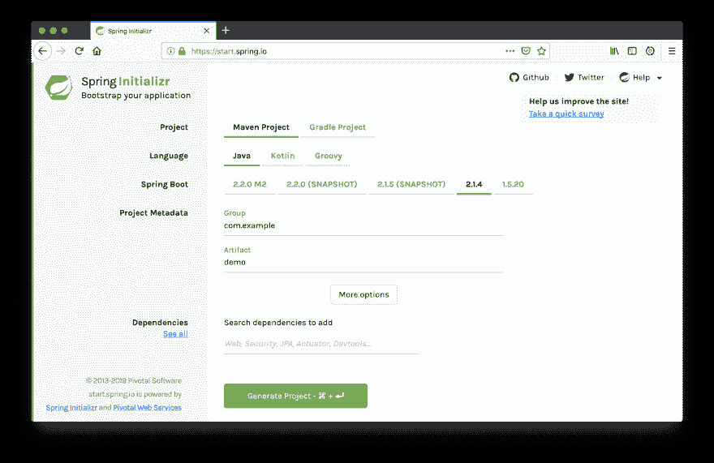
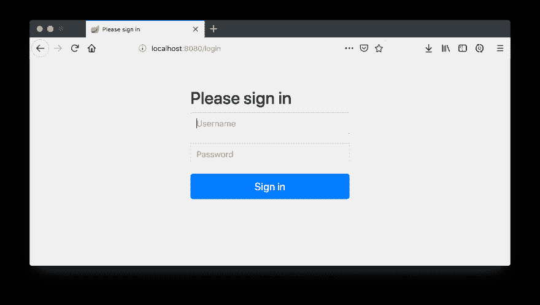
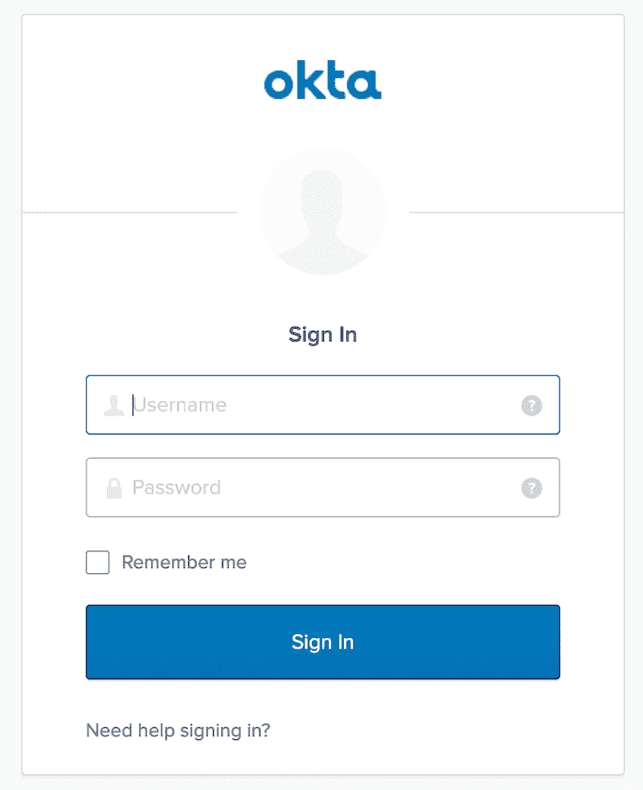
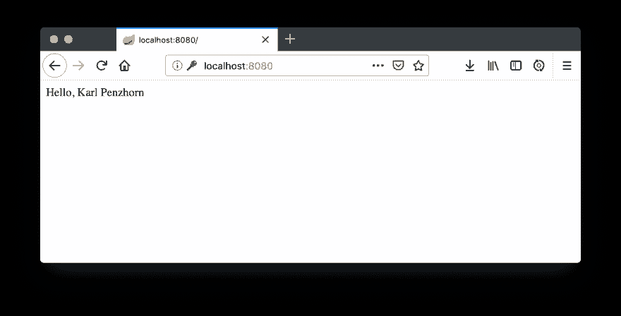
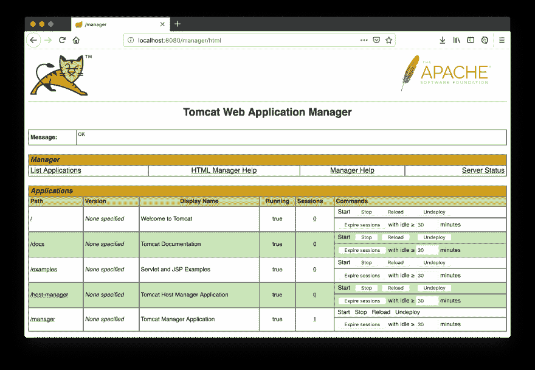
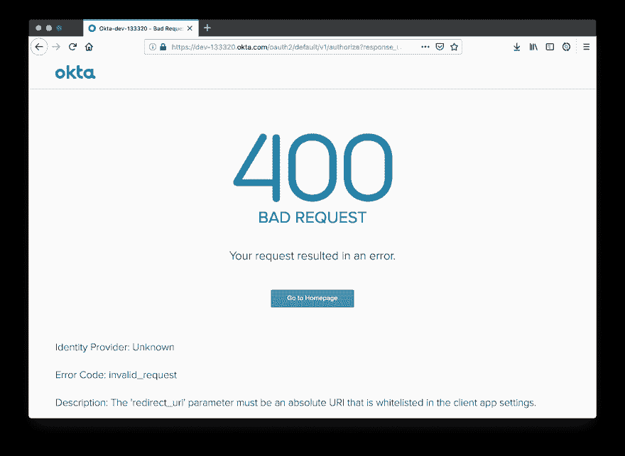

# 将 Spring Boot 应用程序部署到 Tomcat 中

> 原文：<https://dev.to/oktadev/deploy-a-spring-boot-application-into-tomcat-5gll>

部署应用程序很难。通常，您需要控制台访问服务器，从中获取最新的代码，然后手动实例化到您的容器中。在本教程中，您将看到使用 Tomcat 的一种更简单的方法:您将创建一个经过身份验证的 web 应用程序，并使用最新版本的 Tomcat、Spring Boot 和 Java 通过浏览器部署它。

## 启动你的 Java 11 应用

打开一个控制台，运行`java -version`看看你用的是什么版本的 Java。

```
[karl@localhost demo]$ java -version
openjdk version "1.8.0_111"
OpenJDK Runtime Environment (build 1.8.0_111-b16)
OpenJDK 64-Bit Server VM (build 25.111-b16, mixed mode)
[karl@localhost demo]$ 
```

Java 8 显示为版本`1.8.0`。

SDKMAN 是一个保持你的开发库最新的好工具。要安装它，运行

```
$ curl -s "https://get.sdkman.io" | bash 
```

注意 SDKMAN 只在 Linux 和类 Unix 系统上工作。Windows 用户将需要[手动安装最新的 Java】。](https://stackoverflow.com/a/52531093/4295424)

如果 SDKMAN 安装正确，您将看到在当前终端中使用该命令的说明。

```
All done!

Please open a new terminal, or run the following in the existing one:

    source "/home/karl/.sdkman/bin/sdkman-init.sh"

Then issue the following command:

    sdk help Enjoy!!!
[karl@localhost demo]$ 
```

运行所示的`source`命令，此时`sdk`命令应该处于活动状态。

现在只需用`sdk install java`安装最新的 Java。

```
[karl@localhost demo]$ sdk install java

Downloading: java 11.0.2-open

In progress... 
```

一旦完成，`java -version`应显示`11.0.2`。

```
Done installing!

Setting java 11.0.2-open as default.
[karl@localhost demo]$ java -version
openjdk version "11.0.2" 2019-01-15
OpenJDK Runtime Environment 18.9 (build 11.0.2+9)
OpenJDK 64-Bit Server VM 18.9 (build 11.0.2+9, mixed mode)
[karl@localhost demo]$ 
```

**注意:**如果你已经有了 SDKMAN！并且安装了 Java 11，可以用`sdk default java 11.0.2-open`设置为默认。

## 为 Tomcat 创建一个 Spring Boot 项目

启动 Spring 项目最流行的方式是使用 [Spring Initializr](https://start.spring.io/) 。

[](https://res.cloudinary.com/practicaldev/image/fetch/s--zETYCYio--/c_limit%2Cf_auto%2Cfl_progressive%2Cq_auto%2Cw_880/https://developer.okta.com/assets-jekyll/blog/spring-boot-tomcat/spring-initializr-7f007ecdc8cd618c6d5dceda07e71c3561447aee7ad643cb3198d05cd8ead1e9.png)

在您最喜欢的 web 浏览器中导航到 start.spring.io，然后选择您的项目选项:

*   离开作为 Maven，Java，和最新稳定的 Spring Boot (2.1.4)
*   如果愿意，可以更改组和工件
*   点击**更多选项**并选择`Java 11`
*   在*依赖项*框中，输入并选择`Web`、`Security`和`Devtools`。它们应该在右侧显示为选中的依赖项

 *现在点击**生成项目**，一个包含项目的 zip 文件将会下载。只需从命令行解压并输入目录。如果你`ls`，你会看到五个文件和一个目录(`src`)。

```
[karl@m14x demo]$ ls HELP.md mvnw mvnw.cmd pom.xml src 
```

`mvnw`是一个不需要全局安装就可以使用 Maven 的脚本。`mvnw.cmd`是这个脚本的 Windows 版本。`pom.xml`描述你的项目，`src`里面有你的 Java 代码。(注意还有一个隐藏的`.mvn`目录，其中存放着嵌入的 maven 文件！).

让我们看看这个项目是做什么的。键入`./mvnw spring-boot:run`并按回车键。安装所有东西可能需要一段时间，但最终，您应该会看到类似这样的内容:

```
Tomcat started on port(s): 8080 (http) with context path ''
2019-03-17 19:56:49.342 INFO 10744 --- [restartedMain] com.karl.demo.DemoApplication : Started DemoApplication in 3.022 seconds (JVM running for 3.56) 
```

注意消息`Tomcat started on port(s): 8080`。打开`http://localhost:8080`的浏览器窗口，您应该会看到一个登录页面。

[](https://res.cloudinary.com/practicaldev/image/fetch/s--wqI5zCXk--/c_limit%2Cf_auto%2Cfl_progressive%2Cq_auto%2Cw_880/https://developer.okta.com/assets-jekyll/blog/spring-boot-tomcat/spring-sign-in-cdf26b94839265ddc406463fc56d9a6742baa229a5835d2a12b1b81778ff124b.png)

您可以使用“用户”来鉴定打印在终端上的用户名和密码。登录后，您会看到一个 404 错误页面，因为您还没有创建任何代码来显示在`/`的登录页面。

## 为你的 Spring Boot 应用添加安全认证

让我们用 Okta 添加认证。为什么是 Okta？因为你不想担心管理你的用户和散列他们的密码，你呢？朋友不让朋友写认证——让 Okta 的专家替你写！毕竟，Okta 的 API 也是用 Java 和 Spring Boot 构建的！

一旦你在[注册了一个免费账户](https://developer.okta.com/signup/)，就可以在你的仪表板上进入**应用**。点击**添加应用**，选择**网页**，点击**下一步**。

你现在应该在应用程序设置页面。将**登录重定向 URIs** 字段替换为以下内容:

```
http://localhost:8080/login/oauth2/code/okta 
```

点击底部的**完成**。从客户端凭证部分复制您的**客户端 ID** 和**客户端机密**，并将其保存在安全的地方。现在，在顶部点击 **API** 选项卡(在**应用**旁边)，然后点击**授权服务器**。记下**发行人 URI** 的样子:

```
https://{yourOktaDomain}/oauth2/default 
```

在项目中的`src/main/resources/application.yml`处创建一个文件，并将这些值放入:

```
okta:  
  oauth2:
    issuer: https://{yourOktaDomain}/oauth2/default  
    client-id: {clientId}
    client-secret: {clientSecret} 
```

现在将 Okta Spring Boot 入门库作为一个依赖项添加到您的`pom.xml`中。

```
<dependency>
    <groupId>com.okta.spring</groupId>
    <artifactId>okta-spring-boot-starter</artifactId>
    <version>1.1.0</version>
</dependency> 
```

现在编辑您的主 Java 入口文件——可能类似于`src/main/java/com/example/demo/DemoApplication.java`——并将`@RestController`注释添加到类中，以及一个主页入口点:

```
package com.example.demo;

import org.springframework.boot.SpringApplication;
import org.springframework.boot.autoconfigure.SpringBootApplication;
import org.springframework.security.core.Authentication;
import org.springframework.security.oauth2.core.oidc.user.DefaultOidcUser;
import org.springframework.web.bind.annotation.GetMapping;
import org.springframework.web.bind.annotation.ResponseBody;
import org.springframework.web.bind.annotation.RestController;

@RestController
@SpringBootApplication
public class DemoApplication {

    public static void main(String[] args) {
     SpringApplication.run(DemoApplication.class, args);
    }

    @GetMapping
    @ResponseBody
    public String currentUserName(Authentication authentication) {
        DefaultOidcUser userDetails = (DefaultOidcUser) authentication.getPrincipal();
        return "Hello, " + userDetails.getFullName();
    }
} 
```

使用`./mvnw spring-boot:run`重启你的应用或者使用你的 IDE 来运行它。

现在，当您访问`http://localhost:8080`时，您应该会看到 Okta 登录屏幕。

[](https://res.cloudinary.com/practicaldev/image/fetch/s--T3sWZM_p--/c_limit%2Cf_auto%2Cfl_progressive%2Cq_auto%2Cw_880/https://developer.okta.com/assets-jekyll/blog/spring-boot-tomcat/okta-login-38f3f88b74727db69692ee543120fe32963ca7bc8c450473e328ce48e260cd8e.png)

一旦你输入了一个附属的 Okta 用户的详细信息(你可以在这里使用与你的 Okta 开发者帐户相同的登录)，你应该会看到一个欢迎信息，上面有你注册时输入的全名:

[](https://res.cloudinary.com/practicaldev/image/fetch/s--4dCNH-Q3--/c_limit%2Cf_auto%2Cfl_progressive%2Cq_auto%2Cw_880/https://developer.okta.com/assets-jekyll/blog/spring-boot-tomcat/hello-world-9cc47b4faf2c2d86f4ebe78ac748c110388bebf744f39302fc50f52183a14e15.png)

**热门提示:**注销 OAuth2 会话的[比人们最初想象的要更加微妙](https://stackoverflow.com/q/12909332)。为了继续测试登录过程，我建议您使用私人浏览窗口，以确保登录屏幕返回；完成后关闭它们。

停止您的 Spring Boot 应用程序，以便您可以在其默认端口 8080 上运行 Tomcat。

## 为你的 Spring Boot 应用程序设置 Tomcat 9

启动并运行 Tomcat 再简单不过了。从[下载与您的平台兼容的二进制文件](https://tomcat.apache.org/download-90.cgi)开始。确保使用`.zip`或`.tar.gz`文件，而不是安装程序。解压到一个位置，在`bin`目录中运行启动脚本- `startup.sh`用于 Linux/Mac，运行`startup.bat`用于 Windows。

```
[karl@m14x bin]$ ./startup.sh
Using CATALINA_BASE: /home/karl/Downloads/apache-tomcat-9.0.19
Using CATALINA_HOME: /home/karl/Downloads/apache-tomcat-9.0.19
Using CATALINA_TMPDIR: /home/karl/Downloads/apache-tomcat-9.0.19/temp
Using JRE_HOME: /home/karl/.sdkman/candidates/java/current
Using CLASSPATH: /home/karl/Downloads/apache-tomcat-9.0.19/bin/bootstrap.jar:/home/karl/Downloads/apache-tomcat-9.0.19/bin/tomcat-juli.jar
Tomcat started.
[karl@m14x bin]$ 
```

**热门提示:**你也可以使用`./catalina.sh run`来启动你的应用。这个命令会将日志打印到您的终端，这样您就不需要跟踪它们来查看发生了什么。

浏览到`http://localhost:8080`，您应该会看到 Tomcat 安装页面。

[](https://res.cloudinary.com/practicaldev/image/fetch/s--8kTKg7H9--/c_limit%2Cf_auto%2Cfl_progressive%2Cq_auto%2Cw_880/https://developer.okta.com/assets-jekyll/blog/spring-boot-tomcat/hello-tomcat-a7a5c311bb89b7b16e65a0bc82c076d3f4bd596956aef766f89f268751f43737.png)

## 从你的 Spring Boot 项目中创建一个 WAR 文件

您现在需要从您的 Spring Boot 应用程序创建一个 WAR 文件。在您的`pom.xml`中的`<description>`节点之后添加以下内容。

```
<packaging>war</packaging> 
```

通过将以下内容添加到依赖项列表中来删除嵌入式 Tomcat 服务器:

```
<dependency>
   <groupId>org.springframework.boot</groupId>
   <artifactId>spring-boot-starter-tomcat</artifactId>
   <scope>provided</scope>
</dependency> 
```

最后，通过用`SpringBootServletInitializer` :
扩展主类，使您的应用程序成为一个 servlet

```
import org.springframework.boot.web.servlet.support.SpringBootServletInitializer;

@SpringBootApplication
public class DemoApplication extends SpringBootServletInitializer {
    ...
} 
```

现在用下面的命令清理并打包您的应用程序:

```
./mvnw clean package 
```

您应该会看到如下消息:

```
[INFO] Building war: /home/karl/tst/demo/target/demo-0.0.1-SNAPSHOT.war 
```

记下你的新`.war`住在哪里。

## 从浏览器向 Tomcat 部署战争

你可能已经注意到在 Tomcat 欢迎界面的右边有三个按钮:**服务器状态**、**管理器应用**和**主机管理器**。您可以从**管理器应用**部署 WAR，但是它需要认证(默认情况下没有定义用户)。

将以下内容添加到 Tomcat 目录中的`conf/tomcat-users.xml`中:

```
<user username="karl" password="secret" roles="manager-gui" /> 
```

您需要重新启动 Tomcat 以使这一更改生效。因为是你直接开始的，所以你需要自己停止这个过程。使用`ps aux | grep tomcat`找到进程 id。

```
[karl@m14x bin]$ ps aux | grep tomcat
karl 11813 180 1.9 7389172 159596 pts/0 Sl 09:44 0:07 /home/karl/.sdkman/candidates/java/current/bin/java -Djava.util.logging.config.file=/home/karl/Downloads/apache-tomcat-9.0.19/conf/logging.properties -Djava.util.logging.manager=org.apache.juli.ClassLoaderLogManager -Djdk.tls.ephemeralDHKeySize=2048 -Djava.protocol.handler.pkgs=org.apache.catalina.webresources -Dorg.apache.catalina.security.SecurityListener.UMASK=0027 -Dignore.endorsed.dirs= -classpath /home/karl/Downloads/apache-tomcat-9.0.19/bin/bootstrap.jar:/home/karl/Downloads/apache-tomcat-9.0.19/bin/tomcat-juli.jar -Dcatalina.base=/home/karl/Downloads/apache-tomcat-9.0.19 -Dcatalina.home=/home/karl/Downloads/apache-tomcat-9.0.19 -Djava.io.tmpdir=/home/karl/Downloads/apache-tomcat-9.0.19/temp org.apache.catalina.startup.Bootstrap start
karl 11881 0.0 0.0 6268 2280 pts/0  S+ 09:44 0:00 grep tomcat
[karl@m14x bin]$ 
```

这里我的进程 ID 是`11813`。使用 kill 命令杀死它。

```
kill 11813 
```

像以前一样使用`startup.sh`重启服务器。当您点击**经理应用**按钮时，您在上面输入的用户详细信息将带您进入经理屏幕。

[](https://res.cloudinary.com/practicaldev/image/fetch/s--dTSEIOSk--/c_limit%2Cf_auto%2Cfl_progressive%2Cq_auto%2Cw_880/https://developer.okta.com/assets-jekyll/blog/spring-boot-tomcat/tomcat-manager-50d65c7731d4b9baf1fbe33ac4b29f2fae0f4a5b83c29d67b2b1ba3f0813efae.png)

滚动到底部的 **WAR 文件以部署**部分。点击**浏览…** ，选择之前的战争文件。点击**部署**。

如果你向上滚动，你应该看到类似于`/demo-0.0.1-SNAPSHOT`的东西列在**应用**部分。点击它将把我们带到`http://localhost:8080/demo-0.0.1-SNAPSHOT`,这是 Tomcat 为我们的应用程序提供服务的地方。您将看到一个错误的请求错误。

[](https://res.cloudinary.com/practicaldev/image/fetch/s--1oW6gx8n--/c_limit%2Cf_auto%2Cfl_progressive%2Cq_auto%2Cw_880/https://developer.okta.com/assets-jekyll/blog/spring-boot-tomcat/bad-request-1c09d8411227ded23a86c3a3f4c82fe0ed2e92820c30642faa5275e133d03e1d.png)

这是因为在我们的 Okta 应用程序配置中，重定向 URL 现在是错误的——所有内容都应该加上`demo-0.0.1-SNAPSHOT`。那个名字有点累赘。要更改它，请将您的 WAR 文件重命名为`demo.war`(您可以通过将`<finalName>demo</finalName>`添加到您的`pom.xml`的构建部分来永久地做到这一点)。现在，在管理器窗口中点击您的应用名称旁边的**取消部署**，并重新部署 WAR。现在这个应用程序应该在`/demo`下。

现在，在 Okta 应用程序配置中，在所有 URL 前添加`/demo`，例如`http://localhost:8080/demo/login/oauth2/code/okta`(点击**编辑**，然后点击**保存**)。现在，在管理器中点击你的`/demo`应用程序(或者浏览到`http://localhost:8080/demo`，你应该会像以前一样看到欢迎屏幕。

**热门提示:**为了确保您的本地开发设置与您要部署到的机器相匹配，请通过将以下内容添加到您的`pom.xml` :
来确保嵌入式 Tomcat 版本与您的外部服务器相同

```
<properties>
    <tomcat.version>9.0.19</tomcat.version>
</properties> 
```

## 了解关于 Tomcat、Spring Boot 和 Java 11 的更多信息

干得好——您已经在 Tomcat 9 上远程部署了一个 Spring Boot 2.1 应用程序，全部由 Java 11 支持！

我希望这个教程对你有用。你可以在[okta developer/okta-spring-boot-Tomcat-example](https://github.com/oktadeveloper/okta-spring-boot-tomcat-example)找到这个例子的 GitHub repo。

更多信息请查看以下链接:

*   [i18n 在 Java 11 中，Spring Boot 和 JavaScript](https://developer.okta.com/blog/2019/02/25/java-i18n-internationalization-localization)
*   [Spring Boot 2.1:出色的 OIDC、OAuth 2.0 和反应式 API 支持](https://developer.okta.com/blog/2018/11/26/spring-boot-2-dot-1-oidc-oauth2-reactive-apis)
*   [将你的 Spring Boot 应用迁移到最新最好的 Spring Security 和 OAuth 2.0](https://developer.okta.com/blog/2019/03/05/spring-boot-migration)
*   [用 Spring WebFlux 构建反应式 APIs】](https://developer.okta.com/blog/2018/09/24/reactive-apis-with-spring-webflux)
*   [用 Spring Boot 和 MongoDB 构建一个反应式应用](https://developer.okta.com/blog/2019/02/21/reactive-with-spring-boot-mongodb)
*   [Baeldung 的如何将 WAR 文件部署到 Tomcat](https://www.baeldung.com/tomcat-deploy-war)

喜欢你今天学到的吗？在 Twitter 上关注我们和[订阅我们的 YouTube 频道](https://www.youtube.com/channel/UC5AMiWqFVFxF1q9Ya1FuZ_Q)。*