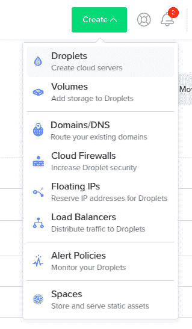
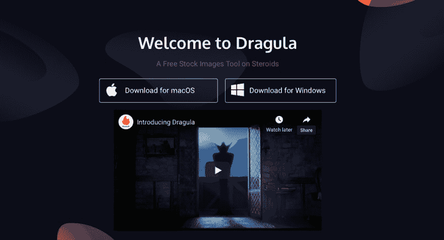
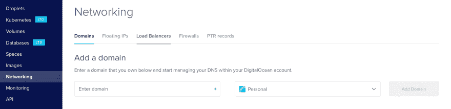
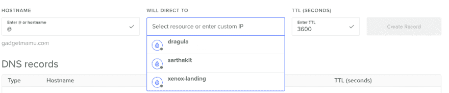

# 分 3 步部署静态站点👆🏼✌🏼🤟🏼

> 原文：<https://dev.to/xenoxdev/deploy-a-static-site-in-3-steps-5dag>

所以你刚刚做了你的第一个静态网站。厉害！现在你已经准备好与你的朋友和全世界分享了。但是你还在阅读那些关于在服务器上部署网站的长篇文章，或者只是安装像 FileZilla 这样的软件。

停下来。有一种更简单的方法可以做到这一点。我有一个简单的教程给我所有的初学者朋友(或探索新方法的中间者)。因此，不要浪费更多的时间，让我们开始与赃物😎...哎呀，我是说赃物🤓。

[](https://i.giphy.com/media/BW7QHkBICEZG0/giphy.gif)

#### 1。设置服务器

为此，我们使用数字海洋。如果您没有 DO 帐户，请在此处获取 100 美元优惠券[。你现在要做的很简单，就像下面的截图一样创建一个 droplet](https://m.do.co/c/12642f967cd1)

[](https://res.cloudinary.com/practicaldev/image/fetch/s--WZB9P-qd--/c_limit%2Cf_auto%2Cfl_progressive%2Cq_auto%2Cw_880/https://thepracticaldev.s3.amazonaws.com/i/o9ubuix3mx40b1bqtwna.png)

用 Ubuntu 发行版创建一个 5 美元的 droplet。我强烈建议在你的数字海洋账户中添加 ssh 密钥，以增加安全性和易用性。如果你不知道怎么做，使用本教程或者你可以使用密码。

#### 2。install nginx(安装引擎)

现在打开你的终端，使用
登录你的数字海洋账户

```
 ssh root@your-ip 
```

Enter fullscreen mode Exit fullscreen mode

完成后，让我们将 nginx 安装到服务器上，这也很容易。

```
 apt-get update
    apt-get install nginx 
```

Enter fullscreen mode Exit fullscreen mode

如果你在浏览器中打开你的 IP 时看到这个，你就可以开始了。
[T3】](https://res.cloudinary.com/practicaldev/image/fetch/s--BYxUH9IY--/c_limit%2Cf_auto%2Cfl_progressive%2Cq_auto%2Cw_880/https://thepracticaldev.s3.amazonaws.com/i/in66emnwlren9aqbam7d.png)

#### 3。最后一步:部署

好了，这是最后一步。让我们移动到您的项目文件夹，运行这个命令来复制所有内容:

```
scp -r * root@your-ip-address:/var/www/html/ 
```

Enter fullscreen mode Exit fullscreen mode

或者，如果你想复制一些特定的文件，然后使用:

```
scp -r css/ fonts/ images/ index.html js/ root@your-ip-address:/var/www/html/ 
```

Enter fullscreen mode Exit fullscreen mode

嗯，就是这样。你的网站很快就会建立并运行起来。

[](https://dragula.teamxenox.com)

注意:这可能不是一个有效的方法，但肯定很快。不要把这个用于生产。T3】

### 加贺🎊

#### 设置域名

为此，请进入您的管理部分，然后单击“网络”

[](https://res.cloudinary.com/practicaldev/image/fetch/s--n9PuW9V5--/c_limit%2Cf_auto%2Cfl_progressive%2Cq_auto%2Cw_880/https://thepracticaldev.s3.amazonaws.com/i/8hckfekecmxyi2zxaybm.png)

输入您的域名，然后点击“添加域”。在此之后，您必须更改您的 DNS，完成此操作的完整指南在此处提供给每个注册商。

[](https://res.cloudinary.com/practicaldev/image/fetch/s--263fS_rZ--/c_limit%2Cf_auto%2Cfl_progressive%2Cq_auto%2Cw_880/https://thepracticaldev.s3.amazonaws.com/i/3meuor7yl4xw960q6fe0.png)

如果这样做了，下一步是添加一个 A 记录。要做到这一点，只需在主机名中添加`@`，然后选择你想要链接的 droplet，就这样。认为任务完成了。

#### 部署多个项目

如果你想在一个 droplet 上部署多个项目以节省资金，这也非常容易。只要在`/var/www/html/`中创建一个新文件夹，你就可以使用`https://domainname/foldername`访问你的其他项目。可能是这样的:

```
 scp -r * root@your-ip-address:/var/www/html/project-2 
```

Enter fullscreen mode Exit fullscreen mode

如果你想有一个类似`project2.mydomain.com`的子域，有一个单独的 droplet，这可以用一个记录来完成。只需在 hostname 中键入您的域名`project2`，选择您想要链接的 droplet，然后嘣！你完了。

* * *

## 结论

我希望我的文章有助于简化在几秒钟内部署静态站点的过程。如果你有任何疑问或者你遇到了什么困难，请在下面的评论中问我任何问题。
***专家:如果你有更好的方法，欢迎在下方评论区跳转。***

此外，如果您不想错过这个过程中的下一个重要步骤，即设置一个免费的 SSH，请不要忘记继续，以便您可以在下周赶上。
[T3】](https://camo.githubusercontent.com/9daeffb125235402391e39f25747fb7145461e3a/68747470733a2f2f6d656469612e67697068792e636f6d2f6d656469612f64376f38495864737077526d7358523743702f67697068792e676966)

顺便说一下，我们最近推出了一款免费产品，名为 [Dragula](http://dragula.teamxenox.com) 。一定要去看看。你可以很容易地使用 Dragula 复制股票图片的链接和降价代码，因此它可以为你的开发博客节省很多时间。😉

好了，伙计们，现在就这样。回头见！

[](https://i.giphy.com/media/vGfq40OBLIehW/giphy.gif)