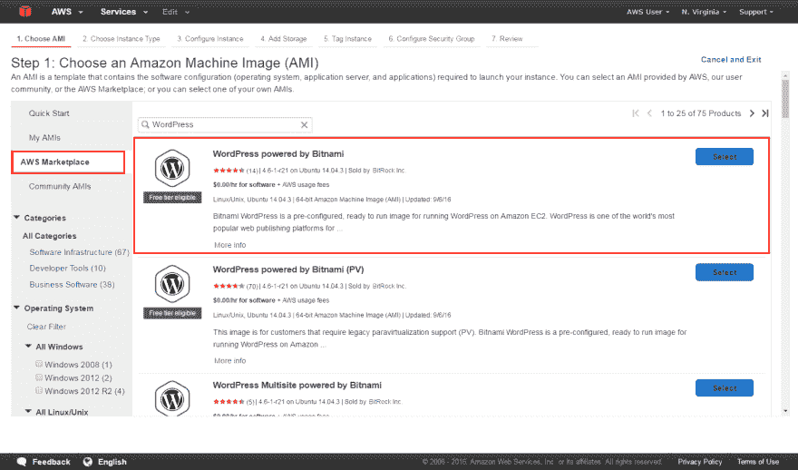
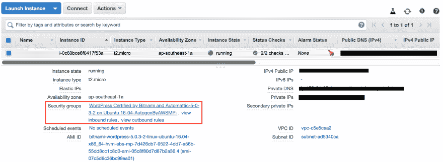
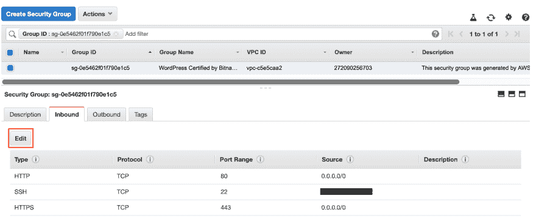
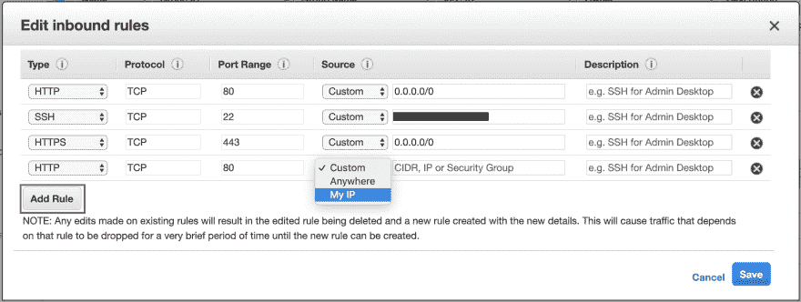

# 使用 AWS EC2 部署一个 Wordpress 网站(绝对初学者指南)

> 原文：<https://dev.to/maybebored/deploy-a-wordpress-website-using-aws-ec2-the-absolute-beginners-guide-2plf>

WordPress 主题是一个很好的工具，因为你可以在几分钟内，几乎毫不费力地建立一个优雅的网站。因为它抽象掉了大部分的样式和所有的后台工作，WordPress 是建立一个网站的首选解决方案。如果你刚开始接触 web 开发，这个指南是为你准备的。

### 步骤 1 -设置您的 AWS 帐户

AWS 为新的[注册用户](https://portal.aws.amazon.com/gp/aws/developer/registration/index.html?refid=em_127222)提供了一个[免费层](https://aws.amazon.com/free/)来获得免费的服务实践体验。免费层对于本指南来说已经足够了。

### 第二步——按照这个 [AWS 教程](https://aws.amazon.com/getting-started/tutorials/launch-a-wordpress-website/)建立一个 WordPress 网站。

这篇教程写得很好，指导新手。然而，如果它仍然令人困惑(这没关系)，留下评论来获得一些帮助。上面的指南只对那些想要部署一个基本上静态的、简单的、实验性的博客的人有用。这是**而不是**针对生产层面的解决方案。

AWS EC2 是云中的一个虚拟服务器，Amazon 机器映像(AMI)向这个服务器提供配置信息，因此它可以托管你的 Wordpress 网站。当你选择“Wordpress powered by Bitnami”并点击“下一步”时，你只需点击*一下*就可以完成。启动一键式解决方案的能力是现代云计算的众多优势之一。

### 步骤 3(可选)——配置 EC2 实例的安全配置

如果您可以在浏览器上访问 EC2 实例的公共 IP，则可以忽略此步骤。

安全配置通常是在您设置 EC2 实例时自动创建的，以保护您的虚拟服务器免受外部攻击。通过选择您的实例，然后在“Description”选项卡下查看其关联的安全组，检查您的安全配置。您应该会看到类似下图的内容。然后，通过单击它，转到您的实例的安全组。

如果您成功创建了实例，但无法使用浏览器访问它，那么可能是因为您没有允许任何传入连接到您的实例。编辑您的安全组的入站规则以允许传入流量。这些规则描述了您的实例所允许的传入 web 流量的类型和来源。下图显示了我的规则。

我允许来自所有 IP 地址的 HTTP 和 HTTPS 流量，因为我有一个网站，但我只允许来自我的 IP 地址的 SSH 流量(SSH 用于远程连接到我的服务器)。在 AWS 控制台上配置安全规则既简单又直观。

如果您没有允许 HTTP 或 HTTPS 流量的入站规则，那么您将无法使用浏览器查看您的站点(其他人也不能)。因此，继续添加一个规则，选择 HTTP/HTTPS 作为类型，对于源，添加您的 ip 地址或留空以允许所有传入的连接。如果您有兴趣了解更多关于 AWS 中的安全组的信息，[官方文档](https://docs.aws.amazon.com/AWSEC2/latest/UserGuide/using-network-security.html)是一个很好的起点。

现在去检查你是否能使用浏览器访问你的实例的公共 IP。好了，你刚刚使用 AWS 部署了一个 Wordpress 网站。

请在评论中告诉我你对这篇文章的看法。我想提高我的写作水平，并帮助其他人学会喜欢科技，就像我一样。