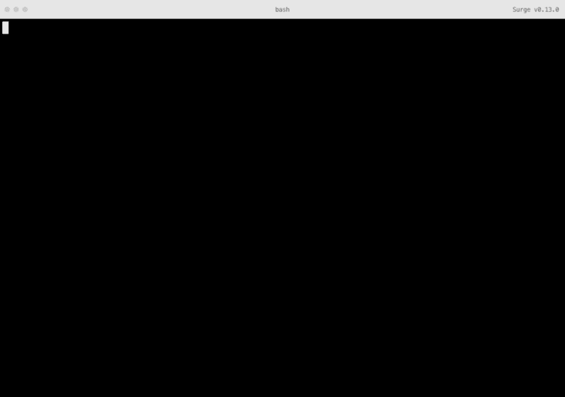

# 部署多英特尔控制器

> 原文：<https://dev.to/oscmedgon/deploy-multientorno-con-gitlab-ci-y-surge-sh-g2d>

* * *

维护需要手动上传到主机服务器或在终端上运行一系列命令的 web 应用程序可能会非常麻烦。此外，如果我们再加上一个事实，即我们希望有两个环境，其中一个环境将用于测试，事情就变得复杂了。
而这正是持续整合能极大地帮助我们把工作重点放在真正重要的事情上的地方。

> 云服务有助于我们在亚马逊网络服务或类似的服务中处理这种‘t0’任务，只要我们愿意为其‘T2’服务支付费用。

在此示例中，我们将学习如何在两个独立的环境中轻松、经济地部署应用程序。

# 第一步

我们首先要考虑的是项目设置，在本示例中，我们将使用 webpack 4，并需要以下文件。

```
|_config
  |__development.json
  |__staging.json
  |__production.json
|_webpack.dev.js
|_webpack.prod.js
|_webpack.common.js
|_package.json
|_ postcss.config.js 
```

现在，我们转到项目的基本配置文件，在本例中，我们将对 babel 和 sass/sass 样式使用 reactor 16 transferred，这些设置可能会根据您的需要而变化。
包的内容。json 将如下所示。

```
{  "name":  "my-awesome-project",  "version":  "1.0.1",  "private":  true,  "scripts":  {  "dev":  "export NODE_ENV=development && export env=development && webpack-dev-server --hot --inline --config webpack.dev.js",  "prebuild":  "rm -rf ./build/*",  "prebuild-qa":  "rm -rf ./build/*",  "build":  "export NODE_ENV=production && export env=production && webpack --config webpack.prod.js -p",  "build-qa":  "export NODE_ENV=staging && export env=staging && webpack --config webpack.prod.js -p"  },  "devDependencies":  {  "@babel/core":  "^7.0.0",  "@babel/plugin-proposal-class-properties":  "^7.0.0",  "@babel/plugin-proposal-decorators":  "^7.0.0",  "@babel/plugin-proposal-do-expressions":  "^7.0.0",  "@babel/plugin-proposal-export-default-from":  "^7.0.0",  "@babel/plugin-proposal-export-namespace-from":  "^7.0.0",  "@babel/plugin-proposal-function-bind":  "^7.0.0",  "@babel/plugin-proposal-function-sent":  "^7.0.0",  "@babel/plugin-proposal-json-strings":  "^7.0.0",  "@babel/plugin-proposal-logical-assignment-operators":  "^7.0.0",  "@babel/plugin-proposal-nullish-coalescing-operator":  "^7.0.0",  "@babel/plugin-proposal-numeric-separator":  "^7.0.0",  "@babel/plugin-proposal-optional-chaining":  "^7.0.0",  "@babel/plugin-proposal-pipeline-operator":  "^7.0.0",  "@babel/plugin-proposal-throw-expressions":  "^7.0.0",  "@babel/plugin-syntax-dynamic-import":  "^7.0.0",  "@babel/plugin-syntax-import-meta":  "^7.0.0",  "@babel/preset-env":  "^7.0.0",  "@babel/preset-es2015":  "^7.0.0-beta.53",  "@babel/preset-react":  "^7.0.0",  "babel-core":  "^7.0.0-bridge.0",  "babel-eslint":  "^9.0.0",  "babel-jest":  "^23.4.2",  "babel-loader":  "^8.0.0",  "css-loader":  "^0.28.7",  "extract-text-webpack-plugin":  "^2.1.2",  "file-loader":  "^1.1.6",  "html-webpack-plugin":  "^3.2.0",  "isomorphic-fetch":  "^2.2.1",  "mini-css-extract-plugin":  "^0.5.0",  "node-sass":  "^4.9.2",  "nodemon":  "^1.18.3",  "postcss-loader":  "^2.1.6",  "redux-logger":  "^3.0.6",  "redux-mock-store":  "^1.4.0",  "redux-thunk":  "^2.3.0",  "sass-loader":  "^7.0.3",  "script-ext-html-webpack-plugin":  "^2.0.1",  "style-loader":  "^0.19.1",  "surge":  "^0.20.1",  "uglifyjs-webpack-plugin":  "^2.0.1",  "url-loader":  "^0.6.2",  "webpack":  "^4.5.0",  "webpack-cli":  "^3.1.2",  "webpack-dev-server":  "^3.1.14"  },  "dependencies":  {  "prop-types":  "^15.6.0",  "react":  "^16.8.3",  "react-dom":  "^16.8.3",  "react-router":  "^4.3.1",  "react-router-dom":  "^4.3.1"  }  } 
```

要考虑的最重要的一点是使用环境变量，并且我们在 config 文件夹中有相应的文件(如果要发布此项目，则应忽略此文件夹，因为这是我们放置令牌或运行项目所需的所有内容的位置)

```
// Todos los ficheros seguiran esta estructura
{
    "API_BASE_PATH": "http://localhost:8080",
    "env": "development",
    //añade tantas variables como te sea necesario
} 
```

你好，我们来看看网络包的配置。

```
// webpack.dev.js
const projectName = 'My awesome project'
const path = require('path');
const HtmlWebpackPlugin = require('html-webpack-plugin');

const webpack = require('webpack');
const MiniCssExtractPlugin = require('mini-css-extract-plugin');

const commonRules = require('./webpack.common');

const APP_DIR = path.resolve(__dirname, './src/');
const entryJS = path.resolve(APP_DIR, 'index.jsx');
const entryCss = path.resolve(APP_DIR, 'sass/index.scss');

module.exports = {
    mode: 'development',
    entry: [entryJS/*, entryCss*/],
    output: {
        path: path.resolve(__dirname, 'dist'),
        filename: 'bundle.[hash].js',
        publicPath: '/'
    },
    module: {
        rules: [
            ...commonRules,
            { // sass / scss loader for webpack
                test: /\.(sass|scss)$/,
                use: [
                    MiniCssExtractPlugin.loader,
                    {
                        loader: 'css-loader',
                        options: {
                            sourceMap: true,
                            minimize: true
                        } // translates CSS into CommonJS
                    },
                    {
                        loader: 'postcss-loader',
                        options: {
                            sourceMap: true
                        }
                    },
                    {
                        loader: 'sass-loader',
                        options: {
                            sourceMap: false
                        }
                    }
                ],
            }
        ]
    },
    resolve: {
        modules: [APP_DIR, 'node_modules'],
        extensions: ['.js', '.json', '.jsx', '.css'],
    },
    performance: {
        maxEntrypointSize: 400000, // int (in bytes)
        assetFilter: function(assetFilename) {
            // Function predicate that provides asset filenames
            return assetFilename.endsWith('.css') || assetFilename.endsWith('.js');
        }
    },
    target: 'web',
    devtool: 'source-map',
    devServer: {
        contentBase: path.join(__dirname, 'dist'),
        compress: true,
        port: 8082,
        hot: true,
        historyApiFallback: true
    },
    plugins: [
        /*new MiniCssExtractPlugin({
            filename: 'bundle.[hash].css',
        }),*/
        new HtmlWebpackPlugin({
            title: projectName,
            template: path.join(__dirname, 'src', 'index.html'),
            filename: 'index.html',
        }),
        new webpack.EnvironmentPlugin({
            ...require('./config/' + (process.env.env || 'development') + '.json' )
        })
    ]
}; 
```

```
// webpack.dev.js
const projectName = 'My awesome project'
const path = require('path');
const HtmlWebpackPlugin = require('html-webpack-plugin');

const webpack = require('webpack');

const UglifyJsPlugin = require('uglifyjs-webpack-plugin');
const MiniCssExtractPlugin = require('mini-css-extract-plugin');

const commonRules = require('./webpack.common');

const APP_DIR = path.resolve(__dirname, './src/');
const entryJS = path.resolve(APP_DIR, 'index.jsx');
const entryCss = path.resolve(APP_DIR, 'sass/index.scss');

console.log(require(`./config/${process.env.env}.json`))

module.exports = {
    mode: 'production',
    entry: [entryJS/*, entryCss*/],
    output: {
        path: path.resolve(__dirname, 'build'),
        filename: 'bundle.[hash].js',
        publicPath: '/'
    },
    module: {
        rules: [
            ...commonRules,
            { // sass / scss loader for webpack
                test: /\.(sass|scss)$/,
                use: [MiniCssExtractPlugin.loader, 'css-loader', 'postcss-loader', 'sass-loader'],
            },
        ]
    },
    resolve: {
        modules: [APP_DIR, 'node_modules'],
        extensions: ['.js', '.json', '.jsx', '.css'],
    },
    performance: {
        hints: 'warning', // enum    maxAssetSize: 200000, // int (in bytes),
        maxEntrypointSize: 400000, // int (in bytes)
        assetFilter: function(assetFilename) {
            // Function predicate that provides asset filenames
            return assetFilename.endsWith('.css') || assetFilename.endsWith('.js');
        }
    },
    target: 'web',
    plugins: [
        new webpack.EnvironmentPlugin({
            ...require(`./config/${process.env.env}.json`)
        }),
        /*new MiniCssExtractPlugin({
            filename: 'bundle.[hash].css',
        }),*/
        new HtmlWebpackPlugin({
            title: projectName,
            template: path.join(__dirname, 'src', 'index.html'),
            filename: '200.html'
        }),
        new UglifyJsPlugin({

        })
    ]
}; 
```

```
// webpack.common.js
const path = require('path');

const APP_DIR = path.resolve(__dirname, './src/');

module.exports =  [
    {
        test: /\.(jsx|js)?$/,
        exclude: /node_modules/,
        include: APP_DIR,
        loader: 'babel-loader'
    },
    {
        test: /\.css$/,
        use: [
            { loader: 'style-loader' },
            { loader: 'css-loader' }
        ]
    },
    {
        test: /\.(jpe?g|gif|png|svg|woff|eot|ttf|wav|mp3)$/,
        use: [
            {loader: 'file-loader'}
        ]
    }
]; 
```

```
// este fichero es la configuracion de post css, nos evita la necesidad de añadir prefijos de navegador para distintas etiquetas css. (Webkit, moz, etc.)
module.exports = {
    plugins: [
        require('autoprefixer')
    ]
}; 
```

这样，并考虑到您在 dev 和 prod 文件中看到的项目入口点，它们是:

```
const APP_DIR = path.resolve(__dirname, './src/');
const entryJS = path.resolve(APP_DIR, 'index.jsx');
const entryCss = path.resolve(APP_DIR, 'sass/index.scss'); 
```

我们必须满足 webpack 的需求，或者配置 web pack 以满足我们的需求。

> 此设定可在 UNIX
> 终端机上执行，例如 linux、mac 原生或 windows
> 在 linux 子系统或其他 linux 终端机模拟器下。

一旦我们的应用程序开始运行，现在是使用 gitlab-ci 采取行动的时候了，拥有 gitlab 帐户并将其用作项目存储库非常重要。

## 与 gitlab 的持续整合

gitlab 的持续集成将使我们能够更轻松地在我们的托管平台上部署我们的案例，并且我们将能够获得存款及其状态的记录，而我们只需将一个文件添加到我们的项目中即可。
在添加持续集成之前，我们需要添加弹出令牌，以便能够在我们的域中进行部署，为此，我们可以使用≤命令，请求我们登录或注册(如果我们不是)。
[](https://cdn-images-1.medium.com/max/800/1*B66ARSK2o4_XUyO4nEDh0w.gif)

一旦我们有了令牌，我们就必须转到 CI/CD 选项卡上的 gitlab 设置，并添加以下环境变量:
SURGE_TOKEN:这是我们刚刚得到的令牌。
SURGE_LOGIN:这是我们的电子邮件。
完成后，我们已经进入最后一步，将持续集成添加到我们的存储库中。

```
// .gitlab-ci.yml
image: node:10.15.1
stages:
  - staging
  - production

staging:
  stage: staging
  script:
    - npm install --silent
    - npm run build-qa
    - echo "staging.domain.com" > build/CNAME
    - node_modules/.bin/surge build
  only:
    - develop
    - schedules

production:
  stage: production
  script:
    - npm install --silent
    - npm run build
    - echo "www.domain.com" > build/CNAME
    - node_modules/.bin/surge build
  only:
    - master
    - schedules 
```

## 结论

完成所有步骤后，我们将有两个项目分支与无缝集成相连接，因此，在投入生产之前，我们可以在测试环境中获得新功能，而无需花费一欧元。无论如何，如果我们希望我们的应用程序拥有自己的域，而不是我们的比例出现，我们需要一个域