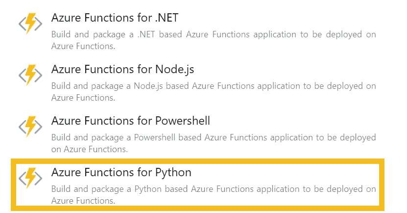
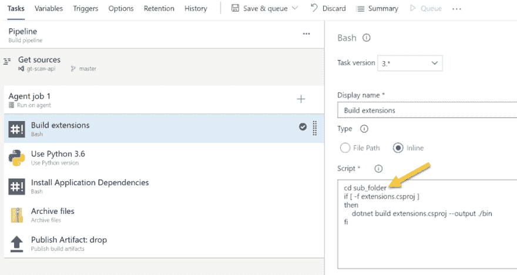
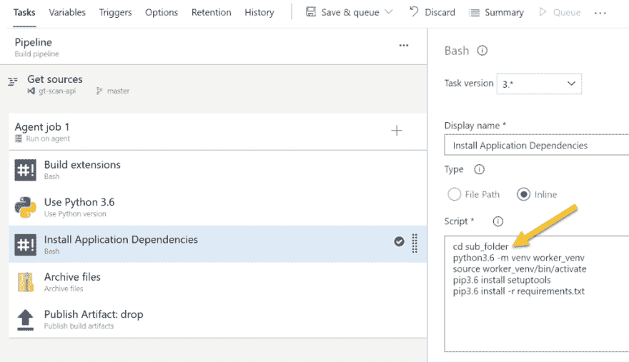
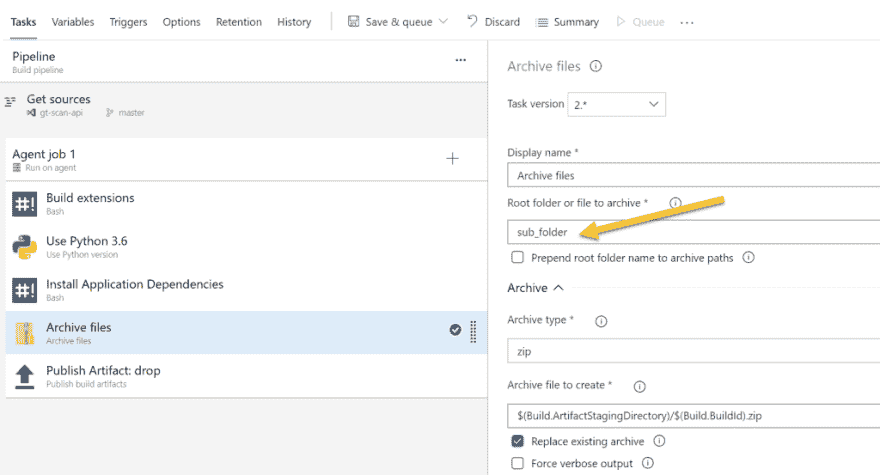
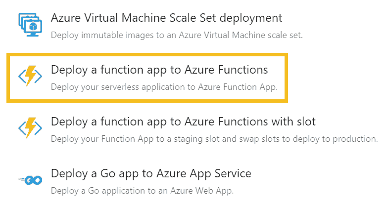

# 使用 Azure DevOps 部署基于 Python 的 Azure 功能

> 原文：<https://dev.to/simonwaight/deploy-python-based-azure-functions-using-azure-devops-46dp>

8 月份，微软宣布 Azure Functions 中的 Python 支持已普遍可用(GA)，这意味着它已准备好用于生产场景。

在这篇文章中，我将简要介绍如何使用 Azure Pipelines(Azure devo PS 的一部分)快速部署 Python 函数。

#### 构建和打包

现在，您可以选择在 Azure Pipelines 中使用预构建的模板来打包 Python Azure 函数。

选择此选项后，您将拥有恢复 requirements.txt 文件中的任何 Python 模块所需的全部内容，并确保安装了任何 Azure 函数扩展。最终的封装会被压缩，以便在发布中使用。

如果像我一样，你将多个独立的 Azure 函数放入一个 Azure Git Repo 中，那么你将需要修改三个构建任务，以确保在运行命令时选择子文件夹。

首先，我们需要确保我们恢复了 Azure Functions 扩展，因此我们将添加一个“cd”命令并切换到正确的文件夹。

然后，我们必须确保根据子文件夹中的`requirements.txt`恢复 Python 模块。

最后，我们需要编辑存档文件任务，确保您选择了与上一步相同的子文件夹。

是的，如果您运行这个构建，您将得到一个准备好部署的 zip 文件。

#### 释放到天蓝色

我们现在可以创建一个使用标准 Azure 函数模板的 Azure Pipelines 版本(如下所示)。在部署到已经为 Python 函数设置好的主机环境中时，不需要使用特殊的步骤。

一旦运行了发布版，您的功能就部署好了！如果您需要同时部署应用设置，您可以使用“部署 Azure Function 应用”任务的“应用程序和配置设置”部分来指定要部署的设置。

就是这样——比预览版中的这个功能简单多了！