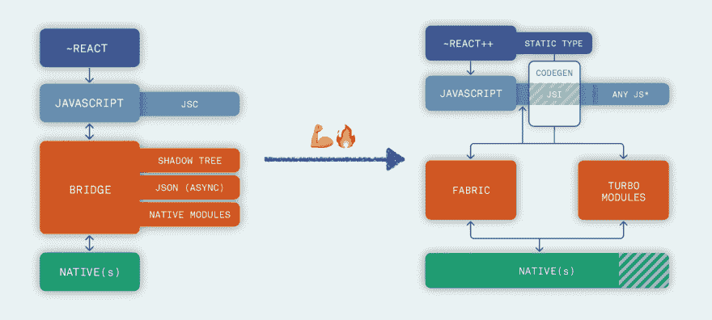

# 描述 React 原生重构，一个故事

> 原文：<https://dev.to/kelset/describing-the-react-native-re-architecture-a-story-3m1b>

距离我上次写文章已经有一段时间了——甚至比我的上一系列博客文章还要久:我的上一篇关于 Medium(关于[开源](https://hackernoon.com/i-thought-i-understood-open-source-i-was-wrong-cf54999c097b))的文章的日期是 2018 年 1 月 2 日(！).

这有几个原因，但很大程度上是因为我将大部分业余时间用于帮助 React Native 脸书团队和 React Native 社区在许多方面成为今天的样子(作为核心回购的维护者是其中之一)。

然而，自今年 1 月以来，我有机会加入了[强大的](https://formidable.com)——老实说，我在那里度过了一生中的时光——感谢我的几个同事，我终于找到了一些新的动力来做我在 2017/2017 年真正喜欢的事情:**写作**。

我决定去解决一件在我脑海中已经存在很长时间的事情:FB 团队目前正在开发的新架构。这些变化将使 React Native soooo 好得多，简直令人难以置信。唯一真正的问题是缺乏相关的材料，而且确实存在的大部分都是超级技术性的。

所以我决定，在几个同事的帮助下，在回答我问题的几个 FB 工程师的耐心帮助下，尝试向更多的开发人员提供一些信息，让我相信 React Native 会继续存在。

我在写作时主要关心的一个问题是在细节和可访问性之间找到正确的中间立场:在这方面，它对不显示代码的决定很有帮助，并且能够可视化架构的前/后图形(感谢我们令人敬畏的图形标记):

我立即意识到我们可以将架构分成四组，从而产生四篇易于理解的文章:

*   [反应&代号](https://formidable.com/blog/2019/react-codegen-part-1/)

*   [你是&地点](https://formidable.com/blog/2019/jsi-jsc-part-2/)

*   [织物&涡轮模块](https://formidable.com/blog/2019/fabric-turbomodules-part-3/)

*   [精益核心](https://formidable.com/blog/2019/lean-core-part-4/)

因为这是正在创造的历史，因为“代码仍在编写中”，我不得不在提出一些概念时采取一些自由，以免这些文章在我们发表时“过时”。例如，关于 Fabric 如何工作的细节自去年以来发生了变化，所以我决定对阴影树和队列如何工作做一点“挥手”。

此外，作为一个与这一切密切相关的人，我也不得不后退一步，试图将每个新“组件”的核心概念讲清楚。这项工作的关键是让[卡迪](https://twitter.com/kadikraman)和[卡洛斯](https://twitter.com/carlos_paelinck)(我有幸与之共事的两位同事)阅读文章草案，并从 React 本地工程师的角度提供精彩观点。

这些文章的出版花费了大量的工作，我很高兴在强大的公司网站上看到它们。我希望他们至少帮助了万维网上的一些开发人员，让他们相信 React Native 很棒，而且会变得更好。

如果你是这些开发者中的一员，请在这里留下你的评论！

我很乐意听到你对帖子的反馈，从你觉得更有趣的到你对这个主题的任何其他问题(如果你愿意，你也可以在 [Twitter](https://twitter.com/Kelset) 上找到我，我的 DMs 是开放的)。

也许将来你会更多地看到我，但在那之前...

**编码快乐！**🤖