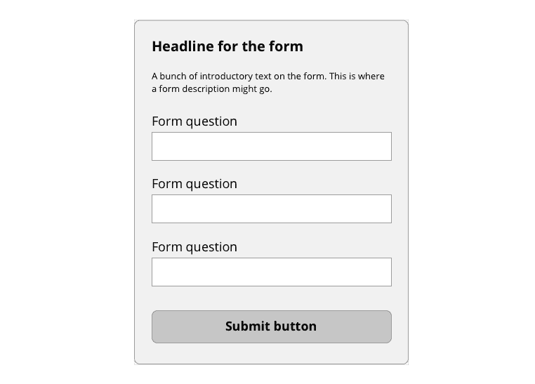
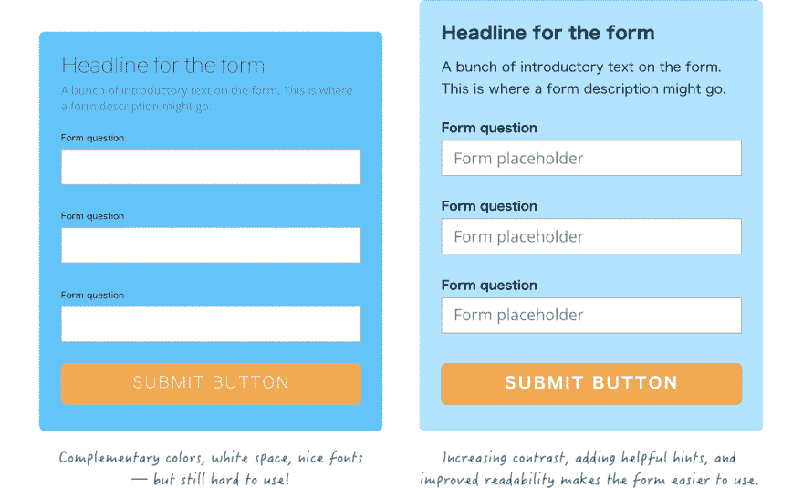
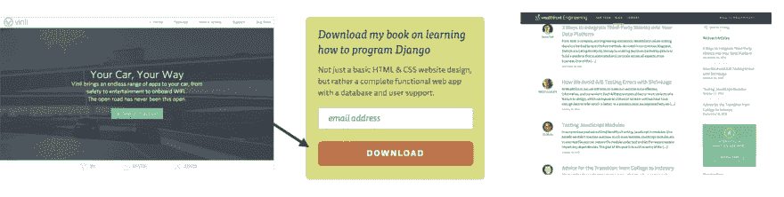
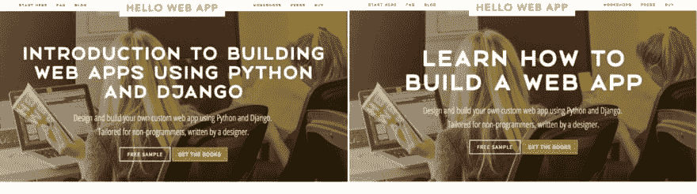

# 为非设计师设计(下)

> 原文：<https://dev.to/tracymakes/design-for-non-designers-part-2-c17>

[本系列文章的第 1 部分](https://dev.to/tracymakes/design-for-non-designers-part-1-28m2)关注视觉效果(因为这通常是人们在设计时寻求帮助的地方)**但是重要的是要记住可用性胜过美观**。

如果使用网站的人不能实现他们想做的事情，那么世界上最华丽的网站也是无用的。

## 别忘了用户体验。

你的设计*运行良好*比它看起来如何更重要。如何判断你的设计是否运作良好？

为了说明这一点，请考虑一个表单。

我们可以使用设计技巧，比如减少混乱和更好的字体，让表单看起来更好，但我们也需要确保它易于阅读和填写。

<figure> 

<figcaption>从技术上来说，左边的表单使用了我们在第 1 部分中讨论过的所有策略，但是对于可用性来说这是一个噩梦。右边的更有用，意味着我们的转化率应该会上升，这比仅仅设计更重要。</figcaption>

</figure>

当然，这个技巧实际上取决于你正在设计什么，所以这里有一些一般的想法来帮助你继续思考用户体验。

### 确定你站点的目的。

对于一个个人网站，也许你希望人们访问尽可能多的页面。对于一个表单，提交的数量可能是最重要的指标。

### 确保你在做设计的时候考虑到了这个目的。

做出决策，让人们更容易实现你为自己设计的目标。这就是为什么最重要的按钮(我们希望人们看到并点击的按钮)是明亮的、可点击的颜色。

<figure> 

<figcaption>明亮的按钮或明亮的小工具吸引眼球，告诉用户“这是我想让你看到并使用的东西。”
</figcaption>

</figure>

想想你想让人们做什么，并专注于构建一个有助于而不是阻碍人们实现这一目的的设计。

关于提高可用性和实现目标的访问者数量(也称为“转换率”)的文章很多。这里有一些很棒的文章:

*   在 Quicksprout 上提高网站可用性的 8 种方法
*   [5 条设计原则，让你的网站在 VWO 上的转化率瞬间提升](https://vwo.com/blog/design-principles-increase-conversions/)
*   Kissmetrics 上的[高转化率网站的 5 个心理学原则(+ 20 个案例分析)](https://blog.kissmetrics.com/psychological-principles-converting-website/)。

## 内容要紧。

你的标题、段落、表单标签、按钮文本——你的内容和你的视觉设计一样重要。你写的东西会极大地影响你的访问者是否理解你的设计，以及他们是否完成了你设计的目的。

一些基本的经验法则:

### 少即是多。减少文本混乱。

在本系列的第 1 部分中，我们讨论了可以用来减少混乱的设计决策。你猜怎么着——对于内容来说，杂乱也很重要！

大段大段的文字令人生畏。网民主要浏览网站，因此大段大段的文字更有可能被完全跳过，而不是通读一遍。

这句话又长又啰嗦:

> 请注意，虽然 Chrome 在 Mac 和 Windows 操作系统上都受支持，但我们建议本网站的所有用户切换到最新版本的 Firefox web 浏览器，以获得最佳效果。

同一句话，为简单起见改写如下:

> 为了获得最佳效果，请使用最新版本的 Firefox。也支持 Mac 和 Windows 的 Chrome。

(感谢 [Peachpit](http://www.peachpit.com/articles/article.aspx?p=1636692&seqNum=20) 的例子。)

简而言之，缩短和简化你的写作。避免使用大词或冗长的句子来覆盖所有基础的诱惑——你的句子越短越简单，它们就越容易被阅读、理解，甚至被翻译成不同的语言。

### 改写你的标题要讲好处，不要讲细节。

通过写标题告诉用户为什么他们应该感到兴奋，来提高对你“卖”的东西的兴奋感和兴趣。当你写标题时，你脑海中闪现的第一件事可能是解释产品的功能。“某某人是设计师。”“这个东西是一个小部件。”

修改标题，让它为读者带来好处。 *“某某人设计了实用而漂亮的网站。”"这个东西提高了 30%的网站转化率."*

<figure> 

<figcaption>离开了，这本书讲的是什么。对，这本书给读者带来了什么。好处比细节更引人注目！
</figcaption>

</figure>

像这样的内容变化可以极大地提高转化率(点击你的网站做你想让他们做的事情的人的数量)，使你的设计更加有效。

有关内容的更多阅读，请查看以下资源:

*   [提高技术写作和文档的五个技巧](https://medium.com/@limedaring/five-tips-for-improving-your-technical-writing-and-documentation-47353723c8a7#.2dlbspbta)
*   [案例研究:一个简单的标题变化如何将转化率提高 52.8%](https://www.webprofits.com.au/blog/case-study-headline/)
*   [始终使用优势标题](http://www.copyengineer.com/post_benefit_headlines/)

## 如何检查你的设计是否存在可用性问题。

发现用户体验和设计可用性问题的最好方法是运行快速可用性测试。这在心理上可能很难，因为你需要向他人展示你的设计并获得反馈，有时反馈可能会很伤人。

将你的感觉从设计中分离出来。你可能很难不把负面反馈放在心上，但解决你可能发现的网站可用性问题更重要。你向他人寻求反馈越多，就越容易。

我在设计中寻找可用性错误的一步一步的过程:

### 1。休息一下，用新鲜的眼光看设计。

既然你做了设计，就很难发现任何可用性问题——毕竟，你知道所有东西在哪里，知道如何使用所有东西，因为你是设计者。

从设计中休息一段时间，几个小时，或者更好的是一夜，意味着你可以用新的眼光来看待设计，并抓住一些你之前可能忽略的问题。

### 2。由朋友和家人来管理你的设计。

寻求帮助时最不害怕的人是你的朋友和家人，但请记住，他们也会拒绝给你任何形式的负面反馈。一定要提醒他们，你需要更多的反馈，而不仅仅是“看起来棒极了，干得好！”

### 3。让陌生人运行你的设计，看着他们使用你的网站。

最诚实的反馈来自你不认识的人，但这也是最难得到的反馈。对于像你的个人网站这样的小东西，你也许可以跳过这一步，但是如果你正在做一个你希望客户使用的项目的网站，这一步可以找到关键的问题。

这里有一篇关于[运行快速和肮脏的可用性测试](http://www.creativebloq.com/quick-and-dirty-usability-testing-9134469)的好文章。

## 总之，确保你的设计和它看起来一样好。

如果你的用户不能实现他们或者你想要他们做的事情，再好的设计也没有任何意义。

*   **思考你设计的目的**，是让某人填写表格、查找信息，还是其他用途。
*   **确保你的设计支持这个目的**并牢记这一点来改善用户体验。
*   **不要忘记你的内容**——简化你的文字，写下谈论利益而不是细节的内容和标题。
*   **向其他人展示你的设计**并获得反馈，找出用户体验问题可能隐藏的地方。

* * *

这是一个为非设计师设计的三部分系列。参见第一部分关于设计和杂乱的内容和[第三部分关于训练你的设计直觉的内容](https://hellowebbooks.com/news/tutorial-design-for-non-designers-part-3/)。

你可以在我的书里找到更多的信息和建议！ *Hello Web Design* 将不仅包含上述信息，还将包含针对程序员和非设计人员的务实且易于理解的理论和最佳实践。

[购买你好网页设计](https://hellowebbooks.com/learn-design)

<small>*电子书的起价为 24.95 美元。*</small>

谢谢大家！如有任何问题，[关注并在 Twitter 上给我发消息](https://twitter.com/tracymakes)。

想法？有问题吗？请在下面的评论中告诉我！