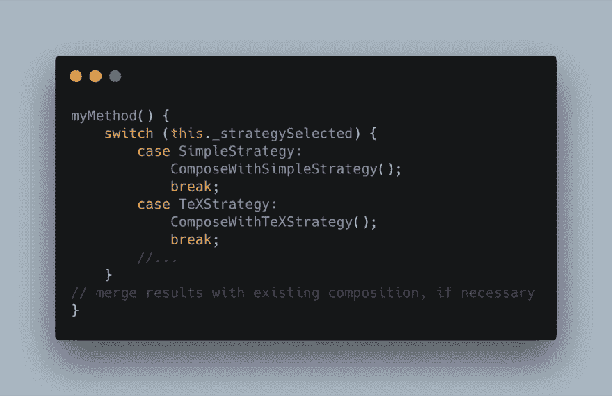
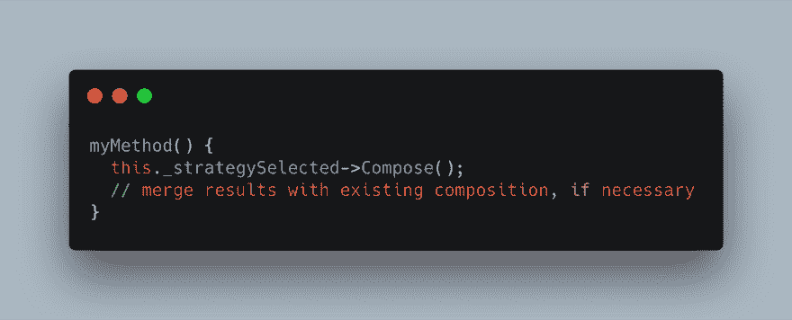
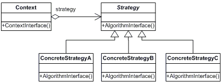
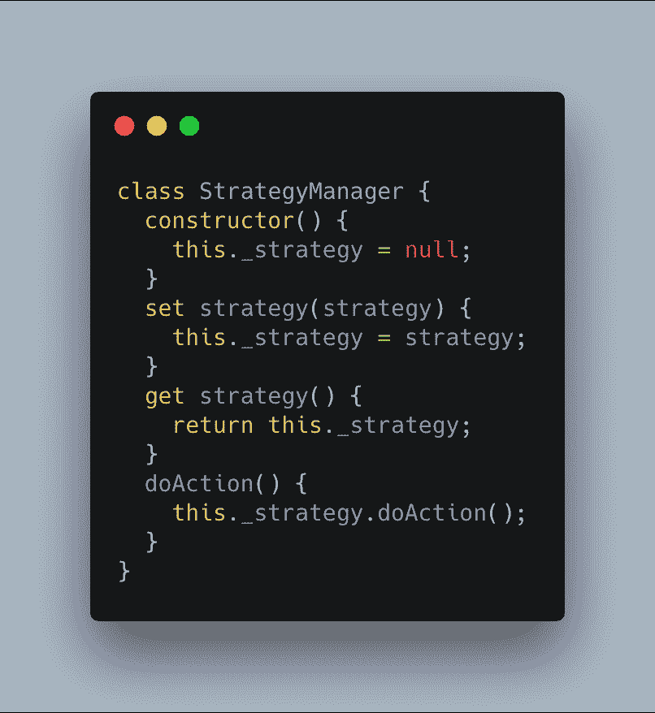
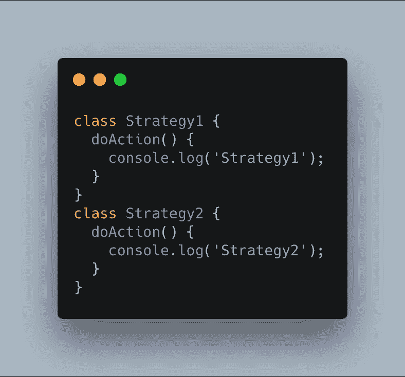
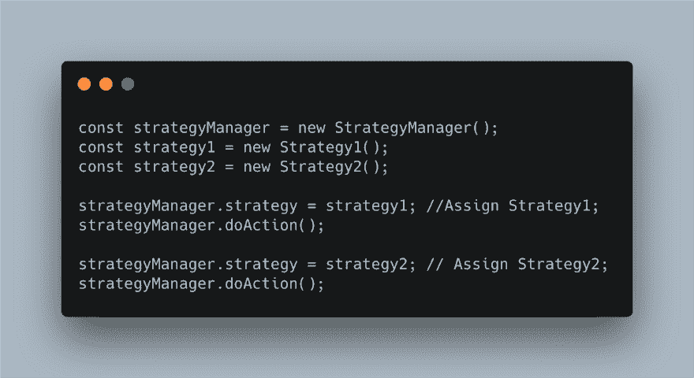
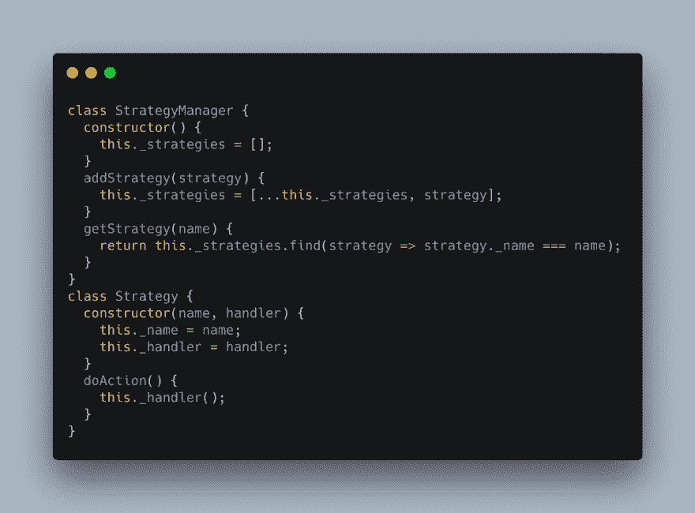
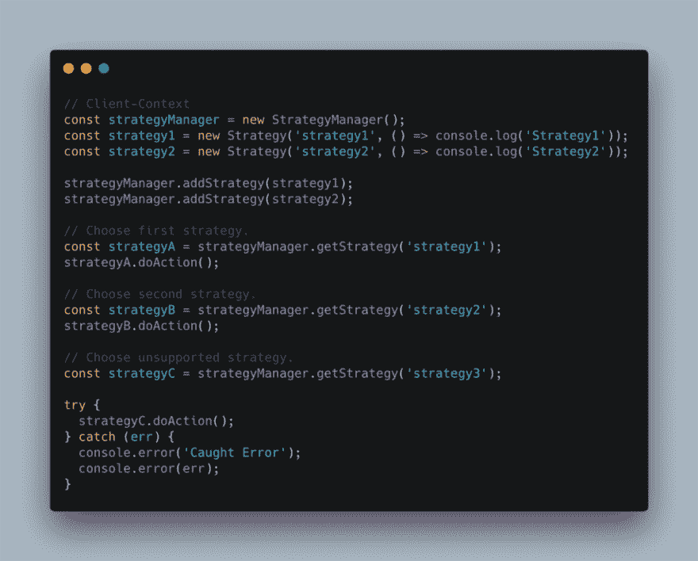

# 设计模式 JavaScript 中的策略模式

> 原文：<https://dev.to/carlillo/design-patterns---strategy-pattern-in-javascript-2hg3>

有 23 种经典的设计模式，在原著
`Design Patterns: Elements of Reusable Object-Oriented Software`中有描述。模式为软件
开发中重复出现的特定问题提供了解决方案。

* * *

*   最初发布于[www . carloscaballero . io](https://carloscaballero.io/stategy-pattern-in-javascript-typescript/)* 2019 年 2 月 22 日。*

* * *

在这篇文章中，我将描述**战略模式**如何运作，
如何以及何时应用。这种模式在其他
语境中被称为**政策**。

### 战略模式:基本理念

> 策略模式是一种行为设计模式，支持在运行时选择一种
> 算法——Wikipedia
> 
> *定义一族算法，封装每一个，并使它们
> 可互换。策略让算法独立于使用它的客户
> ——设计模式:可重用面向对象软件的元素*

这种模式的主要特征是客户端在
中有一组算法，在运行时将选择一个特定的算法来使用。这种
算法在它们之间是可以互换的。

下面的代码展示了一个经典问题，你需要在你的应用中选择一个
具体算法。在这段代码中，你可以使用任何编程语言的`switch`控制
结构。

然而，使用**策略模式**可以更加灵活，这将是
的以下结构:

这个模式的 UML 图表如下:

每种策略都用一个具体的对象来表示。因此，客户端/上下文
包含一个`Strategy`对象(`concreteStrategyA`，`concreteStrategyB`，...)哪个
实现了 in 接口`Strategy`。策略
之间互换的关键在于在改变策略的上下文中实现一个方法，例如
、`setStrategy`。

### 策略模式:何时使用

1.  解决策略模式的问题是当你需要使用几个具有不同变量的算法时。这时，你需要创建一个具体的类来实现你的算法(可以包含在一个或几个函数中)。
2.  另一个需要这种模式的有趣时刻是，在一些算法之间存在相关的条件语句。
3.  最后，当你的大多数类都有相关行为时，你必须使用这种模式。

### 战略模式:优势

这种战略模式有几个优点，可以总结为
以下几点:

*   在运行时，在不同的算法(策略)之间切换很容易，因为你通过接口使用了多态性。
*   **清理代码**因为你避免了有条件感染的代码(不复杂)。
*   **更干净的代码**因为你将关注点分成了类(每个策略一个类)。

### 策略模式:使用 JavaScript 的基本实现

现在，我将向您展示如何使用 Javascript 实现这种模式，
您必须记住，JavaScript 缺乏接口。所以，你需要编写一个名为`StrategyManager`的
类作为接口:

这个类包含一个名为`_strategy`的私有属性，它代表此时将使用的
策略。方法`doAction`是将在每个具体策略中实施的方法
。JavaScript 中的策略模式不同于 UML，因为这种语言缺乏面向对象的特性。

每个具体策略的实施如下:

注意，具体的方法`doAction`是在每个具体的
策略中实现的。

最后，上下文/客户端必须包含`StrategyManager`(或者策略
接口是面向对象语言)才能使用具体的策略:

### 策略模式:使用 JavaScript 的一组策略

在下面的实现中，我们的`StrategyManager`可以更复杂，而
包含一系列算法。在这种情况下，你可以改变属性
`_strategy`，而不是一个名为`_strategies`的数组。

最后，您可以使用
`addStrategy`方法在我们的策略列表中添加新策略。`Strategy`类有两个属性:1)策略的名称；2)
算法(称为`handler`)。方法`doAction`用于调用
具体算法。

最后，我们使用具体策略的客户端/上下文代码是下面的
:

第一部分是创建具体的策略(可以使用
**Singleton** 模式和 **Factory** 模式构建)并添加到我们的
**strategyManager** (可以是我们的接口)。客户端
的下一部分是选择要使用的策略，可以使用我们应用程序中的 **GUI**
或 **CLI** 选择该策略。

最后，您可以注意到，如果选择了不支持的策略，系统
会返回一个错误。当你想给你的系统提供一个高级算法时，可以使用这个。

### 结论

**策略模式**是一种模式，当需要
选择一个具体的算法时，它可以避免代码中的复杂。在这篇文章中，你可以获得一个简单的使用 JavaScript 语言的
实现，它没有接口。在
的情况下，你使用有接口的编程语言，你可以遵循
模式的 UML。

最重要的不是实现我给你展示的模式，而是你需要
知道这个模式解决了什么问题，以及为什么你必须使用这个模式，因为
实现会因编程语言的不同而不同。

* * *

*   最初发布于[www . carloscaballero . io](https://carloscaballero.io/stategy-pattern-in-javascript-typescript/)* 2019 年 2 月 22 日。*

* * *

嗨！我叫卡洛斯·卡瓦列罗，我是博士。来自西班牙马拉加的计算机科学。教授开发人员和计算机科学学位/硕士如何成为专家