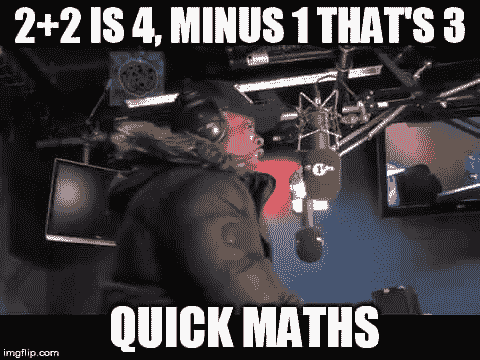
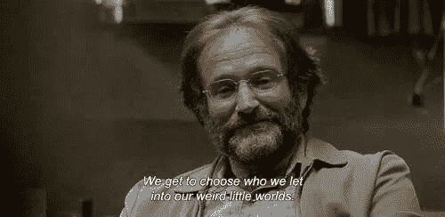
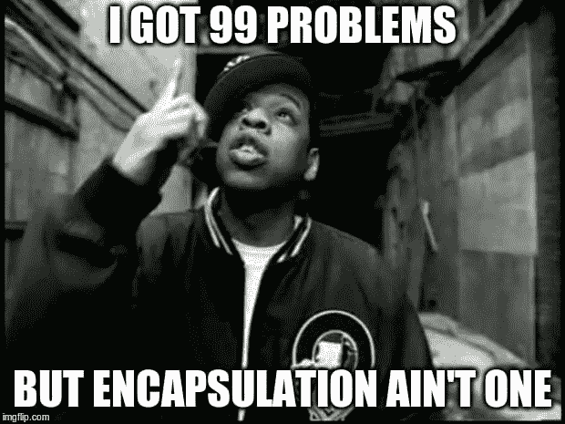
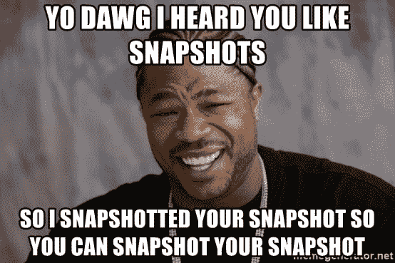
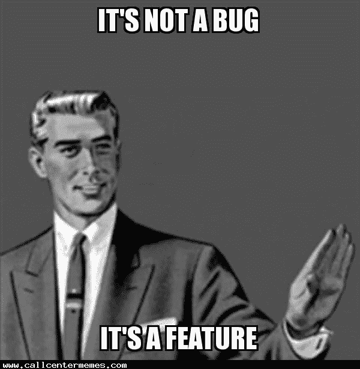

# Web 开发中的设计模式- #2 纪念品

> 原文：<https://dev.to/shikaan/design-patterns-in-web-development---2-memento-253j>

#### 查看更新版本[此处](https://withbenefits.dev/design-patterns-memento/)

# 简介

你们中的一些人可能还记得，在[试播集](https://dev.to/shikaan/design-patterns-in-web-development-2gbp)中，我说过我要用三个例子来解释*命令*:UI 套件、CQRS 应用程序和电子撤销/重做实现。在[指令集](https://dev.to/shikaan/design-patterns-in-web-development---1-command-2jf)虽然我没有提供后者，原因也极其简单:我是个混蛋。

此外，用那个例子来解释另一种行为模式对我来说更有意义，这种行为模式属于“四人帮” : **纪念册**中的经典模式。

# 纪念品

**[bla，Bla，Bla。代码请](#code-examples)**

## 举例:计算器

假设你正在使用计算器。你提供一个表达式，它会为你计算。为了简单起见，我们只考虑它的一个方法:`power`。

这个计算器背后的逻辑在一个名为`Calculator`的类中，看起来应该是这样的:

```
class Calculator {
    // State
    private string display;
    // and a whole lot of unrelated other fields

    // Resolves expressions like x^y
    private power(string expression): number;

    // Writes on display
    setState(string display): void;

    // Parse what's on the display, calculates and overrides the display
    calculate(): number;
} 
```

一个晴朗的日子，我们决定是时候为这个应用程序实现一个撤销机制了。实现这种机制的第一个想法可以是简单地应用你刚才所做的反函数。

[](https://res.cloudinary.com/practicaldev/image/fetch/s--S7BzrSL6--/c_limit%2Cf_auto%2Cfl_progressive%2Cq_auto%2Cw_880/https://i.imgflip.com/1wg0hg.jpg)

不幸的是，这对`power`功能不起作用。

例如:撤销`y = power(x, 2)`将会应用`sqrt(y, 2)`，但是`power(2, 2)`和`power(-2, 2)`产生相同的结果，所以你不能仅仅通过`y`就明确地得到`x`。

此时，当您`calculate`时，在快照中保存先前的状态，并且在`undo`时，使用这样的快照来重置计算器的状态看起来更简单和更有效。

Memento 提供了一个处理这个问题的好方法。

## 这是怎么回事？

> **意图**
> 在不违反封装的情况下，捕获并具体化一个对象的内部
> 状态，以便该对象可以在以后恢复到这个状态。

是的，您刚刚赢得了这一轮“猜报价”:它来自四人组*。*

这里的想法非常简单:我们希望有一种系统的方法来存储给定对象的内部状态的快照，而不暴露这样的状态，以便能够在以后恢复。

[](https://res.cloudinary.com/practicaldev/image/fetch/s--RbGrxtzP--/c_limit%2Cf_auto%2Cfl_progressive%2Cq_auto%2Cw_880/https://i.pinimg.com/originals/99/40/8c/99408c1fba73591cf6fb4509cab8b87c.jpg)

如果你想知道为什么你不应该公开状态，也许你仍然不害怕耦合。这绝对不好。然而，通过[阅读这篇文章](https://dev.to/shikaan/design-patterns-in-web-development---1-command-2jf)，你仍然有时间解决这个问题。我会在这里等你。

...

完成了吗？实践中我们可以从**时刻**开始。

## 模式在实践中

[](https://res.cloudinary.com/practicaldev/image/fetch/s--k4fEsHR_--/c_limit%2Cf_auto%2Cfl_progressive%2Cq_auto%2Cw_880/https://i.imgflip.com/2msosq.jpg)

首先:为什么这个图案被称为纪念品？ *Memento* 是一个拉丁词，可以放心地翻译成*reminder*[<sup>2</sup>](#note2)。这是我们存储感兴趣的`Calculator`的状态部分的对象。

`Calculator`，也就是国家起源的地方，被称为**发起人**，这个故事的第三个角色将会负责使整个事情运转起来，被称为**看守人**。

所以，总结一下，这些是 Memento 的参与者和他们的责任:

*   **发起人**:
    *   创建一个纪念品来存储内部状态；
    *   用纪念品来恢复它的状态；
*   **纪念品**:
    *   存储发起者内部状态的不可变快照；
    *   只能由发起者访问*；*
*   **看管人**:
    *   储存纪念品；
    *   从不做手术或阅读纪念品；

在实践中，这些将变成类似于:

```
// Originator
class Calculator {
    private string display;

    private power(string expression): number;

    setState(string display): void;
    calculate(): number;
    save(): Snapshot;
    restore(Snapshot snapshot): void; 
}

// Memento
class Snapshot {
    private string state;

    getState(): state;
}

// CareTaker
class Application {
    Calculator calculator;
    Array<Snapshot> undoSnapshots;
    Array<Snapshot> redoSnapshots;

    calculate(): void {
        const snapshot = this.calculator.save()
        this.undoSnapshots.push(snapshot)
        this.redoSnapshots = []
        this.calculator.calculate()
    }

    undo(): void {
        const snapshot = this.undoSnapshots.pop()
        this.redoSnapshots.push(snapshot)
        this.calculator.restore(snapshot)
    }

    redo(): void {
        const snapshot = this.redoSnapshots.pop()
        this.undoSnapshots.push(snapshot)
        this.calculator.restore(snapshot)
    }
} 
```

## 好看！我明天怎么用这个 s**t？

有了 **Memento** 我们算是幸运的:你不需要找到超级复杂的用例来实现它。撤销/重做场景是这种模式最常见的地方，但是每当您需要将对象恢复到以前的阶段时，都可以很容易地重用它。

你需要另一个例子，不是吗？

假设您有一个 web 应用程序的概要年龄。用户点击“编辑个人资料”,但是在做了一些事情之后，他们“取消”了操作。除非您想在每次发生这种情况时执行 AJAX 调用来重新获取用户信息，否则一个好主意是存储一个包含用户配置文件快照的纪念品，以便在取消时恢复。

难道**纪念物**是*达到这个目的的唯一*方式吗？不。在这些情况下，另一个相当常见的模式是**原型**，这可能是下集的主题。或者不是，谁知道呢？无论哪种方式，你现在需要知道的关于 **Prototype** 的所有事情就是它提供了另一种方式来创建对象状态的副本，但是以不同的方式。

总而言之，当你必须穿越物品的历史时，拍快照会让你的生活更轻松。

[](https://res.cloudinary.com/practicaldev/image/fetch/s--KFzdp33d--/c_limit%2Cf_auto%2Cfl_progressive%2Cq_auto%2Cw_880/https://memegenerator.net/img/instances/64082371/yo-dawg-i-heard-you-like-snapshots-so-i-snapshotted-your-snapshot-so-you-can-snapshot-your-snapshot.jpg)

你的下一个问题可能是，这只是方便还是必要的？我们在计算器的例子中已经看到，有时反转上一个动作不足以到达前一个状态。不幸的是，这不仅适用于不可逆的数学函数，而且适用于任何有副作用的方法。在这些情况下，通常拍摄快照是安全恢复到先前状态的唯一方法。

## 那么，问题出在哪里呢？

这种模式有几个你应该非常清楚的问题。

第一个也是最明显的一个问题是，如果要恢复的对象很大，拥有快照的历史记录会变得很麻烦。解决这一问题的一种方法是只存储不同的更改，但这仅适用于您确切知道要应用的快照顺序的情况(例如在撤销/重做中)。

另一个更危险的问题是，如果快照创建不正确，在遍历历史时很容易产生和积累错误。我们举一个这个案例的例子。

让我们假设你有一个有史以来最愚蠢的游戏:每次你点击一个按钮，你就获得 10 分，如果分数达到 100，你就获得一个徽章。我们想在这里实现一个撤销机制，所以我们在每次点击`score`变量时存储快照。

我们点击达到 100，我们获得一个徽章，我们撤销，我们再次点击，我们获得第二个徽章。

[](https://res.cloudinary.com/practicaldev/image/fetch/s--qs3uFImF--/c_limit%2Cf_auto%2Cfl_progressive%2Cq_auto%2Cw_880/http://www.callcentermemes.com/wp-content/uploads/2015/12/1449610204609.jpg)

为什么会这样？因为我们忘记了跟踪快照中的徽章，因此在撤销时我们只是恢复了分数，而没有清除徽章列表。

# 少一点对话，多一点动作，拜托

> 你可以在这里找到这些例子的更详细版本
> 
> ## /[图案](https://github.com/shikaan/design-patterns)
> 
> ### 设计模式在实际代码中的使用示例
> 
> <article class="markdown-body entry-content p-5" itemprop="text">
> 
> # 设计模式
> 
> 设计模式在实际代码中的使用示例
> 
> 这些是本系列文章的参考资料
> 
> </article>
> 
> [View on GitHub](https://github.com/shikaan/design-patterns)

终于码时间了！

正如我在介绍中所承诺的，我将展示如何通过命令和备忘录来解决同样的撤销问题。

> **免责声明**
> 我决定在这个例子中不使用电子，原因很简单，对于不熟悉它的人来说，它会使整个事情变得更复杂，而且它不会给电子专家带来任何价值。如果你真的对此感到不安，请发表评论，我也会添加那个例子。

这个例子是一个非常简单的 React 应用程序，它应该是一个游戏:排序瓷砖获胜。

它基本上在`keyDown`上设置一个监听器，并基于此调用一个方法(Memento)或发出一个命令(command)。

在 Memento 示例中，我们有处理所有游戏逻辑的`Game`组件:移动方块、选择方块、计算用户是否获胜...这使得它成为完美的**发起者**，因为它也是我们存储可能想要通过撤销恢复的状态的地方。作为发起者也意味着它负责创建和恢复`Snapshot`。

`Snapshot`当然是**纪念物**，它是`Game` ES6 模块的“私有”，以防止`KeyboardEventHandler`(又名**管理员**)知道它。

在命令示例中，我们有一个额外的组件:`CommandManager`充当**调用程序**。`Game`和`KeyboardEventHandler`的角色没有改变，但是由于实现不同，他们做事情的方式也不同。`Game`现在是命令的**接收方**，而`KeyboardEventHandler`是**的委托方**，是`Command`的唯一拥有者。

你可能已经注意到了，我们可以在这里互换使用**命令**和**纪念品**，因为我们封装的动作(`moveSelectedTile`)是一个纯动作，没有副作用，所以我们实际上*不一定需要*快照来重建状态:应用反函数就足够了。

这是否意味着纪念品和命令*不能*共存？绝不可能。事实上，您可以在一个命令中封装`takeSnaphot`方法来解耦`CareTaker`和`Originator`。或者，你也可以封装`moveSelectedTile`——就像我们已经做的那样——在命令中，除了执行方法之外，你还可以拍摄快照。最后一个是最常见的让命令和记忆共存的方法。

你可以从[回购](https://github.com/shikaan/design-patterns/tree/master/2-memento)开始，把它作为一个练习来试验。如果你很邪恶，想破坏别人的派对，你可以提交一份公关。

# 最后的话

嗯，当我们开始在桌面上添加知识和混合卡片时，事情开始变得更加令人兴奋。这肯定会随着时间的推移而改善，所以坚持住，:D

如果你有任何反馈(“不要告诉我如何编码。你不是我真正的妈妈！”)，观点(“你编码像狗屎，但你的模因很棒”)，评论(“是啊，好吧，行为模式很酷，接下来是什么？”)，请留言或评论，让我们一起把这个系列做得更好。

下次见！

* * *

[1](#note1ref) 。如果你不确定什么是行为模式，看看这里的

[2](#note2ref) 。为了避免忘记这一点，你应该记住**记忆**恩托和**记忆**里有着相同的起源。记忆技巧，记忆与记忆有关的东西。嘣！