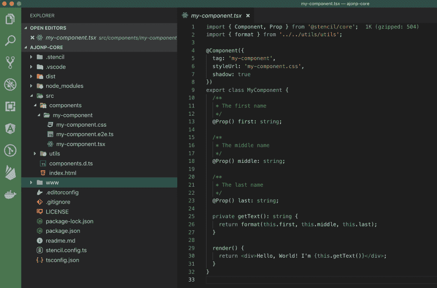
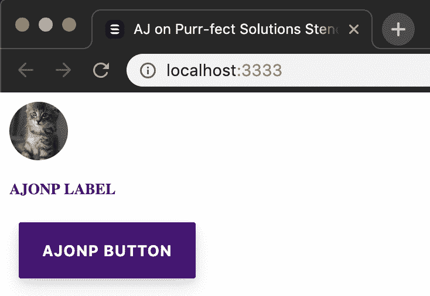
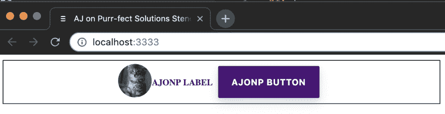
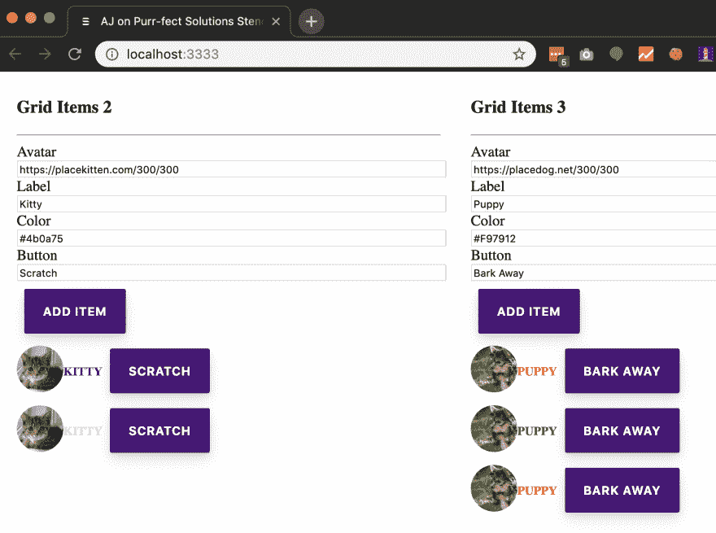
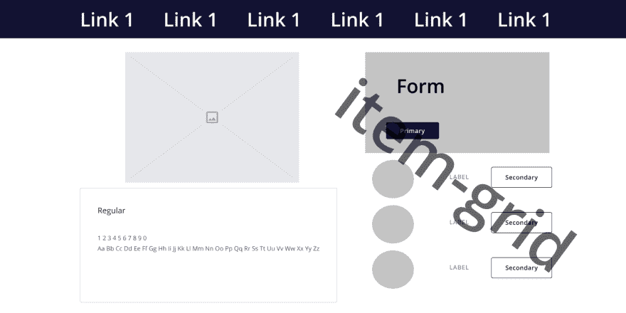
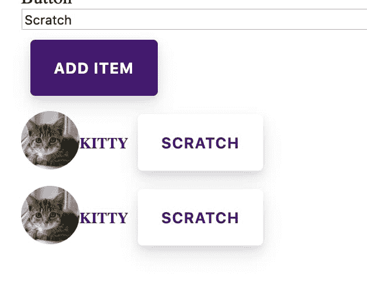

# 用 Web 组件设计系统

> 原文：<https://dev.to/codingcatdev/design-systems-with-web-components-13pd>

> 原帖:[https://coding cat . dev/tutorial/design-systems-with web-components](https://codingcat.dev/tutorial/design-systems-with-web-components)

# 用 Web 组件设计系统

如果你曾经在一家拥有多个不同站点的公司工作过，那么请继续阅读。我们将介绍良好的原子设计背后的构建原则，如何使用 Stencil 创建 Web 组件，以及最后(可能是最重要的)如何允许您的公司创建和采用设计系统。

# TL；DR -使用 Web 组件制作一个成功的设计系统。

[演示](https://ajonp-stencil-examples.firebaseapp.com/)

## 翻转设计系统上的脚本

最近，我得以与 Ionic 的一些核心成员坐在一起，他们也创建了 T2 模板，这是一个用于构建设计系统和渐进式网络应用的工具链。我们花了很长时间讨论公司如何通过设计团队来接触 Ionic，并需要帮助构建组件。作为一名开发人员，我想先谈谈设计系统中使用的 Web 组件。有相当多的惊喜，所以我想我会分解什么是设计系统，以及为什么你从哪一端开始并不重要，只要你有你的设计和开发团队一起工作来构建你的设计系统。

## 原子设计原理

在我看来，布拉德·弗罗斯特的《原子设计》是最专业的指南。布拉德打破了原子设计，因为它会涉及到化学元素。原子设计的关键是记住你是从最有限的组件开始构建的，直到你构建了一个完整的页面。

原子设计有 5 个阶段:

*   原子
*   分子
*   有机体
*   模板
*   页

从我(有限的)经验来看，大多数前端开发人员担心原子、分子和有机体。UI/UX 设计师担心有机体、模板和页面。实际上，他们**和**都需要考虑所有 5 个阶段。

### 原子

原子是好的设计中最小的部分，比如按钮、文本元素和图像。您会注意到，即使在这些基本的原子中，您的开发人员也会想知道原子呈现和反应的性能如何。例如，在桌面和移动设备上，按钮的“点击”动画必须保持非常快的速度。你的设计师会希望允许颜色，字体，边框和图标的位置。我们已经开始看到，两个角色都需要就每个组件达成一致。

### 分子

分子是这些原子按照逻辑关系的组合。例如，我们可以使用头像图像、标签文本和按钮来创建头像-项目-导航分子。现在我们有了一个简单、实用、可重用的组件，可以在许多不同的地方使用。

### 生物体

现在，生物体可以利用原子和分子来构建复杂的组件。你甚至可以得到真正的元，让有机体使用有机体！我喜欢使用卡片(也许太喜欢了)，所以让我们使用上面的组件。假设我们正在建立一个书籍设计系统，我们想有一个作者卡。这个作者卡将有一个头像-物品-导航，它将显示作者头像、作者姓名和一个导航到作者简历的按钮。让我们继续这个元思想，我们可以把这个作者卡放在一个更大的图书卡组件中，这个组件有一个图书英雄图像组件和标题。这些有机体的伟大之处在于，我们可以基于动态数据轻松地重复它们。

### 模板

这是我们在所有不同技术中实现所有原子、分子和有机体的标准化方式。许多人使用像 [Sketch](https://www.sketch.com/) 或者我最喜欢的 [Figma](https://www.figma.com/) 这样的设计工具来设计这些不同类型的模板。这通常被称为页面的框架，其中的每个元素将被放置在不同的页面类型上，如主页、产品页面和联系页面。这里重要的部分是得到正确的结构，而不是内容。

### 页面

现在，您可以继续使用这些设计系统来构建每个模板中的实际内容。这是“橡胶上路的地方”，你会发现每个模板、有机体、分子和原子需要多少调整才能利用你所有不同系统的所有组件。

## 为什么说翻剧本？

似乎都是直截了当的，不是每个人都这样想吗？你可能是一名开发人员，而不是设计师。我的设计朋友会说，我们需要设置字体、颜色和风格。这就是为什么我说你需要**一起工作**来创建设计中的所有 5 个阶段。当设计者创建颜色时，开发人员应该使 CSS 具有足够的可移植性，允许每个组件使用一个源来更新这些颜色。通常公司会从设计多个页面开始，然后告诉开发人员如何创建它们。这就是我认为你应该“翻转剧本”的原因。

关于设计系统的更多信息，一个很好的资源是 Figma 博客。

# 带模板的 Web 组件

所以我们谈了很多原子设计原则，但是你可以在任何系统中使用它并开始创造。可以有角度分量、反作用分量和 Vue 分量。但是如果你注意到这些在任何地方都不容易起作用。因此，解决方案是使用 Web 组件，因为现代浏览器已经可以理解这些组件，任何前端框架都可以利用这些组件。桌面可以用[电子](https://electronjs.org/)(Slack，VSCode)，安卓和 iOS 都可以用 [PWA](https://developers.google.com/web/progressive-web-apps/) ，跨所有浏览器[我可以用](https://caniuse.com/#search=custom%20elements)。

这自然允许像 [Stencil](https://stenciljs.com/) 这样的工具创建可以集中定位和更新的 web 组件。这也意味着您可以在任何框架中使用这些组件，或者根本不在任何框架中使用。

## 创建模板组件

首先，我们将创建一个模板组件项目，并开始创建所有需要的组件。如果你熟悉 ReactJS 或 JSX，你会觉得很舒服。类似于 Ionic 团队使用模板构建的`ion-core`，我们将创建`<yourname>-core`，例如`ajonp-core`。

```
npm init stencil 
```

Enter fullscreen mode Exit fullscreen mode

选择:

1.  成分
2.  项目名称:ajonp-core

[选择视频](https://res.cloudinary.com/ajonp/video/upload/v1557259772/ajonp-ajonp-com/blog/Screen_Recording_2019-05-07_at_4.07.54_PM.mov)

[](https://res.cloudinary.com/practicaldev/image/fetch/s--MkUo7rEA--/c_limit%2Cf_auto%2Cfl_progressive%2Cq_auto%2Cw_880/https://res.cloudinary.com/ajonp/image/upload/f_auto%2Cfl_lossy%2Cq_auto/v1557260425/ajonp-ajonp-com/blog/Screen_Shot_2019-05-07_at_4.17.02_PM.png)

现在，如果您切换到您的项目目录，您将看到一个简单的设置，其中包含带有 starter `my-component`的`components`目录。这是一个基本组件，它返回一个`<div>`,包含使用 props 传入的您的名、中间名和姓。

这个新组件可以简单地通过提供到一个`<html>`页面中来使用。你可以在`index.html`中看到这一点，在这个新的 Web 组件中，它传递了两个道具`first="Stencil"`和`last="'Don't call me a framework' JS"`。

```
<my-component first="Stencil" last="'Don't call me a framework' JS"></my-component> 
```

Enter fullscreen mode Exit fullscreen mode

这看起来像是魔术，但确实有点神奇！如果你仔细观察`index.html`，你会注意到有一个`script`正在被导入`<script src="/build/mycomponent.js"></script>`，它提供了你的组件所需要的 javascript。

然后，您可以运行该项目，并在浏览器中查看它。

```
npm run start 
```

Enter fullscreen mode Exit fullscreen mode

如需更详细的指南，请查看[入门](https://stenciljs.com/docs/getting-started)。

### 创造原子

#### 按钮

对于按钮，我们将构建一个简单的蓝色按钮，它包含一个允许子组件通过的[槽](https://stenciljs.com/docs/templating-jsx#slots)。在我们的例子中，这只是一些文本。

src/components/ajonp-button/ajonp-button . tsx

```
import { Component } from '@stencil/core';

@Component({
  tag: 'ajonp-button',
  styleUrl: 'ajonp-button.css',
  shadow: true
})
export class AjonpButton {
  render() {
    return (
      <button>
        <slot />
      </button>
    );
  }
} 
```

Enter fullscreen mode Exit fullscreen mode

src/components/ajonp-button/ajonp-button . CSS

```
button {
  background: #5851ff;
  color: white;
  margin: 8px;
  border: none;
  font-size: 13px;
  font-weight: 700;
  text-transform: uppercase;
  padding: 16px 20px;
  border-radius: 2px;
  box-shadow: 0 8px 16px rgba(0, 0, 0, 0.1), 0 3px 6px rgba(0, 0, 0, 0.08);
  outline: 0;
  letter-spacing: 0.04em;
  transition: all 0.15s ease;
  cursor: pointer;
}

button:hover {
  box-shadow: 0 3px 6px rgba(0, 0, 0, 0.1), 0 1px 3px rgba(0, 0, 0, 0.1);
  transform: translateY(1px);
} 
```

Enter fullscreen mode Exit fullscreen mode

index.html

```
<ajonp-button>AJonP Button</ajonp-button> 
```

Enter fullscreen mode Exit fullscreen mode

为了了解一个按钮可以变得多详细，看看 Ionic 用 [ion-button](https://github.com/ionic-team/ionic/blob/master/core/src/components/button/button.tsx) 做了什么！

#### 标签

这只是一个简单的文本元素，你可以传入一个十六进制颜色代码来改变颜色，但是这个元素将始终是大写的，预定义大小为 13。注意这里我们引入了元素

src/components/ajonp-label/ajonp-label . tsx

```
import { Component, Prop } from '@stencil/core';

@Component({
  tag: 'ajonp-label',
  styleUrl: 'ajonp-label.css',
  shadow: true
})
export class AjonpLabel {
  @Prop() color: any;
  render() {
    return (
      <p style={{ color: this.color }}>
        <slot />
      </p>
    );
  }
} 
```

Enter fullscreen mode Exit fullscreen mode

src/components/ajonp-label/ajonp-label . CSS

```
p {
  font-size: 13px;
  font-weight: 700;
  text-transform: uppercase;
} 
```

Enter fullscreen mode Exit fullscreen mode

index.html

```
<ajonp-label color="#4b0a75">AJonP Label</ajonp-label> 
```

Enter fullscreen mode Exit fullscreen mode

#### 头像

这也是一个非常简单的`atom`样式的组件，它再次使用 props 到 src 属性中来接收一个图像 url，并使它像一个头像一样变圆。

src/components/ajonp-avatar/ajonp-avatar . tsx

```
import { Component, Prop } from '@stencil/core';

@Component({
  tag: 'ajonp-avatar',
  styleUrl: 'ajonp-avatar.css',
  shadow: true
})
export class AjonpAvatar {
  @Prop() src: any;
  render() {
    return ;
  }
} 
```

Enter fullscreen mode Exit fullscreen mode

src/components/ajonp-avatar/ajonp-avatar . CSS

```
img {
  border-radius: 50%;
  width: 50px;
  height: 50px;
  object-fit: cover;
  overflow: hidden;
} 
```

Enter fullscreen mode Exit fullscreen mode

index.html

```
<ajonp-avatar src="http://placekitten.com/200/300"></ajonp-avatar> 
```

Enter fullscreen mode Exit fullscreen mode

现在我们应该开始看到，当我们每次将所有这些 Web 组件添加到我们的`index.html`中时，它们都可以很容易地显示在屏幕上。这些决不是生产就绪，但你得到了原子的组成应该包含什么的一般想法。

如果您运行
，您应该会看到类似这样的内容

```
npm start 
```

Enter fullscreen mode Exit fullscreen mode

[](https://res.cloudinary.com/practicaldev/image/fetch/s--t0ZRYEXy--/c_limit%2Cf_auto%2Cfl_progressive%2Cq_auto%2Cw_880/https://res.cloudinary.com/ajonp/image/upload/f_auto%2Cfl_lossy%2Cq_auto/v1557346675/ajonp-ajonp-com/gxv5lnpggkccvhs5phjn.png)

### 创造分子

现在，我们可以利用上面构建的三个原子，创建一个分子来显示这三个项目。

#### 项

src/components/ajonp-item/ajonp-item . tsx

```
import { Component, Prop } from '@stencil/core';

@Component({
  tag: 'ajonp-item',
  styleUrl: 'ajonp-item.css',
  shadow: true
})
export class AjonpItem {
  @Prop() color: string;
  @Prop() src: string;
  @Prop() labelText: string;
  @Prop() buttonText: string;
  render() {
    return (
      <span>
        <div>
          <ajonp-avatar src={this.src} />
          <ajonp-label color={this.color}>{this.labelText}</ajonp-label>
          <ajonp-button>{this.buttonText}</ajonp-button>
        </div>
      </span>
    );
  }
} 
```

Enter fullscreen mode Exit fullscreen mode

src/components/ajonp-item/ajonp-item . CSS

```
div {
  display: flex;
  align-items: center;
  justify-content: center;
}
span {
  display: flex;
  flex-direction: column;
  align-items: center;
  justify-content: center;
  border: 1px;
  border-style: solid;
} 
```

Enter fullscreen mode Exit fullscreen mode

[](https://res.cloudinary.com/practicaldev/image/fetch/s--iyETnSZr--/c_limit%2Cf_auto%2Cfl_progressive%2Cq_auto%2Cw_880/https://res.cloudinary.com/ajonp/image/upload/f_auto%2Cfl_lossy%2Cq_auto/v1557356079/ajonp-ajonp-com/gwchtihnryyezuqgop15.png)

### 创造生物

现在我们有了一个分子，我们可以在生物体内使用它，将这个分子重复几次。我们将采取一个非常简单的形式，允许我们添加每个`ajonp-item`分子，但是你会注意到我们也将使用这个有机体内部的`ajonp-button`原子。

> 事后看来，也许我应该称之为清单😺
> 
> #### 项目网格
> 
> 这个网格开始变得更加复杂，因为它像我们的其他组件一样包含了 [@Props](https://stenciljs.com/docs/properties) ，但是现在我们引入了 [@State](https://stenciljs.com/docs/state) ，这样我们的组件就可以管理该组件的内部数据，在我们的例子中是属于网格的所有项目。最后一个类属性是 [@Element](https://stenciljs.com/docs/host-element#element-decorator) ，它允许我们访问主机 HTMLElement，允许我们找到表单输入字段和每个单独的`ajonp-item-grid`。

src/components/ajonp-item-grid/ajonp-item-grid . tsx

```
import { Component, Element, Prop, State } from '@stencil/core';

import { Item } from '../../models/Item';

@Component({
  tag: 'ajonp-item-grid',
  styleUrl: 'ajonp-item-grid.css'
})
export class AjonpItemGrid {
  // Incoming Property elements
  @Prop() defaultColor: string;
  @Prop() defaultSrc: string;
  @Prop() defaultLabelText: string;
  @Prop() defaultButtonText: string;

  // State to track inside of the component
  @State() items: Item[] = [];

  //Host Element to access the form data instead of looking at entire document
  @Element() el: HTMLElement;

  addItem() {
    const item = new Item();
    item.src = (this.el.querySelector('#src') as HTMLInputElement).value;
    item.labelText = (this.el.querySelector(
      '#labelText'
    ) as HTMLInputElement).value;
    item.color = (this.el.querySelector('#color') as HTMLInputElement).value;
    item.buttonText = (this.el.querySelector(
      '#buttonText'
    ) as HTMLInputElement).value;
    //Add newly created Item to array non-mutated
    this.items = [...this.items, item];
  }
  scratchItem(key: number) {
    //Remove newly created Item to array non-mutated
    this.items = [...this.items.slice(0, key), ...this.items.slice(key + 1)]; //Return an array from before the key and after the key.
  }

  render() {
    return (
      <div>
        <h3>Grid Items {this.items.length}</h3>
        <hr />
        Avatar
        <input type="text" id="src" value={this.defaultSrc} />
        <br />
        Label
        <input type="text" id="labelText" value={this.defaultLabelText} />
        <br />
        Color
        <input type="text" id="color" value={this.defaultColor} />
        <br />
        Button
        <input type="text" id="buttonText" value={this.defaultButtonText} />
        <br />
        <ajonp-button onClick={this.addItem.bind(this)}>Add Item</ajonp-button>
        {this.items.map((item: Item, key: number) => {
          return (
            <ajonp-item
              src={item.src}
              color={item.color}
              label-text={item.labelText}
              button-text={item.buttonText}
              onClick={this.scratchItem.bind(this, key)}
            />
          );
        })}
      </div>
    );
  }
} 
```

Enter fullscreen mode Exit fullscreen mode

src/components/ajonp-item-grid/ajonp-item-grid . CSS

```
input {
  width: 100%;
}
ajonp-item {
  display: flex;
} 
```

Enter fullscreen mode Exit fullscreen mode

现在，如果你仔细观察，我们在我们的页面中使用了这两种生物，但是我们也可以在我们的页面中的任何页面中使用它们 100 次！

index.html

```
<div style="display: flex; justify-content: space-around">
      <ajonp-item-grid
        default-src="https://placekitten.com/300/300"
        default-label-text="Kitty"
        default-color="#4b0a75"
        default-button-text="Scratch"
      ></ajonp-item-grid>
      <ajonp-item-grid
        default-src="https://placedog.net/300/300"
        default-label-text="Puppy"
        default-color="#F97912"
        default-button-text="Bark Away"
      ></ajonp-item-grid>
    </div> 
```

Enter fullscreen mode Exit fullscreen mode

[](https://res.cloudinary.com/practicaldev/image/fetch/s--vNpdsCFz--/c_limit%2Cf_auto%2Cfl_progressive%2Cq_auto%2Cw_880/https://res.cloudinary.com/ajonp/image/upload/f_auto%2Cfl_lossy%2Cq_auto/v1557366081/ajonp-ajonp-com/kmkxesgnqvgxcbo8ndt6.png)

## 模板

我不打算深入研究创建模板和实现所需的所有代码，但 Ionic 在其[布局](https://ionicframework.com/docs/layout/structure)功能中提供了一个可靠的解决方案。这里最棒的是，你可以再次在你的开发和设计团队之间工作，快速创建一个适合你未来组件的高保真线框。我不得不再次说我爱 Figma，因为任何用网络技术建造的东西都会在我心中占据一个特殊的位置。也就是说，在[产品设计套件](https://pdkit.co/)中可以找到创建模板这一常见任务的简单解决方案，查看【Figma 产品设计套件简介。

我们能做的很快就是为我们的页面设置模板，这样设计者和开发者就可以通过分解所有的组件来交流，并确保你有一个成功的模板。

> 请不要杀我，我不是设计师(是的，我应该与一个)。这是我们模板的一个例子。

[](https://res.cloudinary.com/practicaldev/image/fetch/s--p4C7tmc1--/c_limit%2Cf_auto%2Cfl_progressive%2Cq_auto%2Cw_880/https://res.cloudinary.com/ajonp/image/upload/f_auto%2Cfl_lossy%2Cq_auto/v1557369571/ajonp-ajonp-com/blog/Template_Example_1.png)

## 页面

因此，模板允许我们看到的是，我们可以立即调整我们的组件。我们可以看到我们的`ajonp-button`将需要允许一个**主要**和**次要**类型，所以我们应该确保更新一个属性来允许这一点，并且所有按钮上的圆角半径应该相同，所以我们应该更新 css。颜色和内容不碍事，直到看到页面示例的时候。现在，我们可以开始看到真正的页面，因为用户每天都会与它进行交互，但因为我们从头开始在组件上构建我们的整个系统，所以我们可以调整每个原子、分子和有机体，以确保我们的系统完美契合。

因此，一些简单的事情，如初级与次级可以调整

```
<span>
        {this.buttonType ? (
          <button class="secondary">
            <slot />
          </button>
        ) : (
          <button class="primary">
            <slot />
          </button>
        )}
      </span>

button.primary {
  background: #4b0a75;
  color: white;
}

button.secondary {
  background: white;
  color: #4b0a75;
} 
```

Enter fullscreen mode Exit fullscreen mode

[](https://res.cloudinary.com/practicaldev/image/fetch/s--QbOPtoae--/c_limit%2Cf_auto%2Cfl_progressive%2Cq_auto%2Cw_880/https://res.cloudinary.com/ajonp/image/upload/f_auto%2Cfl_lossy%2Cq_auto/v1557371683/ajonp-ajonp-com/z8heurbn50kcbsuelyg1.jpg)

# 创建和采用企业设计系统

我见过许多伟大的公司花费数百万美元维护不同的系统，只是为了试图跟上他们营销部门品牌变化的步伐。一个脱节公司的例子可能是利用 [Sitefinity](https://www.progress.com/sitefinity-cms) 、 [Adobe AEM](https://www.adobe.com/marketing/experience-manager.html) 、 [Angular](https://angular.io/) 和 [React](https://reactjs.org/) 建立网站。现在，在这些堆栈中的每一个上，假设他们已经构建了 5 个不同的站点。为了跨这些系统更新 button 组件，意味着您最多需要在 4 个地方进行更改，但更有可能的是，您需要在 20 个地方进行更新，然后构建、测试和部署这些系统。

在组件系统中，只需对组件进行一次更新！！

## 添加中心位置

为了能够被采用，你需要把你的组件放在一个集中的地方，比如 NPM。这里有一个关于如何[发布到 NPM](https://docs.npmjs.com/packages-and-modules/contributing-packages-to-the-registry) 的很好的指南。因为你如此努力地创造了这个系统，你很可能希望把它保存在你公司的私人 npm 注册表中。

# 如何成功

你需要得到两个部门的支持，并作为一个有凝聚力的单位工作，以获得真正的成功，但最终你会节省大量的时间和金钱！！！