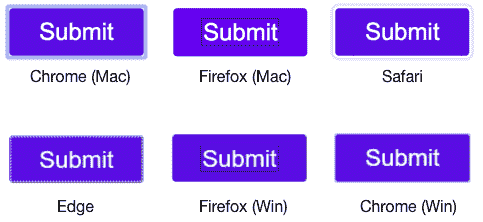

# 设计按钮焦点状态以提高可用性

> 原文：<https://dev.to/elizabethschafer/designing-button-focus-states-for-better-usability-gm2>

假设我们正在制作一个自定义按钮。设计师将设计文件交给我们，我们编写一些 CSS 来使它看起来完全正确。很简单，对吧？

[https://codepen.io/eschafer/embed/qvJvZR?height=600&default-tab=css,result&embed-version=2](https://codepen.io/eschafer/embed/qvJvZR?height=600&default-tab=css,result&embed-version=2)

但是等等，按钮有不止一种状态。到目前为止，我们刚刚创建的默认状态看起来不错，但是我们需要确保当它被聚焦时，它看起来也有明显的不同。

许多人专门使用键盘来导航，并依靠焦点状态来了解他们在页面上的位置。 [1](#fn1)

人们使用键盘而不是鼠标的原因有很多种，对许多人来说，使用鼠标作为退路并不是一种选择。

当您使用键盘浏览页面时，您可以按 tab 键浏览页面上的所有交互元素。如果你现在有键盘，那就试试吧。你应该可以很容易地看到什么是焦点。

如果焦点状态不可见(或很难看到)，就像试图使用一个带有不可见鼠标光标的网站:

[https://codepen.io/eschafer/embed/moaKXV?height=600&default-tab=result&embed-version=2](https://codepen.io/eschafer/embed/moaKXV?height=600&default-tab=result&embed-version=2)

没有人会认为这可以投入生产！但是当我们不注意我们的焦点状态时，那正是我们最终所做的。

这影响了真实的人，就像看不见的光标例子可能会影响你一样。如果你有视力，就你个人而言，随着年龄的增长，你很有可能最终会依赖这些注意力状态(假设你还没有依赖)。让我们来解决这个问题！

## 浏览器默认值

默认情况下，浏览器提供焦点状态。这是我们的自定义按钮的外观:

我没有视力问题，但大多数视力问题对我来说很难看到。对于视力不好的人来说，这更糟糕——对他们来说，这些焦点状态和默认的按钮状态之间没有明显的区别。

## 设计自定义焦点状态

那么，我们需要做些什么来让人们看到焦点状态呢？我使用的主要准则是:

1.  如果你依靠颜色来表示状态的变化，默认颜色和焦点颜色之间的[颜色对比度](https://webaim.org/resources/contrastchecker/)至少需要达到 3:1 [2](#fn2) 。
2.  确保任何轮廓都足够粗，以便实际看到。这方面没有任何官方指导，但至少使用大于 1px 的东西。

以下是一些可访问焦点状态的示例:

[https://codepen.io/eschafer/embed/pYGNge?height=600&default-tab=css,result&embed-version=2](https://codepen.io/eschafer/embed/pYGNge?height=600&default-tab=css,result&embed-version=2)

啊，好多了！我知道很多人喜欢这种微妙的东西，但如果你不能使用它，它看起来像什么并不重要。这只是一个概念的快速验证，所以我相信在这些指导方针下会有更有创造性的方法来符合审美。

希望这个有用！

### 相关阅读

*   [https://css-tricks.com/focusing-on-focus-styles/](https://css-tricks.com/focusing-on-focus-styles/)
*   [https://www.deque.com/blog/accessible-focus-indicators/](https://www.deque.com/blog/accessible-focus-indicators/)
*   [https://hacker noon . com/remove-than-ugly-focus-ring-and-keep-it too-6c 8727 fef CD 2](https://hackernoon.com/removing-that-ugly-focus-ring-and-keeping-it-too-6c8727fefcd2)
*   [https://www . w3 . org/WAI/wcag 21/Understanding/focus-visible . html](https://www.w3.org/WAI/WCAG21/Understanding/focus-visible.html)
*   [https://webaim.org/resources/contrastchecker/](https://webaim.org/resources/contrastchecker/)

* * *

1.  [https://www.w3.org/WAI/perspective-videos/keyboard/](https://www.w3.org/WAI/perspective-videos/keyboard/)↩

2.  [https://www . w3 . org/wai/wcag 21/understanding/non-text-contrast . html](https://www.w3.org/WAI/WCAG21/Understanding/non-text-contrast.html)↩