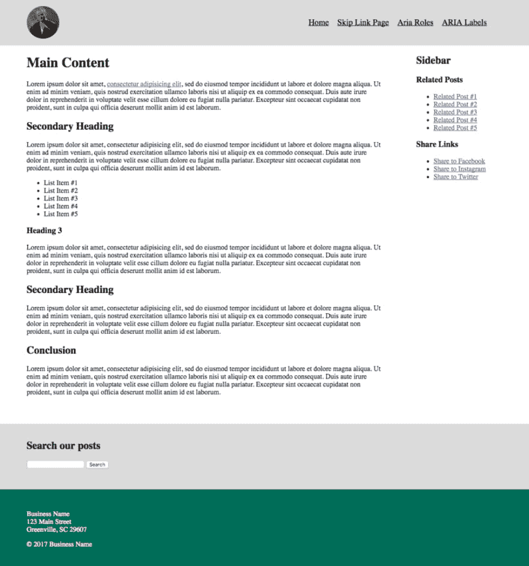
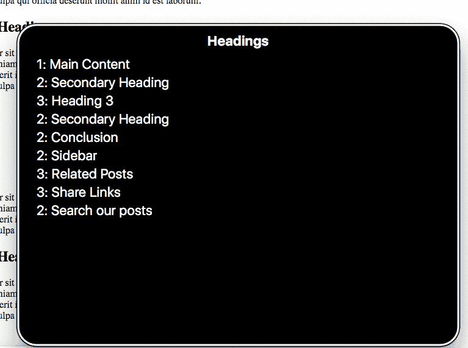
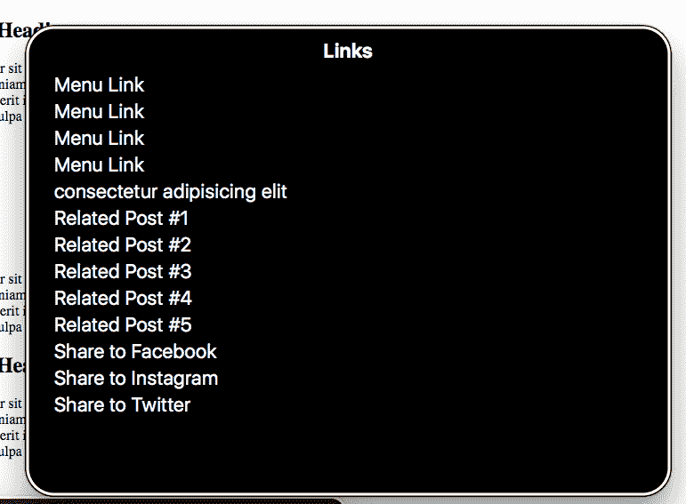
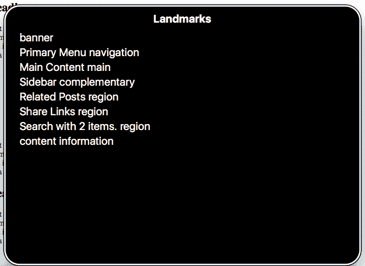

# 为屏幕阅读器设计布局

> 原文：<https://dev.to/benrobertson/designing-layouts-for-screen-readers-108k>

很容易认为布局主要是视觉上的关注。标题放在顶部，侧边栏在这里，行动号召放在内容上面(开玩笑)。网格、边框、间距和颜色都描绘了有价值的视觉数据，但是如果这些对页面结构的暗示只是可见的，一些用户可能会觉得你的内容难以理解。

如果您尝试在 web 上使用屏幕阅读器，您可以直接体验到这一点。当我在 Mac 上启动 VoiceOver 并拿出来进行测试时，我意识到对于一个屏幕阅读器用户来说，很多页面只是一大堆“内容”，缺少有用的组织线索。

这种体验有点像在听一个冗长杂乱的故事，没有任何迹象表明哪些细节是重要的或者与故事的主线相关。故事进行到一半时，你不确定是否值得继续听下去，因为你不知道你是否会找到你在寻找的东西。在一个网站的上下文中，当你开始怀疑网站上是否有任何有价值的内容时，你的屏幕阅读器可能已经读到一半了。

像这样的体验是由那些只有视觉布局的网站造成的。然而，理想情况下，我们的视觉布局应该指向内容的底层组织模型。它们应该是概念模型的视觉指示器。视觉指标只是揭示这一模式的一种方式。网页可访问性倡议的 ARIA(可访问的富互联网应用程序)项目为可能需要的用户提供了替代指标。

我将介绍如何利用这些指标来为辅助技术的用户创建一个简单的易于使用、导航和阅读的网页。所有的示例代码都可以在 [github](https://github.com/mergeweb/screen-reader-layout-post) 上找到。

<small>*想升级你的无障碍游戏？查看我的免费电子邮件课程:
✉️ [常见的易访问性错误以及如何避免它们](/courses/common-accessibility-mistakes/)。*</small>

## 初始布局

这是一个页面布局非常简单的例子。我们在顶部有一个包含徽标和导航的页眉，一些正文内容，右边有一个相关帖子列表和社交媒体共享链接列表的侧边栏，内容下方有一个搜索框，页脚包含我们企业的联系信息。

[](https://mergeweb.github.io/screen-reader-layout-post/)

*   [预览初始布局](https://mergeweb.github.io/screen-reader-layout-post/)
*   [查看 HTML](https://github.com/mergeweb/screen-reader-layout-post/blob/master/index.html)

视觉上，内容划分得很好，使用简单的网格和背景颜色来区分不同的元素。如果您在此页面上启动 VoiceOver，您可以使用“下一个元素”命令很好地浏览页面。标记中元素的顺序非常符合元素的视觉顺序。首先我们阅读标题，然后是正文，然后是侧边栏，然后是搜索框，最后是页脚。那很好。如果我按下`CAPS + U`来调出 VoiceOver 菜单，我可以获得页面上所有标题和所有链接的列表，并直接导航到它们。

[](https://res.cloudinary.com/practicaldev/image/fetch/s--9hxcy2vt--/c_limit%2Cf_auto%2Cfl_progressive%2Cq_auto%2Cw_880/https://benrobertson.io/assets/img/designing-layouts-for-sr/header-menu.png)

[](https://res.cloudinary.com/practicaldev/image/fetch/s--fMQ4J9UX--/c_limit%2Cf_auto%2Cfl_progressive%2Cq_auto%2Cw_880/https://benrobertson.io/assets/img/designing-layouts-for-sr/link-menu.png)

仅仅通过使用结构良好的 HTML、简单的带有`<div>`元素的分组以及标题标签的良好使用，我们就获得了不错的体验。这比我上面提到的那些漫无边际的故事网站要好，但还可以更好。

## 跳过链接

*   [预览跳转链接布局](https://mergeweb.github.io/screen-reader-layout-post/skip-link.html)
*   [查看 HTML](https://github.com/mergeweb/screen-reader-layout-post/blob/master/skip-link.html)

首先，我们将添加一个跳转链接作为页面的第一项。跳过链接是一种非常常见的辅助功能，它允许用户跳过冗长的链接列表和每个网页上重复出现的其他信息，直接进入当前页面的主要内容。

它是一个链接，是页面 tab 键顺序中的第一个元素。它通常在视觉上是隐藏的，但是当聚焦时，它会出现在屏幕上。为了在视觉上隐藏链接，我们将添加以下 CSS:

```
.skip {
    clip: rect(1px, 1px, 1px, 1px);
    position: absolute !important;
    height: 1px;
    width: 1px;
    overflow: hidden;
    word-wrap: normal !important; /* Many screen reader and browser combinations announce broken words as they would appear visually. */
}

/* Display the link on focus. */
.skip:focus {
    background-color: #fff;
    border-radius: 3px;
    box-shadow: 0 0 2px 2px rgba(0, 0, 0, 0.6);
    clip: auto !important;
    color: #888;
    display: block;
    font-weight: bold;
    height: auto;
    left: 5px;
    line-height: normal;
    padding: 15px 23px 14px;
    text-decoration: none;
    top: 5px;
    width: auto;
    z-index: 100000;
} 
```

跳转链接的链接位置需要是一个指向页面主要内容的`id`。在我们的例子中，我将`id="main"`添加到`<div class="content">`部分，并给跳转链接一个 URL`href="#main"`。

如果您访问[跳过链接页面](https://mergeweb.github.io/screen-reader-layout-post/skip-link.html)并点击 Tab 键，链接应该会显示。如果你启动 VoiceOver 并开始在页面中导航，跳过链接应该是你遇到的第一件事，点击它应该会触发 VoiceOver 开始阅读页面的主要内容。

### WCAG 使用的技法

*   [跳过链接](https://www.w3.org/TR/WCAG20-TECHS/G1.html)

通过这一步，我们允许用户直接跳到页面的核心部分，但是除了轻松访问主要内容之外，他们仍然没有一个很好的页面其余部分的概念图。

## 咏叹调的角色和标志

向用户提供页面概念图的一种方式是使用语义 HTML5 元素，如`<header>`、`<nav>`、`<main>`、`<section>`和`<aside>`。这些元素内置了与它们相关联的数据，这些数据可以被浏览器和屏幕阅读器解析。他们在网页上创建地标。通过明智地使用这些元素来代替`<div>`元素，我们可以为辅助技术设备提供额外的信息，并帮助用户构建页面的概念图。

我保持了和以前一样的布局，但是我用一些语义 HTML5 元素替换了一些 div。我还向搜索组件添加了一个`role`属性。或者，您可以保留所有 div 并添加一个`role`,而不是将它们换成新的 HTML5 元素。(参见[w3 ARIA 角色指南](https://www.w3.org/TR/wai-aria/roles#landmark_roles))

## - [预览更新后的布局](https://mergeweb.github.io/screen-reader-layout-post/aria-roles.html)

[查看更新后的 HTML](https://github.com/mergeweb/screen-reader-layout-post/blob/master/aria-roles.html)

*   `<div class="header">`变成了`<header class="header">`
*   `<div class="main-navigation">`变成了`<nav class="main-navigation">`
*   `<div class="content">`变成了`<main class="content">`
*   `<div class="sidebar">`变成了`<aside class="sidebar">`
*   `<div class="related-posts">`变成了`<section class="related-posts">`
*   `<div class="search">`变成了`<div class="search" role="search">`

现在，当我启动 VoiceOver 并按下`CAPS + U`时，我会看到一个新的地标菜单。在该菜单中，您可以看到以下元素:

*   旗帜
*   航行
*   主要的
*   补充的
*   搜索
*   内容信息

选择这些菜单项中的任何一个都会将用户直接带到该元素，因此他们可以轻松地浏览页面的不同元素。如果他们在页面的底部，他们可以很容易地通过 Landmarks 菜单返回到标题中的主导航。

### WCAG 使用的技法

*   [咏叹调地标](https://www.w3.org/TR/WCAG20-TECHS/ARIA11.html)

我们已经极大地增加了页面的导航性，并为用户提供了初始地图，但是我们还缺少一些东西来让这种体验变得非常棒。首先，我们站点部分的名称是相当通用的。仅仅从菜单上听来，我们并不完全确定任何一种元素里可能有什么。其次，有些元素不容易导航。例如，我们的侧边栏组件都分组在“补充”标签下。

我们可以添加一些经过深思熟虑的咏叹调标签，让这种体验更加美好。

## 使用合适的咏叹调标签

通过加入一些 ARIA 标签，我们可以给用户一个更详细的布局概念图。

*   [预览更新后的布局](https://mergeweb.github.io/screen-reader-layout-post/aria-labels.html)
*   [查看更新后的 HTML](https://github.com/mergeweb/screen-reader-layout-post/blob/master/aria-labels.html)

在下一次迭代中，我添加了以下标签:

*   `<nav class="main-navigation">`现在有了一个`Primary Navigation`的`aria-label`。
*   `<main class="content">`现在有一个`main-title`的`aria-labelledby`属性，它的`<h1>`有一个`main-title`的`id`。
*   `<aside class="sidebar">`现在有一个`sidebar-title`的`aria-labelledby`属性，它的`<h2>`有一个`sidebar-title`的`id`。
*   侧边栏中的两个`<section>`元素现在都有了合适的 ARIA 标签。

让我们再次启动 VoiceOver，用`CAPS+U`调出我们的地标菜单。现在我们看到，我们提供的 ARIA 标签显示在每个通用菜单项的旁边。我们还有几个额外的菜单项，因为我们为其提供标签的`<section>`元素(相关文章、共享链接)现在有了自己的菜单项。

[](https://res.cloudinary.com/practicaldev/image/fetch/s--T_2xjzg---/c_limit%2Cf_auto%2Cfl_progressive%2Cq_auto%2Cw_880/https://benrobertson.io/assets/img/designing-layouts-for-sr/landmarks-detail.png)

现在，与非辅助技术用户相比，辅助技术用户对网站上的内容和操作有了相同(甚至可能更好)的概念图。他们可以快速浏览网站上的所有内容，轻松导航到他们想要的页面部分，并快速找到他们想要的内容。

### WCAG 使用的技法

*   [地标](https://www.w3.org/TR/WCAG20-TECHS/ARIA11.html)
*   [标记地标](https://www.w3.org/TR/WCAG20-TECHS/ARIA13.html)

## 总结起来

通过结合结构良好的 HTML 标记、对 ARIA 角色的深思熟虑的使用以及使用 ARIA 标签对站点部分的仔细标记，我们能够为辅助技术用户创建与非辅助技术用户的体验相媲美的用户体验。我们能够将隐含在视觉布局中的概念图展示给辅助技术。

你可能会在你的概念图或剖面图中发现不必要的相同功能的漏洞。该过程可以帮助您阐明您的设计，识别可能在概念上或视觉上没有意义的区域，并为站点的所有用户改进您的设计。

想要更深入地构建无障碍网站吗？加入我的免费电子邮件课程:📨 *[常见的易访问性错误以及如何避免](https://dev.to/courses/common-accessibility-mistakes/)。30 天，10 节课，100%好玩！*😀 [*在这里报名*](https://dev.to/courses/common-accessibility-mistakes/) ！