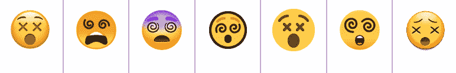

# Dev 101: Unicode

> 原文：<https://dev.to/lgranger/dev-101-unicode-20ah>

### 什么事？

Unicode 是由 Unicode Consortium 建立的编码集和字符标准。它是使用最广泛的标准，使国际化更容易，也是我们拥有表情符号的原因😍

### 我们为什么需要它？

如果您在互联网、桌面软件或移动应用程序上收集、显示、传输或以其他方式使用字符串，那么您需要对它们进行编码。Unicode 保持了最流行的标准，UTF-8[【1】](https://w3techs.com/technologies/cross/character_encoding/ranking)。理解它是成为一名合格开发人员的关键[【2】](https://www.joelonsoftware.com/2003/10/08/the-absolute-minimum-every-software-developer-absolutely-positively-must-know-about-unicode-and-character-sets-no-excuses/)。*(它也被认为是每个初级开发人员应该学习的 12 件事情之一[【3】](https://dev.to/ben/12-things-every-junior-developer-should-learn-lco))*如果不能理解和正确使用它，就会导致那些空盒子、奇怪的问号，以及对你和任何想使用你编写的代码的人的普遍挫败感。

### 哪里来的？

我们倒回去说说字母是从哪里来的。口语是我们人类发现如何在声音中编码意义的一种方式。如果我说“你好”，你会明白我在问候你。书面语言对这些声音进行编码，所以当我写“世界”时，你会明白我说的是我们的星球和全人类。前提是你能理解我所使用的口语和书面语。

如果你不懂我正在使用的语言，那么我的声音或符号的排列就毫无意义。计算机不理解人类语言，它们使用二进制运算。因此，如果我们想用计算机来收集、显示、传输或理解一种人类语言，我们必须用二进制来给它指令。

二进制和字符之间的编码使这成为可能。不同类型的计算机过去有不同的编码，这种方式工作得很好，直到我们想要在计算机之间共享信息。要做到这一点，我们需要有一个两台计算机共享的编码标准，以便在接收到一组二进制文件时，正确的字母可以显示或保存。1963 年，美国信息交换标准代码(ASCII)成为该标准。

ASCII 有大写字母、小写字母、标点符号、符号和控制代码。它缺少重音符号，如è，非美国符号，如或任何非拉丁字符，但它完成了任务。ASCII 码集是 128 个 8 位字符，剩下 128 个自由字符。这导致了预标准和标准编码的混合发展。前 128 个字符是 ASCII 标准，后 128 位由不同的组用来编码不同的符号和字母。

不同机器使用最后 128 个字符的方式会发生冲突，但这已经足够好了，ASCII 是三十年来的标准。对更多语言及其字符的支持导致了 Unicode 在 1991 年的发布。这些年来，Unicode 有了一些发展，从所有的 16 位字符发展到当前的标准 UTF 8，这是一种可变长度编码。

在 UTF 8 中，前 128 个字节就像 ASCII 一样。这意味着互联网上最常用的字符仍然只是每个字符使用一个字节。之后，字符不再局限于一个字节，而是可以是两个、三个或四个！让 ASCII 支持的字符集在 UTF-8 中占用最少的空间是有意义的，因为大多数互联网都使用 UTF-8 [(93%的网站)](https://w3techs.com/technologies/cross/character_encoding/ranking)，但它仍然让我们可以访问 Unicode 支持的所有其他字符。

那么 Unicode 有哪些做得不好的地方呢？大多数 Unicode 问题都与提供单个字符的 Unicode 有关，这些字符随后会根据其字体以不同的方式显示。不同但看起来相似的字符使得[同形异义词攻击成为可能](https://dev.to/logan/homographs-attack--5a1p)。中文、日文、&韩文都共享一个 Unicode 字符集，依靠不同的字体来区分每种语言显示这些字符的方式。在像阿拉伯语和越南语这样的语言中，单个字符用连字[连接起来形成字形](https://www.k-international.com/blog/what-is-unicode)，这意味着任何给定的字符看起来都可能不同，这取决于它所连接的字符(想想英语中的草书)。对于这些语言，Unicode 和字体是不够的，需要进行二次处理才能正确显示它们。

最后，但同样重要的是，新的国际语言表情符号甚至也受到字体问题的影响。表情符号[比过去的](https://slate.com/human-interest/2016/02/emojis-on-apple-google-samsung-can-look-very-different-from-each-other-video.html)更加一致，但是不同平台之间仍然存在差异。最显著的区别是晕眩的脸，在一些平台上读起来更像死亡。【T2

*总结*

*   你应该关心字符编码，因为这是我们在计算机上存储和显示语言的方式。
*   Unicode，特别是 UTF 8 是互联网上使用最广泛的字符编码。
*   它使用可变长度编码来快速加载我们最常用的内容，同时还为我们提供了超过 137，000 个其他字符。
*   Unicode 和之前的 ASCII 一样，只是字符编码，依赖字体来区分语言和表情符号风格。
*   表情符号是🎉 🙌🏼 💻 🔥 😍

*讨论*
你最喜欢的表情符号是什么？你最常用的表情符号是什么？当你使用它们时，它们对你意味着什么/你想对它们说什么？