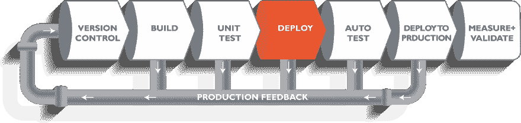

# 从开发到生产第 1 部分

> 原文：<https://dev.to/tech_sam/dev-to-production-part-1-ig9>

前几天，我只是躺在我的办公椅上，假装超级忙😉我正在为我们的一个 Spring-Boot 应用程序构建一个 [Jenkins](https://jenkins.io/doc/) 版本。我的同事刚好从那里经过，为了消磨时间，我问他:"你知道我现在在做什么吗?"他说你正在计划让钢铁侠回到地球。

你知道这不是真的。我问他你推你的代码之后会怎么样？。我是在推码之后才知道他没有意识到流程的。我想，为什么不写一个博客，向我无辜的同事、朋友和其他人解释，他们只是在推代码，等着拿到游戏结束的门票。所以人们只要拿把椅子，拿瓶啤酒，这就是最终游戏的开始。

很快我将在 [GitHub](https://github.com/Earth-43/Thanos) 更新源代码

从开发到发布到生产环境的整个生命周期被称为 CI/CD 管道，代表持续集成和持续交付。

### *【持续集成(CI)*

CI 是一种开发实践，它要求开发人员每天数次将代码集成到共享存储库中。然后，每个签入都由一个自动构建来验证，允许团队尽早发现问题。

### *【连续交货(光盘)】*

CD 是持续集成的自然延伸:在这种方法中，团队确保系统的每一个变化都是可发布的，我们可以按下按钮发布任何版本。持续交付的目的是让发布变得更快、更无聊，所以我们可以频繁地交付，并快速获得用户所关心的反馈。

> 持续集成和部署(CI/CD)管道是软件项目的一个非常重要的方面，它节省了大量手动的、容易出错的部署工作。它为持续集成、自动化测试和代码度量带来了更高质量的软件。最终，这有助于更好的软件更频繁地发布。

有太多的 CI/CD 产品可供使用，比如你可以通过软件即服务(SaaS)或自托管产品在云中使用的产品。托管解决方案的例子有 [CodeShip.io](https://codeship.com/) 和 [TravisCI](https://travis-ci.org/) ，自托管的例子有 [TeamCity、Jenkins](https://www.excella.com/insights/teamcity-vs-jenkins-better-continuous-integration-server) 和 [Thoughtworks Go](https://www.gocd.org/enterprise/) 。

要了解更多关于这个话题的信息，你可以阅读这篇文章。

由于这篇文章很长，我将在一系列博客中解释这里的一切，我们将在 Windows 和 Ubuntu 操作系统中配置 Jenkins，并为 Spring Boot 和 Angular 应用程序创建管道，或者如果你们感兴趣，可能为 React 创建管道。

我们将从头开始讨论整个过程，并详细讨论每个步骤，以便您对该过程有一个清晰的了解。

## **那都是乡亲们！**

感谢[莫哈纳·克里希纳](https://www.linkedin.com/in/mohan-nallapaneni/)的反馈。

我希望这篇文章对您了解 CI/CD 管道有所帮助。

敬请关注下一篇文章。

*在 [Medium](https://medium.com/@tech_sam) 和 [Dev.to](https://dev.to/tech_sam) 上关注我，获取关于科技的最新消息。*