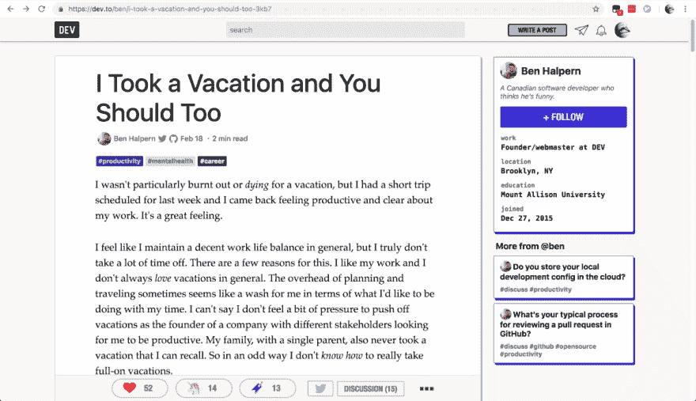
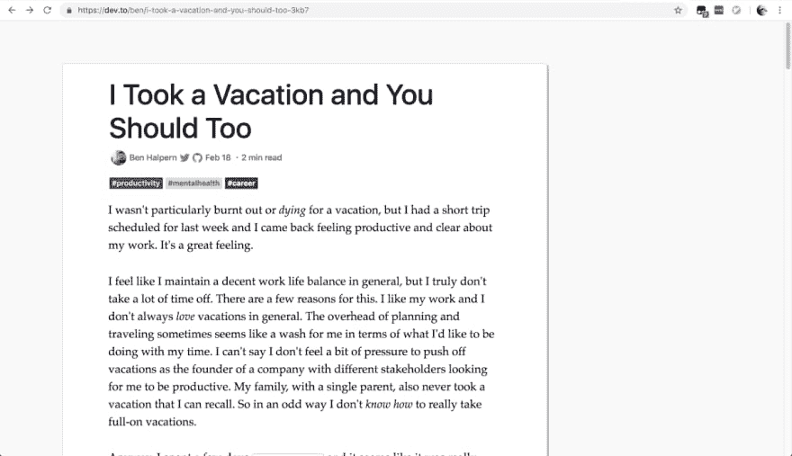

# 开发禅模式:用户脚本

> 原文：<https://dev.to/detunized/dev-zen-mode-userscript-12bd>

很长一段时间以来，当我阅读较长的文章时，我一直在阅读媒体的顶部和底部。在手机上尤其如此，大量宝贵的垂直阅读空间被各种各样的栏占据。现在看来 Medium 去掉了这些，读起来更好了。

DEV 也有类似的问题。我很容易被视觉噪音分散注意力，当我看到文本以外的东西时，我发现很难集中精力阅读。我可以忽略侧边栏，但是忽略底部的水平栏很困难，尤其是当它在中间截一行文本的时候。

所以这次我决定自动化这个过程，制作一个*用户脚本*，用键盘快捷键移除顶部、底部和侧边栏。欢迎来到[开发禅模式](https://github.com/detunized/dev-zen-mode)。安装它，在文章部分按下 Shift-Z，所有的框都会消失。再次按下相同的键将它们带回来。

要安装该脚本，您需要在浏览器中安装一个用户脚本管理器扩展。那将是 Chrome 的 [Tampermonkey](https://chrome.google.com/webstore/detail/tampermonkey/dhdgffkkebhmkfjojejmpbldmpobfkfo?hl=en) 或者 Firefox 的 [Greasemonkey](https://addons.mozilla.org/en-US/firefox/addon/greasemonkey/) 。

脚本本身可以在 [openuser.js](https://openuserjs.org/scripts/detunized/DEV_Zen_mode) 上获得。或者，也可以用 Tampermonkey/Greasemonkey 创建一个新脚本，并将文件格式 [GitHub](https://github.com/detunized/dev-zen-mode/blob/master/dev-zen-mode.user.js) 粘贴到其中。

该功能的核心并不难整合。对于普通的 JavaScript 来说，添加快捷键和隐藏一些元素是非常简单的。我确信代码还不是很健壮，可以从一些清理中受益。首先，我没有保存原始的`display`属性，只是假设它是空的。它不起作用，但是当 CSS 改变时可能会被破坏。

不过，我遇到了一个问题。我希望能够在用户离开页面时带回隐藏的元素。为了做到这一点，我试图找到一个当 URL 改变时触发的事件。令我惊讶的是，我在网上找到的所有东西都不起作用。我试图为 [`hashchange`事件](https://developer.mozilla.org/en-US/docs/Web/API/WindowEventHandlers/onhashchange)添加一个监听器，但是无法触发任何回调。过了一会儿，我放弃了，使用了我在 StackOverflow 上找到的一些[黑客](https://stackoverflow.com/a/18950690/362938)。

我真的很想看到这成为开发的一个功能。不一定要完全像这样，但某种阅读模式真的很好。我不是 web 开发人员，我不认为我有能力为代码库贡献这样的功能。有人感兴趣吗？=)

##  [失谐](https://github.com/detunized) / [开发-禅-模式](https://github.com/detunized/dev-zen-mode)

### 开发(开发到)禅阅读模式脚本

<article class="markdown-body entry-content container-lg" itemprop="text">

# 开发禅模式

这是一个用户脚本，它添加了一个键盘快捷键(Shift+Z)来切换 [DEV](https://dev.to) 上的顶部、底部和侧边栏。这改善了长文章的阅读体验。

更多详情请见[博客](https://detunized.net/posts/2019-02-19-dev-zen-mode-userscript/)或 [DEV](https://dev.to/detunized/dev-zen-mode-userscript-12bd) 。

## 许可证

这个库是在麻省理工学院许可下发布的。详见[执照](https://raw.githubusercontent.com/detunized/dev-zen-mode/master/LICENSE)。

</article>

[View on GitHub](https://github.com/detunized/dev-zen-mode)