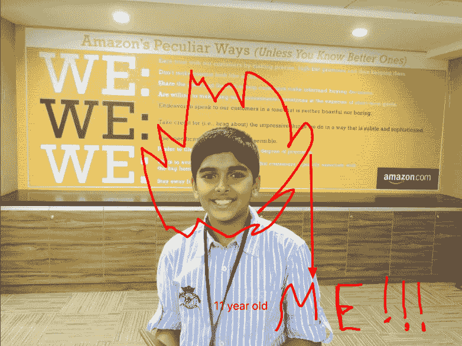
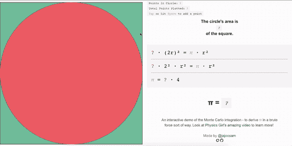
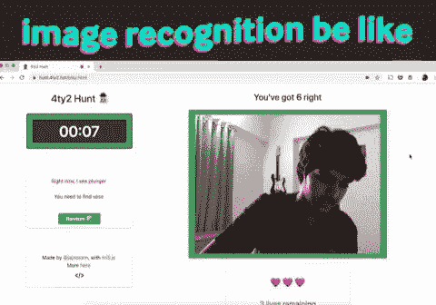

# 开发者聚焦:我们要从印度飞来一位新的实习生！

> 原文：<https://dev.to/katyadee/developer-spotlight-03-we-re-flying-out-a-new-intern-all-the-way-from-india-47i0>

## 我们又迎来了另一个开发者焦点！

 
*图片由[运球](https://dribbble.com/shots/3349688-Pixel-Cafe)* 提供

今天，我们采访了我们的暑期实习生 Samarth，她从印度远道而来，和我们一起在加州的旧金山工作。我们有很多真正活跃的社区成员，但 Samarth 的贡献几乎比任何人都大。从画廊到教程，Samarth 是我们最多产的用户之一。我们不得不说，我们对此非常感激。

**[@katyadee](https://dev.to/katyadee) :** 你知道 Repl.it 多久了？你怎么找到我们的？

**[@jajoosam](https://dev.to/jajoosam) :** 我前阵子在 [Hack Club](https://hackclub.com) Slack 上从 [@yev](https://twitter.com/yevbar?lang=en) 找到了 repl . it——那是我注册的时候。我想我当时 15 岁。

实际上我第一次尝试是因为教程挑战，从那以后我就一直在这里！

**[@katyadee](https://dev.to/katyadee) :** 因为这个原因，我喜欢我们的挑战——我觉得它们总是吸引新的人，否则他们可能不会使用这项服务。我们也从 Game Jam 中得到了很多优秀的新人。

你编码多久了？

**[@jajoosam](https://dev.to/jajoosam) :** 大约 4 年前我第一次开始编码。JavaScript 是我最喜欢的语言。它在任何地方都能工作*，并且是部署和与他人分享我所做的最简单的方式。尽管我 4 年前就开始学习编程，但直到 2 年后我才真正做出了一些东西。我在这里写了很多关于我的旅程[。](https://medium.freecodecamp.org/how-i-went-from-not-knowing-how-to-code-to-shipping-9-projects-in-9-months-all-before-my-15th-7ec3666072c3)*

 ***[@katyadee](https://dev.to/katyadee) :** 哇，这可真酷！我有美术背景，很多建议也适用于此——继续创作，继续阅读，走出去做。我也很喜欢你向杰夫·贝索斯伸出援手的故事。看起来你有吸引公司注意的记录！

这让我不禁想知道——在印度，学生的编程前景是怎样的？

**[@jajoosam](https://dev.to/jajoosam) :** 学校里的计算机科学并没有得到真正的重视——但我看到那些真正想做点什么的人在路上就想出了如何编码。有时候，人们学习如何编码只是因为这是一项需要开发的“聪明”技能——但最终并没有真正做出原创的东西并与人分享。

我试图通过在我的学校成立一个黑客俱乐部来对我学校的一些人产生一点影响，他们真的很喜欢 Repl.it，因为我们没有花时间设置东西，而是直接开始学习和制作！

**[@katyadee](https://dev.to/katyadee) :** 听到它没有被认真对待，我有点惊讶——我想这里也是一样，特别是因为我们缺少比较科学教师……但却有很多兴趣。有点混乱，不是吗？

你认为是什么导致了这种差异？

我认为计算机科学的学习部分被强调了很多，一旦人们真的做了一些东西，他们就会真正开始理解它的价值，并认真对待它。

**[@katyadee](https://dev.to/katyadee) :** 转圈回来一秒……你在 Hack Club 教人编程吗？那是什么感觉？你做哪种事情？

**[@jajoosam](https://dev.to/jajoosam) :** 是的，我教他们编码，很牛逼！最好的部分是看到他们自己对我们做的项目的理解。每个工作坊开始时，每个人都做相同的项目，但是到最后，我们有 10 个不同的东西。到目前为止，我们已经开发了 Chrome 扩展、网络应用(网络抓取)、聊天机器人(Whatsapp！)-还有 pico8 上的游戏。

**[@katyadee](https://dev.to/katyadee) :** 我最喜欢你的一点是你是如此多产和富有创造力。我很了解你在 Repl.it 上所做的工作，但现在似乎是曝光它的最佳时机！你最喜欢的项目是什么？

**[@jajoosam](https://dev.to/jajoosam) :** 太多了！这里是[的一个专用站点](https://www.notion.so/jajoosam/808dca2fbcfa460f893d4758526f525f)。

*编者按:请找出下面的前两名，但一定要查看完整的阵容[在这里](https://www.notion.so/jajoosam/808dca2fbcfa460f893d4758526f525f)。*

*   Mathe Carlo 是一个可探索的解释，玩家可以使用暴力的方法来发现圆周率。这是一个非常有趣的项目，让我用上了几年前在几何学中学到的东西！

*   4t 2 Hunt 是 repl.it 上的一个人工智能挑战赛的投稿——也是我做过的最有趣的事情之一。你真的要在房子里到处移动你的笔记本电脑来完成一个寻宝游戏！

**[@katyadee](https://dev.to/katyadee) :** 你什么时候开始和 Amjad 说话的？怎么会注意到你？

**[@jajoosam](https://dev.to/jajoosam) :** 哇，我不得不为此翻遍推特历史！我第一次发现 Amjad 在 Twitter 上谈论 repl.run，并分享了我和他一起做的一些东西[。从那时起，我开始更多地使用 Repl.it，当我见到 Repl.it/jobs,时，我给他发了电子邮件！我们安排了一次通话，我开始为 repl.it 制作教程！](https://libert-cli.jajoosam.repl.run/)

*编者按:[在这里查看@jajoosam 的部分教程](https://www.notion.so/808dca2fbcfa460f893d4758526f525f)*

**[@katyadee](https://dev.to/katyadee) :** 所以，你得到这个实习机会也就不足为奇了！背后有什么故事？

**[@jajoosam](https://dev.to/jajoosam) :** 看到这条[推文](https://twitter.com/amasad/status/1091844369282301952)和 DMd Amjad too apply 的时候才意识到 Repl.it took 实习生。他答应了！！这么多优秀的 Repl.it 用户实际上使用了我的作品，我非常兴奋，与 Repl.it 团队会面并飞往硅谷！在实习期间，我致力于为 repls 创建一个简单、安全的存储解决方案(从 HTML 开始！)，同时让 Repl.it 社区成为产品的一个更核心的特性！

**[@katyadee](https://dev.to/katyadee) :** 真见鬼，我能搞定！尤其是社区的东西！哈哈。这是你第一次实习吗？

**[@jajoosam](https://dev.to/jajoosam) :** 没有，不过是最刺激的一部！我之前在印度的一些初创公司实习过。[这是我三年前第一次实习时做的一个项目。😝](https://run.plnkr.co/plunks/frLvycFsEnMSzot2vwlk/)

**[@katyadee](https://dev.to/katyadee) :** 嘿，这还是个相当酷的节目。我想问…当你父母发现我们要带你飞去加州时，他们是什么感觉？

**[@jajoosam](https://dev.to/jajoosam) :** 他们为我超级兴奋，感到骄傲！也有一点担心，但这只是他们作为父母😉

**[@katyadee](https://dev.to/katyadee) :** 就是这些疯狂的故事之一。但这似乎是阿姆贾德的风格。我喜欢它。在我最喜欢的美国城市旧金山，你最期待做什么？

**[@jajoosam](https://dev.to/jajoosam) :** 在 Repl.it 制作东西当然，还有(希望！)去见一些我只在推特上见过的很棒的人！这太疯狂了-不敢相信我会在 5 天内到达那里！
如果你们有任何建议，打电话给我。*