# 开发人员对上周的回购进行总结

> 原文：<https://dev.to/devteam/devto-repo-recap-from-the-past-week-4cc3>

欢迎回到另一个回购回顾，我们将讨论上周对 dev.to 库和[iOS 回购](https://github.com/thepracticaldev/dev-ios)的贡献[。这一期涵盖 2 月 10 日至 2 月 16 日。](https://github.com/thepracticaldev/dev.to)

# 特性

*   [@菲尔纳什](https://dev.to/philnash)添加了他自己的 [`<web-share-wrapper>` web 组件](https://github.com/philnash/web-share-wrapper#readme)。它为在 Chrome Android 上分享帖子提供了更广泛的选择。谢谢菲尔。

    # [ 使用< web-share-wrapper >进行文章分享 #1524](https://github.com/thepracticaldev/dev.to/pull/1524) 

    [](https://github.com/philnash) **[philnash](https://github.com/philnash)** posted on [<time datetime="2019-01-12T03:44:40Z">Jan 12, 2019</time>](https://github.com/thepracticaldev/dev.to/pull/1524)

    ## 这是什么类型的公关？(勾选所有适用选项)

    *   [ ]重构
    *   [x]功能
    *   [ ]错误修复
    *   [ ]文档更新

    ## 描述

    这是在支持的平台上用 web 共享 API 替换共享链接的初步尝试。它使用了 [`<web-share-wrapper>`](https://www.npmjs.com/package/web-share-wrapper) ，这是一个定制元素，只有当网络共享 API 可用时才会接管(目前 Android 上有 Chrome，但 Safari 中也有[预览版)。](https://webkit.org/status/#?search=web%20share)

    一个问题:我不确定这是包含该模块的最佳方式。理想情况下，它应该放在供应商包中，但是我不知道如何把它放进去。任何帮助都将不胜感激。

    ## 相关车票&单据

    #399

    ## 手机&桌面截图/录音(如有 UI 改动)

    [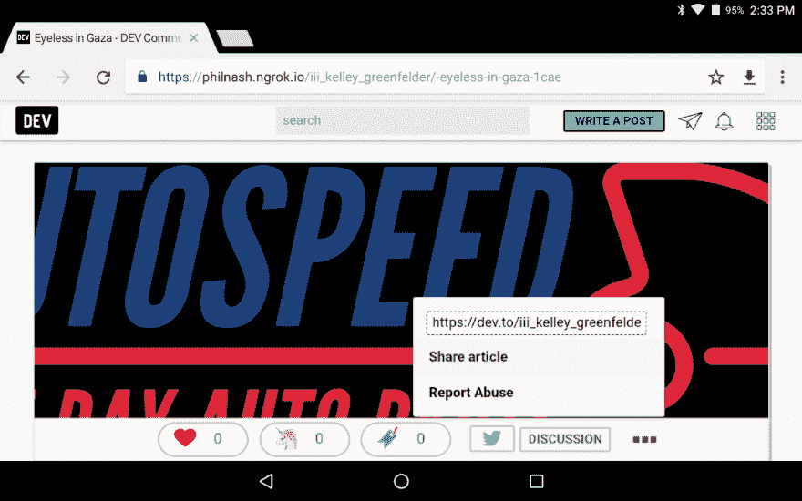 ](https://user-images.githubusercontent.com/31462/51068808-83d1e100-1677-11e9-82a1-82235a5ed930.png) [ 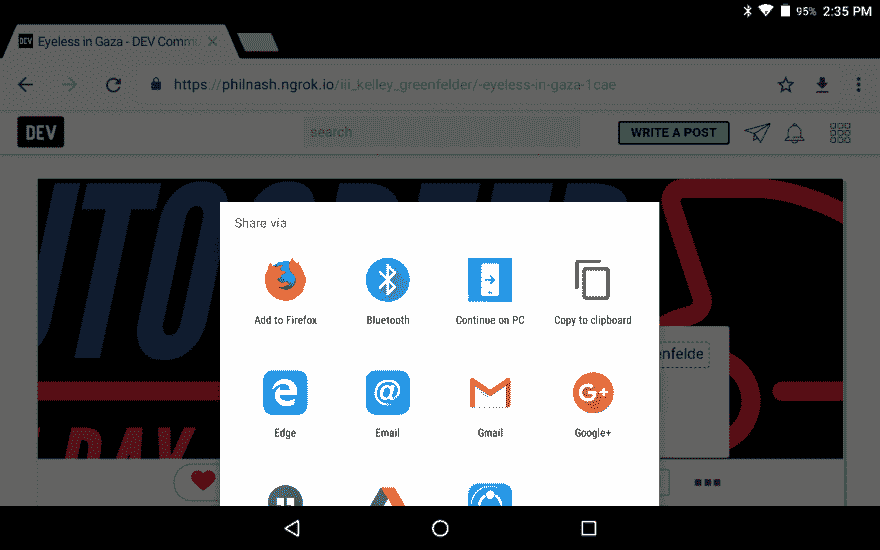](https://user-images.githubusercontent.com/31462/51068811-89c7c200-1677-11e9-8ae5-c3b6e20d0a05.png)

    ## 添加到文档中？

    *   [ ]文档开发到
    *   [ ]自述文件
    *   [x]不需要文档

    ## 【可选】哪个 gif 最能描述这个 PR 或者给你的感觉？

    [](https://camo.githubusercontent.com/302c491737e049fead78b88c10c0b510798af2f9/68747470733a2f2f6d656469612e67697068792e636f6d2f6d656469612f61745a4949384e6d62504777302f736f757263652e676966)

    [View on GitHub](https://github.com/thepracticaldev/dev.to/pull/1524)
*   [@seanmfox](https://dev.to/seanmfox) 做了一个 PR 在标签页显示标签版主。谢谢肖恩。

# [ 在标签页显示标签版主 #1739](https://github.com/thepracticaldev/dev.to/pull/1739) 

[](https://github.com/seanmfox) **[seanmfox](https://github.com/seanmfox)** posted on [<time datetime="2019-02-05T01:54:46Z">Feb 05, 2019</time>](https://github.com/thepracticaldev/dev.to/pull/1739)

## 这是什么类型的公关？(勾选所有适用选项)

*   [ ]重构
*   [x]功能
*   [ ]错误修复
*   [ ]文档更新

## 描述

每个标签页在左侧栏显示一个标签版主列表。格式与“组织”页面上的“会见团队”侧栏中使用的格式相匹配。

## 相关车票&单据

#1677

## 手机&桌面截图/录音(如有 UI 改动)

[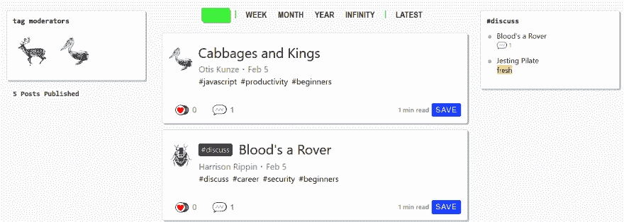](https://user-images.githubusercontent.com/32000565/52248833-3fc0ad80-28be-11e9-873f-300f854a0825.png)

[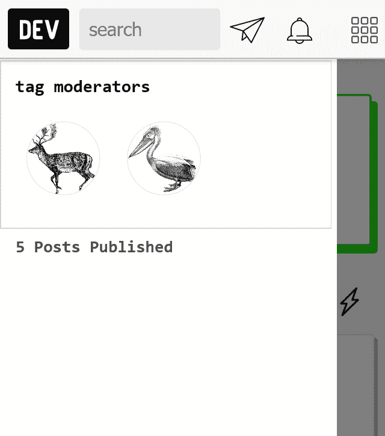](https://user-images.githubusercontent.com/32000565/52248898-8f06de00-28be-11e9-90d8-b616daaa91b4.png)

## 添加到文档中？

*   [ ]文档开发到
*   [ ]自述文件
*   [x]不需要文档

[View on GitHub](https://github.com/thepracticaldev/dev.to/pull/1739)

*   [@nikoheikkila](https://dev.to/nikoheikkila) 给乳齿象网址的`'rel'`标签添加了`'me'`值。更多详情请见 PR。谢谢， [@nikoheikkila](https://dev.to/nikoheikkila) ！

# [ 在个人资料  #1792](https://github.com/thepracticaldev/dev.to/pull/1792) 上的乳齿象 URL 的“rel”标签中添加“me”值

[](https://github.com/nikoheikkila) **[nikoheikkila](https://github.com/nikoheikkila)** posted on [<time datetime="2019-02-12T18:20:42Z">Feb 12, 2019</time>](https://github.com/thepracticaldev/dev.to/pull/1792)

你好。<g-emoji class="g-emoji" alias="wave" fallback-src="https://github.githubassets.cimg/icons/emoji/unicode/1f44b.png">👋</g-emoji>

## 这是什么类型的公关？(勾选所有适用选项)

*   [ ]重构
*   [x]功能
*   [ ]错误修复
*   [ ]文档更新

## 描述

尝试我在这里的第一次贡献。我注意到，当你在个人资料上设置乳齿象 URL 时，链接不包含`rel=me`属性。这是乳齿象实例识别实例和 dev.to 之间的链接是真实的所必需的。这应该能解决问题。

## 相关车票&单据

没有。

## 手机&桌面截图/录音(如有 UI 改动)

没有用户界面变化。通过研究从源代码生成的乳齿象 URL 来验证这个特性。

## 添加到文档中？

*   [ ]文档开发到
*   [ ]自述文件
*   [x]不需要文档(可能？)

## 【可选】哪个 gif 最能描述这个 PR 或者给你的感觉？

[](https://camo.githubusercontent.com/055d2e34071893843b1af364894afb1e57dd6c97/68747470733a2f2f6d656469612e67697068792e636f6d2f6d656469612f3561765a7a58537859536637792f67697068792e676966)

[View on GitHub](https://github.com/thepracticaldev/dev.to/pull/1792)

*   [@glennmen](https://dev.to/glennmen) 增加了 GitHub PR 液态标签支持，这也是你看到这些新的 GitHub PR 嵌入的原因！谢谢， [@glennmen](https://dev.to/glennmen) ！

# [ 新增 GitHub PR 液态标签支持 #1784](https://github.com/thepracticaldev/dev.to/pull/1784) 

[](https://github.com/Glennmen) **[Glennmen](https://github.com/Glennmen)** posted on [<time datetime="2019-02-11T18:39:37Z">Feb 11, 2019</time>](https://github.com/thepracticaldev/dev.to/pull/1784)

## 这是什么类型的公关？(勾选所有适用选项)

*   [ ]重构
*   [x]功能
*   [ ]错误修复
*   [ ]文档更新

## 描述

通过 markdown 中的 liquid 标签添加对 Github pull 请求的支持。``

这是我第一次设置 Ruby 环境，并在 Ruby 中进行实际开发，所以请告诉我，我是否应该以不同的方式来做事情。

我还修复了几个预提交错误，奇怪的是抛出的错误来自我没有编辑的部分。所以我假设很多人用`--no-verify`跳过提交前检查。无论如何，我无法修复的唯一错误是这一部分，因为它将解析 html 而不是在代码块中显示它:[https://github . com/thepracticaldev/dev . to/blob/7c 369 facf 183 FB 236 f 47333 e 0 Fe 913 e 565 b 12d 2 a/app/views/pages/_ editor _ guide _ text . html . erb # L192-L194](https://github.com/thepracticaldev/dev.to/blob/7c369facf183fb236f47333e0fe913e565b12d2a/app/views/pages/_editor_guide_text.html.erb#L192-L194)

## 相关车票&单据

关闭#1760

## 手机&桌面截图/录音(如有 UI 改动)

[](https://user-images.githubusercontent.com/11406433/52585069-18c12900-2e34-11e9-8dd3-878220c069fa.png)

## 添加到文档中？

*   降价编辑器中的[x]帮助选项卡
*   [ ]文档开发到
*   [ ]自述文件
*   [ ]不需要文档

## 【可选】哪个 gif 最能描述这个 PR 或者给你的感觉？

[](https://camo.githubusercontent.com/59186e83b51b9d6043259b6476651d085030ec02/68747470733a2f2f6d656469612e67697068792e636f6d2f6d656469612f316771445155614c65336d43632f67697068792e676966)

[View on GitHub](https://github.com/thepracticaldev/dev.to/pull/1784)

*   我们已经取消了对测试版用户上传视频的限制。访问您的[仪表盘](https://dev.to/dashboard)上传帖子。公关由 [@ben](https://dev.to/ben) :

# [ 取消苛刻的视频限制，增加视频时长 #1811](https://github.com/thepracticaldev/dev.to/pull/1811) 

[](https://github.com/benhalpern) **[benhalpern](https://github.com/benhalpern)** posted on [<time datetime="2019-02-16T20:01:18Z">Feb 16, 2019</time>](https://github.com/thepracticaldev/dev.to/pull/1811)

## 这是什么类型的公关？(勾选所有适用选项)

*   [ ]重构
*   [x]功能
*   [ ]错误修复
*   [ ]文档更新

## 描述

删除视频权限角色，并替换为检查帐户年龄。还为文章添加了一个视频持续时间属性，并添加了从 s3 文件获取视频持续时间的代码。

[View on GitHub](https://github.com/thepracticaldev/dev.to/pull/1811)

# Bug 修复/其他贡献

*   [@aspittel](https://dev.to/aspittel) 用 v1 编辑器修复了几个 bug。谢谢你，阿里！总结一下:
    *   多次点击提交帖子会发送多个请求，
    *   一个允许 v1 编辑器预填充标签的 bug 如果你访问，比如:`https://dev.to/new/githunt`，
    *   and bug that prevented front matter errors from rendering.

        # [Bug/多篇存 v1 编辑 #1791](https://github.com/thepracticaldev/dev.to/pull/1791) 

        [](https://github.com/aspittel) **[aspittel](https://github.com/aspittel)** posted on [<time datetime="2019-02-12T17:44:01Z">Feb 12, 2019</time>](https://github.com/thepracticaldev/dev.to/pull/1791)

        ## 这是什么类型的公关？(勾选所有适用选项)

        *   [ ]重构
        *   [ ]功能
        *   [x]错误修复
        *   [ ]文档更新

        ## 描述

        如果已经按下提交按钮，则提前退出提交功能。

        ## 相关车票&单据

        [https://github.com/thepracticaldev/dev.to/issues/1770](https://github.com/thepracticaldev/dev.to/issues/1770)

        ## 手机&桌面截图/录音(如有 UI 改动)

        ## 添加到文档中？

        *   [ ]文档开发到
        *   [ ]自述文件
        *   [x]不需要文档

        ## 【可选】哪个 gif 最能描述这个 PR 或者给你的感觉？

        [](https://camo.githubusercontent.com/57e18411cf6e26d75ce73643db5ede493684ffd7/68747470733a2f2f6d656469612e67697068792e636f6d2f6d656469612f32367566664473426238704d5169324e472f67697068792e676966)

        ```
        </div>
        <div class="gh-btn-container"><a class="gh-btn" href="https://github.com/thepracticaldev/dev.to/pull/1791">View on GitHub</a></div> 
        ```

        Enter fullscreen mode Exit fullscreen mode

        # [  Bug/v1 编辑标签 #1793](https://github.com/thepracticaldev/dev.to/pull/1793) 

        [](https://github.com/aspittel) **[aspittel](https://github.com/aspittel)** posted on [<time datetime="2019-02-12T18:58:34Z">Feb 12, 2019</time>](https://github.com/thepracticaldev/dev.to/pull/1793)

        ## 这是什么类型的公关？(勾选所有适用选项)

        *   [ ]重构
        *   [ ]功能
        *   [x]错误修复
        *   [ ]文档更新

        ## 描述

        添加条件，以便 V1 编辑器可以有预填充的模板标签

        ## 相关车票&单据

        [https://github.com/thepracticaldev/dev.to/issues/1769](https://github.com/thepracticaldev/dev.to/issues/1769)

        ## 手机&桌面截图/录音(如有 UI 改动)

        ## 添加到文档中？

        *   [ ]文档开发到
        *   [ ]自述文件
        *   [x]不需要文档

        ## 【可选】哪个 gif 最能描述这个 PR 或者给你的感觉？

        [](https://camo.githubusercontent.com/85f184bd1b5f481e284f582d1fbf66797f3484f1/68747470733a2f2f6d656469612e67697068792e636f6d2f6d656469612f336f3645693066574f7731695137396430412f67697068792e676966)

        [View on GitHub](https://github.com/thepracticaldev/dev.to/pull/1793)

        # [ 编辑视图  #1797](https://github.com/thepracticaldev/dev.to/pull/1797) 上仍呈现编辑器有 frontmatter 错误

        [](https://github.com/aspittel) **[aspittel](https://github.com/aspittel)** posted on [<time datetime="2019-02-13T18:27:33Z">Feb 13, 2019</time>](https://github.com/thepracticaldev/dev.to/pull/1797)

        ## 这是什么类型的公关？(勾选所有适用选项)

        *   [ ]重构
        *   [ ]功能
        *   [x]错误修复
        *   [ ]文档更新

        ## 描述

        如果您在 v1 编辑器的编辑视图的 frontmatter 中有一个错误，它将抛出一个 500，而不是呈现带有错误的编辑器。这个解决了这个问题。如果抛出一个错误，那么我们在 v1 编辑器中，所以我们渲染它。这个`has_frontmatter?`方法只在模板中被调用:

        ```
          <% unless @article.has_frontmatter? %>
        ```

        Enter fullscreen mode Exit fullscreen mode

        ## 相关车票&单据

        [https://github.com/thepracticaldev/dev.to/issues/625](https://github.com/thepracticaldev/dev.to/issues/625)

        ## 手机&桌面截图/录音(如有 UI 改动)

        ## 添加到文档中？

        *   [ ]文档开发到
        *   [ ]自述文件
        *   [x]不需要文档

        ## 【可选】哪个 gif 最能描述这个 PR 或者给你的感觉？

        [](https://camo.githubusercontent.com/f5339c244f953ae6bcc387792945e3e1de4947ab/68747470733a2f2f6d656469612e67697068792e636f6d2f6d656469612f78543949674e505662477361305764386c692f67697068792e676966)

        [View on GitHub](https://github.com/thepracticaldev/dev.to/pull/1797)

        *   [@lightalloy](https://dev.to/lightalloy) refactored a few pieces of code. Thanks, Anna! Pr titles say it all:

            # [  Clear unused organization # resave _ articles method   # 1802](https://github.com/thepracticaldev/dev.to/pull/1802) 

            [](https://github.com/lightalloy) **[lightalloy](https://github.com/lightalloy)** Posted on [<time datetime="2019-02-14T12:02:42Z">FEB14, 2019</time>](https://github.com/thepracticaldev/dev.to/pull/1802)What kind of public relations is this? (Check all that apply)

            *   [X] Refactor

            ## Description

            This method is saved in the code base, so that the existing job will not fail. Now all the old jobs should have run, so we can delete this method.

            [View on GitHub](https://github.com/thepracticaldev/dev.to/pull/1802)

        # [ 除去无用的除去阿果索引上的文章消灭 #1807](https://github.com/thepracticaldev/dev.to/pull/1807) 

        [](https://github.com/lightalloy) **[lightalloy](https://github.com/lightalloy)** posted on [<time datetime="2019-02-15T07:06:30Z">Feb 15, 2019</time>](https://github.com/thepracticaldev/dev.to/pull/1807)

        ## 这是什么类型的公关？(勾选所有适用选项)

        *   [x]重构

        ## 描述

        当一个物品被销毁时，`trigger_delayed_index`是无用的，因为`trigger_delayed_index`运行`after_destroy`，所以这个检查`record.&persisted?`总是假的，`record.delay.remove_from_index!`没有被执行。一篇文章实际上是从`before_destroy_actions` ( `remove_algolia_index`)的索引中删除的。这个 pr 去掉了无用的代码，使逻辑更容易理解。

        ## 相关车票&单据

        与#1641 相关，虽然这个 pr 没有提供任何修复。

        [View on GitHub](https://github.com/thepracticaldev/dev.to/pull/1807)

        # [ 减少文章评论的 sql 查询数量#1606  #1766](https://github.com/thepracticaldev/dev.to/pull/1766) 

        [](https://github.com/lightalloy) **[lightalloy](https://github.com/lightalloy)** posted on [<time datetime="2019-02-08T11:29:12Z">Feb 08, 2019</time>](https://github.com/thepracticaldev/dev.to/pull/1766)

        ## 这是什么类型的公关？(勾选所有适用选项)

        *   [x]重构

        ## 描述

        加载文章评论时消除 N+1。

        ## 相关车票&单据

        #1606

        ## 添加到文档中？

        *   [x]不需要文档

        [View on GitHub](https://github.com/thepracticaldev/dev.to/pull/1766)

        *   @maestromac 修复了一个代码块的水平滚动条不可点击的问题。谢谢你，麦克！

        # [【UI】修复滚动条重叠的 bug  #1540](https://github.com/thepracticaldev/dev.to/pull/1540) 

        [](https://github.com/maestromac) **[maestromac](https://github.com/maestromac)** posted on [<time datetime="2019-01-14T21:27:44Z">Jan 14, 2019</time>](https://github.com/thepracticaldev/dev.to/pull/1540)

        ## 这是什么类型的公关？(勾选所有适用选项)

        *   [x]错误修复

        ## 描述

        删除了两个 CSS 行来修复一个 UI 错误。我需要另一双眼睛来确认我没有在其他地方弄坏任何东西。

        ## 相关车票&单据

        解决#1332

        ## 手机&桌面截图/录音(如有 UI 改动)

        [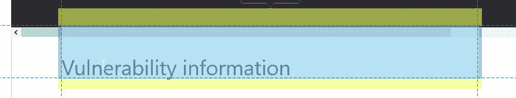](https://user-images.githubusercontent.com/9059487/50056275-e2af4380-0127-11e9-89e2-1e36fdb31943.png) 之前 [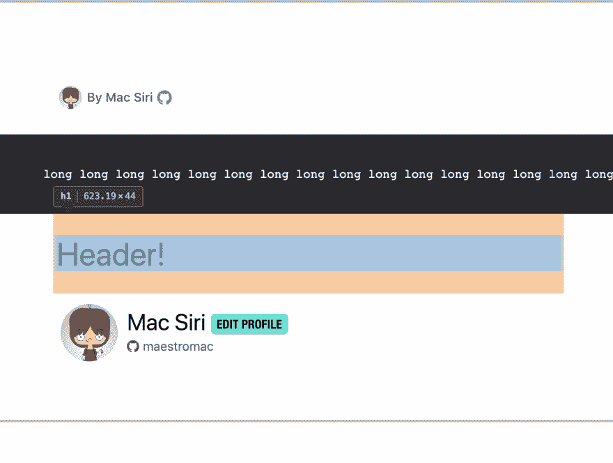之后](https://user-images.githubusercontent.com/15793250/51142092-eb736200-1818-11e9-9d6c-9076ff583a8b.png)

        ## 添加到文档中？

        *   [x]不需要文档

        ## 【可选】哪个 gif 最能描述这个 PR 或者给你的感觉？

        [](https://camo.githubusercontent.com/404f37a228d54b686d845a243e1df71007b95fab/68747470733a2f2f692e67696665722e636f6d2f37374d332e676966)

        [View on GitHub](https://github.com/thepracticaldev/dev.to/pull/1540)

        # 新的问题和讨论

        *   [@sarthology](https://dev.to/sarthology) 提出了一个可以用`ctrl + s`保存帖子的功能。谢谢， [@sarthology](https://dev.to/sarthology) ！

        # [ 用户按下 ctrl+s# 1772](https://github.com/thepracticaldev/dev.to/issues/1772)时保存帖子

        [](https://github.com/sarthology) **[sarthology](https://github.com/sarthology)** posted on [<time datetime="2019-02-10T06:44:21Z">Feb 10, 2019</time>](https://github.com/thepracticaldev/dev.to/issues/1772)

        **您的功能请求是否与某个问题相关？请描述一下。有时我在写文章的时候不小心按了 ctrl+save。它打开浏览器默认的保存命令，想知道我们是否可以改变这一点。**

        **使用这个可以修复的简单片段来描述您想要的解决方案**

        ```
        document.addEventListener("keydown", function(e) {
          if (e.keyCode == 83 && (navigator.platform.match("Mac") ? e.metaKey : e.ctrlKey)) {
            e.preventDefault();
            // Save post instead...
          }
        }, false);
        ```

        Enter fullscreen mode Exit fullscreen mode

        使用这个可以停止默认事件。也许你们可以在这里触发保存帖子功能。

        不确定是不是 bug <g-emoji class="g-emoji" alias="thinking" fallback-src="https://github.githubassets.cimg/icons/emoji/unicode/1f914.png">🤔</g-emoji>

        [View on GitHub](https://github.com/thepracticaldev/dev.to/issues/1772)

        *   [@_bigblind](https://dev.to/_bigblind) 请求在选择个人资料背景和文本颜色时提供对比指导的功能。谢谢@大盲！

        # [ 对用户资料背景/文字颜色给予对比指导 #1774](https://github.com/thepracticaldev/dev.to/issues/1774) 

        [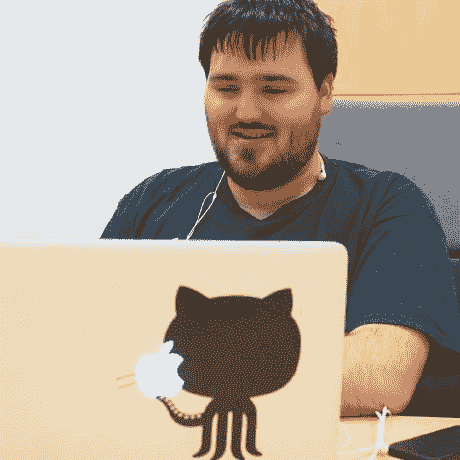](https://github.com/bigblind) **[bigblind](https://github.com/bigblind)** posted on [<time datetime="2019-02-11T02:20:44Z">Feb 11, 2019</time>](https://github.com/thepracticaldev/dev.to/issues/1774)

        **您的功能请求是否与某个问题相关？请描述一下。**

        查看[此配置文件]，follow 按钮上的文本对比度很低。这些颜色来自文本颜色和背景颜色设置。我们能给用户一些选择对比色的指导吗？

        **描述您想要的解决方案**

        当用户输入两种颜色时，我们测量它们的[对比度](https://contrast-ratio.com/)并反馈给用户。

        **描述你考虑过的替代方案**

        我们甚至可以禁止特定对比度下的组合。仅仅给出一个预览可能也是有用的。既然这样，为什么不把这些字段做成`input type=color`？

        [View on GitHub](https://github.com/thepracticaldev/dev.to/issues/1774)

        *   [@aligoren](https://dev.to/aligoren) 在你的设置页面打开了一个关于编辑器版本字段的讨论:“是否应该使用下拉菜单来选择编辑器版本？”谢谢@阿里戈伦！

        # [ 编辑器版本选择要用下拉菜单吗？ #1775](https://github.com/thepracticaldev/dev.to/issues/1775) 

        [](https://github.com/aligoren) **[aligoren](https://github.com/aligoren)** posted on [<time datetime="2019-02-11T06:39:54Z">Feb 11, 2019</time>](https://github.com/thepracticaldev/dev.to/issues/1775)

        **您的功能请求是否与某个问题相关？请描述一下。**

        在我看来，总是写编辑版很烦。我不确定，但如果有版本号 99，用户将不得不写 v99。

        除此之外，`select`标签可能会很有用。

        **描述您想要的解决方案**

        我认为我们可以用如下选择元素来改变输入元素:

        ```
        <label for="user_editor_version">Editor version: v1 or v2</label>
        <select name="user[editor_version]" id="user_editor_version">
            <option value="v1">v1</option>
            <option value="v2">v2</option>
        </select>
        ```

        Enter fullscreen mode Exit fullscreen mode

        css 也将如此

        ```
        width: 650px;
        max-width: calc(100% - 30px);
        padding: 12px;
        font-size: 19px;
        border: 1px solid #dee6e9;
        border-radius: 3px;
        ```

        Enter fullscreen mode Exit fullscreen mode

        **描述你考虑过的替代方案**

        如果有两个版本，另一个选择是单选按钮。

        **附加上下文**

        我用 Chrome 的开发工具用 select 标签修改了输入。

        它看起来像下面；

        [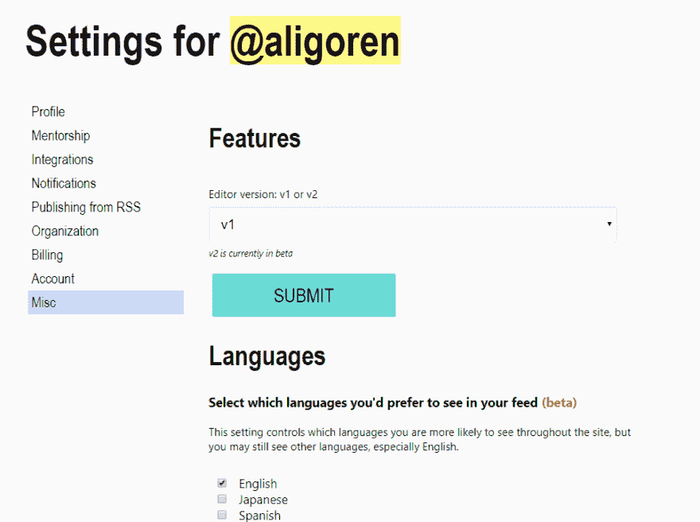](https://user-images.githubusercontent.com/4205423/52548794-b3901800-2de0-11e9-91cf-480c44932e2e.png)

        在这个例子中，我使用 select 标签更改了我的编辑器版本。

        [View on GitHub](https://github.com/thepracticaldev/dev.to/issues/1775)

        *   [@ it asine](https://dev.to/itsasine)报告了一个错误，如果你过滤阅读列表，帖子是`SAVE`而不是`SAVED`。谢谢，[@ it asine](https://dev.to/itsasine)！

        # [ 过滤阅读列表  #1785](https://github.com/thepracticaldev/dev.to/issues/1785) 后，帖子会被保存而不是被保存

        [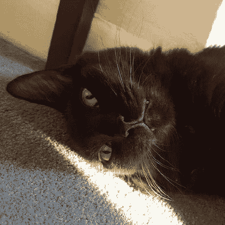](https://github.com/ItsASine) **[ItsASine](https://github.com/ItsASine)** posted on [<time datetime="2019-02-12T03:16:49Z">Feb 12, 2019</time>](https://github.com/thepracticaldev/dev.to/issues/1785)

        **描述 bug** 我知道还有其他关于 SAVE/SAVED 的问题，但这个问题对于它自己的帖子来说似乎足够独特了。过滤阅读列表时，帖子上的按钮不处于保存状态。

        **重现**:

        *   导航到阅读列表
        *   选择边栏上的一个标签

        **预期**:

        *   文章在已保存内容列表中被标记为已保存

        **实际**:

        *   文章按钮被保存，就好像它们不在阅读列表中

        **截图** [](https://user-images.githubusercontent.com/11020425/52607583-bd4b6700-2e44-11e9-8c9a-fbda80dc0724.png)

        **桌面(请填写以下信息):**

        *   OS: Chrome 操作系统
        *   浏览器:铬
        *   版本:71.0.3578.127

        [View on GitHub](https://github.com/thepracticaldev/dev.to/issues/1785)

        *   [@lightalloy](https://dev.to/lightalloy) 报告了一个错误，当您在播客上提交评论时，页面不会立即显示您的评论。

        # [ 提交播客评论后页面不更新 #1788](https://github.com/thepracticaldev/dev.to/issues/1788) 

        [](https://github.com/lightalloy) **[lightalloy](https://github.com/lightalloy)** posted on [<time datetime="2019-02-12T12:56:52Z">Feb 12, 2019</time>](https://github.com/thepracticaldev/dev.to/issues/1788)

        **描述 bug**

        **重现**重现行为的步骤:

        1.  前往一个[播客单集页面](https://dev.to/developertea/how-we-construct-software--part-two-beliefs-and-models-)
        2.  填写意见表
        3.  点击提交或按下`Ctrl+Enter`
        4.  “提交”按钮改变颜色，表格变得模糊不清(当提交评论时)。
        5.  表单保持不变，注释不出现在页面上。
        6.  刷新后，评论出现在页面上。

        **预期行为**提交后，评论出现在页面上，评论表单返回到其“新鲜”状态(提交按钮变回原来的颜色，文本区被清除)

        **截图** [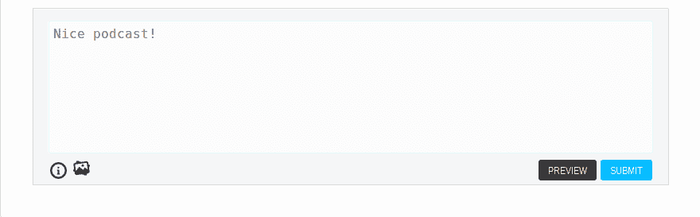](https://user-images.githubusercontent.com/30115/52636586-1f0bdf80-2ede-11e9-834d-ff919fffc27c.png)

        **桌面(请填写以下信息):**我检查过 Firefox 和 Chrome，但假设浏览器没有问题，原因如下:

        **附加上下文**我已经注意到开发环境中的这个错误。

        ```
        NoMethodError - undefined method `receive_notifications' for #<PodcastEpisode:0x00007fdc223ae340>:
          app/models/notification.rb:50:in `send_new_comment_notifications'
          app/controllers/comments_controller.rb:69:in `create' 
        ```

        所以代码需要更新以适应`PodcastEpisode`注释。

        [View on GitHub](https://github.com/thepracticaldev/dev.to/issues/1788)

        *   [@12vanblart](https://dev.to/12vanblart) 报告了一个错误，在你的阅读列表中，页脚与左侧边栏重叠。谢谢，@12vanblart！

        # [ 页脚与左手导航卡 #1794](https://github.com/thepracticaldev/dev.to/issues/1794) 

        [](https://github.com/12vanblart) **[12vanblart](https://github.com/12vanblart)** posted on [<time datetime="2019-02-12T21:09:40Z">Feb 12, 2019</time>](https://github.com/thepracticaldev/dev.to/issues/1794)

        **描述 bug** 在一个大小为 1305x842 的 Chrome 窗口中，我滚动到“我的阅读列表”的底部，页脚与左手卡片重叠。【T2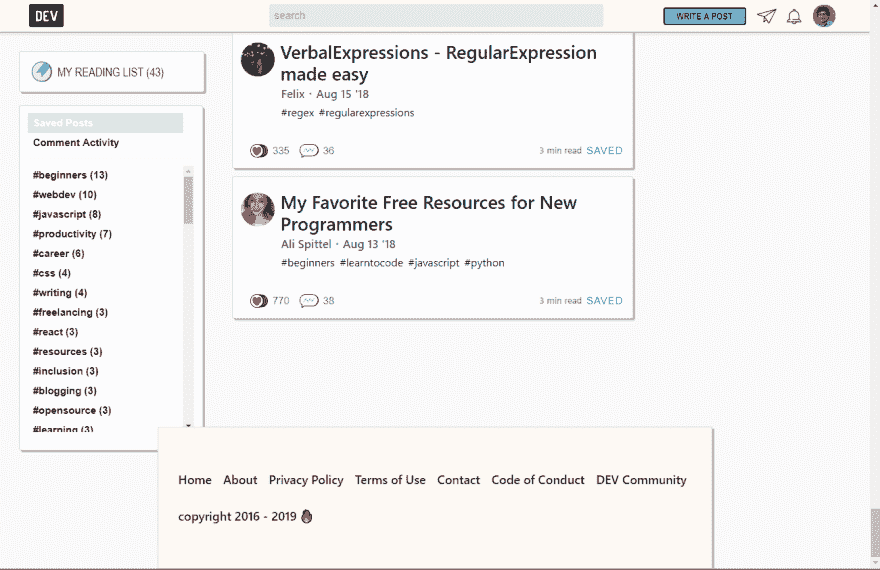

        **重现**重现行为的步骤:0。(将窗口大小调整到大约 1305 x 842)

        1.  转到“我的阅读列表”
        2.  向下滚动到页面底部(尽可能向下)
        3.  参见重叠

        **预期行为**我不确定最好的处理方式是什么，但可能是通过缩小页脚卡的宽度来匹配中间列的宽度。

        **桌面(请填写以下信息):**

        *   操作系统:Windows
        *   浏览器浏览器
        *   版本 72.0.3626.96

        [View on GitHub](https://github.com/thepracticaldev/dev.to/issues/1794)

        *   我报告了一个错误，首页上的文章只有向下滚动才能加载。这种情况似乎发生在装有 Windows 10 的 Chrome 上。如果你也看到了这个错误，请随意添加评论。谢谢，我！

        # [ 首页的帖子要向下滚动  #1805](https://github.com/thepracticaldev/dev.to/issues/1805) 才能加载

        [](https://github.com/Zhao-Andy) **[Zhao-Andy](https://github.com/Zhao-Andy)** posted on [<time datetime="2019-02-14T18:35:30Z">Feb 14, 2019</time>](https://github.com/thepracticaldev/dev.to/issues/1805)

        当转到主页时，有时第一篇文章下面的文章直到你向下滚动才载入。页面简单的挂起，看起来是这样的: [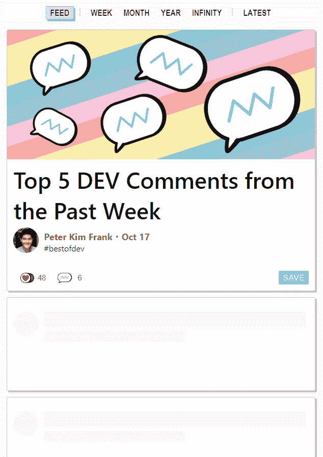](https://user-images.githubusercontent.com/17884966/52808675-6f10b080-305c-11e9-88d5-dd69c5beef6a.png)

        Windows 10，Chrome 上好像也是这样。可能相关的扩展是 uBlock 起源。

        我认为我们用 Algolia 加载帖子，所以可能会有一些 JS 是由滚动触发的。虽然不是 100%确定。

        [View on GitHub](https://github.com/thepracticaldev/dev.to/issues/1805)

        *   [@jf1](https://dev.to/jf1) 请求了一个可以查看您的反应历史的功能。谢谢，@j-f1！

        # [ 允许查看你的心(❤️)和独角兽(🦄)历史 #1806](https://github.com/thepracticaldev/dev.to/issues/1806) 

        [](https://github.com/j-f1) **[j-f1](https://github.com/j-f1)** posted on [<time datetime="2019-02-14T19:26:21Z">Feb 14, 2019</time>](https://github.com/thepracticaldev/dev.to/issues/1806)

        **您的功能请求是否与某个问题相关？请描述一下。**我希望能够用<g-emoji class="g-emoji" alias="unicorn" fallback-src="https://github.githubassets.cimg/icons/emoji/unicode/1f984.png">来标记帖子🦄</g-emoji>把它们留到以后用，而不必放在我的阅读清单里。

        **描述你想要的解决方案**最好能有一份我已经 <g-emoji class="g-emoji" alias="heart" fallback-src="https://github.githubassets.cimg/icons/emoji/unicode/2764.png">❤️</g-emoji> 编辑或<g-emoji class="g-emoji" alias="unicorn" fallback-src="https://github.githubassets.cimg/icons/emoji/unicode/1f984.png">的帖子列表🦄</g-emoji>编辑，以便我以后参考

        描述你考虑过的备选方案也许是一个单独的清单，我读完之后可以把它们保存起来？

        **附加上下文**不适用

        [View on GitHub](https://github.com/thepracticaldev/dev.to/issues/1806)

        *   @stereobooster 报告了一个他们经常看到离线屏幕的问题。如果您也遇到这种情况，请告诉我们。谢谢， [@stereobooster](https://dev.to/stereobooster) ！

        # [ 不断看到离线画面 #1810](https://github.com/thepracticaldev/dev.to/issues/1810) 

        [](https://github.com/stereobooster) **[stereobooster](https://github.com/stereobooster)** posted on [<time datetime="2019-02-16T16:07:03Z">Feb 16, 2019</time>](https://github.com/thepracticaldev/dev.to/issues/1810)

        **描述 bug**

        打开了文章的直接链接，看到了离线界面。`Cmd` + `R`没帮上忙。我一直在线。唯一有帮助的是完全移除 ServiceWorker 并重新加载页面。

        **重现**重现行为的步骤:

        1.  打开开发人员发布的任何链接

        **预期行为**如果浏览器在线，没有离线屏幕

        **截图**不适用

        **桌面(请填写以下信息):**

        *   操作系统:苹果 OS X
        *   浏览器浏览器
        *   版本版本 71.0.3578.98(正式版)(64 位)

        **附加上下文**不适用

        [View on GitHub](https://github.com/thepracticaldev/dev.to/issues/1810)

        # 开发-iOS

        我们最近没有任何新的问题或 PRs 合并。请随意查看 [iOS 回购](https://github.com/thepracticaldev/dev-ios)，或者在 App Store 下载[我们的 iOS 应用。](https://itunes.apple.com/us/app/dev-community/id1439094790)

        感谢阅读！让我知道你对 PRs 新格式的看法。下周见！