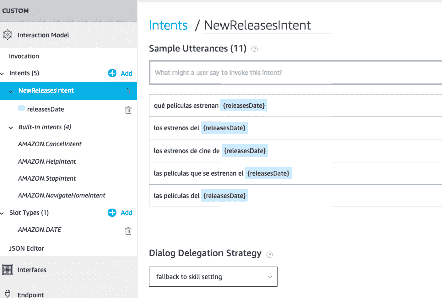
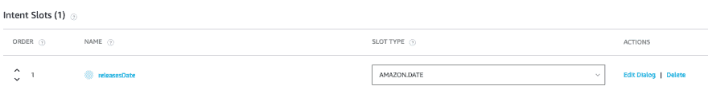
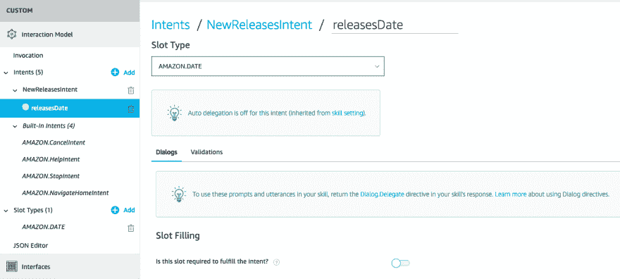
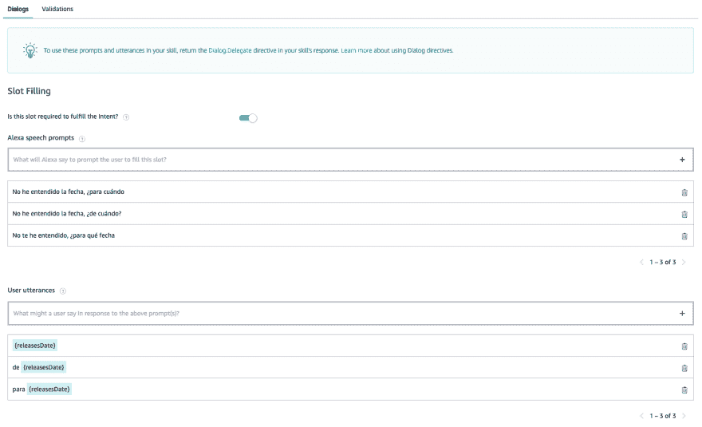

# 对话框管理

> 原文：<https://dev.to/kini/dialog-management-en-alexa-slots-obligatorios-3hl1>

如果您不知道对话管理的这方面内容，我建议您先阅读[我关于概念和一些基本资源的帖子](https://dev.to/kini/dialog-management-en-alexa-introduccion-y-referencias-2dpb-temp-slug-1175086):)

* * *

以我的技能[电影明星](https://www.amazon.es/Kinisoftware-Estrenos-de-cine/dp/B07MKCLZ62/ref=sr_1_1?s=alexa-skills&ie=UTF8&qid=1545905661&sr=1-1)我使用亚马逊式的插槽。DATE 收集用户想咨询明星的日期。

在[中，他讲述如何创建该插槽并在背面收集其值](https://kinisoftware.com/creando-un-custom-skill-para-alexa-vi-anadiendo-un-slot-a-nuestro-intent/)的其中一个帖子指出，必须考虑到我们可以达到“null”值。这种情况发生在 Alexa 在一个用户的授意下确定意图，但无法填充该插槽以将意图请求发送回。通过研究 Alexa Developer Console 和官方文档，我找到了解决方案。

Alexa 为我们提供了一种简化收集、验证和确认插槽值的方法。为此，我们需要做两件事:创造他们所说的‘t0’对话模式和[将对话委托给 Alexa](https://developer.amazon.com/docs/custom-skills/delegate-dialog-to-alexa.html) 。这让我简化了背码让 Alexa 做得更好。

## 把对话委托给 Alexa

在开始对话模型的定义之前，我将告诉您如何设置对话委托给 Alexa。你可以在[官方的医生](https://developer.amazon.com/docs/custom-skills/delegate-dialog-to-alexa.html#ways-to-delegate-the-dialog-to-alexa)中看到更多深入的东西，我将只专注于教我所需要的使用案例的步骤。

将对话委托给 Alexa 有两种方式:自动或[手动](https://developer.amazon.com/docs/custom-skills/delegate-dialog-to-alexa.html#manual-delegation-scenarios)。自动格式是针对 Alexa 将使用 dialog model 在对话中前进的简单情况而设计的，没有必要的后端代码。手动方式更灵活，允许您在运行时做出决策，但在后台使用代码。

Alexa 开发者控制台需要做的是[配置您要用于技能的委托策略](https://developer.amazon.com/docs/custom-skills/delegate-dialog-to-alexa.html#configure-delegation)，然后在必要时将其更改为具体的意图级别。

对于我来说，我需要使用我们稍后将定义的对话模式的自动代表团。默认情况下，每个技能都已启用此类型的委托，您可以在控制台中查看。

在*无脸部分，我们会看到一个列表，其中包含*自动委派*选项，该选项必须为我们要做的事而启用。说明到目前为止，所有技能都是以*自动委派*的默认启用技能级别来提供的。*

对于我们需要此授权的意图，我们不需要做任何事情，因为默认情况下，它将使用在技能级别定义的策略。如果我们希望拥有手动授权，我们可以指明这一点，它将优先于在技能级别配置的内容。

## 定义对话框模型

设置我们技能的第一步已经准备就绪。现在，为了让 Alexa 知道如何控制对话的步骤，我们需要[定义对话模式](https://developer.amazon.com/docs/custom-skills/define-the-dialog-to-collect-and-confirm-required-information.html)。

我们可以将对话框模型看作是基本意图模型的扩展，它将帮助 Alexa 收集、验证和确认插槽和尝试值。model 对话框将特别允许我们配置必需的插槽，为插槽中的值定义验证规则，并控制插槽级别和尝试级别的确认。

在此文章中，我将重点讲述如何配置一个强制插槽。我会写更多的帖子，在那里我会讲述对话模式给我们带来的其他东西。

### 配置强制插槽

在电影明星技能中，我们有一个亚马逊. DATE 类型的插槽，让用户指出他们想知道放映电影的时间段。我们将设置对话框 model，以便在 Alexa 将意图请求发送回之前，该插槽必须具有值。

为此，我们必须通过单击 *Edit Dialog* 操作进入意图内的插槽编辑屏幕。在此屏幕上，我们将拥有定义对话框模型所需的所有选项，该对话框模型分为两个块:“对话框”(如果需要和需要确认)和“验证”。

对于此帖子，我们只需启用插槽是完成意图所必需的选项。点击切换开关*是否需要此插槽来满足意图？*我们启用了 Alexa 在这种情况下将使用的对话模式版本。

我们需要定义两件事:

*   **Alexa 的语音提示**是 Alexa 将用来提示用户输入插槽值的问题。它们可以随意定义和使用。请记住使用有关插槽类型和上下文的问题。
*   **【用户饲料】**是用户对上述问题的回答。在此，我们使用与意图中的螺帽相同的规则，并定义螺帽的插槽部分。

关于更详细的信息，我在此留下了与官方文件的链接，用于对话模式的这一部分。

* * *

使用 Alexa 对话模型中的这一功能并使您的技能更加强大，而不必在后面增加复杂性，这是相当简单的。我事后发现的，现在看起来很基本。你可以通过强迫 Alexa 进行对话来测试你在模拟器上的技巧如何工作，用不完整的夹具，或者不用【不到后面就用。**我推荐使用**饲料分析仪。并且，如果你愿意的话，你可以用 JSON 模型同样地定义一切。

在下面的对话管理文章中，我们将看到如何告诉 Alexa，我们希望在将请求发送回之前确认插槽的价值或确认整个意图:)