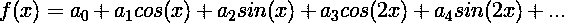
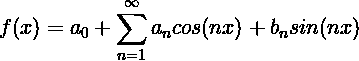
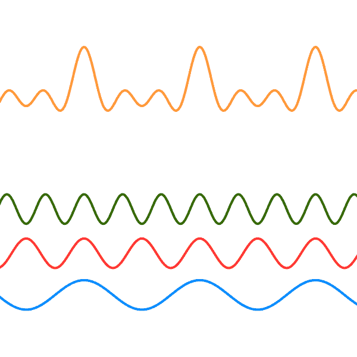

# 数字音乐和自拍:让·巴普蒂斯特·约瑟夫·傅立叶的遗产

> 原文：<https://dev.to/shikaan/digital-music-and-selfies-the-legacy-of-jean-baptiste-joseph-fourier-co0>

让·巴普蒂斯特·约瑟夫·傅立叶是历史上最著名的数学人物之一，这是有充分理由的:他是调和分析(也称为傅立叶分析)之父。我们将了解这是为什么我们可以播放音乐、分享图像，甚至拥有回声消除耳机或进行声音搜索的原因。

> 最初发布于[Full-Stack with Benefits](https://withbenefits.dev/digital-music-and-selfies-fourier)
> 照片由 [Tim Marshall](https://unsplash.com/photos/yEOCA6oiVqg?utm_source=unsplash&utm_medium=referral&utm_content=creditCopyText) 于 [Unsplash](https://unsplash.com/search/photos/wave?utm_source=unsplash&utm_medium=referral&utm_content=creditCopyText) 发布

# 一点历史

和他那个时代的许多科学家一样，他是一个完全的数学家:他的工作跨越了数学、热力学、化学直到工程学。

他还对“埃及描述”做出了贡献，尽管我不确定埃及学是否属于完全堆叠的数学范畴…

在他的科学生涯中，他也是法国大革命的重要成员，是为拿破仑·波拿巴服务的忠诚的人。就在那个时候，他被要求解决一个影响武装部队的非常实际的问题:我们如何在非常繁忙的战斗中冷却枪支并保持其可用性？

这导致了傅立叶定理(及其副产品傅立叶变换)，这正是计算机和高科技小发明处理音乐和图像的方式。

## 是啊，暖枪真的和浴室自拍有关…

傅立叶的基本思想简单而又聪明:热波——不管它们有多复杂——可以分解为基本波的总和。

尽管这是一个聪明的直觉，傅立叶并没有用现代严格的术语 [1](#fn1) 来证明它。然而，他的运气并不好。

将周期函数分解成更小的初等函数可以追溯到公元前 3 世纪，当时托勒密天文学试图解释行星的运动。此外，研究热波可能与周期函数有关的想法并不完全是新的:欧拉、d'Alambert 和丹尼尔·伯努利提出了一些热问题的解决方案，这些解决方案只在热源的行为类似于基本波时才适用。

无论如何，在一百年后，整个问题将由狄利克雷和黎曼完全解决，他们将把这些碎片放在一起，给调和分析一个适当的数学基础。

事实上，这样的数学基础正是我们可以在那个领域之外使用傅立叶结果的原因:热波只是…波，所以只要给定的信号可以变成波，我们就可以应用傅立叶的结果来研究它们。

现在，你在物理课上无聊透顶的时间变得有意义了:最终形成图像的光和声音都是波。因此，它们可以用傅立叶定理来分析。

# 傅立叶分析

首先:从数学的角度来看，信号可以被认为是函数。因此，在下文中，作为谐波分析的一种常见做法，我们将互换使用“功能”和“信号”。

傅立叶工作背后的整个想法是将“任何给定的函数”[【2】](#fn2)重写为基本周期块的总和。你还记得高中时，你能想到的最基本的周期是正弦或余弦，这些小块通常被称为*振荡。*

因此，在傅立叶术语中，所有信号都可以写成

其中系数可以被认为是我们想要在给定区间上表示的函数的平均值。这样的间隔被称为*周期*并且恰好是振荡的周期。

振荡分解背后的关键思想如下:你越想精确，你就越需要对振荡求和。因此，提高精度的方法是对无限个块求和。数学中的无穷和被称为*级数*，这是给定函数的*傅立叶级数*的形状:

我们忽略的一个细节是，上述内容适用于周期信号。当信号不是周期性的时会发生什么？幸运的是，上述内容在一定程度上仍然成立，这种推广被称为*傅立叶变换。*我们不打算深入探讨这个问题。

## 快速举例

一个简单的方法就是思考音乐会发生什么。为便于论证，我们假设钢琴发出的每个音符都可以表示为正弦波 [3](#fn3) 。当你弹奏一个和弦时——即更多的音符和一次——你会产生一个由所有这些波叠加而成的波。

 *顶波(和弦波)是底音符波(音符波)的总和*

你得到的是一个复合信号，最终由基本信号的和给出。弦波的峰值(黄色的)发生在所有三个节点波都处于其峰值时，而相比之下弦波的底部都没有那么低:这是因为不存在三个节点波同时处于其底部的时刻。

# 日常生活中的应用

现在，你可能想知道如何将无限的事物相加，会导致一个非无限的，因此有意义的结果。这个问题在数学中相当普遍，它被称为*收敛*，不幸的是，由于它的复杂性，无法在本文中处理。

然而，这里可以观察到一件非常明显的事情:为了使这个和不趋向于无穷大(即*发散*，我们需要变得越来越小的块。这又意味着总和中的一些项包含了表示原始信号所需的大部分信息。

这最后一个观察是 Spotify，Shazam，Instagram，甚至你 iPhone 的吉他调音器应用程序或降噪耳机成为可能的原因。

事实上，当你通过 Spotify 播放你的音乐时，你并没有完全按照它被录制的样子来听歌。为了提供连续的数据流并保持曲目播放，而无需提前下载，Spotify 应用了一种压缩算法，旨在将文件大小减少到足以实时播放。

这个算法的作用是:

*   发现与人类可听频谱末端或之外的频率相关的振荡，并将其消除；

*   去除不包含大量信息的振荡，即序列的“其余部分”。

同样的原理也适用于 Shazam、SoundHound 甚至 Siri 和谷歌助手:当你提供一个声音输入时，这些软件需要对其进行清理，例如，删除超出人类平均语音频谱的频率，并消除微小的振荡。然后进行实际的搜索，比较输入和数据集之间相同振荡的系数。

降噪耳机的工作原理相同:它们有一个麦克风，可以记录环境声音并计算振动。然后他们翻转振动，这样你周围的声音就会产生无声的波动。最终，他们将这种翻转波注入你的混音中，这样你的音乐之外的频率就听不见了。

对于图像，事情变得有点棘手，因为在这种情况下，我们必须谈论二维傅里叶变换，因为图像信号跨越两个维度。然而，基本的想法是一样的:当我们在 Instagram 上分享一张照片时，一种算法将图像分块，并对每个像素应用我们在上面看到的同一种近似。这一次，计算发生在像色谱和亮度这样的事情上，生活在我们感知边界的元素被扔掉了。

## 结论

每次你在 Instagram 上看到你妹妹的浴室自拍照，或者在 Spotify 上听艾德·希兰的歌，现在你知道该怪谁了。你认为在事后，傅立叶会传播这些知识吗？

下次见！

* * *

1.  但这不是他的错:那时我们对积分和函数都没有明确的定义。事实上，从现代的角度来证明傅立叶定理是不可能的。 [↩](#fnref1)

2.  从数学角度来说，这是大错特错的。不幸的是，我们生活在一个有缺陷的世界里，在那里，工程师们大部分时间都带着这种假设，我们满足于近似的解决方案。 [↩](#fnref2)

3.  实际上，每一个音符都是正弦波的总和。在我们看来，构成一个音符声音的一组波叫做谐波系列，单个波叫做谐波。 [↩](#fnref3)