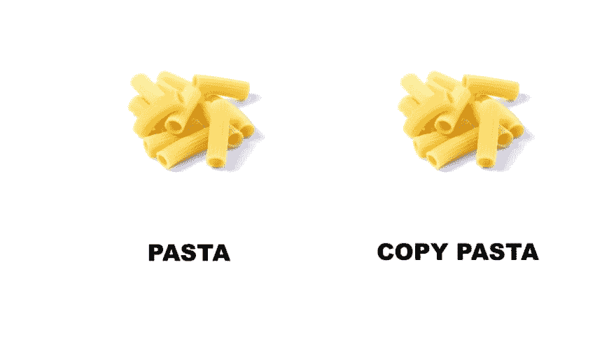
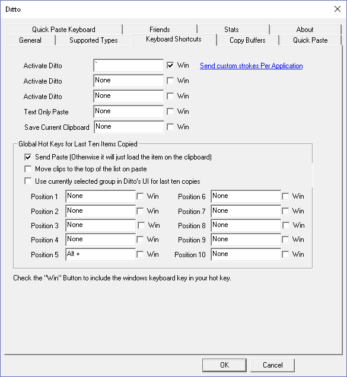

# 同上，救了我的剪贴板管理器

> 原文：<https://dev.to/dejavo/ditto-the-clipboard-manager-that-saved-me-1j8h>

 *原载于[中](https://medium.com/@dvirsegal/ditto-the-clipboard-manager-that-saved-me-967c6dd7651a)2019 年<time title="Thursday, May 16, 2019, 06:14:01 AM">5 月 16 日</time>* 

复制粘贴是你每天在电脑上工作时都会做的事情之一。通过这样做，每次你投资了你日常事务的一小部分。

比方说，你想从一个网站上与朋友分享一张照片\文本\什么的，你复制它，或者右击它并将其复制到剪贴板，或者使用 Ctrl+C，然后将其粘贴到你最喜欢的共享应用程序，这样做后，你意识到你想再次与他人分享它。不幸的是，数据已经不在你的剪贴板上了，现在你不得不费力地爬回网页，从头再做一遍。我相信你对那种情况很熟悉。

](https://res.cloudinary.com/practicaldev/image/fetch/s--B-ksQe1H--/c_limit%2Cf_auto%2Cfl_progressive%2Cq_auto%2Cw_880/https://cdn-images-1.medium.com/max/800/0%2AUWZyPY_V2vKOyqZB.jpg)

[*来了，同上*](https://ditto-cp.sourceforge.io/) 来救援了。一个开源的*超级*工具，托管在 [SourceForge](https://sourceforge.net/projects/ditto-cp/) 上，它通过收集我的剪贴板历史节省了我**很多**时间。它通过各种功能增强了 Windows 剪贴板的复制粘贴体验，如果您确保将它们融入到您的日常工作中，您可以提高您的工作效率。

或者，正如 Ditto 主页上提到的:

> Ditto 是标准 windows 剪贴板的扩展。它保存放在剪贴板上的每个项目，允许您在以后访问其中的任何项目。Ditto 允许你保存任何类型的信息，可以放在剪贴板上，文本，图像，HTML，自定义格式…

#### 入门

只需[下载](https://sourceforge.net/projects/ditto-cp/files/Ditto/3.22.20.0/DittoSetup_3_22_20_0.exe/download)并安装同上。该工具在后台运行，当使用 Windows 复制功能将内容复制到剪贴板时，Ditto 将所有复制的数据收集到它的日志中。

然后，通过单击系统托盘中的图标或按下预定义的热键(默认情况下配置为 Crtl +`)打开 Ditto。

打开后，双击或按回车键，从列表中选择您想要粘贴到您的工作的适当范围的项目，如下图所示:

#### 日常使用和功能

Ditto 的开发者 [sabrogden](https://sourceforge.net/u/sabrogden/profile/) 提到的特性列表:

*   搜索并粘贴以前的副本条目
*   保持多台电脑的剪贴板同步
*   数据通过网络发送时会被加密
*   从托盘图标或全局热键访问
*   通过双击、回车键或拖放来选择条目
*   粘贴到除标准复制/粘贴条目以外的任何窗口中
*   在列表中显示复制图像的缩略图
*   完全 Unicode 支持(外来显示字符)
*   UTF 8 支持语言文件(创建任何语言的语言文件)
*   使用 SQLite 数据库([www.sqlite.org](http://www.sqlite.org/))

我最喜欢的功能是使用搜索选项；您可以查找每个记录中包含的文本或使用通配符，甚至支持使用正则表达式(对于我们中的勇士)；我每天都用它。

](https://res.cloudinary.com/practicaldev/image/fetch/s--P7KzNoVk--/c_limit%2Cf_auto%2Cfl_progressive%2Cq_auto%2Cw_880/https://cdn-images-1.medium.com/max/800/0%2AMFQwryVQ3QLi-YKE.jpg)

此外，我将默认热键重新配置为(Win key +` ),我发现使用 Win 键更舒适、更恰当。

Ditto 允许配置保存副本的最大数量，复制条目的到期时间，基本上，你可以根据需要调整它的行为。我喜欢深色主题和为显示的文本选择任何字体的选项(我使用 [hack](https://sourcefoundry.org/hack/) 字体)。

此外，高级用户可以使用 IP 或计算机名配置在同一网络上的计算机之间共享他的剪贴板项目。另一个有用的功能是可以选择将一个记录标记为粘性剪辑，这样你就可以将最重要的记录放在顶部\底部；为此定义一个热键是有帮助的。也支持组复制；您可以将几个片段组合在一起，并添加预定义的快捷键来一次拷贝它们。

其中一个工具警告是当使用密码管理器时，即使是一个确保在复制粘贴密码后立即删除剪贴板的工具。这意味着任何复制的密码都将保留在 Ditto 的日志中，直到通过手动删除或达到保存的副本数来明确删除它们。降低该风险的方法是通过 Windows 的防火墙配置阻止 Ditto 访问网络，从而阻止其流量。

总的来说，如果你想提高打字效率，那就安装 Ditto，你不会后悔的。