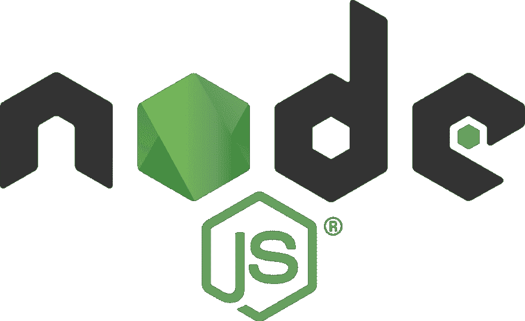

# 分而治之:使用分布式队列扩展 Node.js 应用程序

> 原文：<https://dev.to/bnevilleoneill/divide-and-conquer-scale-your-node-js-app-using-distributed-queues-1p2j>

在之前的文章中，我谈到了如何在 Node.js 中运行后台任务/作业(特别是使用新的 *worker_threads* 模块)。但是，如果达到运行 Node.js 实例的机器的极限，会发生什么呢？然后，您需要转移到更大的机器(称为垂直扩展)或水平扩展。垂直缩放总是有限制的，所以在某些时候，你需要水平缩放。

但是怎么做呢？例如，如果您的应用程序是一个需要立即发送响应的 web 服务器，那么您需要一个类似负载平衡器的东西。相比之下，如果您的应用程序需要完成工作，但不要求立即完成，那么您可以将工作分散到“worker”节点，并使用队列进行分配。

一些用例包括生成每日报告、每天为用户重新计算内容(例如推荐)、处理用户上传的内容(例如大型 csv 文件、在用户迁移到服务时导入数据、在用户登录时导入数据)。

分布式队列类似于作业描述的存储，其中包含足够的信息来完成作业，或者足够的信息来计算出完成作业所需的所有内容。例如:

[https://medium . com/media/52490 c 66225 e 57669738 c 3818 b4e 629 f/href](https://medium.com/media/52490c66225e57669738c3818b4e629f/href)

通常，主应用程序(或更复杂系统的任何部分)将作业放入队列中。在不同机器上运行的其他应用程序连接到队列并接收这些作业。这些消费者能够利用收到的信息来处理工作，或者至少他们能够找出他们需要的所有信息并获得它们。这种简单的架构具有重要的优势:

*   您的应用程序现在分为两个逻辑部分，可以分布在不同的机器上
*   您可以从一个工作人员扩展到多个工作人员，而无需接触任何代码，也不会中断主应用程序的执行。队列负责通过网络将作业发送给工人，并且在大多数实现中，负责将相同的作业发送给工人一次

注意:对于队列(主题、通道)、作业(任务、消息)和工作人员(消费者)，每个供应商都有自己的行话。

### 自己动手？

您可能会想，您可以用现有的数据库自己实现这个体系结构，而不会增加系统的复杂性。您可以创建一个包含两列的“jobs”表，一列是*“id”*主键列，另一列是*“data”*列，其中包含所有的作业信息。主应用程序只向表中写入数据，每隔 X 秒，工作人员从表中读取数据，以查看下一个要执行的作业。为了防止其他工作线程读取该作业，您在一个事务中执行该操作，同时从表中删除该作业。

瞧啊。问题解决了，对吧？嗯，首先，你是每 X 秒查询等待一次。这并不理想，但在基本用例中是可以的。更重要的是，问题是，如果工人在处理作业时崩溃，会发生什么？当作业被从表中取出时，它已经被删除了，我们无法恢复它…这个问题(以及其他问题)已经被为这个问题实现的库和服务很好地解决了，您不必重新发明轮子。

### 使用队列服务的理由

队列系统的一个优点是它们如何处理错误场景。当您收到一个作业时，该作业不会从队列中删除，而是被“锁定”或对其他工作人员不可见，直到发生以下情况之一:工作人员在工作完成后将其删除，或者您可以配置超时。因此，如果一个工作线程崩溃，就会发生超时，作业会返回队列供其他工作线程使用。当一切正常时，一旦数据得到处理，工人就删除作业。

如果问题出在工人身上(机器关闭、资源耗尽等等)，那就太好了，但是如果问题出在处理作业的代码上，而每次队列将它发送给工人时，工人就会崩溃，那该怎么办呢？

那我们就陷入了失败的无限循环中，对吗？不，分布式队列通常有一个配置选项来设置最大重试次数。如果达到最大重试次数，那么根据队列，您可以配置不同的东西。一个典型的调整是将这些作业移动到“失败队列”中进行人工检查，或者为只是通知错误的工人消耗它。

分布式队列实现不仅非常适合处理这些错误，而且它们使用不同的机制将作业尽快发送给工作人员。一些实现使用套接字，另一些使用 HTTP 长轮询，还有一些可能使用其他机制。这是一个实现细节，但我想强调的是，实现起来并不简单，所以您最好使用现有的和经过实战检验的实现，而不是实现您自己的实现。

### 作业数据中要放什么

很多时候，我发现自己不知道应该在工作数据中放入什么。答案取决于您的用例，但它总是归结为两个原则:

*   **不要放太多。**您可以放入作业数据的数据量是有限的。有关更多信息，请检查您正在使用的排队系统。通常，它足够大，我们不会达到极限，但有时我们会忍不住放得太多。例如，如果您需要处理一个大的 CSV 文件，您不能将它放入队列中。您需要首先将其上传到存储服务，然后使用文件的 URL 和您需要的附加信息(如上传文件的用户等)创建一个作业。
*   **不要放得太少。**如果您有不可变的数据(如创建日期)或很少改变的数据(如用户名)，您可以将其放入您的工作数据中。这项工作应该在几秒钟或几分钟内完成，所以通常情况下，放一些可能会改变的数据是可以的，比如用户名，但是如果没有更新到一秒钟，这并不重要。您可以将查询保存到数据库，或者完全删除任何查询。但是，如果有影响数据处理方式的信息，您应该在作业处理器中进行查询。

### 让你的工作变得小而快

如果你需要处理大量的数据，把它们分成小块。如果您必须处理一个大的 CSV 文件，首先，将它分成一定行数的块，并为每个块创建一个作业。这样做有几个好处:

*   数据将被更快地处理，因为它可以被并行处理
*   你能更好地利用你的资源。让一个工人做较小的工作，比让一个工人做繁重的加工工作，而其他人闲置或未被充分利用要好
*   与失败的大作业相比，重试失败的小作业也更快、更高效

如果您需要来自所有这些小块的聚合结果，您可以将所有中间结果放在数据库中，当它们都完成时，您可以在另一个队列中触发一个聚合结果的新作业。这本质上是 map/reduce。“映射”是将一个大任务划分为较小任务的步骤，然后*“缩减”*是汇总这些较小任务的结果的步骤。

如果你不能预先划分你的数据，你仍然应该在小的工作中做处理。例如，如果您需要使用一个使用游标对结果进行分页的外部 API，那么预先计算所有游标是不切实际的。您可以为每个作业处理一页结果，一旦作业被处理，您将光标移至下一页，并使用该光标创建一个新作业，因此下一个作业将处理下一页，依此类推。

### 延期作业

分布式队列的另一个有趣的特性是，您通常可以延迟作业。通常这是有限制的，所以你不能推迟两年工作，但是在一些用例中这是有用的。一些例子包括:

*   您希望向注册的用户发送欢迎电子邮件，但不是立即发送，而是稍后发送。只需创建一个发送电子邮件的延迟作业
*   当处理一个任务时，你达到了一个 API 的速率限制。您可能会被告知速率限制何时结束，以便您可以将作业放回队列，但会延迟该特定时间
*   一般来说，如果你想在未来的某个特定时间触发某件事，比如安排备份、通知、提醒等…

### 工作优先级

大多数队列实现不保证作业的执行顺序，所以不要依赖于此。但是，他们通常会实现某种方式来优先处理某些工作。这在很大程度上取决于实现，所以如果需要的话，看看你正在使用的系统的文档，看看你如何能实现它。

### 显示代码

让我们看一些例子。尽管所有的排队系统都有相似的特性，但是它们没有一个通用的 API，所以我们将看到一些不同的例子。

#### **英库库**

Kue 是 automatic(Wordpress 背后的公司)开发的一个不错的库，它在 Redis 上实现了一个排队系统。Redis 是一个可以持久化的内存数据库，很多时候已经用于应用程序中的会话存储。因此，选择这个库是显而易见的。此外，即使你还没有使用 Redis，也有一些云提供商可以让你轻松地启动一个托管 Redis 服务器(例如 Heroku 或 AWS)。最后，使用 kue 的另一个好处是，您的栈是 100%开源的，因此您不会陷入任何供应商锁定。

如果你需要处理大量的工作，并且你仍然想要一个开源解决方案，那么我会选择 [RabbitMQ](https://www.rabbitmq.com/) 。在本文的例子中，我没有选择它，因为 Redis 通常更容易设置，也更常见。然而 RabbitMQ 是专门为这些用例设计的，所以从设计上来说，它在技术上更胜一筹。

让我们看看如何使用 kue 来创建和消费工作。

**创建队列并在其上放置一个作业:**

[https://medium . com/media/3 de 817 a 51 D4 ca 216484492178 fbea 57 e/href](https://medium.com/media/3de817a51d4ca216484492178fbea57e/href)

**消耗队列中的作业:**

[https://medium . com/media/9 EEC 5954 f 6536 a 162 B2 DD 42 b 84552 b 35/href](https://medium.com/media/9eec5954f6536a162b2dd42b84552b35/href)

#### **Azure 使用其服务总线**

微软 Azure 提供两种队列服务。这里有一个很好的对比。我选择使用服务总线，因为它保证一个作业最多被交付给一个工人。

让我们看看如何使用服务总线创建和消费作业。

#### **创建队列并在其上放置作业**

使用 Microsoft Azure，我们可以使用 createTopicIfNotExistsmethod 以编程方式创建队列。一旦创建完毕，我们就可以开始发送消息了:

[https://medium . com/media/aa 69a 2518 EC 3 EAD 2c 24 ADC 179 ef 8969d/href](https://medium.com/media/aa69a2518ec3ead2c24adc179ef8969d/href)

#### **消耗队列中的作业**

像这样的一些实现是创建订阅所必需的。查看 [Azure 文档](https://docs.microsoft.com/en-us/azure/service-bus-messaging/service-bus-nodejs-how-to-use-topics-subscriptions)了解关于该主题的更多信息:

[https://medium . com/media/DBE FB 3 e 85 C5 b 14b 9916 F2 f 055740 d0bb/href](https://medium.com/media/dbefb3e85c5b14a9916f2f055740d0bb/href)

#### **亚马逊，使用其 SQS 服务**

亚马逊分布式队列服务被称为简单队列服务(SQS)。它可以直接使用，但也可以配置其他 AWS 服务来完成有趣的工作流。例如，您可以配置 S3 存储桶，以便在存储新文件(对象)时自动将作业发送到 SQS 队列。例如，这有助于轻松处理文件(视频、图像、CSV 等)。

让我们看看如何以编程方式在队列上添加和使用作业。

**创建队列并在其上放置一个作业:**

[https://medium . com/media/1d 4919 D3 CBF 46 D5 e 08 d46 cf 973d 97324/href](https://medium.com/media/1d4919d3cbf46d5e08d46cf973d97324/href)

**消耗队列中的作业:**

[https://medium . com/media/bf1c 3a 5333 a 621 F5 a 04 b 6 C4 E5 e 604757/href](https://medium.com/media/bf1c3a5333a621f5a04b6c4e5e604757/href)

查看 SQS 上的 [Node.js 文档了解更多信息。](https://docs.aws.amazon.com/sdk-for-javascript/v2/developer-guide/sqs-examples-using-queues.html)

#### **谷歌云，使用其发布/订阅服务**

像 Azure 一样，Google Cloud 也需要创建订阅([参见文档](https://cloud.google.com/pubsub/docs/quickstart-client-libraries#pubsub-client-libraries-nodejs)了解更多信息)。事实上，在向主题/队列发送消息之前，您需要首先创建订阅，否则它们将不可用。

文档建议从命令行创建主题和订阅:

gcloud 发布订阅主题创建队列名称

和

gcloud 发布订阅创建订阅名称-主题队列名称

然而，您也可以通过编程方式[创建它们](https://cloud.google.com/pubsub/docs/admin)，但是现在让我们看看如何插入和消费作业，假设我们已经创建了队列(主题)和订阅。

**创建队列并在其上放置一个作业:**

[https://medium . com/media/877 e 8118706220 b 47 ff 45 D3 cc 78d 807 b/href](https://medium.com/media/877e8118706220b47ff45d3cc78d807b/href)

#### **消耗队列中的作业**

Google Cloud Pub/Sub 保证对于每个订阅，消息/作业至少被传送一次，但是消息可以被传送多次(与往常一样，[查看文档](https://cloud.google.com/pubsub/docs/subscriber#at-least-once-delivery)了解更多信息):

[https://medium . com/media/b 922739539 c 46 f 8d 2060 bb 1798 EC 0 c 68/href](https://medium.com/media/b922739539c46f8d2060bb1798ec0c68/href)

### 结论

分布式队列是扩展应用程序的好方法，原因如下:

*   它们允许您将应用程序划分成逻辑块，这些逻辑块可以单独且适度地伸缩
*   他们有可靠的机制来优雅地处理错误
*   它们还提供了其他有趣的特性，比如延迟作业和优先级
*   有许多具有类似功能的服务和开源库，您可以使用它们，而不用担心被供应商锁定

### Plug: [LogRocket](https://logrocket.com/signup/) ，一款适用于网络应用的 DVR

<figcaption>[https://logrocket.com/signup/](https://logrocket.com/signup/)</figcaption>

LogRocket 是一个前端日志工具，可以让你回放问题，就像它们发生在你自己的浏览器中一样。LogRocket 不需要猜测错误发生的原因，也不需要向用户询问截图和日志转储，而是让您重放会话以快速了解哪里出错了。它可以与任何应用程序完美配合，不管是什么框架，并且有插件可以记录来自 Redux、Vuex 和@ngrx/store 的额外上下文。

除了记录 Redux 操作和状态，LogRocket 还记录控制台日志、JavaScript 错误、堆栈跟踪、带有头+正文的网络请求/响应、浏览器元数据和自定义日志。它还使用 DOM 来记录页面上的 HTML 和 CSS，甚至为最复杂的单页面应用程序重新创建像素级完美视频。

免费试用。

* * *