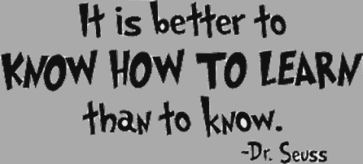
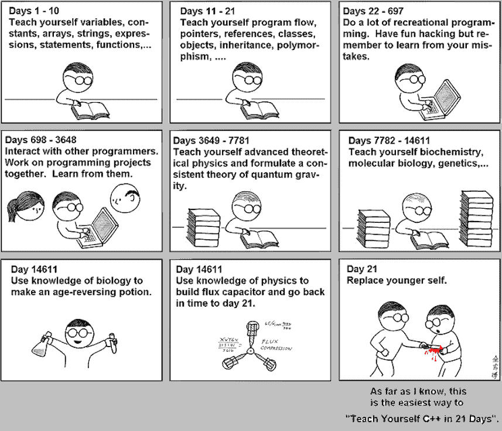

# 深入编程:从哪里开始？

> 原文：<https://dev.to/riter/diving-into-programming-where-not-to-begin-8p5>

我已经在我之前的[帖子](https://riter.co/blog/diving-into-programming-things-to-avoid)中提出了这个问题，然而，日常实践表明这个问题仍然存在。这一次，我还将谈谈当今非常流行的付费编程课程。很多课程，比如“学习 PHP/Java/C++/...一个月内/两个星期内/…”对他们的高要求不允许我保持沉默。此外，他们的广告数量巨大，超出了合理的限度，也不允许忽视这个话题。因此，我将努力为那些想通过课程深入编程的人节省几百美元。

首先，这里有一些需要考虑的陈述。

1.  绝大多数程序员的日常任务包括寻找和评估必要的信息以及构建新的精神抽象。所以提前了解工作所需的一切是不可能的。首先，最好研究一下获取新知识的机制。是关于“学会学习”。

2.  最热门的技术在半年或一年后变成古老的企业。学习技术的过程应该是连续的，永不停止。现在课程中教给你的材料是几个月前准备好的，并在六个月前或更早由老师自己掌握。这种知识的相关性极小。

3.  学习过程总是建立在与已知事物进行类比的基础上。对每个人来说，进行这种类比的过程都是非常个体化的。老师所能做的就是强加他们自己的类比。

4.  某些基础知识仍然可以在课程中获得，但它非常基础，你可以很容易地独立学习。Git，Unix 基础，算法和数据结构，一点数学。另外，某个特定职业的一些基础。例如，在 web 编程中，你需要理解 HTML、CSS、HTTP 等等。

当然，在实践中，你很难独自掌握基础知识和某种编程语言，尤其是在没有任何技术背景的情况下，因为你没有一个整体的概念。在这种情况下，区分好的课程和不好的课程还是很重要的。

好的课程会给你新的挑战，新的任务，让你学会去解决。有时这些是典型的任务，通常也是典型的方法。好的课程不强加方法，而是解释哪些方法更好，为什么。解决问题的工具——比如说 ruby 或 python——你可以根据具体情况选择。糟糕的课程教会你一门语言。好的课程教你迎接挑战，解决任务。

最后，即使你成功选择了最好和最严格的课程，也很难从越来越多的其他类似学生中脱颖而出，更不用说成千上万的计算机科学毕业生了。

你对这个问题有什么看法？你对这类课程或其毕业生有过亲身体验吗？有多成功？

最初发表于 [Riter 敏捷博客](https://riter.co/blog/diving-into-programming-2-where-not-tobegin)。