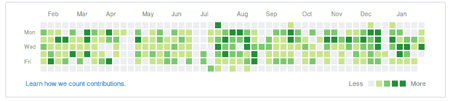
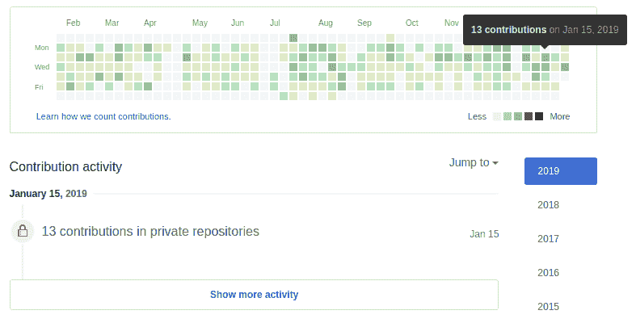

# 他们有工作/生活平衡吗？用 GitHub 调查潜在雇主

> 原文：<https://dev.to/itamarst/do-they-have-worklife-balance-investigating-potential-employers-with-github-4o7d>

当你寻找一份新的编程工作时，你会希望避开工作时间长的公司。你可以在面试时问工作/生活平衡的问题(除非你绝望了，否则你应该一直问)，但这意味着在你不想工作的公司申请和面试是浪费时间。

你真正想要的是只申请那些实际上允许——甚至鼓励——良好的工作/生活平衡的公司。

仔细阅读招聘启事和公司招聘页面有时可以帮助你做到这一点，但一些好公司不会谈论这些，一些坏公司只会撒谎。

因此，在这篇文章中，我将解释如何使用 GitHub 来根据经验*过滤掉至少一些工作与生活平衡不佳的公司。*

 *## 我们来看看 GitHub 简介

如果你进入 GitHub 用户的个人资料([这是我的](https://github.com/itamarst))你会看到一个图表，显示一段时间内的贡献。列是周，每行是一周中的一天。

每个方块显示某一天的贡献:颜色越深，贡献越多。

这里最有趣的是第一排和最后一排，分别是周日和周六。正如你在上面的图片中看到的，这个 GitHub 用户不倾向于在周末写很多代码:周末框大部分是空白的。

你也可以用这个 UI 来看看这家公司到底有没有用 GitHub。鉴于有这么多框，用户的雇主可能确实使用 GitHub，但你也可以点击特定的框，查看具体的贡献。在这种情况下，您会看到在某个特定的工作日，用户向“私有存储库”投稿，大概是为他们的雇主:

另一方面，如果你点击周末框，你会看到所有的周末贡献都是开源项目。简而言之，这个用户在周末不怎么编码，当他们编码的时候，是在个人开源项目上，而不是工作项目上。

概括这一过程将允许你过滤掉那些没有为开发者提供工作/生活平衡的公司。

## 使用 GitHub 调查工作/生活平衡

这里有两个假设:

*   这是一家相对较小的公司；大公司倾向于在不同的团队中有更大的差异，所以你需要稍微调整一下流程，把重点放在你申请的团队中的程序员身上。
*   该公司的大部分源代码都使用 GitHub。

你可以从公司页面或 LinkedIn 上了解公司的规模，GitHub 的使用情况也是我们可以一路了解的。

这不是一个完美的过程，因为用户可以禁止显示私有库贡献，或者开发者有可能有个人私有库。这就是为什么你想检查尽可能多的配置文件。

你应该这样做:

1.  找到一些为公司工作的程序员。你可以通过该公司的网站，以及该公司在 LinkedIn 上的页面来完成这项工作，该页面将列出拥有 LinkedIn 个人资料的员工。你也可以检查该公司 GitHub 组织的成员，如果他们有一个公开的名单，但不要完全依赖这个，因为它可能会遗漏许多员工。
2.  **对于每一个程序员，用你最喜欢的搜索引擎，搜索“$NAME github”就能找到他们的 github 简介。试着做一些理智检查，以确保这是正确的人，尤其是如果他们有一个共同的名字:地点、组织成员、使用的技术等..**
3.  对于每个程序员，检查他们在一周内是否对私有库做出了贡献。您可以通过直观地查看是否有许多绿色方框，点击时间线中的周一至周五方框并阅读下面的结果来做到这一点。如果他们大多不这样做，该公司可能不会使用 GitHub。
4.  **如果他们确实在工作中使用 GitHub，对于每个程序员来说，检查他们是否在周末编码。**你可以直观的看到他们在周日和周六是否有很多绿盒子。
5.  如果他们在周末写代码，检查一下这些是不是工作贡献。你可以点击周末框，看看这些是否是对私人知识库的贡献。

其他提示:

*   如果公司大部分写的是开源代码，你可以在周末检查一下程序员是否对相关的开源库有贡献。
*   寻找不同人之间相关的周末工作日期:如果 5 个人在相同的 4 个周末从事私人回购工作，这可能是关键时刻的迹象。

在过程结束时，你通常会感觉到大多数程序员都在周末编码。注意，这个方法只能告诉你他们**有没有**工作/生活平衡——你还无法知道他们**有没有**工作/生活平衡。

因此，即使你决定申请一家通过了这一筛选的公司，你仍然需要[问一些关于工作/生活平衡的问题](https://codewithoutrules.com/2016/10/14/job-you-dont-hate/)，并在面试过程中仔细倾听。

## 永远做你的研究

在你申请工作之前，你应该总是做你的研究:阅读他们的网站，阅读他们所有的招聘信息，如果你有朋友的话，和那里的朋友聊聊...正如我在本文中解释的，他们的 GitHub 配置文件也是如此。你仍然需要在面试中寻找警示信号，但是调查还是值得的。

你研究得越多，你就越知道你是否想在那里工作。如果你真的想在那里工作，你对那里了解得越多，你的面试就越顺利。

* * *

### 我们都会犯错，我有 20 年的经验:从每天凌晨 4 点让生产崩溃的代码，到接受一份糟糕透顶的工作邀请。

### 每一次痛苦的失败都给了我一个教训——但已经太迟了。

### 你可以做得更好！加入 3600 名其他程序员，每周你都会学习如何[避免我的另一个错误](https://codewithoutrules.com/softwareclown/?ref=dev.to)。*