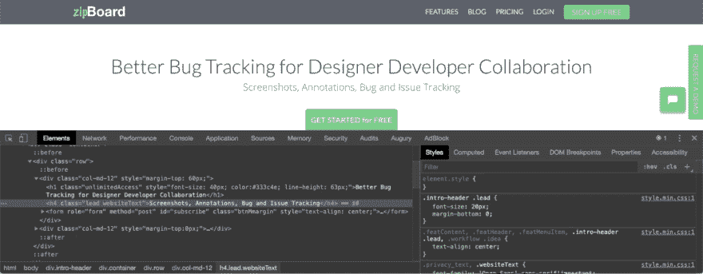
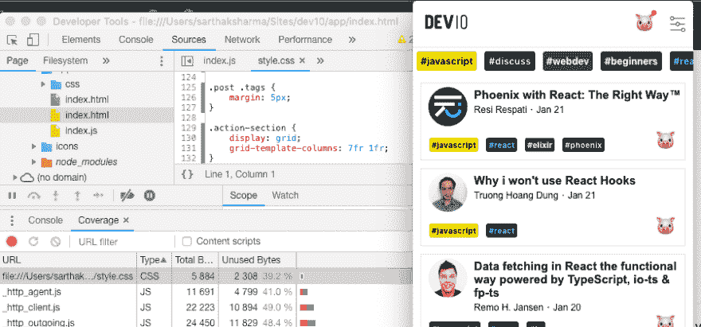
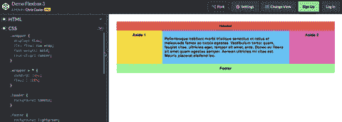
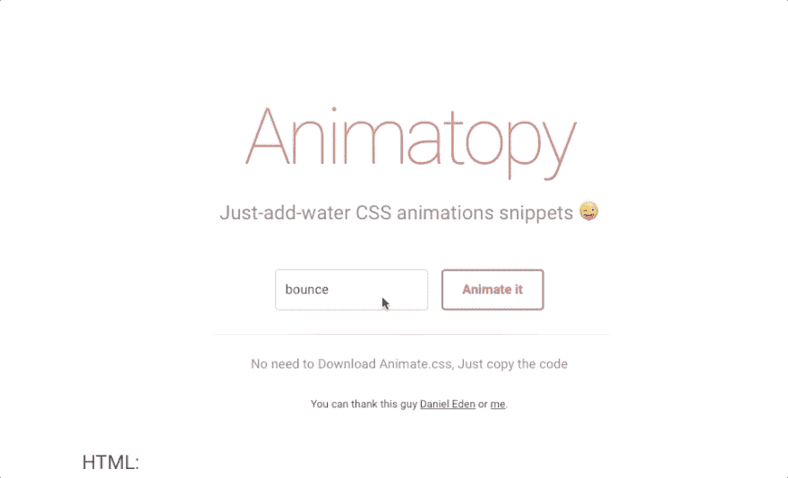

# 我们真的需要一个 CSS 框架吗？

> 原文：<https://dev.to/xenoxdev/do-we-really-need-a-css-framework-4ma6>

我们都非常了解 Bootstrap 的功能和局限性。当然，曾经有一段时间，如果有人问，“什么是 Bootstrap？”，我们都是这样的

那个时代已经过去了，使用 CSS 框架已经成为整个行业的标准实践，因为它们节省了我们很多时间。但是我今天想提出的问题是:2019 年我们真的需要他们吗？

也许不是。🤔

在这篇文章中，我们将解释为什么你不再需要 CSS 框架了。让我们直接开始吧。🏃🏻‍♂️

## 未使用的 CSS

我记得当时我们所需要做的就是添加一个`bootstrap.min.css`，瞧！应用程序的生产版本已经准备好了...至少我们是这么认为的。好吧，事实证明事实并非如此。

看看这个网页的例子。他们使用 Bootstrap 作为他们的登录页面。我们可以看到它被缩小了，但是这里值得注意的一件有趣的事情是超过 90%的 CSS 没有被使用。使用 Chrome 中的*覆盖率*工具，你可以检查任何网页。只需点击`cmd + shift + p`并输入“覆盖范围”。

是的，Bootstrap 当然有像[定制和下载](https://getbootstrap.com/docs/3.4/customize/)这样的工具，可以让你选择组件并减小下载文件的大小，但是仍然有很多代码没有被使用。

看看艾迪·奥斯马尼关于这个话题的精彩演讲。我强烈建议您观看完整视频，但如果您想节省时间，请点击[此处](https://youtu.be/FEs2jgZBaQA?t=860)。

[https://www.youtube.com/embed/FEs2jgZBaQA](https://www.youtube.com/embed/FEs2jgZBaQA)

## 小项目 vs 大项目

Bootstrap 流行的原因是:

*   易于移动友好的响应设计。
*   减少开发大项目的时间。

所以，如果你正在做一个大项目，而你的团队中没有一个熟练的前端开发人员，那么 CSS 框架可以拯救你。但是小项目真的需要 CSS 框架吗？我不这么认为。当我在制作 [Dev10](https://github.com/sarthology/Dev10) 的时候，我没有使用任何外部框架，并且看到了不同之处。
T3T5】

关键是明智地评估你的项目范围。如果你的应用中没有很多 UI 元素和页面，你就不需要框架。

### 如何在小项目中替换框架？

我认为，使用普通 CSS 进行手机友好的响应式设计不仅是可能的，而且比使用框架更容易做到。这里有两个非常强大的 CSS 属性。

##### 1。弯曲

看看这支笔。只需使用几行代码，您也可以制作这样令人惊叹的响应页面。

 
所以今天就抽出点时间来了解一下吧。这里有一些资源。

*   [Flexbox 的完整指南](https://css-tricks.com/snippets/css/a-guide-to-flexbox/) - CSS 技巧
*   [Flexbox CSS 在 20 分钟内完成](https://www.youtube.com/watch?v=JJSoEo8JSnc) -旅行媒体(视频)
*   [flexbox 的基本概念](https://developer.mozilla.org/en-US/docs/Web/CSS/CSS_Flexible_Box_Layout/Basic_Concepts_of_Flexbox) - MDN(一直以来的最爱)

##### 2。格子

从框架中取出简单的 CSS 网格，并把它放在类固醇上，这是你们都应该学习的东西。如果你过去只在网格系统中使用 Bootstrap，使用`grid`并制作你自己的定制布局。

*   [网格完全指南](https://css-tricks.com/snippets/css/complete-guide-grid) - CSS 技巧
*   [CSS 网格布局速成班](https://www.youtube.com/watch?v=jV8B24rSN5o) -旅行媒体(视频)
*   [网格布局的基本概念](https://developer.mozilla.org/en-US/docs/Web/CSS/CSS_Grid_Layout/Basic_Concepts_of_Grid_Layout) - MDN

##### 3。使用 UI 组件的代码片段

下次当你感到困惑，想从按钮和导航条等 UI 元素中获得灵感时，请访问 Codepen。这是一个很棒的社区，你可以找到数百支笔来帮助你。其他有用的资源:

*   你不需要 JavaScript，它是 bootstrap.js 的替代品
*   [最佳 CSS 代码片段网站](https://www.awwwards.com/best-css-code-snippets-sites.html)

如果你仍然发现很难找到一些 UI 元素的 CSS，那么使用你的老朋友 *Inspect Element* 。😊

##### 4。使用动画代码片段

我在 1 月 21 日停止写这篇文章，因为这篇文章给了我创作**动画的想法和灵感**。如果你还记得 [animate.css](https://daneden.github.io/animate.css/) ，它是一个很棒的工具，但唯一的问题是即使你想使用一些动画，你仍然必须包含完整的 css。显然，我发现这是不必要的，令人沮丧，所以我制作了[动画](https://sarthology.github.io/Animatopy/)。有了这个，你不需要下载 Animate.css，只需要复制代码片段就可以了。

*将很快分享完整的故事😃*

##### 结论/Tl；博士；医生

这里有一条黄金法则:如果项目很小，保持小规模，不要使用框架。唯一允许的大尺寸文件是图片，你也应该尝试优化它，而不是 CSS。

如果你有其他很酷的建议，欢迎在下面的评论区分享。

### 但是大项目呢？

如果你刚开始一个新项目，这很容易做到。但是如果你已经有了一个大的项目，只有当它被很好的计划并且和你的团队讨论时，这个转变才会成功。在这一部分，我们将讨论一些优化大型项目的技巧。

##### 1。从项目中移除未使用的 CSS

感谢令人敬畏的 Javascript 社区，我们有令人敬畏的工具来优化 CSS。你可以在现有的大项目中使用的伟大工具之一是 *purifycss* 。它可用于

*   [咕噜声](https://github.com/purifycss/grunt-purifycss)
*   [一饮而尽](https://github.com/purifycss/gulp-purifycss)
*   [网络包](https://github.com/purifycss/purifycss-webpack-plugin)

##### 2。缩小/丑化全部使用

还有其他方法可以进一步减小 CSS 的大小，最明显的方法就是缩小它。已经有很多关于它的帖子，但这里有一个神奇的帖子可以节省你的时间。

*   [用 JavaScript 实现更好的 CSS](https://medium.com/making-internets/better-css-with-javascript-88463deecf3)

##### 3。制作 CSS wiki 或文档(如果抛弃框架)

如果你下定决心完全离开框架，那么就从框架中吸取精华，编写良好的文档。这样，开发人员可以轻松地复制和粘贴代码片段，节省时间。相信我，这样可以节省很多时间，这样你和你的开发人员就可以避免其他开发人员产生的那些冗长的 bug 列表。一开始，这可能会令人生畏，但从长远来看，这将使你受益。当然，最好的起点是这些框架的文档。万事如意！

## 结论

是否使用框架，这取决于你的判断。关键的想法是很好地使用它们，遵循最佳实践，并不断检查新的属性以替换旧的属性。

伙计们，我的观点是这样的。我可以继续下去，但我的工作只是点燃你的想法，这样我们就可以在下面的评论中继续讨论。准备好你自己的提示、技巧和建议！

