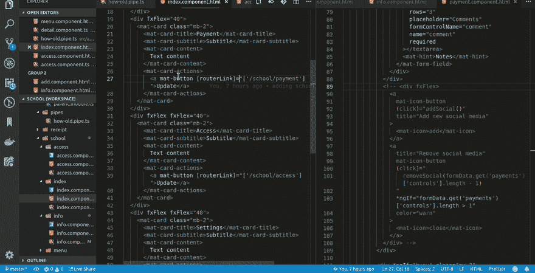

# 编码完成后，你会整理你的工作空间吗？

> 原文：<https://dev.to/khophi/do-you-tidy-up-your-workspace-when-done-coding-1d94>

在每个编码会话结束时，我关闭所有打开的文件并折叠所有侧边栏菜单。

当我打开我的代码编辑器进行下一个编码会话时，我很容易被那些打开的文件弄糊涂和分心。

在每次编码会议结束时“清理”工作空间，让我能够“加速”到上次离开的地方。

然而，在实现一个功能/修复一个错误的过程中，我只将计算机置于睡眠模式。

完成后，利用特性、推动、CI 构建、实时反映，然后开始清理。

无论如何，你是在每次编码会议后清理你的工作空间，还是关上笔记本电脑的盖子就大功告成了？