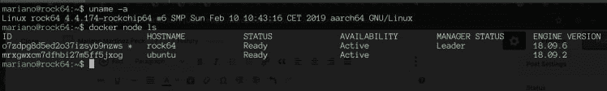
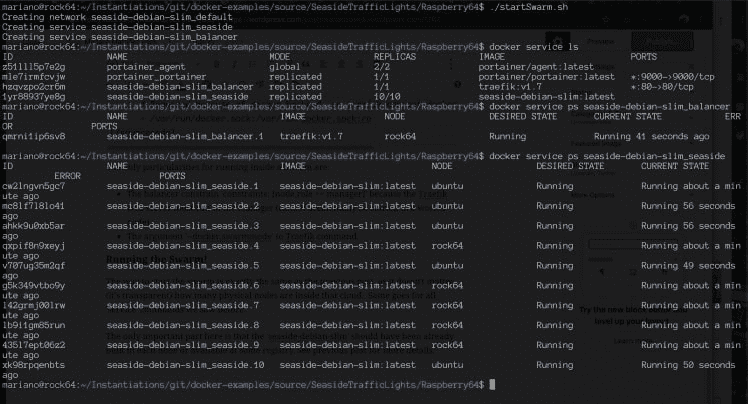
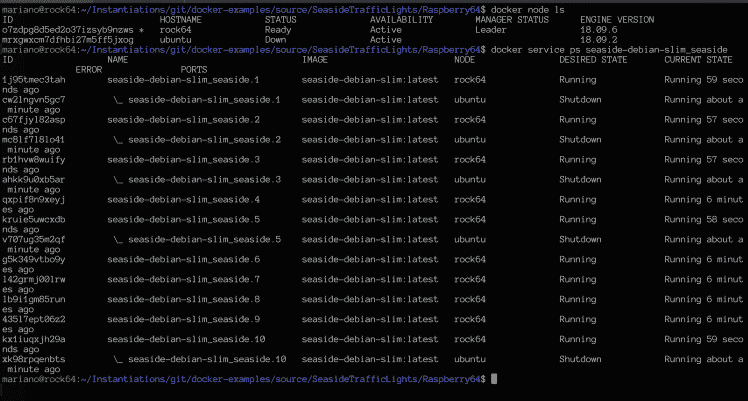

# 运行 Smalltalk webapp 的 ARM64 DIY SBC 集群上的 Docker Swarm cloud

> 原文：<https://dev.to/martinezpeck/docker-swarm-cloud-on-a-arm64-diy-sbc-cluster-running-a-smalltalk-webapp-9l1>

在[之前的一篇文章](https://dev.to/martinezpeck/step-2-single-node-docker-swarm-and-smalltalk-46i0)中，我们看到了如何构建一个运行 [VASmalltalk](https://www.instantiations.com/products/vasmalltalk/index.html) 的单节点 [Docker 群](https://docs.docker.com/engine/swarm/)。该堆栈涉及一个 web 服务器( [Traefik](https://traefik.io/) )跨运行 [Seaside](http://seaside.st/) web 应用程序的 10 个 VASmalltalk 映像进行负载平衡。同一节点中的所有容器。

### 准备物理集群

在开始之前，要知道代码已经[发布在 Github 上，和之前的帖子](https://github.com/vasmalltalk/docker-examples)在同一个地方。

前一篇文章的单节点是一个树莓派 3B+运行 Raspbian 32 位。但是 VASmalltalk 也可以运行 64 位(x86，ARM 等)。在某种程度上，这要归功于 libffi 和 LLVM 的可移植性和电源功能。所以…我用运行在树莓 Pi 3B+上的 Ubuntu Server 18.04 ARM 64 位为我们的集群准备了`ubuntu`节点

液体错误:内部

但是为了能够称之为“集群”,我至少还需要一个节点，对吗？用 Raspbian 再弄一个树莓 Pi 3 就没意思了。所以[实例](https://www.instantiations.com/)给我买了一个不同的设备，也能运行 64 位:岩石 64。这是一台令人难以置信的好机器，在某些方面比 Pi3 更强大(4GB 内存，eMMC 等)。我已经有了 Raspbian 和 Ubuntu 服务器，所以对于这个`rock`节点，我安装了 Armbian Debian Stretch(顺便说一句，运行非常非常好和稳定！)

液体错误:内部

**集群结论:** `ubuntu`树莓 Pi3 上 Ubuntu Server 18.04 的节点和 Rock64 上 Armbian 的`rock64`节点。全部 64 位。

### 准备码头工人群

在之前的帖子中，在开始 swarm 之前，我们执行了`docker swarm init`。这使得单个节点成为云的“管理者”。但是在真正的云上，你有经理和工人节点。通常有 1 个管理节点和 N 个工作节点。然而，据我所知，有些情况下可能会有不止一个经理。但是目前，让我们只取 1:这个`rock64`。

第一步是到管理器(`rock64`)执行`docker swarm init`如果你以前没做过。然后，运行`docker swarm join-token worker`。这将打印出如下内容:

```
To add a worker to this swarm, run the following command: docker swarm join --token SWMTKN-1-32xpsbsdu9zxzf3cejp6b459ubcgyoyxvvifuv75kf17ld2kd9-7ow4qvkpf30wn7aad0a3vvlui 192.168.7.108:2377 
```

Enter fullscreen mode Exit fullscreen mode

然后，转到每个 worker 节点，执行上一步中的 docker 命令。如果那个工人已经在一个蜂群中，你需要首先做`docker swarm leave`。在这个例子中，我是为`ubuntu`节点做的。

仅此而已！Docker 群组现在应该有 2 个节点。您可以使用`docker node ls`来确认结果:

[](https://res.cloudinary.com/practicaldev/image/fetch/s--ykm_5gJ7--/c_limit%2Cf_auto%2Cfl_progressive%2Cq_auto%2Cw_880/https://marianopeck.files.wordpress.com/2019/05/screen-shot-2019-05-14-at-4.21.40-pm.png%3Fw%3D748)

你可以注意到`rock64`“经理身份”是“领导”，而`ubuntu`不是。

### docker-compose . yml 中的群体特定设置

本例的`docker-compose.yml`如下:

```
version: '3'
services:
  seaside:
    image: seaside-debian-slim
    environment:
      TZ: America/New_York
      SEASIDE_PORT: 7777
    deploy:
      replicas: 10
      labels:
        traefik.port: 7777
        traefik.frontend.rule: "HostRegexp:{catchall:.*}"
        traefik.backend.loadbalancer.stickiness: "true"
    volumes:
      - /var/log/docker-logs:/opt/log
  balancer:
    image: traefik:v1.7
    # The webserver should only load on manager nodes
    deploy:
      placement:
        constraints: [node.role == manager]
    # To see all available  command line options: docker run --rm traefik:v1.7 --help | less
    command: --docker --docker.swarmmode --retry --loglevel=WARN
    ports:
      - "80:80"
    volumes:
      # Required because of docker backend, so traefik can get docker data.
      - /var/run/docker.sock:/var/run/docker.sock:ro 
```

Enter fullscreen mode Exit fullscreen mode

在群体中跑步的唯一特点是:

*   平衡器`constraints: [node.role == manager]`因为 Traefik web 服务器必须在管理器中运行(不能在工作节点中意外启动)
*   Traefik 命令的参数`–docker.swarmmode`。
*   `/var/log/docker-logs`必须存在于每个节点上。有更好的方法来解决这个问题，但超出了本文的范围。

### 奔跑的蜂群！

启动 swarm 的方法与前一篇文章完全相同，因为云中有多少物理节点并不重要(这是透明的)。我们之前看到的所有`service`命令也是如此。

这里唯一重要的部分是，`seaside-debian-slim`应该已经在每个节点中构建好了，或者在某个注册表中可用。更多细节见上一篇文章。

下面你可以看到完整的序列:

[](https://res.cloudinary.com/practicaldev/image/fetch/s--LlvXwsND--/c_limit%2Cf_auto%2Cfl_progressive%2Cq_auto%2Cw_880/https://marianopeck.files.wordpress.com/2019/05/screen-shot-2019-05-14-at-4.27.27-pm.png%3Fw%3D748)

请注意，Traefik 正在管理器上运行，10 个 worker 容器在管理器和一个 worker 之间分成两半。

### 有趣的点

您可以看到扩展到多个节点是多么容易。在这个例子中，我只使用了 2 个，但是通常你可以有更多的节点。很高兴看到它对可用性的帮助。看看当我断开(关闭)工人的电源时会发生什么(本例中为`ubuntu`):

[](https://res.cloudinary.com/practicaldev/image/fetch/s--7PghrWSh--/c_limit%2Cf_auto%2Cfl_progressive%2Cq_auto%2Cw_880/https://marianopeck.files.wordpress.com/2019/05/screen-shot-2019-05-14-at-4.32.44-pm.png%3Fw%3D748)

看到了吗？`ubuntu`显示为“关闭”,运行在其上的容器在不同的节点(这里唯一的可能是管理器)上自动重启，以满足指定的副本数量(10)。当然，Seaside 用户会丢失他们的会话，但这仍然很棒。

液体错误:内部

希望你喜欢，