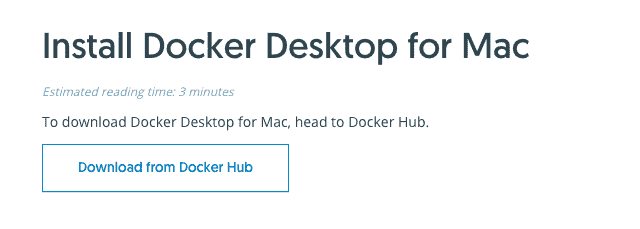
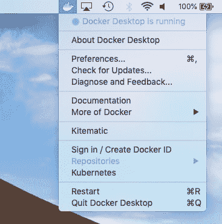

# 把它归档！

> 原文：<https://dev.to/annazubova/dockerize-it-4pne>

用代码解决问题非常有趣。但是，当你的创作过程被依赖问题打断，你不得不深入终端并检查版本，担心一个错误的举动会破坏你几周以来建立的东西时，这绝对是一个令人沮丧的挫折。

在我学习数据科学的道路上，我一直在努力为我的项目创建合适的环境，并确保我所有的包都已安装并且没有产生任何问题。但是，当我需要在没有手工开发环境的服务器上运行我的应用程序时，会发生什么呢？幸运的是，码头工人挽救了局面。

Docker 是一个开源的平台，开发者和系统管理员可以利用容器来开发、部署和运行应用程序(来自 T2 Docker 文档)。这里我们讨论的是 linux 容器，或者换句话说，应用程序允许开发人员将一个项目打包到一个包中，这个包包含所有的库和依赖项以及项目代码本身。容器可以与虚拟机相比，但它要轻量得多，因为它只使用来自主机的适量资源，而不是在主机内创建完整的操作系统。

在本教程中，我将向您介绍一些关键的 Docker 概念和组件，以便能够在您的开发过程中使用它们。

## 安装

*   下载坞站:【https://docs . docker . com/docker-for-MAC/install/

有 2 个 Docker 版本可用:Docker CE(社区版)和 EE(企业版)。文档推荐 CE 用于学习目的和小型团队项目。Docker 可以在 AWS 上运行，也可以下载到本地机器上运行。在本教程中，我将下载 MacOS 的 Docker。如果你没有 Docker 帐号，你需要创建一个来下载安装文件。
[T3】](https://res.cloudinary.com/practicaldev/image/fetch/s--lCy9URdP--/c_limit%2Cf_auto%2Cfl_progressive%2Cq_auto%2Cw_880/https://github.com/AnnaLara/docker_blogpost/raw/master/download.png)

*   运行 Docker.dmg 安装文件，并将应用程序移动到您的应用程序文件夹

*   从应用程序文件夹中打开 Docker。您会看到一个图标出现在屏幕的右上角。

*   用你的码头工人 ID 登录

[](https://res.cloudinary.com/practicaldev/image/fetch/s--MngORyzP--/c_limit%2Cf_auto%2Cfl_progressive%2Cq_auto%2Cw_880/https://github.com/AnnaLara/docker_blogpost/raw/master/docker_desktop.png)

*   在终端中键入以下命令，查看它是否正常工作:

`docker run hello-world`

输出应该如下所示

```
latest: Pulling from library/hello-world
1b930d010525: Pull complete 
Digest: sha256:5f179596a7335398b805f036f7e8561b6f0e32cd30a32f5e19d17a3cda6cc33d
Status: Downloaded newer image for hello-world:latest

Hello from Docker!
This message shows that your installation appears to be working correctly.

To generate this message, Docker took the following steps:
 1\. The Docker client contacted the Docker daemon.
 2\. The Docker daemon pulled the "hello-world" image from the Docker Hub.
    (amd64)
 3\. The Docker daemon created a new container from that image which runs the executable that produces the output you are currently reading.
 4\. The Docker daemon streamed that output to the Docker client, which sent it
    to your terminal. 
```

Enter fullscreen mode Exit fullscreen mode

## Docker 图像和 Docker 文件

将你的项目归档有两个关键部分:归档图片和归档文件。

一个映像可以被描述为我们执行项目代码所需的一组工具和指令:系统工具、库、依赖项等。方便的是，这组工具可以以一种非常简单的方式重用，因此您不需要定义一个新的项目环境，而是可以重用一个现有的项目环境。

Dockerfile 是一个文本文件，包含一组组装图像的指令。docker 文件的每一行都被视为一个层，可以在以后重用。

还有一个名为 [Docker Hub](https://hub.docker.com/) 的云服务，Docker 用户可以在这里分享 Docker 图片。这个服务类似于 GitHub 为 git 所做的。

## 运行现有图像

为了测试 Docker 如何运行 Jupyter 服务器，我遵循了这个[教程](https://www.dataquest.io/blog/docker-data-science/)

我开始在我的终端中运行这个命令:

`docker run ubuntu:16.04`

这个命令将运行一个名为[ubuntu]的镜像，镜像版本为[16.04]。如果 Docker 在本地机器上找不到这个映像，那么它会在 Docker Hub 中查找并下载这个映像。

在 [Docker 官方文档](https://docs.docker.com/engine/reference/run/)中可以找到`run`命令的一些额外选项。

正如我之前提到的，使用现有图像非常方便。让我们运行一个已经由 Jupyter 开发社区创建的图像，该社区刚刚安装了 Python 和 Jupyter:[https://hub.docker.com/r/jupyter/minimal-notebook](https://hub.docker.com/r/jupyter/minimal-notebook)

`docker run -p 8880:8888 jupyter/minimal-notebook`

在上面的行中，`-p <host_port>:<container_port>`是告诉 Docker 打开 Docker 容器和主机之间的连接的部分，因此可以与正在运行的容器进行交互。

`jupyter/minimal-notebook`是我们想要运行的映像。

运行该命令后，您将在终端中看到这种类型的输出:

```
To access the notebook, open this file in a browser:
        file:///home/jovyan/.local/share/jupyter/runtime/nbserver-6-open.html
    Or copy and paste one of these URLs:
        http://(2f0da4326d97 or [my IP address]):8888/?token=xxxxxxxxxxxxxxxxxxxxxxxxxxxxxxxxxxxxxxxxxxxx 
```

Enter fullscreen mode Exit fullscreen mode

从最后一个 URL 中，我们必须获取令牌号，我用‘x’表示它，因为它是一个密钥。使用我用来运行映像的端口号 8880，我可以访问笔记本:
`http://localhost:8880/?token=xxxxxxxxxxxxxxxxxxxxxxxxxxxxxxxxxxxxxxxxxxxx`

下一步是允许在运行容器的情况下创建和修改 Jupyter 笔记本。在`run`命令中有一个特殊选项:

`-v <host_directory>:<container_directory>`

主机目录指定了存储我们将要创建的笔记本的位置，容器目录应该在容器文档中指定(如果使用 Docker Hub 容器)。在我们的例子中，文档中的容器目录是`/home/jovyan`

因此，运行带有访问映像和创建笔记本选项的映像的最终代码是:

`docker run -p 8880:8888 -v ~/docker_tests:/home/jovyan jupyter/minimal-notebook`

在浏览器中进入`http://localhost:8880/?token=xxxxxxxxxxxxxxxxxxxxxxxxxxxxxxxxxxxxxxxxxxxx`将允许您访问 Jupyter 服务器并创建笔记本。

## 整理您的 Python 项目

要对项目进行 Dockerize 化，您首先需要创建一个 Dockerize 文件，其中包含关于您将使用什么映像、需要安装什么包以及项目目录的说明。

假设您需要对名为`add_numbers.py`的 python 脚本进行 Dockerize，这需要安装`scikit-learn`库。

首先，创建一个名为 Dockerfile 的文件(不要给它添加扩展名！).在任何文本编辑器中添加这些行到文件:

```
FROM python:3

ADD add_numbers.py /

RUN pip install -U scikit-learn

CMD [ "python", "add_numbers.py" ] 
```

Enter fullscreen mode Exit fullscreen mode

命令显示你正在使用什么样的图像作为模板。

告诉 Docker 将某个脚本添加到 Docker 文件中。这个命令有两个参数:源和目标

`ADD <source> <destination>`

`RUN`表示在执行脚本之前，应该安装`scikit-learn`。

`CMD`提供图像加载后将执行的默认命令，除非被其他命令覆盖。

我的 python 文件`add_numbers.py`只有下面的代码:

```
def add_numbers (a, b):
   return a + b

c = 3
d = 4

print(add_numbers(c, d)) 
```

Enter fullscreen mode Exit fullscreen mode

在创建了我的脚本和 Dockerfile(其中包含如何创建映像的说明)之后，我可以运行这个命令来基于新创建的 Dockerfile 构建一个新映像:

`docker build -t add_numbers .`

该命令基于 Dockerfile 文件创建一个名为“add_numbers”的映像，该文件来自运行该命令的同一个目录。

最后，我们可以使用以下命令运行映像:

`docker run add_numbers`

因为我的 python 脚本包含一个将两个数相加并打印出结果的函数，并且还有一个将 3 + 4 相加的函数调用，所以我在终端中得到 7 作为输出。

了解更多，请参考 Docker 官方文档:
[https://docs.docker.com/](https://docs.docker.com/)

开始使用 Docker 的有用教程:
[https://runnable . com/Docker/python/dockerize-your-python-application](https://runnable.com/docker/python/dockerize-your-python-application)
【https://www.dataquest.io/blog/docker-data-science/】T4