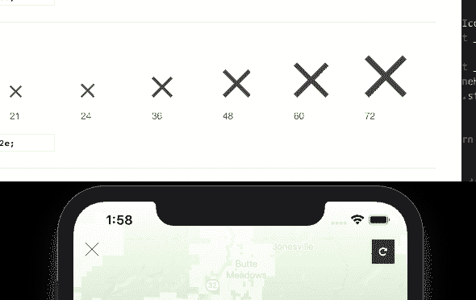
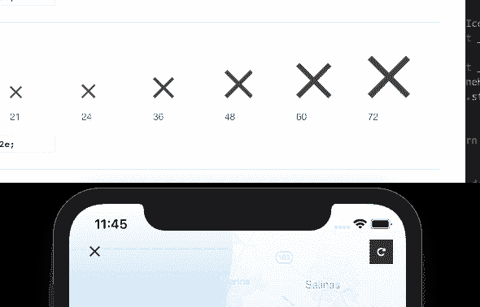

# 将小事归档

> 原文：<https://dev.to/drk/dockerize-the-small-things-52cj>

# TL；博士；医生

*   熟悉一下 [react-native](https://facebook.github.io/react-native/) 、 [yarn](http://yarnpkg.com) 、 [Docker](https://www.docker.com) 和命令行会有所帮助。
*   当开发人员使用不同的机器、操作系统和版本时，在开发环境中运行的工作流可能会出现问题。
*   将 Docker 用于常见的开发任务(比如使用原生依赖项生成代码)是愚蠢的，尽管使用 Docker 会有额外的开销。
*   查看底部的完整配置/设置。

# 设置

Docker 在自动化开发环境和生产环境方面有许多应用。这通常不直观，也不容易操作，但权衡通常是值得的。有了这样一个复杂而强大的工具，学习起来有些困难:自动化更小的任务值得吗？我也这么认为

我最近遇到了一个在 React 本地应用程序中生成图标字体的问题。为了更好的性能和简单性，推荐使用 SVG 字体的图标。反正我是这么看的，也是这么听说的🤷‍♂️.React Native(至少 iOS 作为平台)可以处理 True Type 字体(`.ttf`)文件。我正在使用的设置是每个图标一个单独的 SVG 文件目录。姐妹 www 项目已经有了一些工具，使用 [`FontCustom`](https://github.com/FontCustom/fontcustom) ruby 库将这些 SVG 文件转换成所有必要的字体文件、CSS 和预览 HTML。相当漂亮。

# 走吧

安装好一切并准备就绪后，我运行`fontcustom compile`命令，一切都相应地生成了。我检查了生成的网络预览文件，图标看起来不错。作为我的配置的一部分，我还生成了一个 React 组件文件，它使用 [`react-native-vector-icons`](https://www.github.com/oblador/react-native-vector-icons) 来渲染生成的`.ttf`字体文件中的图标。运行应用程序来查看一些图标，它们非常棒。感觉我作弊了。仔细观察，虽然图标在一些情况下稍微有点偏离…时髦。

[](https://res.cloudinary.com/practicaldev/image/fetch/s--jsZLPPf3--/c_limit%2Cf_auto%2Cfl_progressive%2Cq_auto%2Cw_880/https://thepracticaldev.s3.amazonaws.com/i/zl40ajfrqzh92wgxiwds.png) 
*【时报】图标在 iOS vs 网页渲染时看起来有点单薄。*

# 调试

这发生在哪里？`react-native-vector-icons`从`.ttf`文件生成字形有困难吗？是不是所有字体渲染都变细了？我能在`react-native`层破解这个吗？`.ttf`文件与其他文件如`.woff`或`.woff2`有什么不同吗？

在试图用代码寻址之后，我想验证使用的`.ttf`文件是否产生了与其他文件格式相同的字形。我通过注释掉 CSS 中的其他文件格式来编辑生成的预览 html 文件，果然，当使用`.ttf`文件时，字形在浏览器中也变细了。

```
/* Icon Font: hc-awesome */

@font-face {
  font-family: "hc-awesome";
  src: url("./hc-awesome.eot");
  src: url("./hc-awesome.eot?#iefix") format("embedded-opentype"),
       /* url("./hc-awesome.woff2") format("woff2"),
       url("./hc-awesome.woff") format("woff"), */
       url("./hc-awesome.ttf") format("truetype");
       /* url("./hc-awesome.svg#hc-awesome") format("svg"); */
  font-weight: normal;
  font-style: normal;
} 
```

到目前为止，我已经在我的主机 OSX 机器上为 web 项目运行了相同的`fontcustom compile`命令。`FontCustom`库已经有一段时间没有更新了，所以我想知道它在新版本的 OSX 上是否有问题。这促使我尝试在 Linux 环境下运行该命令。具体在 Docker。

# 打卡

web 项目已经在使用 Docker 解决更多的“Docker 式”问题，如运行本地数据库，因此利用该基础设施完成更小的任务(如生成字体)并不是一个巨大的飞跃。我添加了一个`Dockerfile`，将它与我的 SVG 源文件放在同一个目录下。

```
# Used the Docker community ruby image
FROM ruby:2.6

# Installed all the same dependencies from our host machine, but using Linux flavors.
RUN apt-get -y update && apt-get -y upgrade
RUN apt-get -y install zlib1g-dev fontforge
RUN git clone https://github.com/bramstein/sfnt2woff-zopfli.git sfnt2woff-zopfli && cd sfnt2woff-zopfli && make && mv sfnt2woff-zopfli /usr/local/bin/sfnt2woff
RUN git clone --recursive https://github.com/google/woff2.git && cd woff2 && make clean all && mv woff2_compress /usr/local/bin/ && mv woff2_decompress /usr/local/bin/
RUN gem install fontcustom

# Copies the directory containing the SVG files in to the built container
COPY . . 
```

现在我们需要构建一个容器来运行`fontcustom compile`命令。

```
docker build -t hc/hc-awesome . 
```

最后运行命令。

```
docker run
    \ -v $(realpath ./generated):/generated 
    \ -t hc/hc-awesome 
    \ fontcustom compile 
```

关于这个`docker run`命令有一些事情需要注意。

*   `-v`是用于配置卷的选项，我们可以认为这是将目录从您的主机镜像到容器中的目录。
*   `realpath`是必需的，因为`-v`选项需要一个绝对路径。
*   `-t`选项指定了我们之前构建的容器。
*   最后，我们将提供在容器`fontcustom compile`中运行的命令。

所以我们在这里说“无论什么数据(文件)出现在容器的`/generated`目录中，也应该出现在与`Dockerfile`位于同一位置的`./generated`目录中。

如果一切正常，我们应该在主机的`./generated`目录中看到相同的字体文件、CSS 和 HTML 预览。

# 反应过来的成分

前面我跳过了这是如何完成的，但是一旦我们从 fontcustom 获得了生成的文件，我们就可以在我们的**主机**上运行来自`react-native-vector-icons`的`generate-icon`命令，而不是 Docker，来创建我们的 React 组件。

```
yarn generate-icon 
  \ Icon/generated/hc-awesome.css 
  \ --componentName=hc-awesome 
  \ --fontFamily=hc-awesome 
  \ -p .hc-awesome- 
  \ -o Icon/generated/HcAwesomeIcon.tsx 
  \ -t Icon/lib/iconSet.tpl 
```

现在，当我们运行我们的应用程序时，我们应该会看到一个漂亮准确的字形…

[](https://res.cloudinary.com/practicaldev/image/fetch/s--2qiZM3Ki--/c_limit%2Cf_auto%2Cfl_progressive%2Cq_auto%2Cw_880/https://thepracticaldev.s3.amazonaws.com/i/b1valqiwydjftbd8umt7.png)

好多了！

# 更进一步

甚至在我写这篇文章的时候，我就在想其他的方法来完成这个任务。有一些很棒的工具/服务，比如 IcoMoon.io 或 T2 Fontello，它们提供了一种更加人工的方法来生成图标和 API。我优化了不引入太多新技术(我认为我没有引入新技术)和快速解决问题，这意味着不会掉进一个不同流程的兔子洞(我只是在 Docker 中使用相同的命令)。现在，无论是谁生成图标，这两个项目都可以从一致的图标编译过程中受益。展望未来，我认为这将是一个很棒的自动操作，并有一个服务可以从 GitHub 获取最新的图标，并为任何需要它们的项目输出所有必要的文件。

# 配置

```
package.json
Icon/
  generated/
  svgs/
  lib/
    iconSet.tpl
  Dockerfile
  fontcustom.yml 
```

## package.json

这是一个截短的版本，展示了我们如何将命令封装成一个单独的 yarn 脚本。

```
{  "scripts":  {  "hcawesome":  "hcawesome:build && yarn hcawesome:compile && yarn hcawesome:clean && yarn hcawesome:generate",  "hcawesome:build":  "docker build -t hc/hc-awesome ./Icon",  "hcawesome:compile":  "docker run -v $(realpath ./Icon/generated):/generated -t hc/hc-awesome fontcustom compile",  "hcawesome:clean":  "cd ./Icon/generated && rm *.eot *.svg *.woff *.woff2",  "hcawesome:generate":  "yarn generate-icon Icon/generated/hc-awesome.css --componentName=hc-awesome --fontFamily=hc-awesome -p .hc-awesome- -o Icon/generated/HcAwesomeIcon.tsx -t Icon/lib/iconSet.tpl"  }  } 
```

## Dockerfile

```
# Used the Docker community ruby image
FROM ruby:2.6

# Installed all the same dependencies from our host machine, but using Linux flavors.
RUN apt-get -y update && apt-get -y upgrade
RUN apt-get -y install zlib1g-dev fontforge
RUN git clone https://github.com/bramstein/sfnt2woff-zopfli.git sfnt2woff-zopfli && cd sfnt2woff-zopfli && make && mv sfnt2woff-zopfli /usr/local/bin/sfnt2woff
RUN git clone --recursive https://github.com/google/woff2.git && cd woff2 && make clean all && mv woff2_compress /usr/local/bin/ && mv woff2_decompress /usr/local/bin/
RUN gem install fontcustom

# Copies the directory containing the SVG files in to the built container
COPY . . 
```

## fontcustom.yml

```
# =============================================================================
# Font Custom Configuration
#   This file should live in the directory where you run `fontcustom compile`.
#   For more info, visit <https://github.com/FontCustom/fontcustom>.
# =============================================================================

# -----------------------------------------------------------------------------
# Project Info
# -----------------------------------------------------------------------------

# The font's name. Also determines the file names of generated templates.
font_name: hc-awesome

# Format of CSS selectors. {{glyph}} is substituted for the glyph name.
css_selector: .hc-awesome-{{glyph}}

# Generate fonts without asset-busting hashes.
no_hash: true

# Encode WOFF fonts into the generated CSS.
base64: false

# Forces compilation, even if inputs have not changed
#force: true

# Display (possibly useful) debugging messages.
#debug: true

# Hide status messages.
#quiet: true

# Copyright information.
#copyright:

# -----------------------------------------------------------------------------
# Input / Output Locations
#   You can save generated fonts, CSS, and other files to different locations
#   here. Font Custom can also read input vectors and templates from different
#   places.
#
#   NOTE:
#   - Be sure to preserve the whitespace in these YAML hashes.
#   - INPUT[:vectors] and OUTPUT[:fonts] are required. Everything else is
#     optional.
#   - Specify output locations for custom templates by including their file
#     names as the key.
# -----------------------------------------------------------------------------

input:
  vectors: ./svgs
#  templates: my/templates

output:
  fonts: ./generated
  css: ./generated
#  preview: app/views/styleguide
#  my-custom-template.yml: path/to/template/output

# -----------------------------------------------------------------------------
# Templates
#   A YAML array of templates and files to generate alongside fonts. Custom
#   templates should be saved in the INPUT[:templates] directory and referenced
#   by their base file name.
#
#   For Rails and Compass templates, set `preprocessor_path` as the relative
#   path from OUTPUT[:css] to OUTPUT[:fonts]. By default, these are the same
#   directory.
#
#   Included in Font Custom: preview, css, scss, scss-rails
#   Default: css, preview
# -----------------------------------------------------------------------------

#templates:
#- scss-rails
#- preview
#- my-custom-template.yml

#preprocessor_path: ../fonts/

# -----------------------------------------------------------------------------
# Font Settings (defaults shown)
# -----------------------------------------------------------------------------

# Size (in pica points) for which your font is designed.
#font_design_size: 16

# The em size. Setting this will scale the entire font to the given size.
#font_em: 512

# The font's ascent and descent. Used to calculate the baseline.
#font_ascent: 448
#font_descent: 64

# Horizontally fit glyphs to their individual vector widths.
autowidth: true 
```

## lib/iconSet.tpl

```
/**
 * ${componentName} icon set component.
 * Usage: <${componentName} name="icon-name" size={20} color="#4F8EF7" />
 */

import createIconSet from 'react-native-vector-icons/lib/create-icon-set'
export const glyphMap = ${glyphMap}

const iconSet = createIconSet(glyphMap, '${fontFamily}', '${componentName}.ttf')

export default iconSet 
```