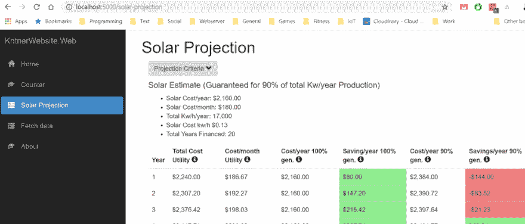
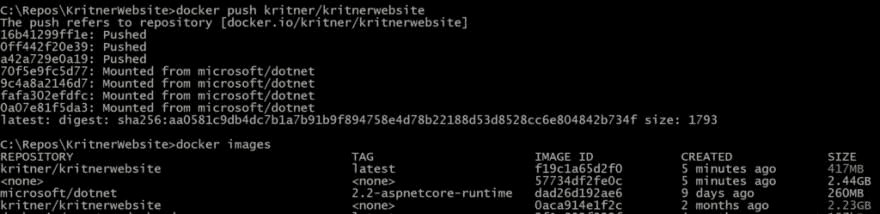

# Docker 使用多阶段构建编写较小的图像。网芯。

> 原文：<https://dev.to/kritner/dockerwriting-a-smaller-image-with-multi-stage-builds-for-net-core-4b3a>

### Docker——编写一个多阶段构建的小图像。网芯。

我一直用 docker 来玩我的小网站，但是 docker 文件/图像总是有点暴力。是时候探索一种更有效的 docker 文件了！

### Docker 概述

Docker 是一种在容器内构建应用/基础设施/代码的方法；容器是一个自包含的软件，具有运行应用程序所需的所有依赖关系。

尽管与[构建服务器](https://medium.com/@kritner/and-its-like-what-s-the-deal-with-build-servers-70d3478dd3a9?source=friends_link&sk=b6b9f777e98014e7411c770e8282c995)没有直接关系，但它们在试图解决的一些问题上确实有一些重叠。当使用 docker 或构建服务器时，您的构建过程及其依赖项需要用代码进行整理。这个想法是，你写“docker 代码”是为了描述构建和部署你的应用程序的步骤。这与使用构建服务器非常相似，因为您可以确保任何开发人员或服务器都能够构建或运行您的应用程序代码，而不会有安装所有应用程序依赖项的麻烦，因为这些依赖项在 docker“代码”本身中被引用。(注意，您仍然需要安装 docker，并且可能还有一些其他的注意事项，尤其是在向 docker 容器中注入变量的时候。)

### 当前图像

我使用的当前图像非常小(代码长度方面)，因此构建花费的时间比应该花费的时间要长。这仅仅是因为在我的构建过程中没有真正的“检查点”。在浏览我的基本图像时，我将尝试对此进行更多解释:

dnc2.1.401-v1-base

```
FROM microsoft/dotnet:2.1.401-sdk-stretch
WORKDIR /app

# Perform updates, install gnupg and sudo
RUN apt-get update \
    && apt-get -y upgrade \
    && apt-get -y dist-upgrade \
    && apt-get install -y gnupg \
    && apt-get install -y sudo 
```

DNC 2 . 1 . 401-v1-节点

```
FROM kritner/builddotnetcore:dnc2.1.401-v1-base
WORKDIR /app

# Install node
RUN curl -sL deb.nodesource.com/setup_10.x | sudo -E bash - \
    && apt-get install -y nodejs 
```

KritnerWebsite。DockerFile 文件

```
FROM kritner/builddotnetcore:dnc2.1.401-v1-node
WORKDIR /app

# Copy everything to prep for build
COPY . ./

WORKDIR /app/src/KritnerWebsite.Web

# Publish code
RUN dotnet publish -c Release -o out
CMD dotnet out/KritnerWebsite.Web.dll 
```

### 当前图像的问题

*   没有真正使用“多阶段构建”(多个“from”语句)。我使用了一些不同的图像，但都被卷成了最终的图像。这意味着我正在运行一个最终的图像，其中的“东西”比需要的要多得多。
*   由于我是基于我的其他图像来构建我的最终版本`KritnerWebsite.Dockerfile`的，当升级我正在使用的 sdk 时，这不是很灵活。我目前需要更新`dnc2.1.401-v1-base`，重建`dnc2.1.401-v1-node`，然后重建我的实际网站形象。
*   虽然与前两点有关，但我认为它值得拥有:我目前在 dnc 映像上安装了很多东西——比如 sudo、node，执行操作系统级更新。使用“单独的”映像构建 dotnet 核心代码，并运行 dotnet 核心，将有助于避免这种情况。

### 重构我的 DockerFile

#### 更好的图像模板(感谢 GaProgMan)

[GaProgMan](https://twitter.com/dotNetCoreShow) 曾与 docker 合作过，他在几个月前给了我一些关于多步构建过程的提示供我参考(是的，我现在才开始讲这个):

```
## Assuming we are building for 2.1.300
## Change this value to match the version of the SDK
## found in the global.json
FROM microsoft/dotnet:2.1.300-sdk-alpine AS build

## Set the default build configuration to be Development
## Override this by adding a --build-arg switch to the call
## to docker build. i.e:
## docker build . --file UI.dockerfile --tag projname-ui --build-arg target_configuration=Release
## Will build this project in Release rather than Development
ARG target_configuration=Development

WORKDIR /build

# Copy all the sln and csproj files, then run a restore. The .NET Core SDK
# doesn't need access to the source files (other than these) in order to
# restore packages.
# By doing this first, docker can cache the result of the restore. This is
# great for build times, because restore actions can take a long time.

COPY ./src/proj.name/proj.name.csproj proj.name.csproj

# Do the above for all of your csprojs

RUN dotnet restore

# This copy relies on the .dockerignore file listing bin and obj directories.
# If these aren't listed, then the generated project.assets.json files will
# be overwritten in this copy action - this will lead to us needing to run
# another restore.
# This, and all other copy commands, will follow any guidance supplied in
# our .dockerignore file. This file ensures that we only copy files from given
# directories or of given file types - it is similar in structure and usage to the
# .gitignore file
COPY ./src/proj.name .
COPY ./global.json ./global.json
RUN dotnet build --configuration ${target_configuration} --no-restore

# FROM build AS publish
RUN dotnet publish --configuration ${target_configuration} --output "../dist" --no-restore --no-build

# Install all of the npm packages as a cache-able layer. Similar to when we did
# a dotnet restore, it will be skipped if npm packages never change.
# The install step is performed in the internal-npm-image container, the steps
# from which are run just-in-time in our down stream container (i.e this one)

WORKDIR /build

FROM internal-npm-image as webpack

COPY --from=build ./build/ClientApp ./ClientApp/
COPY --from=build ./build/webpack-config ./webpack-config/
COPY --from=build ./build/tsconfig.json ./build/tsconfig.aot.json ./build/package.json ./build/webpack.config.js ./

RUN npm run webpack-production

FROM microsoft/dotnet:2.1.0-aspnetcore-runtime-alpine as App

## Set the default runtime environment to be development.
## This can be overridden by providing a value via the --build-arg switch.
## For example:
## docker build . --file UI.dockerfile --tag projname-ui --build-arg target_configuration=Release --build-arg target_env=Staging
## Will build as release, but with the Staging environment
ARG target_env=Development
## We have to "recreate" it here, because an ARG only exists within the
## context of a base image.
## So the version of target_env at the top of this dockerfile only exists
## within the "build" image and this one (which exists only wihtin the
## "App" image), is completely different to the earlier one.

WORKDIR /App

COPY --from=build ./dist ./
COPY --from=webpack ./tmp/wwwroot/ ./wwwroot/

ENV ASPNETCORE_URLS [http://+:5001](http://+:5001)
ENV ASPNETCORE_ENVIRONMENT="${target_env}"
EXPOSE 5001

ENTRYPOINT ["dotnet", "projname-ui.dll"] 
```

#### 使模板适应我的构建

我不想从 GaProgMan 的样本中抄袭*确切地说是*，幸运的是他评论得很好，所以我知道发生了什么。我争取的最重要的事情是创造更多的层。这些层对于确保更多的东西被缓存是很重要的；所以不需要在`DockerFile`的每个版本中都重建。

首先，我知道我可以通过在整个 docker 文件中使用两个独立的基本图像来缩减图像大小:

*   SDK —用于构建
*   运行时—用于运行

以前，我只使用 SDK，这大大放大了我的最终图像大小——根据 docker images(耶！).

因此，对于 sdk 和运行时这两个映像:

```
FROM microsoft/dotnet:2.2-aspnetcore-runtime AS base
RUN apt-get update \
    && apt-get -y upgrade \
    && apt-get -y dist-upgrade \
    && apt-get install -y gnupg \
    && apt-get install -y sudo \
    && curl -sL deb.nodesource.com/setup_10.x | sudo -E bash - \
    && apt-get install -y nodejs

FROM microsoft/dotnet:2.2-sdk AS build
RUN apt-get update \
    && apt-get -y upgrade \
    && apt-get -y dist-upgrade \
    && apt-get install -y gnupg \
    && apt-get install -y sudo \
    && curl -sL deb.nodesource.com/setup_10.x | sudo -E bash - \
    && apt-get install -y nodejs 
```

在上面的例子中，为了安装 nodejs，我们在基本映像上运行了一些命令——构建和运行 angular 应用程序都需要这些命令；至少我很确定两者都需要，对吗？

```
WORKDIR /src

COPY ["./src/KritnerWebsite.Web/KritnerWebsite.Web.csproj", "src/KritnerWebsite.Web/KritnerWebsite.Web.csproj"]

RUN dotnet restore "src/KritnerWebsite.Web/KritnerWebsite.Web.csproj" 
```

接下来，我们将对单个复制的项目文件进行点网络恢复——这背后的原因在上面的例子中已经解释得很清楚了，但是直到在 GaProMan 的评论中看到它，我才真正意识到它是这样工作的。基本上，这个恢复的“层”可以被缓存，并且永远不会“重建”,除非依赖关系中的某些内容发生了变化，这在重建我们的 docker 映像时节省了时间！

```
COPY ["./src/KritnerWebsite.Web/ClientApp/package.json", "src/KritnerWebsite.Web/ClientApp/package.json"]

RUN cd src/KritnerWebsite.Web/ClientApp \
    && npm install 
```

与上面的想法相同，但是对于 npm 包而不是。网络依赖。

```
COPY ["src/KritnerWebsite.Web/", "src/KritnerWebsite.Web"]

WORKDIR /src/src/KritnerWebsite.Web

RUN dotnet build -c Release -o /app --no-restore 
```

在上面的例子中，我复制了整个可构建的源目录，并用。net CLI。需要特别注意的是，`--no-restore`选项正被用于之前执行的恢复操作。

```
FROM build AS publish

RUN dotnet publish -c Release -o /app --no-restore --no-build 
```

这里，与构建层的想法类似，我们正在执行发布；确保不要恢复或构建，因为两者都已经完成。

最后:

```
FROM base AS final
WORKDIR /app
COPY --from=publish /app .
ENTRYPOINT ["dotnet", "KritnerWebsite.Web.dll"] 
```

在上面的例子中，我们将构建的应用程序从发布映像复制到基于“基础”(运行时)的新“最终”映像中。

#### 新建 DockerFile

新的 docker 文件整体如下所示:

```
# docker build -t kritner/kritnerwebsite .
# docker run -d -p 5000:5000 kritner/kritnerwebsite
# docker push kritner/kritnerwebsite

# Runner image - Runtime + node for ng serve
FROM microsoft/dotnet:2.2-aspnetcore-runtime AS base
RUN apt-get update \
    && apt-get -y upgrade \
    && apt-get -y dist-upgrade \
    && apt-get install -y gnupg \
    && apt-get install -y sudo \
    && curl -sL deb.nodesource.com/setup_10.x | sudo -E bash - \
    && apt-get install -y nodejs

# Builder image - SDK + node for angular building
FROM microsoft/dotnet:2.2-sdk AS build
RUN apt-get update \
    && apt-get -y upgrade \
    && apt-get -y dist-upgrade \
    && apt-get install -y gnupg \
    && apt-get install -y sudo \
    && curl -sL deb.nodesource.com/setup_10.x | sudo -E bash - \
    && apt-get install -y nodejs

WORKDIR /src

# Copy only the csproj file(s), as the restore operation can be cached, 
# only "doing the restore again" if dependencies change.
COPY ["./src/KritnerWebsite.Web/KritnerWebsite.Web.csproj", "src/KritnerWebsite.Web/KritnerWebsite.Web.csproj"]

# Run the restore on the main csproj file
RUN dotnet restore "src/KritnerWebsite.Web/KritnerWebsite.Web.csproj"

# Contains the angular related dependencies, similar to csproj above result is cachable.
COPY ["./src/KritnerWebsite.Web/ClientApp/package.json", "src/KritnerWebsite.Web/ClientApp/package.json"]

# Install the NPM packages
RUN cd src/KritnerWebsite.Web/ClientApp \
    && npm install

# Copy the actual files that will need building
COPY ["src/KritnerWebsite.Web/", "src/KritnerWebsite.Web"]

WORKDIR /src/src/KritnerWebsite.Web

# Build the .net source, don't restore (as that is its own cachable layer)
RUN dotnet build -c Release -o /app --no-restore

FROM build AS publish

# Perform a publish on the build code without rebuilding/restoring. Put it in /app
RUN dotnet publish -c Release -o /app --no-restore --no-build

# The runnable image/code
FROM base AS final
WORKDIR /app
COPY --from=publish /app .
ENTRYPOINT ["dotnet", "KritnerWebsite.Web.dll"] 
```

现在映像已经构建好了，我可以像平常一样运行它来测试它了:

```
docker run -d -p 5000:5000 kritner/kritnerwebsite 
```

[](https://res.cloudinary.com/practicaldev/image/fetch/s--kNXORx1v--/c_limit%2Cf_auto%2Cfl_progressive%2Cq_auto%2Cw_880/https://cdn-images-1.medium.com/max/1024/1%2Az-U7SCF2sz0lrPWJDtWMBg.png)

哼，它实际上似乎已经工作了！:D

现在，我可以将图像上传到 dockerhub，并在我的服务器上下载。

```
docker push kritner/kritnerwebsite 
```

现在，为了查看之前的图像和当前图像之间的大小差异，我运行 docker images，出现了:

[](https://res.cloudinary.com/practicaldev/image/fetch/s--EU4hBHzr--/c_limit%2Cf_auto%2Cfl_progressive%2Cq_auto%2Cw_880/https://cdn-images-1.medium.com/max/1024/1%2AY3SjFgGEWOiV4yRmzNh7JQ.png)

因此，我们从一个 chonky 2.23GB 到一个很酷的 417MB，不错！

### 总结起来

感谢 GaProgMan 为我指出了正确的方向，让我的 docker 形象更加有用。这篇文章的代码可以在下面找到:

[返工`DockerFile`以获得更好的多阶段支持，由 Kritner 拉动请求#27 Kritner/KritnerWebsite](https://github.com/Kritner/KritnerWebsite/pull/27)

相关:

*   [如何用 Docker、Nginx 和 letsencrypt 为可爱的 HTTPS 建立网站](https://medium.freecodecamp.org/docker-compose-nginx-and-letsencrypt-setting-up-website-to-do-all-the-things-for-that-https-7cb0bf774b7e)
*   [这就像…构建服务器是怎么回事？](https://dev.to/kritner/and-its-like-whats-the-deal-with-build-servers-bn8)
*   [返工`DockerFile`以获得更好的多阶段支持，由 Kritner 拉动请求#27 Kritner/KritnerWebsite](https://github.com/Kritner/KritnerWebsite/pull/27)
*   [码头工人](https://www.docker.com)

* * *